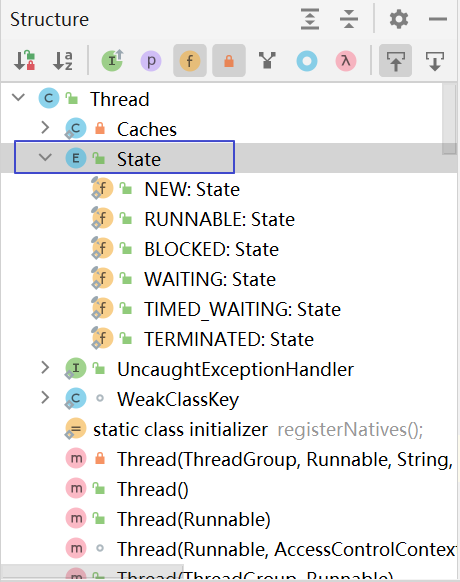

---
tags:
  - interview
  - 尚硅谷
  - Java
  - Java并发编程
source: 尚硅谷Java技术之高频面试题-v2025.1
title: Java并发编程（多线程）
---

# Java并发编程（多线程）

> 来源：尚硅谷 Java 技术之高频面试题 v2025.1 · java并发编程（多线程）

# 1. 创建多线程的四种方式

Java中使用Thread类代表线程，所以不管使用什么方式创建多线程**本质**上都是创建新的**Thread对象**，然后再调用start()方法启动线程

所不同的是：打算放在新线程中要执行的**任务**如何**封装**

## 1.1. 继承Thread类

- 定义一个类继承自 Thread 类，并重写 run() 方法。
- 创建该类的对象，并调用其 start() 方法启动新线程。

## 1.2. 实现Runnable接口

- 定义一个类并实现 Runnable 接口的 run() 方法。
- 创建该类的对象，并将其作为目标传递给一个 Thread 类的实例。
- 调用 Thread 实例的 start() 方法启动新线程。

## 1.3. 实现Callable接口（需借助FutureTask）

- 定义一个类并实现 Callable 接口的 call() 方法。
- 创建一个 FutureTask 对象，将 Callable 实例作为参数传入。
- 将 FutureTask 对象作为目标传递给一个 Thread 类的实例，并启动线程。
- 通过 FutureTask 对象的 get() 方法获取异步计算的结果。

## 1.4. 使用线程池

- 创建一个执行器服务，例如 Executors.newFixedThreadPool(int nThreads) 。
- 提交实现了 Runnable 或 Callable 接口的任务到执行器服务。
- 执行器服务会自动分配线程来执行这些任务。

# 2. 多线程生命周期

## 2.1. 背记

- 新建（New）：线程被创建后，尚未启动（未调用start()方法）的状态。
- 就绪（Runnable）：当线程对象的start()方法被调用后，线程进入就绪状态，此时线程已经准备好执行，等待CPU调度。
- 运行（Running）：当CPU开始调度处于就绪状态的线程时，线程进入运行状态，开始执行其任务。
- 阻塞（Blocked）：线程在运行过程中遇到同步锁但申请锁失败，会进入阻塞状态，此时需要获取到锁之后才会继续执行。
- 等待（Waiting）：线程在执行过程中可能会进入等待状态，例如调用了wait()方法，等待其他线程的通知、唤醒，才能继续执行。
- 计时等待（Timed Waiting）：与等待状态类似，但在此状态下的线程有一个预定的等待时间，超时后自动返回到就绪状态。
- 终止（Terminated）：线程完成任务或者因为异常而结束执行，进入终止状态。

线程状态的管理通常是由操作系统和编程语言的运行时环境共同完成的。

在Java中，可以通过Thread类提供的方法来控制和管理线程的状态，例如使用interrupt()方法来中断线程的阻塞状态，或者使用join()方法等待线程终止等

## 2.2. 理解

### 2.2.1. 源码中定义的线程状态



### 2.2.2. 新建（NEW ）

线程对象刚刚创建，但未启动（start）

```Java
Thread thread = new Thread();// 只要线程new出来
System.out.println("线程的名字"+thread.getName()+"线程的状态:"+thread.getState());
```

示例代码

### 2.2.3. 可运行（RUNNABLE ）

线程已被启动，可以被调度或正在被调度；也可以说此时线程在等待CPU时间片

```Java
Thread thread = new Thread(()->{
  System.out.println("1111");
  System.out.println("线程的状态"+Thread.currentThread().getState());
});
thread.start();
System.out.println("线程的状态"+thread.getState());
```

示例代码

### 2.2.4. 锁阻塞（BLOCKED ）

当前线程要获取的锁对象正在被其他线程占用，此时该线程处于Blocked状态

```Java
Object o = new Object();
Thread threadA = new Thread(() -> {
    synchronized (o) {
        System.out.println("11111");
        try {
            Thread.sleep(1000);
        } catch (InterruptedException e) {
            e.printStackTrace();
        }
    }
}, "A");
threadA.start();
try {
    Thread.sleep(500);
} catch (InterruptedException e) {
    e.printStackTrace();
}
Thread threadB = new Thread(() -> {
    synchronized (o) {
    }
}, "B");
threadB.start();
try {
    Thread.sleep(100);
} catch (InterruptedException e) {
    e.printStackTrace();
}
System.out.println("线程" + threadB.getName() + "状态" + threadB.getState());
```

示例代码

### 2.2.5. 等待阻塞（WAITING ）

当前线程遇到了wait()，join()等方法

```Java
Object o = new Object();
Thread thread = new Thread(() -> {
    synchronized (o) {
        try {
            for (int i = 1; i < 10; i++) {
                System.out.println("i---" + i);
                if (i == 5) {
                    o.wait();
                    // 使用对象的wait方法时 必要要有一个对象和synchronized
                    // 如若不结合synchronized 那么就会出现一个监视器对象状态异常 IllegalMonitorStateException。
                    // 任何一个对象中都有一个ObjectMonitor对象。监视器锁。管程技术。
                }
            }
        } catch (InterruptedException e) {
            e.printStackTrace();
        }
    }
});
thread.start();
Thread.sleep(2000);
System.out.println(thread.getState());
Thread thread1 = new Thread(() -> {
    // o.notify();//使用notify或者notifyAll()都要结合synchronized使用，不然就会出现监视器异常IllegalMonitorStateException
    synchronized (o) {
        System.out.println("do some thing");
        o.notify();
    }
});
thread1.start();
System.out.println("end");
```

示例代码

### 2.2.6. 限时等待（TIMED_WAITING ）

当前线程调用了sleep(时间)，wait(时间)，join(时间)等方法

```Java
Object o = new Object();
Thread thread = new Thread(() -> {
    synchronized (o) {
        try {
            // 线程调用wait(5000)方法
            o.wait(5000);
        } catch (InterruptedException e) {
            e.printStackTrace();
        }
    }
});
thread.start();
// 线程调用sleep(5000)方法
Thread.sleep(5000);
// 线程调用join(5000)方法
thread.join(5000);
System.out.println(thread.getState());
```

示例代码

### 2.2.7. 终止（TERMINATED ）

线程正常结束或异常提前退出

```Java
Thread thread = new Thread(() -> {
    int i = 0;
    System.out.println("1111");
    try {
        i = 10 / 0;
    } catch (Exception e) {
        e.printStackTrace();
    }
    System.out.println(i);
});
thread.start();
Thread.sleep(100);
System.out.println(thread.getState());
```

示例代码

# 3. 什么是线程池，线程池有哪些？

线程池就是事先将多个线程对象放到一个容器中，当使用的时候就不用 new 线程而是直接去池中拿线程即可，节省了开辟子线程的时间、实现了线程对象的复用，提高的代码执行效率

在 JDK 的 java.util.concurrent.Executors 中提供了多种生成线程池的静态方法。

- ExecutorService newCachedThreadPool = Executors.newCachedThreadPool();
- ExecutorService newFixedThreadPool = Executors.newFixedThreadPool(4);
- ScheduledExecutorService newScheduledThreadPool = Executors.newScheduledThreadPool(4);
- ExecutorService newSingleThreadExecutor = Executors.newSingleThreadExecutor();

需要由线程对象执行特定任务时，调用他们的 execute 方法即可。

**注意**：实际开发时严格**禁止使用**上述方法创建线程池！！！因为它们内部设置的各项参数非常不合理，存在OOM等重大风险

## 3.1. newCachedThreadPool()

创建一个可缓存线程池，如果线程池长度超过处理需要，可灵活回收空闲线程，若无可回收，则新建线程。

这种类型的线程池特点是：

- 工作线程的创建数量几乎没有限制(其实也有限制的，数目为Interger. MAX_VALUE)，这样可灵活的往线程池中添加线程。
- 如果长时间没有往线程池中提交任务，即如果工作线程空闲了指定的时间(默认为1分钟)，则该工作线程将自动终止。终止后，如果你又提交了新的任务，则线程池重新创建一个工作线程。
- 在使用CachedThreadPool时，一定要注意控制任务的数量，否则，由于大量线程同时运行，很有会造成系统瘫痪。

## 3.2. newFixedThreadPool()

创建一个指定工作线程数量的线程池。每当提交一个任务就创建一个工作线程，如果工作线程数量达到线程池初始的最大数，则将提交的任务存入到池队列中。FixedThreadPool是一个典型的线程池。在线程池空闲时，即线程池中没有可运行任务时，它不会释放工作线程，还会占用一定的系统资源。

## 3.3. newScheduleThreadPool()

创建一个定长的线程池，而且支持定时的以及周期性的任务执行。例如延迟3秒执行。

这4种线程池底层全部是ThreadPoolExecutor对象的实现，阿里规范手册中规定线程池采用ThreadPoolExecutor自定义的，实际开发也是。

# 4. ThreadPoolExecutor对象有哪些参数？都有什么作用？怎么设定核心线程数和最大线程数？拒绝策略有哪些？ [重点]

## 4.1. 7个参数的作用

### 4.1.1. corePoolSize

核心线程数，在ThreadPoolExecutor中有一个与它相关的配置：allowCoreThreadTimeOut（默认为false）

- allowCoreThreadTimeOut为false：核心线程会一直存活，哪怕是一直空闲着
- allowCoreThreadTimeOut为true：核心线程空闲时间超过keepAliveTime时会被回收

### 4.1.2. maximumPoolSize

最大线程数，线程池能容纳的最大线程数，当线程池中的线程达到最大且等待队列已满时，添加新任务将会触发拒绝策略

### 4.1.3. keepAliveTime

线程的最大空闲时间

- 非核心空闲超过这个时间将被回收
- 核心线程超过这个时间是否回收受allowCoreThreadTimeOut影响

### 4.1.4. unit

keepAliveTime的时间单位

### 4.1.5. workQueue

任务队列，常用有三种队列，即SynchronousQueue、LinkedBlockingDeque（无界队列）,ArrayBlockingQueue（有界队列）。

### 4.1.6. threadFactory

线程工厂，ThreadFactory是一个接口，用来创建worker。通过线程工厂可以对线程的一些属性进行定制，默认直接新建线程。

### 4.1.7. RejectedExecutionHandler

也是一个接口，只有一个方法，当线程池中的资源已经全部使用，添加新线程被拒绝时，会调用RejectedExecutionHandler的rejectedExecution法。默认是抛出一个运行时异常。

## 4.2. 线程池大小设置

### 4.2.1. 最佳实践

把corePoolSize和maximumPoolSize设置成相同的数值，避免非核心线程创建又销毁，销毁又创建

### 4.2.2. 具体数值设置

首先需要分析项目中线程池负责的任务是哪种类型

#### 4.2.2.1. CPU密集型

主要执行计算任务，响应时间很快，CPU一直在运行。这种任务的CPU利用率很高，那么线程数的配置应该根据CPU核心数来决定。

CPU核心数等于最大同时执行线程数

假如CPU核心数为4，那么服务器最多能同时执行4个线程，过多的线程会导致上下文切换反而使得效率降低

此时线程池的最大线程数可以配置为CPU核心数+1

#### 4.2.2.2. I/O密集型

主要进行I/O操作，执行I/O操作时间长，在I/O过程中CPU处于空闲状态导致CPU利用率不高

这种情况可以增加线程池中线程数量的大小，具体增加多少可以结合线程的等待时长来判断，等待时间越长，线程数可以相对越多

一般可以配置CPU核心数的两倍

> 补充：其实我们平时写的常规业务都是
> I/O
> 密集型。前端发送过来一个请求，Java
> 代码需要计算的不多，大部分时间是在等待
> Redis、MySQL、ElasticSearch
> 通过网络传输返回结果

# 5. 常见线程安全的并发容器有哪些？

- Set集合：CopyOnWriteArraySet（写时复制技术）
- List集合：CopyOnWriteArrayList（写时复制技术）
- Map集合：ConcurrentHashMap
  - JDK1.7：采用了锁分段（Segment）技术来提高并发性能，每个段（Segment）相当于一个独立的哈希表，并且每个段都有自己的锁，这样可以减少锁的竞争
  - JDK1.8：设计进行了优化，不再使用分段锁（Segment），而是采用了CAS（Compare and Swap）操作和synchronized关键字相结合的方式来实现线程安全，它使用了更细粒度的锁机制，即在链表或红黑树的节点上使用synchronized锁，同时对于一些非竞争性的操作则采用CAS来保证原子性，从而进一步提高了并发性能

# 6. Atomic原子类了解多少？原理是什么？

## 6.1. 概述

Java中的java.util.concurrent.atomic包提供了一组原子类，用于在多线程环境中执行原子操作，而无需使用显式的锁。

这些原子类使用特殊的CPU指令来确保操作的原子性，从而避免了使用锁带来的性能开销。

这些原子类的实现依赖于底层硬件架构提供的原子操作指令。

通常，这些指令在现代处理器上是硬件级别的支持，确保对内存的读写是原子的。

这使得在不使用锁的情况下，可以在多线程环境中执行某些操作，而不会导致竞态条件（race conditions）。

## 6.2. 分别说明

以下是一些常见的java.util.concurrent.atomic包中的原子类以及它们的一些实现原理：

### 6.2.1. AtomicInteger、AtomicLong、AtomicReference

这些类使用compareAndSet（CAS）操作实现原子性。

CAS是一种乐观锁定机制，它尝试原子地将一个值更新为新值，但只有在当前值等于预期值时才成功；否则，它会重新尝试。

CAS操作是由处理器提供的原子性操作指令支持的。

### 6.2.2. AtomicBoolean

AtomicBoolean类使用compareAndSet实现。

compareAndSet的实现通常依赖于底层处理器的CAS指令。

### 6.2.3. AtomicIntegerArray、AtomicLongArray、AtomicReferenceArray

这些类提供了对数组元素的原子性访问。

它们也使用CAS操作，但应用于数组的特定位置。

### 6.2.4. AtomicIntegerFieldUpdater、AtomicLongFieldUpdater、AtomicReferenceFieldUpdater

这些类提供了对对象字段的原子性更新。

它们使用了反射和CAS操作来实现。

# 7. synchronized底层实现是什么？Lock底层是什么？有什么区别？

## 7.1. synchronized原理

### 7.1.1. 同步方法

方法级的同步是隐式的，即无需通过字节码指令来控制，它实现在方法调用和返回操作之中。

JVM可以从方法常量池中的方法表结构（method_info Structure）中的 ACC_SYNCHRONIZED 访问标志区分一个方法是否同步方法。

当方法调用时，调用指令将会 检查方法的 ACC_SYNCHRONIZED 访问标志是否被设置，如果设置了，执行线程将先持有monitor（虚拟机规范中用的是管程一词）， 然后再执行方法，最后再方法完成（无论是正常完成还是非正常完成）时释放monitor。

### 7.1.2. 同步代码块

代码块的同步是利用monitorenter和monitorexit这两个字节码指令。它们分别位于同步代码块的开始和结束位置。

当JVM执行到monitorenter指令时，当前线程试图获取monitor对象的所有权，如果未加锁或者已经被当前线程所持有，就把锁的计数器+1；

当执行monitorexit指令时，锁计数器-1；

当锁计数器为0时，该锁就被释放了。

如果获取monitor对象失败，该线程则会进入阻塞状态，直到其他线程释放锁。

## 7.2. Lock原理

Lock的存储结构：一个int类型状态值（用于锁的状态变更），一个双向链表（用于存储等待中的线程）

### 7.2.1. Lock获取锁的过程

本质上是通过CAS来获取状态值修改，如果当场没获取到，会将该线程放在线程等待链表中。

### 7.2.2. Lock释放锁的过程

修改状态值，调整等待链表。Lock大量使用CAS+自旋。因此根据CAS特性，Lock建议使用在低锁冲突的情况下。

## 7.3. Lock与synchronized的区别

Lock的加锁和解锁都是由Java代码配合native方法（调用操作系统的相关方法）实现的，而synchronized的加锁和解锁的过程是由JVM管理的。

### 7.3.1. 阻塞机制

- 当一个线程使用synchronized获取锁时，若锁被其他线程占用着，那么当前只能被阻塞，直到成功获取锁。
- Lock则提供超时锁和可中断等更加灵活的方式，在未能获取锁的条件下提供一种退出的机制。

### 7.3.2. 锁占有模式

- synchronized对线程的同步仅提供独占模式，
- Lock既可以提供独占模式，也可以提供共享模式

### 7.3.3. 条件队列

一个锁内部可以有多个Condition实例，即有多路条件队列，而synchronized只有一路条件队列

同样Condition也提供灵活的阻塞方式，在未获得通知之前可以通过中断线程以及设置等待时限等方式退出条件队列。

### 7.3.4. 总结

synchronized

Lock

关键字

接口/类

自动加锁和释放锁

需要手动调用unlock()方法释放锁

JVM层面的锁

API层面的锁

非公平锁

可以选择公平或者非公平锁

锁是一个对象，并且锁的信息保存在了对象中

代码中通过int类型的state标识

有一个锁升级的过程

无
