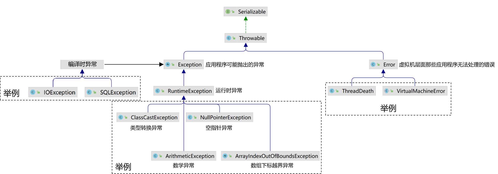
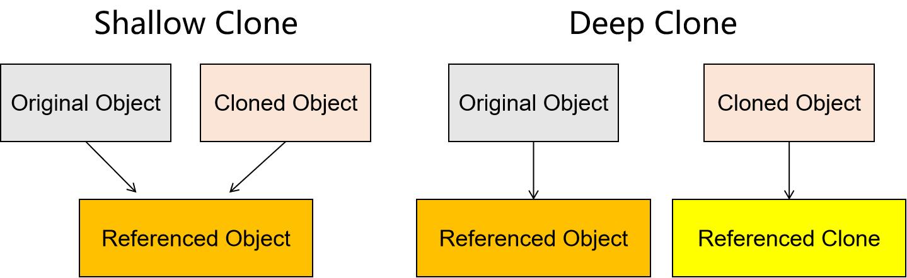

---
tags:
  - interview
  - 尚硅谷
  - Java
  - Java核心语法
source: 尚硅谷Java技术之高频面试题-v2025.1
title: Java核心语法（底线必会）
---

# Java核心语法（底线必会）

> 来源：尚硅谷 Java 技术之高频面试题 v2025.1 · java核心语法（底线必会）

# 1. 写出Java的四类八种基本数据类型

## 1.1. 背会：

四类：整数型、浮点型、字符型和布尔型

八种：byte、short、int、long、float、double、char、boolean

## 1.2. 理解：

类别

整数型

整数型

整数型

数据类型

byte

short

int

占用字节

1

2

4

取值范围

-128 到 127

-32,768 到 32,767

-2^31 到 2^31-1

整数型

long

8

-2^63 到 2^63-1

浮点型

float

4

1.4E-45 到 3.4028235E38

浮点型

double

8

4.9E-324 到 1.7976931348623157E308

字符型

char

2

'u0000'（0）到 '\uffff'（65,535）

布尔型

boolean

特殊

true和false

需要注意的是，上述表格中的取值范围指的是数据类型的默认取值范围。

对于整数型和浮点型，Java使用补码形式表示负数，而对于布尔型，它只有两个可能的值：true和false。

此外，char类型用于表示单个的Unicode字符，它的实际存储大小是16位，即2个字节，能够表示的字符范围从'\u0000'到'\uffff'。

## 1.3. boolean类型的特殊说明

### 1.3.1. 单独使用时

boolean 类型数据在内存中占用4个字节。这是因为Java虚拟机（JVM）将单独的 boolean 值当作 int 类型来处理，而 int 类型在Java中占用4个字节。

### 1.3.2. 放在数组中

当boolean类型以数组的形式出现时，每个boolean元素在内存中占用1个字节。

这是因为在JVM规范中，boolean数组被编码为字节数组，每个元素使用8位即1个字节来表示，其中使用1代表 true ，0代表 false 。

# 2. & 和 && 的区别

## 2.1. 背会

在进行逻辑运算时，&没有短路效果，&&有短路效果

- 左边表达式 & 右边表达式：即使左边表达式计算结果为false可以推断出整体结果，但仍然会执行右边表达式
- 左边表达式 && 右边表达式：如果左边表达式计算结果为false可以推断出整体结果，所以右边表达式将不再执行，提高代码执行效率

## 2.2. &运算符可以计算的数据类型

### 2.2.1. 整数类型

- byte
- short
- int
- long

对于这些类型，&执行按位与操作，即对两个操作数的二进制位逐位进行逻辑与运算。

### 2.2.2. 布尔类型

当用于布尔表达式时，&操作符执行逻辑与操作，只有当两边的操作数都为true时结果才为true。注意，这里的&通常用在表达式中而不是直接对boolean变量操作。

此时整个表达式没有短路效果，即使&号左边是false已经能够推断出整体结果，但还是会对后续表达式进行计算

### 2.2.3. 字符类型

虽然char本质上是一个整数类型（Unicode值），但是直接对char类型使用按位与操作并不常见，除非特别需要处理字符的二进制位。

## 2.3. 应用场景

位运算时使用&这不必多说什么，逻辑运算符通常肯定是使用&&，除非右边表达式必须执行：

```Java
boolean result = (a > 0) & ((b = number * 100) > 100);
```

假设这里必须给b变量赋值，那么右边表达式就一定要执行

## 2.4. 优先级

&&比&优先级高，如果出现在同一个表达式中，先执行&&的计算

```Java
int a = 10;
boolean b = true;
boolean result = false && true & ((a = 20) == 20);
System.out.println("result = " + result);
System.out.println("a = " + a);
```

参照如下代码示例，证明二者优先级：

# 3. switch的参数可以是什么类型

## 3.1. 背会

byte，short，int，char，String，枚举

## 3.2. 理解

在Java中switch语句的参数类型取决于你使用的JDK版本。具体如下：

### 3.2.1. JDK1.6及以前版本

在这些版本中，switch语句的参数可以是基本数据类型int、byte、short和char，以及它们的包装类Integer、Byte、Short和Character 。由于byte、short和char可以自动转换为int，因此它们也可以作为switch的参数。此外从JDK1.5开始，switch还支持枚举类型enum。

### 3.2.2. JDK 1.7及以后版本

从JDK 1.7开始，switch语句新增了对String类型的支持。

这意味着你可以使用字符串作为switch的参数，这在之前的版本中是不允许的。

### 3.2.3. JDK21版本

JDK21中可以使用Object类型，然后在各个分支中匹配具体类型

```Java
public static String formatterSwitch(Object o) {
    return switch (o) {
        case Integer i -> String.format("int %d", i);
        case Long l  -> String.format("long %d", l);
        case Double d -> String.format("double %f", d);
        case String s -> String.format("String %s", s);
        default    -> o.toString();
    };
}
```

### 3.2.4. 所有版本

在所有版本的Java中，switch语句都不支持long类型作为参数。

这是因为long类型的范围比int大，不能自动转换为int类型。

### 3.2.5. 特殊注意

虽然switch语句在某些版本中支持String和枚举类型，但它本质上仍然只接受int类型的参数。

对于String类型，底层实现实际上是使用了字符串的hashCode()方法，该方法返回一个整数值。

对于枚举类型，使用的是ordinal()方法，该方法返回枚举常量的序号，也是一个整数值。

# 4. 实例变量和局部变量的区别是什么？

## 4.1. 背记

### 4.1.1. 代码位置

- 实例变量：类中方法外
- 局部变量：方法中或方法定义的小括号里面

### 4.1.2. 内存位置

- 实例变量：作为对象的组成部分，成员变量在堆内存中
- 局部变量：作为方法执行过程中的临时数据，通常在栈内存中（栈帧）

### 4.1.3. 生命周期

- 实例变量：作为对象的组成部分，随着对象创建而产生，随着对象的消失而消失
- 局部变量：作为方法执行过程中的临时数据，随着方法的调用而产生，随着方法调用结束而消失

### 4.1.4. 有无默认值

- 实例变量：有默认值

类型

基本数据类型中的整数

基本数据类型中的小数

基本数据类型中的字符

默认值

0

0.0

'\u0000'

基本数据类型中的布尔

false

引用数据类型

null

- 局部变量：没有默认值，使用的时候必须先赋值

## 4.2. 理解

实例变量和局部变量是Java中两种主要的变量类型，它们在作用范围、生命周期和初始化方面存在显著差异。

### 4.2.1. 作用范围

实例变量是定义在类中，且不在任何方法体内的变量。

实例变量在对象创建过程中被初始化，在对象使用过程中被读写，它的作用范围在对象内部。

基于封装性考虑，实例变量通常不会被对象外部直接读写，规范的做法是通过getXxx()、setXxx()方法操作。

而局部变量是定义在方法体或代码块内的变量，其作用范围仅限于该方法或代码块内部。

这意味着，一旦方法执行完毕，局部变量就会从内存中消失。

### 4.2.2. 生命周期

实例变量的生命周期与类的实例对象相同，即从对象被创建到被销毁的整个过程。

局部变量的生命周期则局限于方法的调用过程，即从方法被执行到方法执行完毕的整个过程。

### 4.2.3. 初始化

实例变量会自动初始化为其对应类型的默认值（如int类型为0），即使没有显式赋值也是如此。

而局部变量必须经过显式初始化才能使用，否则编译器会报错。

总的来说，理解实例变量和局部变量的区别对于编写正确的Java代码至关重要。

# 5. static关键字都能修饰什么？ 都有什么特点

## 5.1. 背记

- 修饰成员变量，使成员变量变成静态的类变量；
  - 由于类只加载一份，所以静态变量（也叫类变量）也只有一份
  - 静态变量可以在一定范围内共享，但具体范围需要参照权限修饰符
- 修饰方法，方法就成了静态方法: 可以直接使用类名.方法名进行调用；
- 修饰代码块，就得到了静态代码块，在类加载过程中执行；
- 修饰类，只有内部类可以使用static修饰，此时内部类变成了静态内部类；

## 5.2. 理解

在Java中static 关键字是一个非常重要的概念，它用于表示一个成员（变量或方法）属于类本身，而不是类的实例对象。

具体来说static关键字具有以下特点：

### 5.2.1. 类级属性

被static修饰的成员变量被视为类的属性，它们在类加载时被初始化，并且在整个程序运行期间只占用一块内存空间。

这意味着，无论你创建多少个类的实例对象，static成员只有一份拷贝，被所有实例共享。

### 5.2.2. 无需实例化

由于static成员属于类，因此你无需创建类的实例对象就可以直接访问它们。

你可以通过类名直接访问static成员，例如ClassName.staticMethod()或ClassName.staticVariable。

### 5.2.3. 限制访问非静态成员

由于static方法在类加载时就存在，因此它们不能访问非静态成员（即实例成员），因为此时实例对象可能尚未创建。

### 5.2.4. 继承特性

与非静态成员不同，子类不会继承父类的static成员。如果需要访问父类的static成员，可以通过父类的类名直接访问。

### 5.2.5. 默认值

static变量有默认值，与实例变量的默认值相同。

例如， static int类型的默认值为0，static boolean类型的默认值为 false。

### 5.2.6. 静态代码块

Java中还支持静态代码块，它仅在类加载时执行一次。

静态代码块通常用于对静态成员进行初始化操作。

总的来说，理解static关键字是理解Java面向对象编程的关键之一。

通过合理使用static关键字，可以更好地组织代码，实现类与实例之间的资源共享和交互。

# 6. overload和override的区别

## 6.1. 背记

在面向对象编程中，“override”和“overload”是两个重要的概念，它们用于描述方法或函数的行为。

### 6.1.1. 定义

Override：指子类重写（覆盖）了父类中的方法。子类中的方法名、参数列表与父类中的方法完全相同，返回值类型不超过父类方法返回值类型的范围。

Overload：指在同一个类中或者子类中定义多个具有相同名称但参数列表不同的方法。这些方法可以有不同的参数个数、类型或顺序。

### 6.1.2. 参数列表

Override：参数列表必须与父类中被重写的方法完全一致。

Overload：参数列表必须不同，可以是参数个数、类型或顺序的差异。

### 6.1.3. 返回类型

Override：返回类型必须与父类中被重写的方法相同，或者是其子类。

Overload：返回类型可以相同也可以不同。

### 6.1.4. 作用域

Override：通常发生在继承关系中，子类重写父类的方法。

Overload：可以在同一个类中或者子类中进行方法的重载。

### 6.1.5. 编译时决定

Override：动态绑定，即在运行时根据对象的实际类型决定调用哪个版本的方法。

Overload：静态绑定，即根据方法名和参数列表的静态类型在编译期间决定调用哪个方法。

> 为什么『重写』是动态绑定？
> 答：有的时候确实要在运行的时候才知道对象的具体类型是什么。比如：
> walk(Animal animal)这个方法接收
> Animal
> 类型的参数，这就需要运行时才知道具体传入的是
> Cat
> 还是
> Dog

### 6.1.6. 口诀

- 重载：方法名相同，参数列表不同，其它不要求
- 重写：两同两小一大
  - 两同：方法名相同、形参列表相同
  - 两小：
    - 子类方法返回值类型小于等于父类方法返回值类型
    - 子类方法throws异常类型小于等于父类方法返回值类型
  - 一大：子类方法权限修饰符大于等于父类方法权限修饰符

## 6.2. 理解

Overload（重载）和Override（重写）是Java中两个基本的概念，它们都是方法多态性的表现，但有一些关键的区别。具体分析如下：

### 6.2.1. Overload（重载）

作用于同一个类中。方法名相同且参数列表不同（参数类型、个数或顺序至少有一项不同）。

不是基于继承的。在编译时根据参数签名确定调用哪个方法。可以改变返回类型（非必需，但改变了参数必须改变返回类型）。

### 6.2.2. Override（重写）

基于继承，子类覆盖父类的方法。方法名及参数列表必须完全相同。访问权限不能比被覆盖的方法更严格。

返回类型必须是相同的或者是协变的。

抛出的异常必须是相同的或者是其子异常。

总的来说，Overload（重载）提供了一种机制，使得同一个方法名可以用于执行不同的功能，只要它们的参数不同即可。

而Override（重写）则允许子类提供特定于子类的实现，同时保持与父类相同的方法签名。

# 7. final和finally的区别

## 7.1. 背记

### 7.1.1. 总体对比

关键词

final

finally

用法

作为修饰符来使用

后面跟一个代码块

功能

修饰类型、方法或变量

配合try、catch块使用

### 7.1.2. 细节：final

final是一个修饰符，可以修饰如下三种语法结构：

- 类：被final修饰的类不能被继承（可以正常创建对象）
- 方法：被final修饰的类不能被重写（可以正常调用）
- 变量：被final修饰的变量只能被赋值一次，于是这个变量也就成了常量

### 7.1.3. 细节：finally

finally是一个代码块，配合try、catch一起使用，效果是不论前面执行try块成功还是失败，finally块中的代码都必定会执行

## 7.2. 理解

- final关键字提供了不可变性的特性，用于确保特定的类、方法或变量的不可更改性，从而保护数据的一致性和安全性。
- finally 是异常处理机制的一部分，它与 try 和 catch 一起使用，形成 try-catch-finally 块。 finally 块中的代码无论异常是否发生，都会被执行。这通常用于放置一些必须执行的清理代码，如关闭文件、释放资源等，以确保资源的正确释放和程序的稳定性。

# 8. this和super都能用到哪些地方？

## 8.1. 背记：

### 8.1.1. 访问成员变量

- this：可以用于区分成员变量与局部变量重名的情况，如果本类没有这个成员变量，也可以调用父类的成员变量。
- super：可以用于区分本类成员变量与父类成员变量重名的情况，只能调用父类的成员变量。

### 8.1.2. 访问成员方法

- this：可以调用本类的成员方法，如果本类没有这个成员方法，也可以调用父类的成员方法。
- super：只能调用父类的成员方法。

### 8.1.3. 访问构造器

- this：可以通过this()或this(参数)在当前构造器中调用其它构造器
- super：子类通过super()或super(参数)调用父类构造器

## 8.2. 理解：

### 8.2.1. this

当一个方法需要明确指出它正在操作当前对象时，就会用到this关键字。

this可以用来区分局部变量和类的字段之间的名称冲突，也可以用来调用同一个类中的其他构造器。

在构造器中，this通常用于调用同一类中的另一个构造器，这通常发生在构造器的第一行。

这样做的目的是为了代码重用和提高可维护性。

例如，如果一个类有多个构造器，它们可能需要执行一些共同的初始化步骤，那么可以使用this来调用一个共有的构造器，以避免代码重复。

### 8.2.2. super

super关键字用于引用当前对象的父类。

它主要用于在子类的构造器中调用父类的构造器，这是因为子类构造时，需要先初始化从父类继承的成员。

super也可以用来调用父类的方法或访问父类的字段。

如果父类的构造器需要参数，则子类的构造器中必须通过super(参数名)显式调用父类中的某一个构造器。

需要注意的是，在同一个构造器中，this()和super()不能同时出现，因为this()必须放在构造器的第一行，而super() 也是放在第一行，所以它们不能共存。

# 9. 接口与抽象类的区别

## 9.1. 背记

### 9.1.1. 关键字

- 抽象类：使用abstract关键字定义
- 接口：使用interface关键字定义

### 9.1.2. 设计

- 抽象类：代表对事物通用特性的抽象，可以包含属性和方法
- 接口：主要关注事物的行为，所以它是方法的集合

### 9.1.3. 构造器和成员变量

- 抽象类：有构造器，有普通成员变量
- 接口：没有构造器和普通成员变量，其内部变量默认为public static final类型

### 9.1.4. 方法实现

- 抽象类：可以包含抽象方法和非抽象方法
- 接口：只能声明抽象方法，但在Java 8起可以有默认方法和静态方法

### 9.1.5. 继承与实现

一个类只能继承一个抽象类，但可以实现多个接口，这是Java支持多态性的重要方式

### 9.1.6. 访问修饰符

- 抽象类：抽象方法可以有修饰符
- 接口：抽象方法只能是public类型

### 9.1.7. 实例化

抽象类和接口因为包含抽象方法，所以都不能直接用于创建对象，实例化之前都必须给出抽象方法的具体实现

通过匿名内部类方式创建对象时，其实抽象方法在匿名内部类中实现了

## 9.2. 理解

抽象类和接口各有其适合使用的应用场景：

### 9.2.1. 设计层面

- 抽象类：定义一个基础的对象类型，让其他类继承这些基本特征
  - 例如：有一个系统需要处理不同类型的图形，可以定义一个抽象类Shape ，它包含一些如getArea()的抽象方法，然后让Circle、 Rectangle等具体形状类继承Shape并实现这些方法。
- 接口：定义一组不相关类的共同行为
  - 例如：系统中有多种类型的对象需要进行比较，可以实现一个Comparable接口，该接口中定义了compareTo()方法，然后让需要比较的类实现这个接口。

### 9.2.2. 功能实现

- 抽象类：表达类型上的从属关系，比如“鸽子是鸟的一种”则更适合使用抽象类来表示这种层次关系，因为抽象类可以包含具体的方法实现。
- 接口：对于需要多个不相关类共有的行为，比如“飞”这个动作，无论是鸟还是飞机都可以飞，这时可以使用接口来定义“飞”的行为，不同的类实现该接口并提供具体的飞行方式。

### 9.2.3. 实际应用中的选择

在实际应用中，如果遇到需要同时使用抽象类和接口的情况，一般建议先继承抽象类再实现接口，因为Java不支持多重继承。

抽象类可以定义各种类型的成员变量，而接口中只能有 public static final 修饰的静态常量。

总的来说，在实际开发中选择使用接口还是抽象类取决于你的设计需求和所面临的具体问题。

如果你的设计更侧重于对象的层次结构和它们之间的共性，那么抽象类可能是更好的选择。

如果你的设计需要灵活地为不同类添加或修改行为，而不关心它们的具体类型，那么接口可能更加合适。

# 10. 静态变量与实例变量的区别

## 10.1. 背记

- 静态变量是类级别的，是类信息的一部分
- 实例变量是对象级别的，是对象数据的一部分

## 10.2. 理解

静态变量和实例变量是Java中的两种不同类型的变量，它们在定义、存储位置和使用方式上都存在差异。具体分析如下：

### 10.2.1. 声明

静态变量在声明时需要使用 static 关键字，而实例变量则不需要。

### 10.2.2. 存储位置

- 静态变量属于类级别，不依赖于任何对象实例，即使没有创建类的实例，静态变量也存在。
- 实例变量存在于对象实例中，每个对象实例都有自己的实例变量副本。

### 10.2.3. 使用方式

- 静态变量可以通过类名直接访问，无需创建类的实例。
- 实例变量必须通过对象实例来访问。

### 10.2.4. 内存位置

- 静态变量在方法区中（方法区存放类的信息）
- 实例变量在堆内存中（堆内存存放对象数据）

### 10.2.5. 生命周期

- 静态变量随着.class文件加载而产生,随着.class文件结束而结束
- 实例变量随着对象的创建而产生,随着对象的结束而结束

### 10.2.6. 调用方式

- 静态变量既可以通过『类名.变量名』方式直接进行调用，也可以通过『对象.变量名』方式进行调用（当然本质上都是先找到类，然后在找类变量）
- 实例变量只能通过『对象.变量名』方式进行访问

# 11. throw和throws 的区别

## 11.1. 关键要点

- throw动真格
- throws吓唬人

## 11.2. 具体细节

### 11.2.1. 使用位置

- throw：在方法体内使用，用来真实抛出一个异常对象
- throws：在方法声明位置使用，用来告诉方法的调用者，这个方法有抛出这些异常的风险，仅仅只是风险，不代表调用时一定会抛出

### 11.2.2. 使用效果

- throw：真实抛出异常
- throws：声明方法运行中有可能发生的风险

### 11.2.3. 后跟类型

- throw：后跟具体的异常对象，只能是一个
- throws：后跟异常类型，可以多个

## 11.3. 有趣发现：throws为什么加“s”？

并不是因为它后面跟多个异常类型，这不是名词复数形式；

而是因为throws前面是方法名，方法名是主语，throws是谓语动词，那么一般现在时中，主语是第三人称单数时谓语动词加“s”

编程语言语法也是遵循自然语言语法的

# 12. String、StringBuilder 与 StringBuffer 的区别

## 12.1. 背记

String

StringBuilder

StringBuffer

可变性

不可变

可变

可变

频繁修改时性能

差（第三名）

较好（第一名）

较好（第二名）

线程安全性

不加锁，线程不安全

加锁，线程安全

## 12.2. 细节

### 12.2.1. 可变性

- Java中String类型的字符串是不可改变的字符序列
- String类型的对象一旦创建，其内容就不可改变
- 对String进行任何修改操作，都是创建一个新的String对象
- StringBuilder和StringBuffer是可变的，可以在原有对象的基础上进行修改，不会导致新对象的创建。这使得它们在频繁修改字符串时比 String更加高效。

### 12.2.2. 性能

由于String的不可变性，每次修改都会生成新的对象，这可能会导致性能问题，尤其是在大量修改操作的场景下。

StringBuilder和StringBuffer的性能通常比String要好，因为它们避免了频繁的对象创建。

StringBuilder的性能略优于StringBuffer，因为它不是线程安全的，不需要同步操作，所以在单线程环境下速度更快。

### 12.2.3. 线程安全

StringBuffer是线程安全的，因为它的关键方法是同步的。这意味着在多线程环境下，使用StringBuffer可以避免并发问题。

StringBuilder不是线程安全的，它的方法没有同步，因此在多线程环境下可能会出现数据不一致的问题，但它在单线程环境下的性能更优。

# 13. ==和equals()的区别

## 13.1. 背记

- 双等号：
  - 基本数据类型：比较数据本身
  - 引用类型：比较引用地址
- equals()：仅限于引用类型之间比较
  - Object类中未被重写的equals()：使用双等号比较引用地址
  - 官方代码重写equals()之后：比较内容，例如String、Integer等
  - 自定义重写equals()之后：根据重写后的代码逻辑决定

## 13.2. 使用建议

通常来说：

- 基本数据类型使用双等号比较
- 引用类型使用equals()比较，如有需要，由开发人员重写equals()方法

# 14. 包装类拆箱装箱

## 14.1. 背记

- 装箱：将基本数据类型数据转换为包装类型对象
- 拆箱：将包装类型对象转换为基本数据类型数据

## 14.2. 理解

### 14.2.1. 装箱

- 概念：是指将基本数据类型的值转换成对应包装类的实例对象的过程。
- 方法：可以通过调用包装类的构造器或valueOf()方法来实现手动装箱。
- 自动装箱：从Java 5开始，编译器会自动将基本类型转换为包装类，这称为自动装箱。

例如，将int类型的变量赋值给Integer对象时，会自动调用Integer.valueOf()方法。

### 14.2.2. 拆箱

- 概念：是指将包装类对象转换回其对应的基本数据类型的过程。
- 方法：可以通过调用包装类的xxxValue()方法（如 intValue() 、 doubleValue() 等）来实现手动拆箱。
- 自动拆箱：与自动装箱类似，当需要基本数据类型的值时，如果操作的对象是包装类类型，编译器会自动将其转换为基本类型，这称为自动拆箱。

### 14.2.3. 注意事项

自动拆装箱虽然方便，但也可能导致不必要的性能开销，尤其是在大量数据处理时。

频繁的拆装箱操作可能会导致内存占用增加，因为每次装箱都会创建新的包装类对象。

在编写代码时，应当注意不要过度依赖自动拆装箱，以免影响程序的性能和可读性。

总的来说，理解拆箱和装箱的概念对于Java编程是非常重要的，因为它们涉及到Java中基本类型与对象类型之间的转换机制，这对于编写高效且健壮的Java代码至关重要。

# 15. 异常结构图



# 16. 请谈一下Java中I/O技术体系中包含哪些种类的流？

## 16.1. 背记

Java中的I/O流可以从不同角度来分类：

- 按照数据内容分类：
  - 字节流：万能流，可以处理任意类型的文件，主要用于处理二进制数据，如图片、视频等
  - 字符流：非万能，主要用来处理文本文件，提供了对字符数据的高效读写
- 按照数据流动方向分类：
  - 输入流：从源头读取数据，比如从文件中读取
  - 输出流：向目标写入数据，比如写入到文件中
- 按照功能分类：
  - 节点流：直接与数据源相连，比如FileInputStream
  - 处理流：在节点流的基础上提供了额外的功能，比如BufferedInputStream通过缓冲区提高I/O效率，处理流都是对节点流的包装

## 16.2. 参考

Java中的IO流是用于数据输入和输出的抽象概念，它代表了输入源和输出目标。

I/O流类型

FileInputStream

FileOutputStream

ObjectInputStream

功能说明

用于从文件中读取字节数据

用于向文件中写入字节数据

用于从输入流中读取对象：对象的反序列化

ObjectOutputStream

用于向输出流中写入对象：对象的序列化

OutputStreamWriter

将字符流转为字节流，用于写入文本数据

BufferedReader

包装其他读取字符的输入流，提供缓冲功能，提高读取效率

InputStreamReader

将字节流转为字符流，用于读取文本数据

BufferedWriter

包装其他写入字符的输出流，提供缓冲功能，提高写入效率

PrintWriter

提供了打印各种数据的便利方法

Scanner

用于解析原始类型和字符串的正则表达式

## 16.3. 理解

Java中的输入流和输出流是I/O流体系的核心部分，它们分别负责数据的读取和写入。

### 16.3.1. 输入流

输入流主要用于从数据源（如文件、网络连接等）读取数据到程序中。

在Java中，输入流主要由InputStream和Reader作为基类。

- InputStream：基于字节的输入流接口，它是最底层的流，能处理任何类型的数据传输，包括文字、图片、视频等
- Reader：基于字符的输入操作接口，用于更高效地处理文本数据。

### 16.3.2. 输出流

输出流主要用于将程序中的数据写入到目标（如文件、网络连接等）。

在Java中，输出流主要由OutputStream和Writer作为基类。

- OutputStream：基于字节的输出流接口，它同样可以处理各种类型的数据。
- Writer：基于字符的输出操作接口，专门用于文本数据的输出。

输出流也可以分为节点流和处理流，节点流直接与数据目标相连，而处理流提供了额外的功能，如压缩、序列化等。

## 16.4. 思维导图

- I/O流
  - 字节流
    - InputStream输入流
      - FileInputStream
        - 从文件系统的某个文件中获得输入字节用于读取诸如图像数据之类的原始字节流
      - BufferedInputStream
        - 缓冲流，InputStream的间接子类
    - OutputStream输出流
      - FileOutputStream
        - 用于写入诸如图像数据之类的原始字节流
      - BufferedOutputStream
        - 缓冲流，OutputStream的间接子类
  - 字符流
    - Reader
      - InputStreamReader
        - 转换流，字节流通向字符流的桥梁
        - FileReader
          - 读取字符文件的便捷类
      - BufferedReader
        - 缓冲流，特有方法：readLine()
    - Writer
      - OutputStreamWriter
        - 转换流：字符流通向字节流的桥梁
        - FileWriter
          - 写入字符文件的便捷类
      - BufferedWriter
        - 缓冲流，特有方法：newLine()、write(String str)

# 17. 请谈谈你对反射的理解

## 17.1. 反射要解决的问题

- 编写代码时：无法确定对象的类型
- 运行时：动态判定对象的类型

## 17.2. 反射的原理

核心就一句话：类的所有信息都在它编译出的*.class字节码文件中，所以反射操作的起点就是读取*.class字节码文件

### 17.2.1. 光学中的反射


### 17.2.2. Java 中的反射


## 17.3. 反射的具体实现

Java的反射机制实现思路主要包括以下几个关键步骤

### 17.3.1. 获取Class对象

首先，需要获取目标类的Class对象，方式很多：

- Class.forName("全类名")
- 类名.class
- 对象.getClass()
- 类加载器对象.loadClass("全类名")

### 17.3.2. 分析类信息

有了Class对象后，可以对类进行深入的分析，包括获取构造器、字段（属性）和
方法等信息。这些信息可以通过Class对象提供的一组反射方法来获取。

### 17.3.3. 动态操作类

根据获取到的类信息，可以进行动态的操作，如创建对象实例、访问和修改字段值、调用方法等。

这些操作可以通过反射API提供的方法来实现。

### 17.3.4. 异常处理

在反射操作过程中，可能会遇到各种异常情况，如类未找到、方法不存在、访问权限不足等。

因此，需要对异常情况进行捕获和处理。

### 17.3.5. 性能优化（可选）

反射操作相比直接调用方法通常会有一定的性能开销。

如果性能是一个关键因素，可以考虑使用缓存或其他优化技术来提高反射操作的性能。

总之Java的反射机制实现思路是通过获取目标类的 Class 对象，然后利用反射API提供的方法来分析和操作类及其成员。

这种机制使得Java程序可以在运行时具有更高的灵活性和动态性。

## 17.4. 示例

```Java
package com.atguigu.demo.reflective;

import java.lang.reflect.Constructor;
import java.lang.reflect.Field;
import java.lang.reflect.Method;

/**
 * @Author huzhongkui
 * @Date 2023--09--19:10:30
 * 聪明出于勤奋,天才在于积累
 **/
public class ReflectiveDemo {
    public static void main(String[] args) {
        try {
            // 1.获取任意一个对象所属的类
            Student student = new Student();
            Class<? extends Student> aClass1 = student.getClass();
            System.out.println(aClass1);

            // 2.构造任意一个类对象
            Student student1 = aClass1.newInstance();
            System.out.println(student1);

            // 3.获取任意一个类中的构造方法
            Class<?> aClass = Class.forName("se.reflective.Student");
            for (Constructor<?> declaredConstructor :
                    aClass.getDeclaredConstructors()) {
                Object instance = declaredConstructor.newInstance();
                System.out.println(instance);
            }

            // 4. 获取任意一个类中的方法
            for (Method declaredMethod : aClass.getDeclaredMethods()) {
                System.out.println("Student类中的方法:" + declaredMethod.getName());
            }

            // 5. 获取任意一个类中的成员变量
            for (Field declaredField : aClass.getDeclaredFields()) {
                System.out.println("Student类中的成员变量" + declaredField.getName());
            }

            // 6.调用任意一个对象的方法
            System.out.println(student1.getAge());
        } catch (Exception e) {
            e.printStackTrace();
        }
    }
}
```

# 18. 深拷贝和浅拷贝

## 18.1. 背记

- 相同点：
  - 都需要创建新对象
  - 原对象的基本数据类型属性都是复制值本身
- 不同点：对象的引用类型属性不一样
  - 浅拷贝：复制对象地址
  - 深拷贝：创建新对象，给每个属性复制内容，其内容如果还是引用类型则递归操作



## 18.2. 注意

深拷贝涉及到引用类型时，会创建新对象，所以复制之后会得到多个副本，修改任何一个副本都不影响其它副本

## 18.3. 应用场景

- 浅拷贝：可以共享内部引用时使用
- 深拷贝：不能共享内部引用时使用
