---
tags:
  - interview
  - 尚硅谷
  - Java
  - Java虚拟机
source: 尚硅谷Java技术之高频面试题-v2025.1
title: Java虚拟机（JVM）
---

# Java虚拟机（JVM）

> 来源：尚硅谷 Java 技术之高频面试题 v2025.1 · java虚拟机（jvm）

# 1. 请介绍一下JVM的主要组成部分及其作用

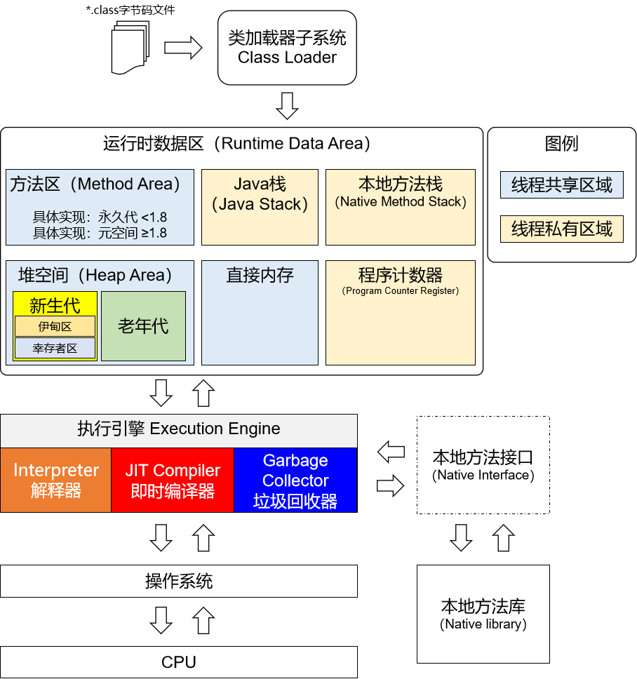

## 1.1. 背记

- 类加载器（Class Loader）：将*.class字节码文件加载到内存中
- 执行引擎（Execution Engine）：也叫解释器，负责解释命令，就是将字节码指令解释/编译为当前所在平台上的本地机器指令
- 本地接口（Native Interface）：本地接口的作用是融合不同的语言为Java所用
- 栈（Stack）：过去叫Java栈内存，现在叫虚拟机栈，Java程序中方法执行时使用的内存空间，用于存储局部变量表、操作栈、动态链接(即引

用，比如方法区的成员变量)、方法出口等信息

- 堆（Heap）：存放实例对象
- 方法区（Method Area）：它用于存储已被虚拟机加载的类的信息、常量、静态变量、即时编译器编译后的代码缓存等
- 程序计数器（PC Register）：每个线程都有一个程序计数器，就是一个指针，指向方法区中的方法字节码

## 1.2. 理解

### 1.2.1. 栈空间

栈空间随着线程的创建而创建，随着线程结束而释放，只要线程一结束，该栈就结束；

对于栈来说不存在垃圾回收的问题（垃圾回收只针对于堆和方法区）。

栈中的数据以栈帧的形式存在，是一个数据集，是一个有关方法和运行期数据的集合，

当方法A被调用时就产生了一个栈帧F1，并被压入到栈中，A方法又调用了B方法，

于是产生栈帧F2也被压入栈，执行完毕后，先弹出F2栈帧，再弹出F1栈帧，遵循“先进后出”原则。

### 1.2.2. 堆空间

堆空间存放的是实例对象。一个JVM实例只存在一个堆内存，堆内存的大小是可以调节的。

堆内存分三部分：

- 永久区（即存储的是运行环境必须的类信息，被装载至此区域的数据是不会被垃圾回收掉的，只有关闭JVM释放此区域所占用的内存）
- 新生区
- 老年代

### 1.2.3. 方法区

方法区只是JVM规范中定义的一个概念，它用于存储已被虚拟机加载的类的信息（类的名称、方法信息、字段信息）、常量、静态变量、即时编译器编译后的代码缓存等。

### 1.2.4. 程序计数器

每个线程都有一个程序计数器，它就是一个指针，指向方法区中的方法字节码（用来存储下一条将要执行的字节码指令的地址），用这种方式记录代码执行到了什么位置，线程得到CPU时间片后由执行引擎读取下一条指令执行

# 2. 说一下JVM运行时数据区？

## 2.1. 背记

JVM运行时数据区分为5个部分：

- 程序计数器（Program Counter Register）
- Java 虚拟机栈（Java Virtual Machine Stacks）
- 本地方法栈（Native Method Stack）
- Java 堆（Java Heap）
- 方法区（Methed Area）

## 2.2. 理解

不同虚拟机的运行时数据区可能略微有所不同，但都会遵从Java虚拟机规范，Java虚拟机规范规定的区域分为以下5个部分：

- 程序计数器：当前线程所执行的字节码的行号指示器，字节码解析器的工作是通过改变这个计数器的值，来选取下一条需要执行的字节码指令，分支、循环、跳转、异常处理、线程恢复等基础功能，都需要依赖这个计数器来完成；
- Java 虚拟机栈：用于存储局部变量表、操作数栈、动态链接、方法出口等信息
- 本地方法栈：与虚拟机栈的作用是一样的，只不过虚拟机栈是服务Java方法的，而本地方法栈是为虚拟机调用Native方法服务的
- Java 堆：Java虚拟机中内存最大的一块，是被所有线程共享的，存放对象实例
- 方法区：用于存储已被虚拟机加载的类信息、常量、静态变量、即时编译后的代码等数据

# 3. 什么是类加载器？

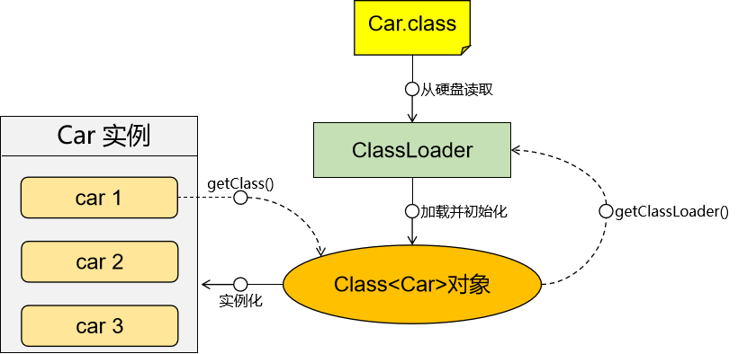

## 3.1. 背记

类加载器是负责将Java字节码文件（*.class）加载到Java虚拟机（JVM）中的组件，根据指定全限定名称将*.class文件加载到JVM内存，然后再转化为Class对象

- JDK8
  - 启动类加载器
  - 扩展类加载器
  - 应用类加载器
  - 用户自定义类加载器
- JDK9
  - 启动类加载器
  - 平台类加载器
  - 应用类加载器
  - 用户自定义类加载器

## 3.2. 理解

对于任意一个类，都需要由加载它的类加载器和这个类本身一同确立在JVM中的唯一性

每一个类加载器，都有一个独立的类名称空间

类加载器就是根据指定全限定名称将*.class文件加载到JVM 内存，然后再转化为Class对象

## 3.3. JDK1.8的类加载器

### 3.3.1. 启动类加载器（Bootstrap）C++

负责加载$JAVA_HOME中jre/lib/下的某些jre包中的类【比如rt.jar】，该类加载器由C++实现，不是ClassLoader子类

### 3.3.2. 扩展类加载器（Extension）Java

负责加载Java平台中扩展功能的一些jar包，包括$JAVA_HOME中jre/lib/ext/ *.jar或-Djava.ext.dirs指定目录下的jar包

### 3.3.3. 应用程序类加载器（AppClassLoader）

也叫系统类加载器，负责加载classpath中指定的jar包及目录中class或-Djava.class.path目录下的jar包或者.class文件

### 3.3.4. 用户自定义加载器

java.lang.ClassLoader的子类，用户可以定制类的加载方式

中文名称

英文名称

说明

加载范围

启动类加载器

Bootstrap

C++ 语言编写，不是 ClassLoader 子类，
Java 中为 null

$JAVA_HOME/jre/lib/rt.jar

扩展类加载器

Extension

sun.misc.Launcher.ExtClassLoader

$JAVA_HOME/jre/lib/*.jar -Djava.ext.dirs 参数指定目录下的 jar 包 $JAVA_HOME/jre/lib/ext/classes 目录下的 class

应用类加载器

AppClassLoader

sun.misc.Launcher.AppClassLoader

classpath中指定的 jar 包及目录中的 class 以及我们导入的第三方框架的jar包

自定义类加载器

程序员自己开发一个类继承 java.lang.ClassLoader，
定制类加载方式

自定义

注意：各种类加载器之间存在着逻辑上的父子关系，但不是真正意义上的父子关系，因为它们从类型上并没有彼此继承，仅仅只是通过parent属性引用父加载器的对象

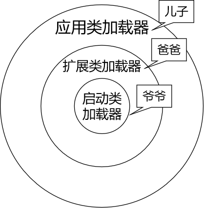

## 3.4. JDK9的类加载器

JDK 9 引入了模块化系统，类加载器体系中也引入了一个新的成员：PlatformClassLoader

对应关系是：

- 应用类加载器的父加载器是：PlatformClassLoader
- PlatformClassLoader的父加载器是：启动类加载器

PlatformClassLoader和扩展类加载器区别：

> JDK 9 中的 PlatformClassLoader 和之前 JDK 版本中的 ExtClassLoader 具有相似的功能，但在一些细节上有所不同。

1. 命名和位置：ExtClassLoader 是 JDK 8 及之前版本中定义的扩展类加载器，而 PlatformClassLoader 是从 JDK 9 开始引入的。它们的命名和位置略有不同，但都属于应用程序类加载器的子类。
2. 类加载范围：ExtClassLoader 主要用于加载 Java 扩展库（Java Extension），即位于 JRE 的 "lib/ext" 目录下的 JAR 文件。而 PlatformClassLoader 主要用于加载模块化平台的类，包括 Java SE 平台的核心类和模块。
3. 模块化支持：PlatformClassLoader 是在 JDK 9 引入的模块化系统中新增的类加载器，它与 Java 平台模块系统（JPMS）紧密集成。PlatformClassLoader 被设计为按模块进行类加载，可以加载模块路径上的模块，并且具有更灵活的类路径处理能力。

总体来说，PlatformClassLoader 是 JDK 9 后引入的类加载器，专门用于加载模块化平台的类，与 JPMS 集成。而 ExtClassLoader 则是 JDK 8 及之前版本的扩展类加载器，主要用于加载 Java 扩展库。它们在功能和使用场景上有所不同，但都属于应用程序类加载器的子类。

# 4. 请谈谈你对双亲委派机制的理解

## 4.1. 背记

简单来说，双亲委派机制就是：找字节码文件先看是否曾经加载过，已经加载过就返回，否则就让爸爸找，爸爸找不到再让儿子找

为啥这么搞呢？这是为了避免字节码文件被重复加载，确保类的唯一性和安全性，防止内存中出现多份相同的字节码，可以保证内存中只存在一份字节码

## 4.2. 理解

双亲委派机制是Java虚拟机加载一个类时为该类确定类加载器的一种机制

### 4.2.1. 总体说明

- 一个类加载器收到了加载某个类的请求
- 先看是否曾经加载过如果曾经加载过就直接返回，因为方法区里面已经有了
- 如果没有加载过，该类加载器并不会去加载该类，而是把这个请求委派给父类加载器
- 每一个层次的类加载器都是如此，因此所有的类加载请求最终都会传送到顶端的启动类加载器
- 只有当父类加载器在其搜索范围内无法找到所需的类，并将该结果反馈给子类加载器，子类加载器会尝试去自己加载

### 4.2.2. 举例说明

例如有一个类 com.atguigu.demo.Foo 需要加载：

- 应用类加载器：判断之前是否加载过这个类，如果加载过则返回，如果没有加载过，则会向上委托给扩展类加载器；
- 扩展类加载器：判断之前是否加载过这个类，如果加载过则返回，如果没有加载过，则继续向上委托给引导类加载器；
- 引导类加载器：判断之前是否加载过这个类，如果加载过则返回，如果没有加载过，则到 jre/lib 目录下去查询是否有这个类，如果找不到则把任务返还给扩展类加载器；
- 扩展类加载器：到 jre/lib/ext 目录下去查询是否有这个类，如果有这个类则加载，如果没有这个类就向下回传给应用类加载器；
- 应用类加载器：到项目的类路径下（classPath）下去查询是否有这个类，如果有这个类则加载，如果没有这个类就会抛出经典的 ClassNotFoundException。

.png)

# 5. 请描述一下类加载的执行过程

## 5.1. 背记

类加载过程主要包括以下五个步骤：

- **加载**：根据查找路径找到相应的class文件然后导入
- **验证**：检查加载的 class 文件的正确性
- **准备**：给类中的静态变量分配内存空间
- **解析**：虚拟机将常量池中的符号引用替换成直接引用的过程
- **初始化**：对静态变量和静态代码块执行初始化工作

## 5.2. 理解

以下对上述五个步骤做一个详细说明：

- **加载**：首先，类加载器会从指定的路径或URL中读取类的字节码文件（.class文件），并将其加载到内存中。这个过程涉及到文件I/O操作和字节码解析。
- **验证**：在加载过程中，类加载器会对字节码进行验证，确保其符合Java虚拟机规范的要求。这包括检查字节码的格式、语义和安全性等方面。
- **准备**：在这个阶段，类加载器会为类的静态变量分配内存空间，并设置默认值。这些静态变量包括基本数据类型（如int、float等）和引用类型（如对象引用）。
- **解析**：在这个阶段，类加载器会将符号引用转换为直接引用。符号引用是指以字符串形式表示的类、字段和方法的引用，而直接引用则是指向内存中实际对象的指针。解析过程涉及到常量池的解析和动态链接。
- **初始化**：在这个阶段，类加载器会执行类的静态代码块和静态变量的初始化操作。这是类加载的最后一步，也是类被完全加载的标志。

# 6. Java中都有哪些引用类型？

## 6.1. 背记

- **强引用**：只要引用指针还在，那么发生GC的时候就不会被回收
- **软引用**：有用但不是必须的对象，在发生内存空间不够会被回收
- **弱引用**：有用但不是必须的对象，只要遇到GC就会被回收，哪怕弱引用指针还在
- **虚引用**（幽灵引用/幻影引用）：无法通过虚引用获得对象，用PhantomReference实现虚引用，虚引用的用途是在GC时返回一个通知——临死之前收到一个通知

## 6.2. 强引用

日常开发时指向对象的引用方式，是最常见的引用类型，当一个对象具有强引用时，垃圾回收器永远不会回收它。

即便系统内存不足，JVM也不会回收被强引用指向的对象

```Java
Object o = new Object();
```

## 6.3. 软引用

软引用（Soft Reference）是Java中的一种引用类型，用于实现内存敏感的缓存。与弱引用不同，软引用在内存不足时才会被垃圾回收器回收。

以下是关于软引用的一些关键点：

- **引用强度**：软引用比弱引用稍强一些，但在所有引用类型中仍然属于较弱的一类。
- **垃圾回收**：当JVM进行垃圾回收时，如果发现一个对象只被软引用所引用，并且内存不足时，才会回收这个对象。如果内存足够，则不会回收。
- **应用场景**：通常用于实现缓存机制，例如缓存数据可以使用软引用来存储，当内存不足时，这些缓存数据会被自动回收，从而避免内存溢出。
- **使用方式**：通过 `java.lang.ref.SoftReference` 类来创建软引用。

示例代码：

```Java
import java.lang.ref.SoftReference;

public class SoftReferenceExample {
    public static void main(String[] args) {
        // 创建一个对象
        Object obj = new Object();

        // 创建软引用
        SoftReference<Object> softRef = new SoftReference<>(obj);

        // 清除强引用
        obj = null;

        // 打印软引用的内容
        System.out.println("软引用对象: " + softRef.get());

        // 强制垃圾回收
        System.gc();

        // 再次打印软引用的内容
        System.out.println("垃圾回收后软引用对象: " + softRef.get());

        // 模拟内存不足的情况
        try {
            byte[] bytes = new byte[1024 * 1024 * 10]; // 分配10MB的内存
        } catch (OutOfMemoryError e) {
            System.out.println("内存不足");
        }

        // 再次打印软引用的内容
        System.out.println("内存不足后软引用对象: " + softRef.get());
    }
}
```

在这个示例中，`softRef` 是一个软引用，指向 `obj` 对象。当 `obj` 被设置为 `null` 后，只有软引用指向该对象。调用 `System.gc()` 会请求垃圾回收器运行，但由于内存可能仍然足够，对象可能不会被立即回收。再次打印软引用的内容时，可能会仍然输出对象的引用。最后，通过分配大量内存模拟内存不足的情况，此时软引用的对象会被回收。

## 6.4. 弱引用

弱引用（Weak Reference）是Java中的一种引用类型，用于实现内存敏感的高速缓存。它允许垃圾回收器在任何时间回收被弱引用关联的对象，即使该对象仍然可以通过弱引用来访问。以下是关于弱引用的一些关键点：

- **引用强度**：弱引用是四种引用类型（强引用、软引用、弱引用、虚引用）中最弱的一种。
- **垃圾回收**：当JVM进行垃圾回收时，如果发现一个对象只被弱引用所引用，那么无论当前内存是否足够，都会回收这个对象。
- **应用场景**：通常用于实现缓存机制，例如缓存数据可以使用弱引用来存储，当内存不足时，这些缓存数据会被自动回收，从而避免内存溢出。
- **使用方式**：通过 `java.lang.ref.WeakReference` 类来创建弱引用。

示例代码：

```Java
import java.lang.ref.WeakReference;

public class WeakReferenceExample {
    public static void main(String[] args) {
        // 创建一个对象
        Object obj = new Object();

        // 创建弱引用
        WeakReference<Object> weakRef = new WeakReference<>(obj);

        // 清除强引用
        obj = null;

        // 打印弱引用的内容
        System.out.println("弱引用对象: " + weakRef.get());

        // 强制垃圾回收
        System.gc();

        // 再次打印弱引用的内容
        System.out.println("垃圾回收后弱引用对象: " + weakRef.get());
    }
}
```

在这个示例中，`weakRef` 是一个弱引用，指向 `obj` 对象。当 `obj` 被设置为 `null` 后，只有弱引用指向该对象。调用 `System.gc()` 会请求垃圾回收器运行，回收该对象。再次打印弱引用的内容时，可能会输出 `null`，表示对象已被回收。

## 6.5. 虚引用

虚引用（Phantom Reference）是Java中的一种引用类型，是最弱的一种引用关系。虚引用并不会决定对象的生命周期，它的作用在于跟踪对象被垃圾回收的状态。

以下是关于虚引用的一些关键点：

- **引用强度**：虚引用是最弱的一种引用类型，甚至比弱引用和软引用还要弱。
- **垃圾回收**：当一个对象仅持有虚引用时，它可以在任何时候被垃圾回收器回收。虚引用不能防止对象被回收，也不能通过虚引用来获取对象。
- **应用场景**：虚引用主要用于在对象被垃圾回收时得到一个系统通知，常用于资源清理或执行其他清理操作。
- **使用方式**：通过 `java.lang.ref.PhantomReference` 类来创建虚引用，并且通常需要与 `ReferenceQueue` 一起使用。

示例代码：

```Java
import java.lang.ref.PhantomReference;
import java.lang.ref.ReferenceQueue;

public class PhantomReferenceExample {
    public static void main(String[] args) {
        // 创建一个对象
        Object obj = new Object();

        // 创建引用队列
        ReferenceQueue<Object> queue = new ReferenceQueue<>();

        // 创建虚引用
        PhantomReference<Object> phantomRef = new PhantomReference<>(obj, queue);

        // 清除强引用
        obj = null;

        // 打印虚引用的内容
        System.out.println("虚引用对象: " + phantomRef.get()); // 输出 null

        // 强制垃圾回收
        System.gc();

        // 等待垃圾回收器将虚引用加入引用队列
        try {
            PhantomReference<Object> ref = (PhantomReference<Object>) queue.remove();
            System.out.println("对象被垃圾回收，虚引用已加入引用队列");
        } catch (InterruptedException e) {
            e.printStackTrace();
        }
    }
}
```

在这个示例中，`phantomRef` 是一个虚引用，指向 `obj` 对象。当 `obj` 被设置为 `null` 后，只有虚引用指向该对象。调用 `System.gc()` 会请求垃圾回收器运行，对象被回收后，虚引用会被添加到引用队列 `queue` 中。通过 `queue.remove()` 方法可以从队列中取出虚引用，从而知道对象已经被垃圾回收。

关键点总结：

- **最弱引用**：虚引用是最弱的一种引用类型，不能防止对象被回收。
- **通知机制**：虚引用主要用于在对象被垃圾回收时得到一个系统通知。
- **配合引用队列**：通常需要与 `ReferenceQueue` 一起使用，以便在对象被回收时进行相应的处理。

# 7. 怎么判断对象是否可以被回收？

## 7.1. 核心思想

天上飞的风筝能够被人控制，是因为人手里拉着一根线拴在风筝身上。线断了，风筝就飞了。

堆内存里的对象是否可以被回收，关键是要看指向对象的指针。

需要注意的是风筝上可能还有线出来连着下一个风筝，下一个风筝又连着下一个风筝……

所以指向对象的指针可能不是直接的，也可能是间接的，但只要还有线连着就不是垃圾

专业的表述是：检查对象是否存在从堆外指向堆内的指针，不管这个路径是直接还是间接的

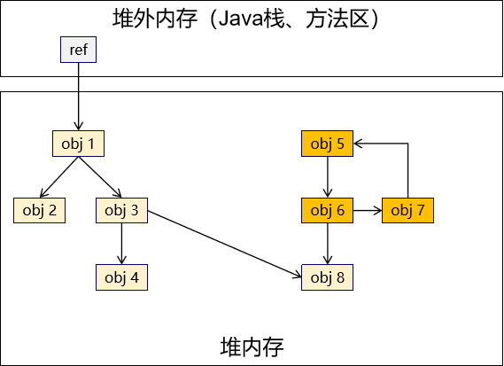

## 7.2. 基于不同引用类型分析

- 强引用：只要引用对象的强引用指针还在，那么就不能回收
- 软引用：当一个对象仅持有软引用时，如果GC是由于堆内存空间不足而触发的，那么即使软引用指针还在也会回收对象
- 弱引用：当一个对象仅持有弱引用时，不管GC是由于什么原因触发，这个对象都会被回收
- 虚引用：当一个对象仅持有虚引用时，它可以在任何时候被垃圾回收器回收。虚引用不能防止对象被回收，也不能通过虚引用来获取对象
- 无引用：当一个对象没有任何类型的指针指向它，那么它在GC中一定会被回收

# 8. 为什么不能使用引用计数法查找垃圾对象？

## 8.1. 引用计数法的概念

在对象头中维护一个计数器，初始值为0。

每增加一个指向对象的引用则使计数器+1

每减少一个指向对象的引用则使计数器-1

当计数器恢复为0时，该对象判定为垃圾对象，可以被垃圾回收

## 8.2. 引用计数法的缺陷

对象之间的循环引用会导致原本应该被回收的对象无法回收


- 对象A引用计数器值：1
- 对象B引用计数器值：1

此时其实已经没有任何有效指针指向它们了，但是这两个垃圾对象彼此之间互相引用，导致引用计数器无法减少到零，进而导致垃圾对象无法回收、长期占用内存，甚至可能导致OOM

# 9. 开发中是否可以避免出现对象的循环引用？

## 9.1. 结论

无法避免，对象彼此之间的引用关系是错综复杂的，两个对象即使看似表面上没有互相引用，但是有可能绕很大一圈后发现它们是互相引用的。

如果禁止对象之间循环引用，那么很多业务功能将无法实现

## 9.2. 举例

### 9.2.1. 实体类之间的关联关系

```Java
public class Order {
    private Customer customer;
}
```

订单实体

```Java
public class Customer {
    private List<Order> orderList;
}
```

客户实体

### 9.2.2. 框架源码

SpringMVC源码显示：

- IOC容器初始化完成之后，IOC容器对象会存入ServletContext域
- 为了获取ServletContext对象方便，ServletContext对象会被存入IOC容器

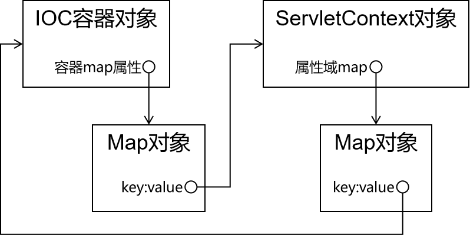

### 9.2.3. 结论

引用计数法存在重大缺陷，不具备实用性；事实上也确实没有任何一款GC产品实际使用引用计数法

# 10. 哪些对象可以作为GC-Roots？

## 10.1. 背记

在Java语言中，可以作为GC Roots的对象包括下面几种：

- 虚拟机栈（栈帧中的本地变量表）中的引用对象
- 方法区中的类静态属性引用的对象
- 方法区中的常量引用的对象
- 本地方法栈中JNI（Native方法）的引用对象

## 10.2. 理解

### 10.2.1. 虚拟机栈中的对象

当一个方法被调用时，该方法的局部变量会被压入到虚拟机栈中，这些局部变量就是GC Roots。例如：

```Java
public void test() {
    Object obj = new Object(); // obj是GC Roots
}
```

### 10.2.2. 方法区中的静态属性引用的对象

类加载到方法区后，类的静态变量会引用该类中定义的静态属性，这些静态属性也是GC Roots。例如：

```Java
public class TestClass {
    private static Object obj = new Object(); // obj是GC Roots
}
```

### 10.2.3. 方法区中的常量引用的对象

常量池是类元数据的一部分，其中存储了类中使用的常量值。

如果一个常量引用了一个对象，那么这个对象也是GC Roots。例如：

```Java
public class TestClass {
    private static final Object obj = new Object(); // obj是GC Roots
}
```

### 10.2.4. 本地方法栈中的JNI引用的对象

当Java代码与本地代码（如C或C++）交互时，本地方法栈中的JNI可能会引用Java对象，这些对象也被视为GC Roots。例如：

```Java
public class TestClass {
    private native void nativeMethod(); // nativeMethod是本地方法
}
```

## 10.3. 小技巧

由于Root 采用栈方式存放指针，所以如果一个指针，它保存了堆里面的对象，但是自己又不存放在堆里面，那他就可以作为一个Root

# 11. 说一下JVM有哪些垃圾回收算法？

## 11.1. 背记

Java虚拟机（JVM）中的垃圾回收算法是用于自动管理内存，回收不再使用的对象所占用的内存空间。

主要的垃圾回收算法包括以下几种：

- 标记复制算法
- 标记清除算法
- 标记整理算法
- 分代算法

## 11.2. 理解

### 11.2.1. 标记复制算法

该算法将内存平均分成两部分，然后每次只使用其中的一部分，当这部分内存满的时候，会将内存中所有存活的对象复制到另一个内存中，然后将之前的内存清空，只使用这部分内存，循环下去。

#### 11.2.1.1. 执行GC前


#### 11.2.1.2. 执行标记

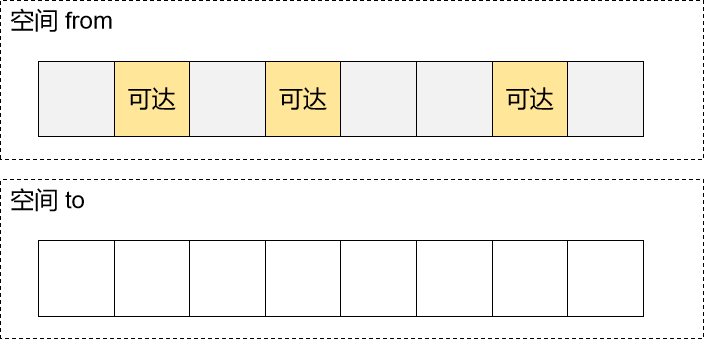

#### 11.2.1.3. 执行复制

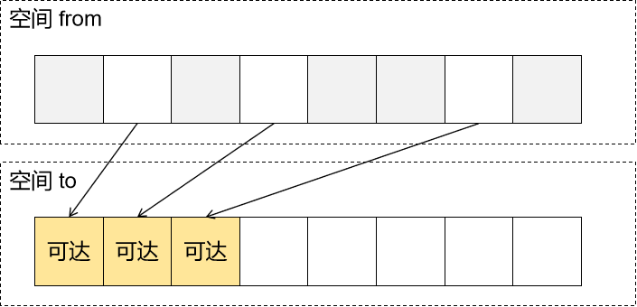

#### 11.2.1.4. 交换指针

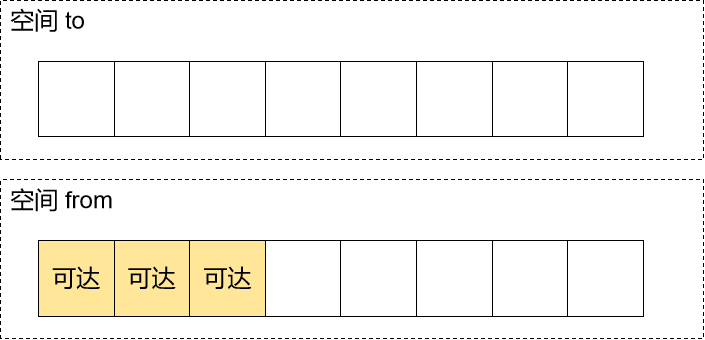

### 11.2.2. 标记清除算法

- 使用GC Roots可达性分析算法把不可达的对象标记出来
- 回收被标记的对象

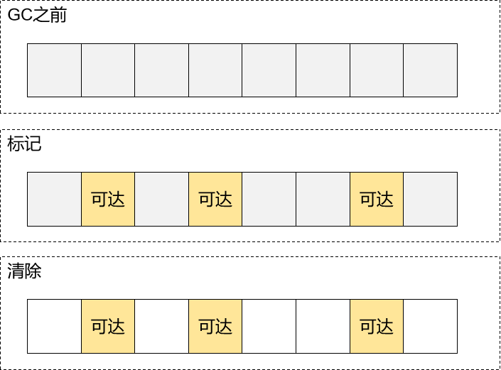

### 11.2.3. 标记整理算法

也叫标记压缩算法，它的做法是：标记无用对象，让所有存活的对象都向一端移动，然后直接清除掉端边界以外的内存

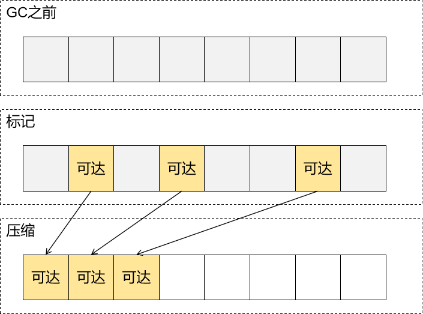

### 11.2.4. 分代算法

根据对象存活周期的不同将内存划分为几块，一般是新生代和老年代，新生代基本采用复制算法，老年代采用标记整理算法。

分代回收算法实际上是把复制算法和标记整理法的结合，并不是真正一个新的算法，一般分为：老年代（Old Generation）和新生代（Young Generation）

老年代就是很少垃圾需要进行回收的，新生代就是有很多的内存空间需要回收，所以不同代就采用不同的回收算法，以此来达到高效的回收算法。

# 12. JVM有哪些垃圾回收器？

## 12.1. 背记

垃圾回收器总共分成三大类：

- 串行：Serial、Serial Old
- 并行：ParNew、Parallel、Parallel Old
- 并发：CMS、G1

## 12.2. 理解

### 12.2.1. Serial收集器

它是最基本的垃圾回收器，使用单线程进行垃圾回收，会暂停所有用户线程，适用于客户端应用或者小型服务器应用

### 12.2.2. Parallel收集器

包括Parallel Scavenge和Parallel Old，它们使用多线程进行垃圾回收，可以充分利用多核处理器的优势，提高回收效率，适用于对吞吐量要求较高的应用

### 12.2.3. CMS（Concurrent Mark Sweep）收集器

它是一种以获取最短回收停顿时间为目标的收集器，主要使用并发收集算法，减少垃圾回收时的停顿时间，适用于对响应时间要求严格的应用，如B/S服务端

### 12.2.4. G1（Garbage-First）收集器

它面向服务端应用，将堆划分为多个大小相等的Region，并根据预测的停顿时间来选择要清理的Region，以达到控制垃圾回收造成的停顿，适用于大内存、多核处理器的服务器环境。

# 13. 详细介绍一下CMS垃圾回收器？

## 13.1. 背记

CMS（Concurrent Mark Sweep）收集器是一种以获取最短回收停顿时间为目标的收集器，属于并发收集器，它实现了让垃圾收集线程与用户线程几乎同时工作。

整个过程由四个步骤：

- 初始标记（CMS initial mark）
- 并发标记（CMS concurrent mark）
- 重新标记（CMS remark）
- 并发清理（CMS concurrent sweep）

## 13.2. 理解

CMS（Concurrent Mark Sweep）收集器是一种以获取最短回收停顿时间为目标的收集器。

它非常适合在注重用户体验的应用上使用，它是HotSpot虚拟机第一款真正意义上的并发收集器，它第一次实现了让垃圾收集线程与用户线程几乎同时工作。

从名字中的Mark Sweep这两个词可以看出，CMS收集器是一种 “标记-清除”算法实现的，它的运作过程相比于前面几种垃圾收集器来说更加复杂一些。

整个过程分为四个步骤：

- 初始标记（CMS initial mark）
- 并发标记（CMS concurrent mark）
- 重新标记（CMS remark）
- 并发清理（CMS concurrent sweep）

其中初始标记、重新标记这两个步骤仍然需要“Stop The World”。

初始标记仅仅只是枚举全部的GC Roots对象，速度很快，并发标记阶段就是进行GC Roots Tracing的过程【采用三色标记算法】

这个过程耗时较长但是不需要停顿用户线程， 可以与垃圾收集线程一起并发运行。

因为用户程序继续运行，可能会有导致已经标记过的对象状态发生改变。

而重新标记阶段则是为了修正并发标记期间，因用户程序继续运作而导致标记产生变动的那一部分对象的标记记录，这个阶段的停顿时间一般会比初始标记阶段稍长一些，但远比并发标记的时间短。

并发清理这个阶段、清理删除掉标记阶段判断已经死亡的对象，由于不需要移动存活对象，因此这个阶段可以与用户线程同时发生。

初始标记：迄今为止在进行根节点枚举这一步骤都是需要暂停用户线程的，必须要保证在一个能够保证一致性的快照中得以进行。

这里的一致性指的是，不会出现在分析过程中，根节点集合的对象的引用关系还在不断地变化。

因为如果这点不能满足，那么分析结果就不能保证。

那么对于目前的Java应用来说，光是方法区的大小就有数百上千兆，里面的类或者常量更是恒河数沙，若是检查这里为起源的引用就需要消耗很多的时间，所以虚拟机自当是有办法直接得到哪些地方存在着对象的引用。

在HotSpot虚拟机中，是使用的一组称为OopMap的数据结构来达存放这些引用。

一旦类加载完成的时候，虚拟机就会把对象的偏移量数据计算出来。

并且在JIT即时编译中也会在特定的位置记录下栈里的寄存器中存放哪些位置是引用。

这样收集器在扫描的时候就可以得知这些信息了。并不需要真正的一个不漏的从方法区等GCROOT开始查找。

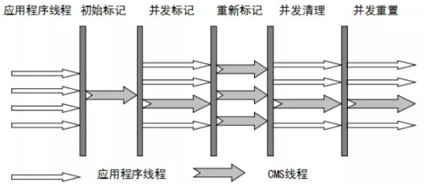

从它的名字就可以看出它是一款优秀的垃圾收集器，主要优点：并发收集、低停顿。

但是它有下面几个明显的缺点：

- 对CPU资源敏感（会和服务抢资源，降低吞吐量）；当然，这是所有并发收集器的缺点
- 无法处理浮动垃圾（在并发标记和并发清理阶段又产生垃圾，这种浮动垃圾在本次收集中无法干掉他们，只能等到下一次GC再清理了，这一部分垃圾成为浮动垃圾）；
- 它使用的回收算法-“标记-清除”算法会导致收集结束时有大量空间碎片产生

同样由于垃圾收集阶段用户程序还需要持续运行，那就还需要预留足够的空间给用户线程使用，因此CMS垃圾回收器不能像其他的收集器那样等待老年代几乎完全被填满再进行垃圾收集。

如果CMS运行期间预留的内存无法满足程序分配新对象的空间，就会出现并发失败。

这时候虚拟机就启动默认的备预案，冻结用户线程，临时启用重新对老年代的垃圾收集。

这样就导致停顿时间很长了，性能反而降低。

# 14. 新生代垃圾回收器和老年代垃圾回收器都有哪些？有什么区别？

## 14.1. 背记

### 14.1.1. 名称列表

- 新生代回收器：Serial、ParNew、Parallel Scavenge
- 老年代回收器：Serial Old、Parallel Old、CMS整堆回收器

### 14.1.2. 区别

#### 14.1.2.1. 应用场景

- 新生代通常采用复制算法，因为大部分新生成的对象会很快变得不可达，所以复制算法可以高效地处理这些朝生夕死的对象。
- 老年代则使用标记-清除或标记-整理算法，这些算法适用于处理长期存活的对象，可以减少内存碎片并提高内存利用率。

#### 14.1.2.2. 内存分配和管理策略

- 新生代与老年代的比例默认为1:2，新生代又可细分为Eden、From Survivor、To Survivor三个区。
- 老年代中的对象通常占用较大的内存空间，因此需要能够有效地管理这些对象的内存分配和回收。

#### 14.1.2.3. 设计目标

- 新生代垃圾回收器的设计目标是优化垃圾回收的性能，因为大多数新创建的对象会很快变得不可达。
- 老年代垃圾回收器的设计目标是处理长时间存活的对象，这些对象通常占用较大的内存空间。

## 14.2. 理解

新生代垃圾回收器与老年代垃圾回收器在多个维度上存在显著差异，这些差异体现在它们的设计目标、适用的回收算法、垃圾回收器的选择以及内存管理策略等方面。

具体分析如下：

### 14.2.1. 设计目标

- 新生代垃圾回收器的设计目标是优化垃圾回收的性能，因为大多数新创建的对象会很快变得不可达，所以新生代的回收器需要快速处理这些短生命周期的对象。
- 老年代垃圾回收器的设计目标是处理长时间存活的对象，这些对象通常占用较大的内存空间，因此老年代的回收器需要能够有效地管理这些对象的内存分配和回收。

### 14.2.2. 适用的回收算法

- 新生代通常使用复制（Copy）算法，这种算法适用于快速回收大量短期对象，但可能会导致内存利用率降低。
- 老年代通常使用标记-清除（Mark-Sweep）或标记-整理（Mark-Compact）算法，这些算法适用于处理长期存活的对象，可以减少内存碎片并提高内存利用率。

### 14.2.3. 垃圾回收器的选择：

- 新生代可以使用的垃圾回收器包括Serial、ParNew和Parallel Scavenge，这些回收器专注于快速清理新生代中的短期对象。
- 老年代可以使用的垃圾回收器包括Serial Old、CMS和Parallel Old，这些回收器专注于长期存活对象的内存管理。

### 14.2.4. 内存管理策略

- 在执行Minor GC之前，JVM会检查老年代的可用内存空间，确保有足够的空间容纳新生代中存活下来的对象，以避免内存溢出。
- 新生代和老年代的内存比例会根据应用程序的需求进行调整，以平衡垃圾回收的效率和内存的使用效率。

综上所述，新生代垃圾回收器和老年代垃圾回收器在设计目标、适用的回收算法等方面各有特点，这些差异使得它们能够高效地管理Java虚拟机中的内存，适应不同类型对象的生命周期。了解这些差异有助于优化JVM的内存管理和垃圾回收过程，从而提高应用程序的性能。

# 15. 简述分代垃圾回收器是怎么工作的？

## 15.1. 背记

分代回收器有两个分区：老年代和新生代，新生代默认的空间占比总空间的 1/3，老年代的默认占比是 2/3。

新生代使用的是复制算法，新生代里有 3 个分区：Eden、To Survivor、From Survivor，它们的默认占比是 8:1:1，它的执行流程如下：

- 把 Eden + From Survivor 存活的对象放入 To Survivor 区；
- 清空 Eden 和 From Survivor 分区；
- From Survivor 和 To Survivor 分区交换，From Survivor 变 To Survivor，To Survivor 变 From Survivor
- 每次在 From Survivor 到 To Survivor 移动时都存活的对象，年龄就 +1，当年龄到达 15（默认配置是15）时，升级为老年代。
- 大对象也会直接进入老年代。

## 15.2. 理解

分代垃圾回收器是基于一种名为“分代假设”的观察，即大部分对象都是很快死去的。基于这个假设，JVM将内存分为两个主要区域：新生代和老年代。

1. 新生代：用于存放刚创建的对象。它的回收过程通常称为Minor GC或Young GC，采用复制算法来处理新生成对象的快速回收。
2. 老年代：用于存放长时间存活的对象。当对象经过一定次数的垃圾回收后依然存活，它们将从新生代晋升到老年代。老年代的回收过程通常称为Major GC或Old GC，采用标记-清除或标记-整理算法来处理长期存活的对象。

整个工作流程可以简述为：

1. 对象分配：在新生代Eden区分配新对象。
2. 第一次垃圾回收：当Eden区满时，执行Minor GC，将存活的对象复制到From Survivor区。
3. 第二次垃圾回收：当From Survivor区满时，再次执行Minor GC，将存活的对象复制到To Survivor区。
4. 晋升：重复上述过程，每次回收后，存活的对象年龄增加。当对象的年龄达到某个阈值时，它们将被移动到老年代。
5. 老年代回收：当老年代被填满，或者无法满足内存分配需求时，触发Major GC，对老年代进行垃圾回收。

通过这种分代的方式，垃圾回收器能够有效地管理不同生命周期的对象，提高垃圾回收的效率。

# 16. 垃圾回收器的比较

名称

Serial

ParNew

Parallel Scavenge

算法

标记复制

标记复制

标记复制

生效区域

新生代

新生代

新生代

线程

单线程

多线程

多线程

工作模式

串行

并行

并行

说明

简单粗暴，效率低下

唯一和CMS搭配的新生代垃圾回收器

实现了更大吞吐量

Serial Old

标记整理

老年代

单线程

串行

可以和所有young GC搭配使用

Parallel Old

标记整理

老年代

多线程

并行

搭配Parallel Scavenge使用

CMS

标记清除

老年代

多线程

并发

设计理念尽可能将STW时间压缩到最短

# 17. 请介绍一下什么是三色标记？

## 17.1. 三色标记算法介绍

三色标记算法是一种应**用于CMS和G1垃圾回收器**中的对象标记策略，主要用于区分内存中的对象是否仍然存活。

通过将对象标记为不同的颜色，垃圾回收器可以高效地追踪和清理不再使用的对象。以下是三色标记算法的详细步骤和原理：

## 17.2. 颜色定义

1. **白色（White）：**表示尚未访问过的对象，初始状态下所有对象都是白色的。
2. **灰色（Gray）：**表示已经访问过但其引用的对象尚未全部访问的对象。灰色对象作为标记过程中的“工作队列”。
3. **黑色（Black）：**表示已经完全访问过的对象，即该对象及其引用的所有对象都已经被标记为存活。

## 17.3. 标记过程

1. **初始化**
  - 将所有对象标记为白色。
  - 将根对象（如全局变量、栈中的对象引用等）标记为灰色，并加入到一个工作队列中。
2. **标记阶段**
  - 从工作队列中取出一个灰色对象。
  - 将该对象标记为黑色。
  - 遍历该对象引用的所有对象：
    - 如果引用的对象是白色的，将其标记为灰色并加入工作队列。
    - 如果引用的对象已经是灰色或黑色，跳过。
  - 重复上述步骤，直到工作队列为空。
3. **清理阶段**
  - 所有仍标记为白色的对象被认为是垃圾，可以被回收。
  - 黑色和灰色对象被认为是存活对象，保留下来。

## 17.4. 并发标记与SATB

- 在并发标记过程中，应用程序可能继续运行并修改对象图。为了确保标记的准确性，一些垃圾回收器（如G1和Shenandoah）使用了**SATB (Snapshot-At-The-Beginning)** 机制。
- SATB的基本思想是在标记开始时创建一个对象图的快照，并记录所有在标记过程中发生的修改，确保所有新创建的引用都能被正确标记。

> 额外说明：Shenandoah
> 使用了
> SATB
> 机制，但
> Shenandoah
> 没有使用三色标记算法
> 。Shenandoah
> 垃圾回收器采用了一种称为颜色指针的技术，而不是传统的三色标记算法。这种技术通过在对象中嵌入额外的位来表示对象的状态，从而避免了在并发环境下对对象进行多次扫描的需求。具体来说，Shenandoah
> 使用了一种名为
> Brooks Forwarding Pointer
> 的技术，它允许在对象移动时更新引用，而不需要像传统垃圾回收器那样在对象之间复制引用。

## 17.5. 优点

- **高效性**: 通过分阶段处理，减少了单次垃圾回收的停顿时间。
- **并发性**: 可以与应用程序并发执行，减少对应用程序性能的影响。
- **准确性**: 确保所有存活对象都能被正确标记，避免内存泄漏。

## 17.6. 缺点

- **复杂性**: 实现并发标记和SATB机制增加了垃圾回收器的复杂性。
- **开销**: 记录和处理并发修改会带来一定的额外开销。

## 17.7. 应用实例

- **CMS（****Concurrent Mark and Sweep****）**使用三色标记进行并发标记，减少停顿时间。
- **G1（****Garbage-First Garbage Collector****）**结合SATB机制，实现高效的并发标记。
- **ZGC（Z Garbage Collector）**利用读屏障和染色标记技术，实现低延迟的垃圾回收。这种染色标记技术是基于三色标记算法的一种优化实现
- **Shenandoah**基于颜色指针技术，实现几乎没有停顿的垃圾回收。颜色指针技术可以看做三色标记技术的优化、改进，但从最终形态来说颜色指针和三色标记已经相差很大了

三色标记算法因其高效性和并发性，在现代垃圾回收器中得到了广泛应用，成为垃圾回收领域的重要技术之一。

# 18. 说说三色标记法工作过程中的多标问题

## 18.1. 多标的产生


此时实际上B对象已经是垃圾对象了，但是由于B已经被标记为了灰色，所以不会再回退到白色状态，那么也就不会被作为垃圾清理掉。最终的结果就是B对象会逃过本轮GC。

## 18.2. 多标的危害

多标危害性不大，仅仅只是部分对象躲过本轮GC，在一定时间段内浪费部分内存空间，下次GC重新扫描即可被清理掉。

# 19. 说说三色标记法工作过程中的漏标问题

## 19.1. 漏标的产生


问题分析：

- D如果被**灰色**对象引用，那么在未来将会被扫描到（灰色表示该对象引用的对象尚未扫描完成）
- D如果被**黑色**对象引用，那么在未来讲不会被扫描到（黑色表示该对象引用的对象全部扫描完成了——但此时事实并非如此）

按照最终的对象引用关系，D对象其实应该是黑色的，但是在引用关系改变后，D被黑色的A对象引用，所以不会被扫描检测，颜色就没有机会改变了，最终保持了它原来的白色状态。

## 19.2. 漏标的危害

D对象事实上来说不是垃圾，但是最终因为是白色的，所以会被清理，那么A对象要访问D对象时就会发生空指针——这就是非常严重的问题

> 所以个人感觉“漏标”这个名字改成“误标”或“错标”或许会更好理解

## 19.3. 漏标的解决方案

### 19.3.1. 问题的本质

漏标问题的危害就是：引用关系改变之后，非垃圾对象被当做垃圾对象清理了。产生这个问题需要同时满足下面两个条件：

- 条件一：灰对象断开了一个连接到白对象的引用
- 条件二：黑对象引用了一个白对象，黑对象本身不会被再次检测，而白对象最终会被当做垃圾清理

所以破坏掉上面两个条件中的任何一个就可以解决这个问题

### 19.3.2. CMS解决方案：写屏障+增量更新（**Incremental Update**）

这一方案用大白话描述就是：如果黑色对象引用了白色对象，那么就把这个白色对象改为灰色，灰色对象会在下一轮扫描过程中被加入工作队列，所以这个方案破坏的是第二个条件


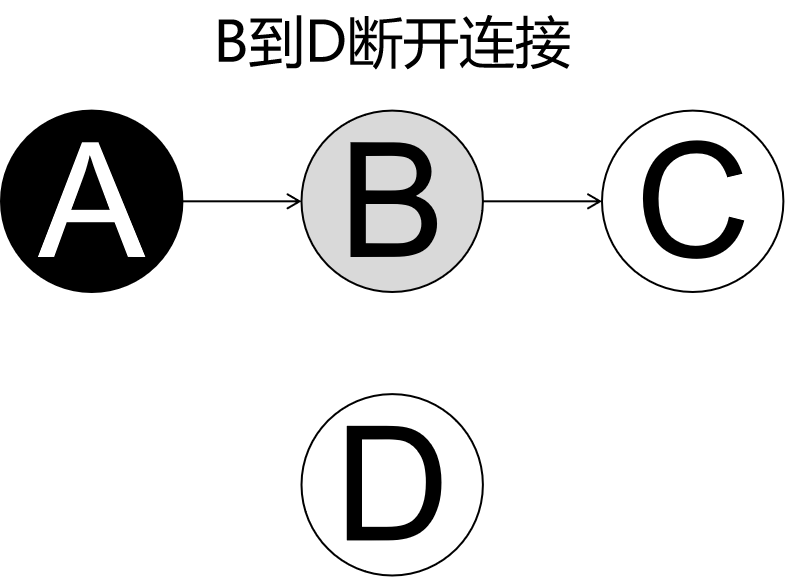

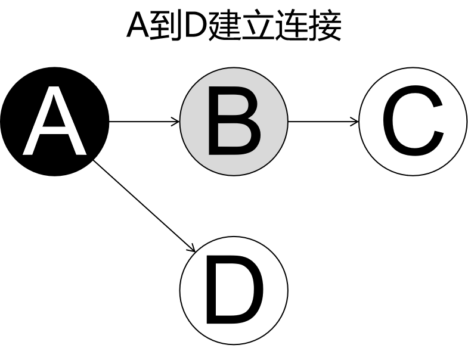

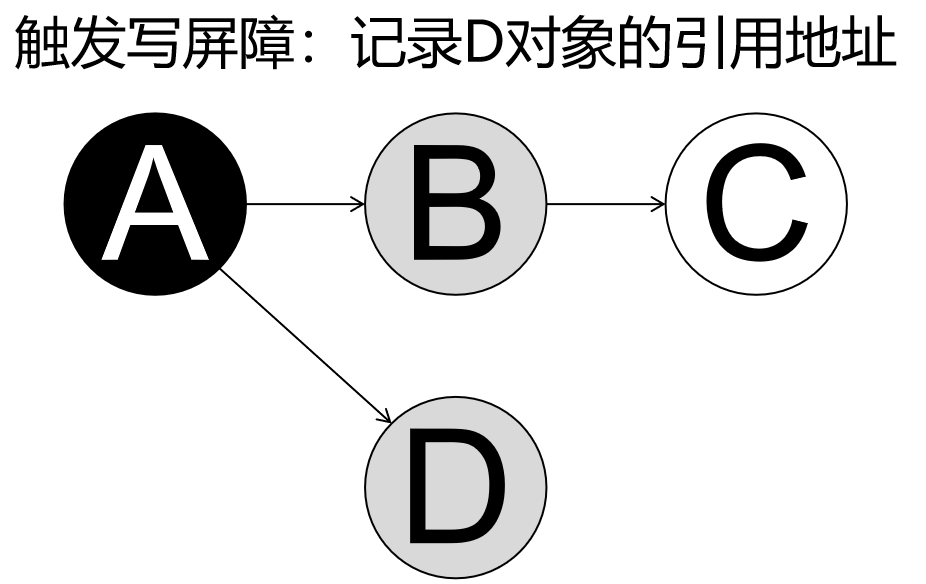

```C
// 在写操作后执行
void post_write_barrier(oop* field, oop new_value) {
    remark_set.add(new_value); // 记录新引用的对象
}
```

写屏障代码参考

### 19.3.3. G1解决方案：写屏障+原始快照（SATB）

#### 19.3.3.1. 方案执行流程

**SATB**：**Snapshot-At-The-Beginning**

这一方案用大白话描述就是：灰色对象和一个白色对象断开连接时，把这个白色对象改成灰色，进而使其在下一轮扫描时放入工作队列，从而避免被清理，，所以这个方案破坏的是第一个条件


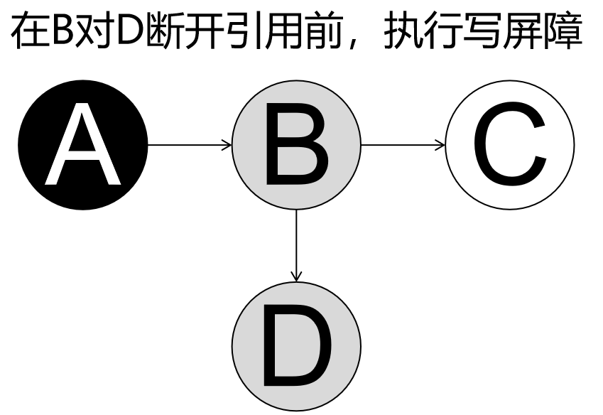

```C
// 在写操作前执行（这里的写操作就是B对D断开引用）
void pre_write_barrier(oop* field) {
    oop old_value = *field; // 获取旧值
    remark_set.add(old_value); // 记录原来的引用对象
}
```

写屏障代码参考

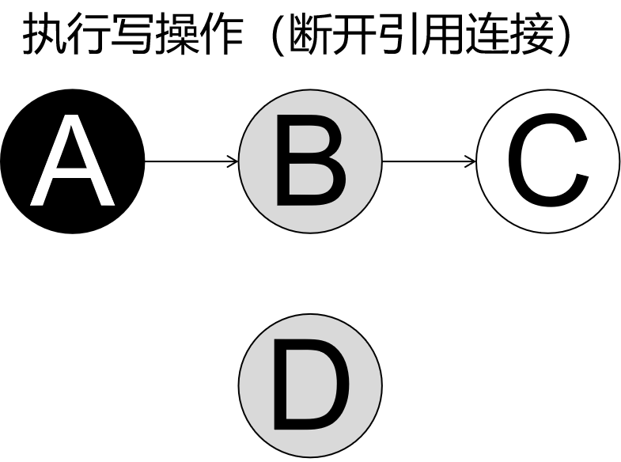

#### 19.3.3.2. 方案存在的问题

很明显：在B到D的连接断开之后，如果A或其它任何对象并没有重新引用D，那么D就成了浮动垃圾，需要在下一次GC时回收

评估：相对于漏标问题的严重危害，浮动垃圾危害不大，可以接受。这相当于把漏标的危害程度降低到了多标的程度

# 20. JVM常用的调优工具有哪些？

## 20.1. 背记

JDK自带了很多监控工具，都位于JDK的bin目录下，其中最常用的是jconsole和jvisualvm这两款视图监控工具。

- JConsole：用于对JVM中的内存、线程和类等进行监控
- JVisualVM：JDK自带的全能分析工具，可以分析内存快照、线程快照、程序死锁、监控内存的变化、GC变化等

## 20.2. 理解

JConsole和JVisualVM是用于监控和管理Java应用程序的图形化工具，它们都是JDK自带的工具。

以下是这两个工具的具体使用情况：

### 20.2.1. JConsole

1. 监控本地或远程JVM：JConsole可以监控本地运行的Java应用程序，同时也可以连接到远程服务器上的Java应用程序进行监控。
2. MBean的管理：它提供了基于JMX（Java Management Extensions）的接口，允许用户查看和管理MBean，这是Java平台的一种资源管理机制。
3. 性能监控：通过JConsole，用户可以实时查看Java应用程序的内存使用情况、线程状态、类加载情况以及CPU使用率等信息。

### 20.2.2. JVisualVM

1. 强大的分析功能：JVisualVM不仅可以进行监控，还能进行深入的性能分析，如堆内存溢出分析、虚拟机栈溢出分析和线程死锁检测等。
2. 插件支持：JVisualVM支持多种插件，这些插件可以提供更多的功能，如监控特定的应用服务器或框架。
3. 图形化界面：JVisualVM提供了一个直观的用户界面，使得查看和分析数据更加方便。

在使用这两个工具时，通常需要确保目标Java应用程序启动时开启了JMX代理，并且设置了正确的端口号，以便JConsole或JVisualVM能够连接到应用程序。

在连接后，用户可以通过这些工具的图形化界面来查看各种性能指标，并根据需要进行调整。

总的来说，JConsole更适合于快速的监控和管理任务，而JVisualVM则提供了更为全面和深入的性能分析功能。在实际使用中，根据需要选择合适的工具进行操作是非常重要的。

# 21. 常用的JVM调优的参数都有哪些？

## 21.1. 堆内存调优

参数名称

-Xms

-Xmx

-XX:NewRatio

功能说明

设置JVM堆内存的初始大小，影响应用程序启动时分配的内存量

设置JVM堆内存的最大大小，限制了应用程序能够使用的最大内存量

设置新生代与老年代的比例，影响垃圾回收的性能和频率

-XX:SurvivorRatio

设置Eden区与Survivor区的比例，进一步细化新生代的内存分配策略

-XX:MaxTenuringThreshold

设置对象经过多少次垃圾回收后进入老年代，决定了对象的晋升年龄阈值

## 21.2. 垃圾回收调优

参数名称

-XX:+UseSerialGC

-XX:+UseParallelGC

-XX:+UseConcMarkSweepGC

功能说明

指定使用串行垃圾收集器，适用于单核处理器或小内存量的应用场景

指定使用并行垃圾收集器，适用于多核处理器且希望最大化吞吐量的场景

指定使用并发标记清除垃圾收集器，适用于需要低延迟的应用

-XX:+UseG1GC

指定使用G1垃圾收集器，适用于大堆内存和多核处理器的场景，提供平衡的吞吐量和较低的延迟

## 21.3. 线程调优

参数名称

-Xss

功能说明

设置Java线程堆栈大小，影响线程的内存占用和性能

## 21.4. 日志设置

参数名称

-verbose:class

-verbose:gc

功能说明

输出类加载信息，有助于分析类加载过程和性能问题

输出垃圾回收信息，有助于监控垃圾回收活动和性能问题

# 22. System.gc()能保证执行GC执行吗？

## 22.1. 背记

不能保证GC一定会执行。

尽管程序员可以通过调用 System.gc() 来建议JVM进行垃圾回收，但Java语言规范并没有规定这会导致垃圾回收一定发生。

垃圾回收通常是自动进行的，而且它的触发时机取决于JVM的具体实现和当前的内存使用状况。

## 22.2. 理解

以下是一些关于垃圾回收执行的关键点：

### 22.2.1. System.gc()的作用

System.gc() 是一个建议性的调用，它向JVM提出了进行垃圾回收的建议，但JVM可能不会立即响应这个请求。

### 22.2.2. 垃圾回收的触发条件

新生代通常在Eden区被填满后会触发垃圾回收，而老年代的触发条件则更为复杂，因为有些并发收集器允许用户线程在清理过程中继续运行。

### 22.2.3. 垃圾回收的不确定性

垃圾回收的发生具有一定的不确定性，通常是在随机的时间点，这取决于对象的分配和存活情况。

### 22.2.4. JVM实现者的角色

JVM的实现者可以决定如何响应 System.gc() 的调用，这意味着不同的JVM实现可能会有不同的行为。

总的来说，虽然 System.gc() 可以作为一种提示JVM进行垃圾回收的手段，但它并不能保证垃圾回收一定会执行。在实践中，通常不建议频繁手动触发垃圾回收，因为这可能会对应用程序的性能产生负面影响。

相反，应该依赖于JVM的自动垃圾回收机制来管理内存，同时通过合理地设置JVM参数来优化垃圾回收的效率。

如果确实需要对垃圾回收进行更精细的控制，可以考虑使用特定的JVM选项或工具来监控和调整垃圾回收的行为。

# 23. 怎么获取Java程序使用的内存？堆使用的百分比？

要获取Java程序使用的内存以及堆使用的百分比，可以使用以下几种方法：

1. **使用JVM内置工具**：
  - **jstat**：这是一个命令行工具，可以用来监控JVM的各种性能指标，包括堆内存的使用情况。例如，运行`jstat -gc <pid>`可以查看指定进程的垃圾回收统计信息，其中包含了堆内存的使用情况。
  - **jmap**：这个工具可以用来生成堆转储快照（heap dump），或者查询堆的详细信息。例如，运行`jmap -heap <pid>`可以查看堆的配置和使用情况。
2. **使用Java代码**：
  - 可以通过`Runtime`类来获取当前JVM的内存使用情况。例如：Runtime runtime = Runtime.getRuntime(); long totalMemory = runtime.totalMemory(); // JVM总内存 long freeMemory = runtime.freeMemory(); // JVM空闲内存 long usedMemory = totalMemory - freeMemory; // 已使用的内存 double usagePercentage = (double) usedMemory / totalMemory * 100; // 使用百分比
3. **使用第三方库**：
  - 可以使用如`SIGAR`、`OSHI`等第三方库来获取系统和JVM的详细性能指标。这些库通常提供了更丰富的API来监控系统资源。
4. **使用JMX（Java Management Extensions）**：
  - JMX是Java平台的一部分，用于管理和监控应用程序、系统对象、设备等。通过JMX，你可以连接到正在运行的JVM并查询各种管理数据，包括内存使用情况。可以使用JConsole或VisualVM这样的工具来访问JMX MBeans。
5. **集成到应用中**：
  - 如果你的应用是一个Web应用，许多应用服务器（如Tomcat, Jetty等）都提供了监控和管理功能，包括内存使用情况。

选择哪种方法取决于你的具体需求，比如是否需要实时监控、是否需要跨平台支持等。对于开发和测试环境，使用JVM内置工具或Java代码可能更为方便；对于生产环境，可能需要更稳定和功能丰富的解决方案，如使用第三方库或JMX。
