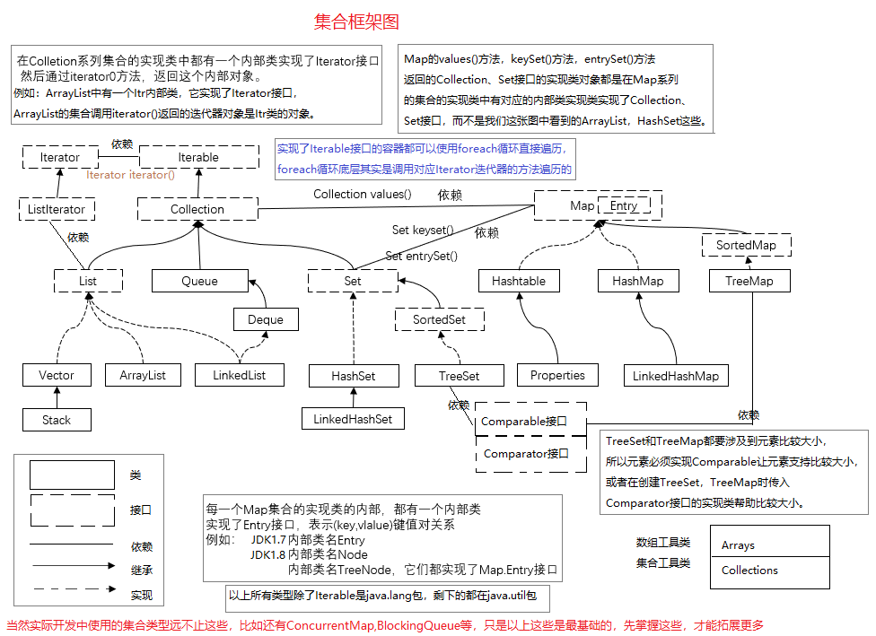
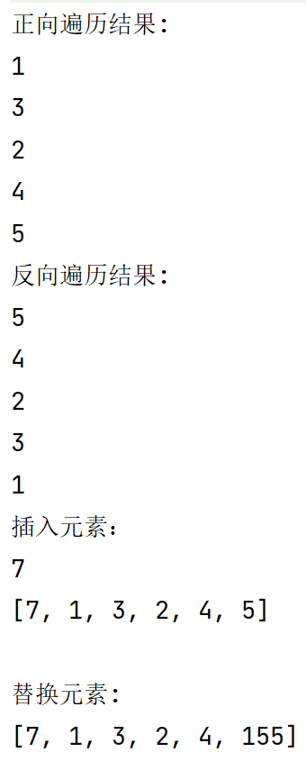
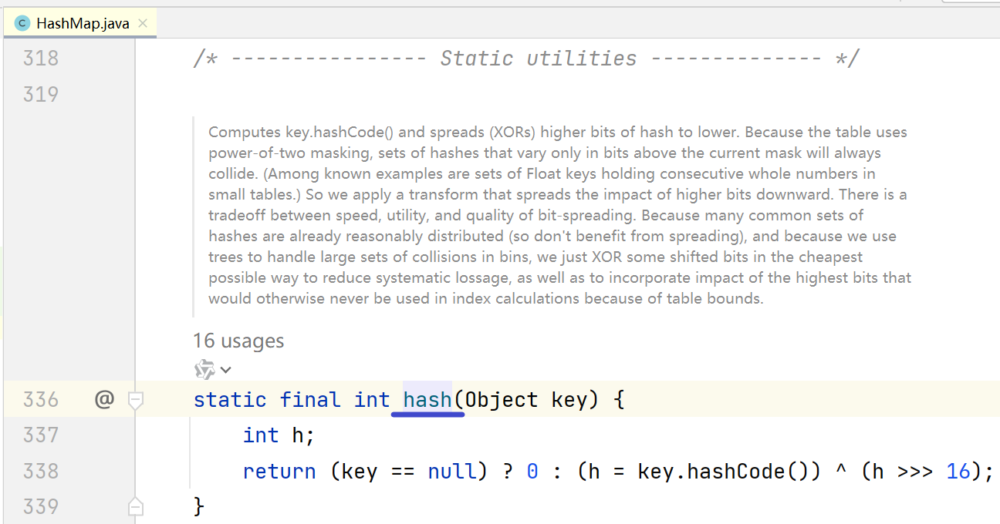
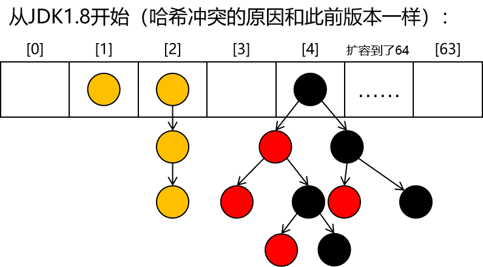

---
tags:
  - interview
  - 尚硅谷
  - Java
  - Java集合框架
source: 尚硅谷Java技术之高频面试题-v2025.1
title: Java集合框架（经典八股）
---

# Java集合框架（经典八股）

> 来源：尚硅谷 Java 技术之高频面试题 v2025.1 · java集合框架（经典八股）

# 1. Java集合框架是什么?说出集合框架的一些优点?

Java集合框架（Collection Framework）是一组用于存储和操作对象的类和接口的集合

集合框架的应用场景非常广泛，具体有List、Set、Map接口及其实现类：

## 1.1. List集合

适用于需要保持元素插入顺序的场景，如学生的成绩列表，或者任何需要有序且允许重复元素的集合。

## 1.2. Set集合

适用于需要存储唯一元素的场景，如学生学号的集合，确保每个学生都有一个唯一的标识。

## 1.3. Map集合

适用于需要通过键快速查找值的场景，如学生名册，其中学号作为键，姓名作为值，可以快速检索每个学生的信息。

## 1.4. 优点：

- 使用核心集合类降低开发成本，而非实现我们自己的集合类。
- 使用经过严格测试的集合框架类，代码质量会得到提高。
- 通过使用JDK附带的集合类，可以降低代码维护成本。
- 复用性和可操作性。



# 2. 集合接口的常见实现类

## 2.1. List接口的实现类

### 2.1.1. 背记

List接口的实现类有以下几个：

- ArrayList：基于动态数组实现，支持随机访问和快速插入、删除操作。
- LinkedList：基于双向链表实现，支持快速插入、删除操作，但不支持高效的随机访问。
- Vector：基于数组实现，与ArrayList类似，但线程安全。
- Stack：继承自Vector，表示一个后进先出（LIFO）的栈。

### 2.1.2. 理解

#### 2.1.2.1. ArrayList：

底层实现：基于动态数组实现。

特点：查询效率高，因为支持快速随机访问；增删效率相对较低，尤其是在列表中间插入或删除元素时，因为需要移动大量元素。

适用场景：适合随机访问元素较多的场景。

#### 2.1.2.2. LinkedList：

底层实现：基于双向链表实现。

特点：在列表的两端添加或删除元素的效率高，因为只需要改变链接；查询效率较低，因为需要从头或尾遍历链表。

适用场景：适合频繁在列表两端进行插入和删除操作的场景。

#### 2.1.2.3. Vector：

底层实现：基于数组实现，与ArrayList类似，但Vector是线程安全的。

特点：由于同步开销，性能比ArrayList低；提供了线程安全的列表操作。

适用场景：在多线程环境中需要保证线程安全的场景。

#### 2.1.2.4. 选择

如果需要频繁访问列表中的某个元素，那么ArrayList可能是最佳选择；

如果需要在列表的两端频繁添加或删除元素，那么LinkedList可能更合适。

如果需要在多线程环境中使用List，可以考虑使用Vector，因为它线程安全，尽管它的性能可能不如其他实现类。

如果在多线程环境中需要兼顾性能和安全，那么就需要使用CopyOnWriteArrayList

## 2.2. Set接口的实现类

### 2.2.1. 背记

Set接口的实现类有以下几个：

- HashSet：基于哈希表实现，元素无序，不允许重复。
- LinkedHashSet：基于哈希表和链表实现，元素有序，不允许重复。
- TreeSet：基于红黑树实现，元素有序，不允许重复。

### 2.2.2. 理解

Set接口的实现类及其特点具体如下：

#### 2.2.2.1. HashSet

基于HashMap实现，由哈希表支持。

无序性：不保证集合的迭代顺序，特别是它不保证该顺序恒久不变。

不允许重复元素：利用hashCode()方法和equals()方法来确保集合中不会有重复元素。

性能优异：因为基于哈希表，所以具有很快的添加、删除和查找速度。

使用示例：当需要创建一个不含重复元素的集合时，通常会选择HashSet。

#### 2.2.2.2. LinkedHashSet

继承自HashSet，内部使用链表维护插入顺序。

有序性：元素迭代顺序为它们被插入的顺序，或者它们最后一次被访问的顺序。

不允许重复：与HashSet类似，通过hashCode()和equals()方法确保元素唯一性。

适用场景：在需要保持插入顺序的场景下使用。

#### 2.2.2.3. TreeSet

基于红黑树数据结构实现。

有序性：可以确保集合元素处于排序状态，它实现了SortedSet接口。

不允许重复：同样利用hashCode()方法和equals()方法确保无重复元素。

可自定义排序规则：允许用户自定义排序规则，或要求集合内的元素类型实现Comparable接口。

使用示例：当需要对集合元素进行排序时，或需要有序且不重复的元素集合时，应使用TreeSet。

以上是Set接口的三个主要实现类及其特点。

在实际开发中，根据需要选择最适合的实现类非常重要。

例如，如果需要一个能够快速访问的无序集合，则HashSet是一个不错的选择；

如果还需要保留插入顺序，则应该考虑使用LinkedHashSet；

而如果需要集合中的元素始终保持排序状态，则TreeSet是正确的选择。

## 2.3. Map接口的实现类

### 2.3.1. 背记

Map接口的实现类主要有以下几个：

- HashMap：基于哈希表实现，支持快速的查找和插入操作。
- LinkedHashMap：继承自HashMap，维护了元素插入的顺序。
- TreeMap：基于红黑树实现，可以按照键的自然顺序或自定义比较器进行排序。
- Hashtable：与HashMap类似，但线程安全，使用synchronized关键字保证同步。
- ConcurrentHashMap：是线程安全的HashMap实现，支持高并发访问。

### 2.3.2. 理解

Map接口的各个实现类在不同维度上的特点如下：

#### 2.3.2.1. HashMap

存储结构：基于散列表（哈希表）实现。

排序：无序，不保证映射的迭代顺序。

同步：非线程安全，高效的单线程访问。

性能：通常具有较高的存取效率，但在大量元素时可能出现哈希冲突。

允许空值：允许一个键对应null值，但不允许多个键相同。

典型用途：在没有特殊排序或同步需求时使用。

#### 2.3.2.2. LinkedHashMap

存储结构：基于哈希表和双向链表实现。

排序：保持插入顺序或访问顺序（取决于构造参数）。

同步：非线程安全。

性能：相对于HashMap，插入和迭代速度略慢，但仍具有较好的存取效率。

允许空值：允许一个键对应null值，但不允许多个键相同。

典型用途：需要保持元素插入顺序的场景。

#### 2.3.2.3. TreeMap

存储结构：基于红黑树（一种自平衡二叉搜索树）实现。

排序：根据键的自然顺序或者自定义比较器进行排序。

同步：非线程安全。

性能：插入、删除和查找操作的时间复杂度为O(log n)。

允许空值：允许一个键对应null值，但不允许多个键相同。

典型用途：需要对键进行排序或有序遍历的场景。

#### 2.3.2.4. Hashtable

存储结构：基于散列表实现。

排序：无序，不保证映射的迭代顺序。

同步：线程安全，所有公共操作都是同步的。

性能：由于同步，多线程环境下表现良好，但单线程效率较低。

允许空值：不允许键和值为null。

典型用途：需要线程安全的Map实现。

#### 2.3.2.5. ConcurrentHashMap

存储结构：基于分段锁的散列表实现。

排序：无序，不保证映射的迭代顺序。

同步：线程安全，高效并发访问。

性能：在高并发环境下提供比Hashtable更好的性能。

允许空值：允许一个键对应null值，但不允许多个键相同。

典型用途：高并发环境下需要高性能的场景。

# 3. List和Map区别?

## 3.1. 背记

### 3.1.1. 存储结构

List是单列数据集合，用于存储一系列有序的对象，而Map是双列数据集合，通过键值对（Key-Value）来存储数据。

### 3.1.2. 元素唯一性

List允许元素重复，即可以有多个相同的元素存在于列表中。

Map中的键（Key）必须是唯一的，不允许有重复的键存在，但值（Value）可以重复。

### 3.1.3. 顺序性

List中的元素是有序的，元素的插入顺序会被保留。

Map中的元素是无序的，它不保证键值对的存储顺序

## 3.2. 理解

List和Map在Java集合框架中是两种非常常用的数据结构，它们在存储结构、元素唯一性、排序特点和使用场景方面存在区别。

具体分析如下

### 3.2.1. 存储结构

List是单列数据集合，用于存储一系列有序的对象。它允许存储重复的元素，并且可以通过索引直接访问元素。

而Map是一种关联数组结构，它通过键值对（Key-Value）来存储数据，其中键是唯一的，不能重复，但值可以重复。

### 3.2.2. 元素唯一性

在List中，元素是可以重复的，即可以有多个相同的元素存在于列表中。

而在Map中，键（Key）必须是唯一的，不允许有重复的键存在。

### 3.2.3. 排序特点

List中的元素是有序的，元素的插入顺序会被保留。

Map中的元素是无序的，它不保证键值对的存储顺序。

### 3.2.4. 使用场景

List通常用于存储一组相关的对象，如名单、待办事项列表等，需要按照特定的顺序进行访问和处理。

Map则适用于需要通过一个特定键来快速查找、插入或删除值的场景，如字典、数据库表等。

总的来说，List以线性方式存储数据，强调的是元素的顺序和重复性；

而Map通过键值对的方式存储数据，强调的是键的唯一性和快速检索。

在实际开发中，选择List还是Map取决于具体的数据结构和应用场景。

# 4. List、Map、Set三个接口，存取元素时，各有什么特点?

## 4.1. 背记

### 4.1.1. List

- 存放：元素是有序的，可以重复。
- 取出：可以通过索引直接取出元素，也可以使用for循环或for-each循环遍历。

### 4.1.2. Map

- 存放：以键值对的形式存放，键是唯一的且不可重复，而值可以重复。
- 取出：通过键来取出对应的值，键无需按顺序存放。

### 4.1.3. Set

- 存放：元素无序，不可重复。
- 取出：不能通过索引取出元素，需要通过迭代器或增强for循环来遍历取出

## 4.2. 理解

### 4.2.1. List 接口

- 特点：List 是一个有序的集合，可以存储重复元素。
- 实现类：常见的 List 实现类有 ArrayList、LinkedList 和 Vector。
- 访问方式：可以通过索引访问元素，支持根据索引进行增删改查操作。
- 迭代方式：可以使用普通 for 循环、Iterator 或 foreach 进行遍历。
- 常用场景：适合需要按顺序存储元素，并且需要频繁根据索引进行操作的场景。

### 4.2.2. Set 接口

- 特点：Set 是一个不允许重复元素的集合，保证集合中的元素是唯一的。
- 实现类：常见的 Set 实现类有 HashSet、LinkedHashSet 和 TreeSet。
- 无序性：Set 不保证元素的顺序，具体的顺序取决于具体的实现类。
- 添加元素：向 Set 添加重复元素时，只会保留一个副本。
- 常用场景：适合需要保证元素唯一性的场景，不关心元素的顺序。

### 4.2.3. Map 接口

- 特点：Map 是一种键值对的集合，每个键对应一个值，键是唯一的。
- 实现类：常见的 Map 实现类有 HashMap、LinkedHashMap、TreeMap 和 ConcurrentHashMap
- 访问方式：通过键来访问值，支持根据键进行增删改查操作。
- 常用方法：包括 put(key, value)、get(key)、containsKey(key) 等。
- 常用场景：适合需要根据键快速查找值的场景，如存储配置信息、缓存等。

总的来说，List 适合有序存储、允许重复元素的场景；Set 适合保证元素唯一性的场景；Map 适合

键值对存储、根据键快速查找值的场景。开发人员在选择使用时应根据实际需求和数据特点来灵活

选取适合的集合类型。

# 5. 为什么Map接口不继承Collection接口？

## 5.1. 背记

### 5.1.1. 数据结构不同

- Map集合：提供的是键值对映射，即每个元素由一个键（Key）和一个值（Value）组成
- Collection集合：提供的是一组数据，这些数据没有键值对的结构

### 5.1.2. 操作方式不同

- Map集合：检索元素时，是通过给出键对象来返回对应的值对象
- Collection集合：直接对元素进行操作

### 5.1.3. 违反接口分离原则

接口的设计应该遵循最小化，不应该把用户不使用的方法塞进同一个接口里，每个接口应该只包含一个职责，即一组相关的操作

## 5.2. 理解

### 5.2.1. 设计原则

根据接口分离原则，接口应该细化并只提供客户端所需的方法

如果一个接口提供了许多方法，而这些方法对于某些客户端来说是不必要的，那么这些客户端就不得不实现它们不需要的方法

### 5.2.2. 设计实践

在设计时，采用多个与特定客户类有关的接口比采用一个通用的接口要好

这是因为不同的客户端可能需要不同的方法集合，通过分离接口可以确保每个客户端只依赖于它实际需要的方法

### 5.2.3. 设计问题

如果Map继承了Collection接口，那么所有实现了Map接口的类也将隐式地继承Collection接口的所有方法

这会导致一些问题，比如类的接口定义暴露了过多的行为，内聚程度不够好

# 6. Iterator和ListIterator之间有什么区别?

## 6.1. 背记

Iterator和ListIterator都是Java集合框架中用于遍历集合的接口

### 6.1.1. 使用范围

- Iterator：用于遍历所有Collection类型的集合，包括Set和List
- ListIterator：专门用于遍历List类型的集合

### 6.1.2. 功能

- ListIterator比Iterator拥有更多的功能。
- ListIterator可以双向遍历列表，即可以向前也可以向后移动，而Iterator只能单向遍历，即只能向前移动。

### 6.1.3. 操作

ListIterator可以在遍历过程中进行安全的修改操作，如添加、设置和获取列表中的元素。Iterator则没有这些额外的操作。

## 6.2. 理解

Iterator和ListIterator都是用于遍历集合的接口，但它们在遍历方向、修改元素、使用范围以及索引定位方面存在差异。

### 6.2.1. 遍历方向

- Iterator只能实现向前遍历集合，即从集合的第一个元素到最后一个元素的顺序遍历。
- ListIterator不仅可以向前遍历，还可以向后遍历集合，即可以从最后一个元素反向遍历到第一个元素。

### 6.2.2. 修改元素

- Iterator只能遍历集合，不支持修改和添加元素的操作。
- ListIterator可以在遍历过程中进行安全的修改操作，如添加、设置和获取列表中的元素。

### 6.2.3. 使用范围

- Iterator可以应用于所有的Collection集合，包括Set、List和Map及其子类型
- ListIterator只能用于List及其子类型

### 6.2.4. 索引定位

ListIterator可以定位当前索引的位置，通过nextIndex()和previousIndex()方法可以实现。

Iterator没有此功能。

总结来说，ListIterator提供了比Iterator更丰富的功能，尤其是在遍历List时，它能够提供更多的操作和灵活性。

如果只是需要对集合进行简单的前向遍历，Iterator就足够了。

而在处理List集合且需要更多控制时，应当使用ListIterator。

```Java
ArrayList<String> list = new ArrayList<>();
list.add("1");
list.add("3");
list.add("2");
list.add("4");
list.add("5");
System.out.println("正向遍历结果:");

ListIterator<String> listIterator = list.listIterator();
while (listIterator.hasNext()) {
    System.out.println(listIterator.next());

}
System.out.println("反向遍历结果:");

while (listIterator.hasPrevious()) {
    System.out.println(listIterator.previous());
}

System.out.println("插入元素：");

ListIterator<String> listIterator1 = list.listIterator();
listIterator1.add("7");
while (listIterator1.hasPrevious()) {
    System.out.println(listIterator1.previous());

}
System.out.println(list);
System.out.println();

ListIterator<String> listIterator2 = list.listIterator();

System.out.println("替换元素:");

while (listIterator2.hasNext()) {
    String next = listIterator2.next();
    if ("5".equals(next)) {
        listIterator2.set("155");
    }
}
System.out.println(list);
```

示例代码



# 7. 集合框架中的泛型有什么优点?

## 7.1. 背记

### 7.1.1. 类型安全

通过使用泛型，可以在编译时检查类型，确保只有正确类型的对象被添加到集合中。

这避免了在运行时可能发生的类型转换错误。

### 7.1.2. 消除类型转换

在使用泛型之前，从集合中取出的对象需要进行类型转换。

使用泛型后，由于类型已经在编译时得到了确认，因此不再需要进行类型转换。

### 7.1.3. 代码重用性

泛型允许你编写灵活且可重用的代码。你可以创建泛型方法或类，它们可以在不同的数据类型上操作，而不必为每种数据类型都编写一个新的版本。

### 7.1.4. 优化设计

泛型提供了一种更优雅的方式来处理集合中的元素，使得代码更加清晰和易于理解。

它们还有助于减少潜在的错误，因为你不能将错误的数据类型添加到集合中。

## 7.2. 理解

Java中的泛型是在JDK 5中引入的，它的主要目的是提供编译时类型检查和消除类型转换，使得代码更加安全、清晰和易于维护。

在没有泛型之前，Java程序员使用Object类型来处理集合中的元素，这导致了代码中充斥着大量的类型转换操作，而且容易出错。

例如，如果你将一个错误类型的对象添加到集合中，那么在运行时可能会引发ClassCastException异常。

为了解决这个问题，Java引入了泛型。通过使用泛型，你可以在编译时指定集合中元素的类型，从而避免了类型转换错误。

此外，泛型还提供了代码重用性和优化设计的好处。

总的来说，Java中的泛型是一个重要的特性，它通过提供编译时的类型检查和消除类型转换，使得代码更加安全、清晰和易于维护。

# 8. Map接口提供了哪些不同的集合视图?

## 8.1. 背记

Map 接口提供了三种不同的集合视图

视图名称

Set view of keys

Collection view of values

Set view of entries

入口方法

keySet()

values()

entrySet()

方法功能说明

获得一个包含所有键（keys）的Set视图

得到一个包含所有值（values）的 Collection视图

获取一个包含所有映射（entries）的Set 视图。每个映射都由一个键和一个值组成

## 8.2. 理解

### 8.2.1. Set keyset()

返回Map中包含的所有key的一个Set视图。

此Set集合是受Map支持的，Map增删改会在该集合中反映出来。

反过来此Set集合的删除操作也会在原Map集合中体现出来。

当时一个迭代器正在遍历此Set集合，若Map被修改了(除迭代器自身的移除操作以外)，迭代器的结果会变为不确定。

此Set集合支持元素查找和删除，从此Set中删除元素会从map中移除对应的映射，它不支持add()和addAll()添加操作。

### 8.2.2. Collection values()

返回一个Map中包含的所有value的一个Collection视图。

这个Collection集合受Map支持，Map增删改会在Collection中反映出来。

反过来此Collection集合的删除操作也会在原Map集合中体现出来。

当一个迭代器正在遍历此Collection时，若Map被修改了(除迭代器自身的移除操作以外)，迭代器的结果会变为不确定。

此Collection集合支持元素查找和删除，从此Collection中删除元素会从Map中移除对应的映射，它不支持add()和addAll()添加操作。

### 8.2.3. Set entrySet()

返回一个Map中包含的所有映射的一个Set集合视图。

这个Set集合受Map支持的，Map增删改会在Collection中反映出来。

反过来此Set集合的删除操作也会在原Map集合中体现出来。

当一个迭代器正在遍历此Set集合时，若Map被修改了(除迭代器自身的移除操作，以及对迭代器返回的entry进行setValue()外)，迭代器的结果会变为未定义。

此Set集合支持元素查找和删除，从此Set中删除元素会从Map中移除对应的映射，它不支持add()和addAll()添加操作。

# 9. JDK1.7版本中HashMap的内部结构

在JDK1.7中HashMap的存储结构是**数组加链表**组合而成的。

每个元素都被存储为一个Entry对象，这些Entry对象被分布到一个数组中，每个数组的元素都是一个单向链表，链表中的每个节点都包含键值对。

这种设计允许HashMap在解决哈希冲突时通过链表来保存具有相同哈希值的不同键值对。

当链表的长度变得过长时，查询效率会受到影响，因为需要遍历链表来查找对应的键值对。

在JDK1.7中，HashMap的put()流程涉及几个关键步骤：

## 9.1. 计算Hash值与数组下标

根据key的hashCode计算出数组的下标，计算过程是先计算hashCode值，然后用hashCode值对数组长度取模，取模的结果就是数组下标。

## 9.2. 判断是否需要扩容

如果当前HashMap的大小已达到阈值（默认容量的0.75倍），则需要进行扩容操作，这个过程涉及到rehash和数据转移。

## 9.3. 插入新元素

在不需要扩容的情况下，直接在对应下标处的链表插入新的Entry节点。

如果链表长度过长，在JDK1.8之后的版本中会将链表转换为红黑树以提高查询效率。

## 9.4. 处理哈希冲突

如果存在相同的hash值导致下标冲突，且key调用equals()方法确定不相等，则采用头插法将新元素插入到链表中，确保新加入的元素位于链表的最前端。

总之，整个put()方法的逻辑保证了HashMap能够在保证键值对高效存取的同时，通过链表来解决哈希冲突的问题。

需要注意的是，在多线程环境下，HashMap并不是线程安全的，因此可能会遇到并发问题如链表循环等。


## 9.5. put()方法流程梳理

.png)

# 10. HashMap中哪些情况会导致哈希冲突？

## 10.1. 哈希冲突

哈希冲突是指：经过一系列计算后，Entry存入数组的下标相同，所以导致哈希冲突的原因就是看哪些情况会导致计算得到的数组下标相同

## 10.2. 冲突原因

- hashCode值相同
- hash()方法执行结果相同
- hashCode值对table.length - 1执行按位与运算，运算结果相同

## 10.3. hash()方法

### 10.3.1. hash()方法的位置



### 10.3.2. hash()方法的作用

通过对hashCode值进行『异或』操作、『位移』操作把原来的hashCode值打乱，尽可能降低哈希冲突的概率

# 11. JDK1.8版本中HashMap的内部结构

JDK1.8中HashMap的存储结构是**数组加链表/红黑树**。

在JDK1.8中，HashMap的底层实现发生了变化，主要为了解决当链表过长时导致的性能问题。

在这个版本中，当一个链表的长度超过一定阈值（默认为8）且数组已经历过两次扩容，该链表会被转换为红黑树，以提高搜索效率。

具体来说JDK1.8中HashMap的put()流程如下：

## 11.1. 计算Hash值与数组下标

首先根据key的hashCode方法计算出一个hash值，然后根据这个hash值通过位运算得到数组的下标。

## 11.2. 判断是否需要扩容

如果当前HashMap的大小已达到阈值（默认容量的0.75倍），则需要进行扩容操作，这个过程涉及到rehash和数据转移。

## 11.3. 插入新元素

在不需要扩容的情况下，根据得到的下标位置，找到对应的节点。如果该位置没有节点，则直接创建一个新的节点并放入。

如果有节点，则判断key是否相等。

## 11.4. 处理哈希冲突

如果存在相同的hash值导致下标冲突，则采用头插法将新元素插入到链表中，确保新加入的元素位于链表的最前端。

如果链表长度超过阈值，将链表转换为红黑树。

总的来说，整个put()方法的逻辑保证了HashMap能够在保证键值对高效存取的同时，通过链表或红黑树来解决哈希冲突的问题。

需要注意的是，在多线程环境下，HashMap并不是线程安全的，因此可能会遇到并发问题如链表循环等。



## 11.5. put()方法流程

.png)

## 11.6. 特点总结

- HashMap是Map接口的一个基于哈希表的实现
- HashMap不同步，非线程安全
- HashMap的key、value都可以为null
- HashMap映射无序
- JDK1.8之前HashMap由『数组+链表』组成（“拉链法”解决哈希冲突）
  - 数组：HashMap的主体
  - 链表：用于解决哈希冲突（两个对象调用的hashCode方法计算的哈希码值一致导致计算的数组索引值相同）
- JDK1.8以后在解决哈希冲突时有了较大的变化，当链表长度大于阈值（或者红黑树的边界值，默认为 8）并且当前数组的长度大于64时，此时此索引位置上的所有数据改为使用红黑树存储

将链表转换成红黑树前会判断，即使阈值大于8，但是数组长度小于64，此时并不会将链表变为红黑树。而是选择进行数组扩容。

这样做的目的是因为数组比较小，尽量避开红黑树结构，这种情况下变为红黑树结构，反而会降低效率，因为红黑树需要进行左旋，右旋，变色这些操作来保持平衡 。同时数组长度小于64时，搜索时间相对要快些。

所以综上所述为了提高性能和减少搜索时间，底层在阈值大于8并且数组长度大于64时，链表才转换为红黑树。

具体可以参考 treeifyBin方法。

当然虽然增了红黑树作为底层数据结构，结构变得复杂了，但是阈值大于8并且数组长度大于64时，链表转换为红黑树时，效率也变的更高效。

# 12. JDK8中的HashMap为什么要使用红黑树？

## 12.1. 背记

JDK8中的HashMap使用红黑树是为了提高查找效率和维持数据结构的平衡。

链表的查找时间复杂度为O(n)，当链表长度过长时会导致性能下降。

而红黑树作为一种自平衡的二叉查找树，可以在数据量增大过程中保持较好的查找性能，其查找时间复杂度为O(log n)。

保证数据结构平衡的同时，提高查找效率，避免因链表过长导致的性能问题，同时也减少了内存开销，并简化了实现的复杂性

## 12.2. 理解

使用红黑树的几个原因：

### 12.2.1. 提高查找效率

当HashMap中某个桶（bucket）内的元素数量超过一定阈值（默认为8个），并且这些元素都位于同一条链表上时，将链表转换为红黑树可以提高查找效率。因为红黑树的查找效率要高于链表。

### 12.2.2. 自平衡性

红黑树是一种自平衡的二叉查找树，它能够在插入和删除操作后自动调整结构，以保持树的平衡。

这样可以确保即使在极端情况下，树的高度也不会过高，从而维持了较好的查找性能。

### 12.2.3. 避免过度哈希化

在早期版本的HashMap中，如果出现大量冲突，链表会变得非常长，导致性能急剧下降。

引入红黑树后，即使有大量冲突，也能通过红黑树的结构来保持较高的查找效率。

### 12.2.4. 减少内存开销

相比于B树等其他平衡树结构，红黑树的节点利用率更高，因为它不需要存储额外的信息（如兄弟节点指针），这有助于减少内存开销。

### 12.2.5. 实现简单

红黑树的实现相对简单，它只有五种基本的旋转操作来维护平衡，这使得它在HashMap中的实现更加高效和可靠。

# 13. JDK8中的HashMap什么时候将链表转化为红黑树？

## 13.1. 背记

JDK8中HashMap将链表转化为红黑树需要同时满足两个条件：

- 条件1：链表长度大于等于8
- 条件2：数组长度大于等于64

## 13.2. 理解

之所以需要同时满足这两个条件，是因为HashMap的设计者认为：频繁的出现哈希碰撞可能是因为数组长度不够。

如果确实是因为数组长度不够而导致了哈希碰撞，那么此时首先要做的就不是把链表转为红黑树，而是对数组扩容。

# 14. 为什么HashMap长度大于等于8且容量大于等于64才转化为红黑树？

## 14.1. 背记

链表的长度达到一定阈值（默认为8）时，表明该链表已经足够长，以至于搜索性能可能开始受到影响。

HashMap的容量达到（默认为64）时，表示HashMap已经足够大，足以容纳更多的元素而不需要频繁扩容，在这个时机进行树化主要是保证性能的同时，避免不必要的数据结构转换开销。

## 14.2. 理解

HashMap在决定是否将链表转化为红黑树时，考虑了两个条件：链表的长度和HashMap的容量。

这两个条件共同确保了转化操作的性能收益大于其带来的开销。

具体来说，以下是为什么HashMap会设定这些条件的详细解释：

### 14.2.1. 链表长度

链表的长度达到一定阈值（默认为8）时，表明该链表已经足够长，以至于搜索性能可能开始受到影响。

这个阈值是基于性能测试和经验得出的，它代表了在一般情况下，链表转化为红黑树的性能收益开始显现的点。

### 14.2.2. HashMap容量

HashMap的容量达到MIN_TREEIFY_CAPACITY（默认为64）时，表示HashMap已经足够大，足以容纳更多的元素而不需要频繁扩容。

此时，将链表转化为红黑树的操作更有可能带来性能上的提升，因为树结构可以提供更好的搜索性能。

此外，如果HashMap的容量小于64，即使链表长度超过8，也不会进行树化操作。

这是为了确保在较小的HashMap中，不会因为过早的树化而导致额外的开销。

同时，如果红黑树的节点数量减少到小于或等于6个，HashMap会将其恢复为链表形态，因为在这种情况下，维护树结构的开销不再划

算。

总的来说，HashMap中的这一设计是为了在保证性能的同时，避免不必要的数据结构转换开销。

# 15. JDK7与JDK8中HashMap的不同点？

## 15.1. 背记

JDK7与JDK8中HashMap的不同点主要体现在数据结构和扩容机制上：

### 15.1.1. 数据结构

- JDK7：HashMap的底层数据结构是数组+链表。
- JDK8：HashMap的底层数据结构是数组 + 链表 + 红黑树，链表在条件满足后会被转换成红黑树。

### 15.1.2. 扩容机制

在JDK7中当HashMap中的元素数量达到容量的0.75倍时，扩大到原来的两倍，并重新散列所有的元素。

在JDK8中除了扩大数组大小，还会根据情况将红黑树转换回链表或保持红黑树结构。

## 15.2. 理解

- JDK8中使用了红黑树
- JDK7中链表的插入使用的头插法（扩容转移元素的时候也是使用的头插法，头插法速度更快，无需遍历链表，但是在多线程扩容的情况下使用头插法会出现循环链表的问题，导致CPU飙升）
- JDK8中链表使用的尾插法（JDK8中反正要去计算链表当前结点的个数，反正要遍历的链表的，所以直接使用尾插法）
- JDK7的Hash算法比JDK8中的更复杂，Hash算法越复杂，生成的hashcode则更散列，那么hashmap中的元素则更散列，更散列则hashmap的查询性能更好，JDK7中没有红黑树，所以只能优化Hash算法使得元素更散列，而JDK8中增加了红黑树，查询性能得到了保障，所以可以简化一下Hash算法，毕竟Hash算法越复杂就越消耗CPU。
- 扩容的过程中JDK7中有可能会重新对key进行哈希（重新Hash跟哈希种子有关系），而JDK8中没有这部分逻辑。
- JDK8中扩容的条件和JDK7中不一样，除开判断size是否大于阈值之外，JDK7中还判断了table[i]是否为空，不为空的时候才会进行扩容，而JDK8中则没有该条件了。
- JDK8中还多了一个API：putIfAbsent(key,value)
- JDK7和JDK8扩容过程中转移元素的逻辑不一样，JDK7是每次转移一个元素，JDK8是先算出来当前位置上哪些元素在新数组的低位上，哪些在新数组的高位上，然后在一次性转移。

# 16. JDK 1.7 ConcurrentHashMap

## 16.1. 两层嵌套数组

JDK 1.7 ConcurrentHashMap底层是由两层嵌套数组来实现的：

- ConcurrentHashMap对象中有一个属性segments，类型为Segment[];
- Segment对象中有一个属性table，类型为HashEntry[];

## 16.2. put流程

### 16.2.1. segments[j]

当调用ConcurrentHashMap的put()方法时，先根据key计算出对应的Segment[]的数组下标j，确定好当前key、value应该插入到哪个Segment对象中，如果segments[j] 为空，则利用自旋锁的方式在j位置生成一个Segment对象。

### 16.2.2. 调用Segment对象的put()方法

Segment对象的put()方法会先加锁，然后根据key计算出对应的HashEntry[]的数组下标i，然后将key、value封装为HashEntry对象放入该位置，此过程和JDK7的HashMap的put()方法一样，然后解锁。

在加锁的过程中逻辑比较复杂，先通过自旋加锁，如果超过一定次数就会直接阻塞

# 17. JDK 1.8 ConcurrentHashMap

## 17.1. 总体介绍

JDK1.8中的ConcurrentHashMap的底层结构是Node数组+链表+红黑树：

### 17.1.1. Node数组

这是ConcurrentHashMap存储元素的基础数据结构，它类似于HashMap中的桶

（bucket）数组。Node是一个简单的静态内部类，它包含一个键、一个值以及指向下一个节

点的指针。

### 17.1.2. 链表

在Node数组的同一索引处，如果发生了哈希冲突，那么新的节点将以链表的形式连接在一起。

### 17.1.3. 红黑树

当链表的长度超过一定阈值时，链表会被转换为红黑树以提高搜索效率。

这是因为红黑树可以提供更好的查找性能，尤其是在大量数据的情况下。

此外，与JDK1.7相比JDK1.8的ConcurrentHashMap不再使用分段锁，而是采用了更细粒度的同步机制，如synchronized关键字和CAS操作。

总的来说，JDK1.8中ConcurrentHashMap的底层结构设计旨在提高并发性能，同时保持数据的线程安全性。

它通过结合多种数据结构和同步机制来实现这一目标。

## 17.2. put流程

当向ConcurrentHashMap中put一个key、value时

- 首先根据key计算对应的数组下标i，
  - 如果该位置没有元素，则通过自旋的方法去向该位置赋值
  - 如果该位置有元素，则会加synchronized锁
- 加锁成功之后，在判断该元素的类型：
  - 如果是链表节点则进行添加节点到链表中
  - 如果是红黑树则添加节点到红黑树
- 添加成功后，判断是否需要进行树化
- addCount，这个方法的意思是ConcurrentHashMap的元素个数加1，但是这个操作也是需要并发安全的，并且元素个数加1成功后，会继续判断是否要进行扩容，如果需要，则会进行扩容，所以这个方法很重要。
- 同时一个线程在put时如果发现当前ConcurrentHashMap正在进行扩容则会去帮助扩容。

# 18. JDK 1.7 ConcurrentHashMap如何保证并发

## 18.1. 背记

JDK1.7中的ConcurrentHashMap通过分段锁机制来保证并发性：

### 18.1.1. 分段锁技术

ConcurrentHashMap将内部结构分为多个段（Segment），每个段都有自己的锁。

这样，当多个线程尝试访问不同的段时，它们可以同时进行，不会被其他线程持有的锁阻塞。

这种细粒度的锁定机制提高了并发度。

### 18.1.2. 高效的读操作

由于HashEntry对象的不变性和volatile变量的使用，读操作可以在没有锁的情况下安全地进行。

即使有写操作正在进行，读操作也能够看到最新的内存状态，这是通过内存可见性保证的。

### 18.1.3. 跨段操作的安全性

对于跨段的读操作ConcurrentHashMap提供了两种方案：不加锁和加锁。

不加锁的方案适用于读多写少的场景，而加锁方案则用于写操作较多的场景，以确保操作的安全性。

## 18.2. 理解

主要利用Unsafe操作+ ReentrantLock +分段思想。

主要使用了Unsafe操作中的：

- compareAndSwapObject：通过CAS的方式修改对象的属性
- putOrderedObject：并发安全的给数组的某个位置赋值
- getObjectVolatile：并发安全的获取数组某个位置的元素

分段思想是为了提高ConcurrentHashMap的并发量，分段数越高则支持的最大并发量越高，程序员可以通过concurrencyLevel参数来指定并发量。

ConcurrentHashMap的内部类Segment就是用来表示某一个段的。

每个Segment就是一个小型的HashMap，当调用ConcurrentHashMap的put()方法时，最终会调用到Segment的put()方法，而Segment类继承了ReentrantLock，所以Segment自带可重入锁，当调用到Segment的put方法时，会先利用可重入锁加锁，加锁成功后再将待插入的key、value插入到小型HashMap中，插入完成后解锁。

# 19. JDK 1.8 ConcurrentHashMap如何保证并发

JDK1.8中的ConcurrentHashMap通过以下几个方面的细节来保证并发性：

## 19.1. 数据结构

使用数组+链表+红黑树的混合结构，其中数组用于存储桶（bucket），链表用于解决哈希冲突，当链表长度超过一定阈值时会转化为红黑树以提升性能。

## 19.2. 无锁操作

ConcurrentHashMap在大部分读操作中不需要加锁，而是采用无锁的方式来进行。

这是通过使用 volatile 关键字和CAS（Compare And Swap）操作来实现的。

## 19.3. CAS操作

在更新操作中ConcurrentHashMap使用了CAS操作来减少同步的开销，并确保原子性操作。

## 19.4. 扩容机制

当元素数量达到阈值时，ConcurrentHashMap会触发扩容操作，即创建一个新的数组并将旧数组中的元素重新散列到新数组中。

## 19.5. 分段锁技术

尽管JDK1.8的ConcurrentHashMap不再依赖分段锁，但在一些写操作中仍然使用了锁来保证线程安全。

总的来说，JDK1.8中的ConcurrentHashMap通过这些细节设计实现了高效的并发操作，同时保持了数据的线程安全性。

# 20. HashSet的去重原理

## 20.1. 背记

HashSet的去重原理主要基于HashMap的key不重复特性。

HashSet底层使用了一个HashMap来存储元素，所有放入HashSet中的元素实际上都被存储在HashMap的key中，而此时HashMap的value则是一个常量对象。

## 20.2. 理解

详细来说，HashSet底层使用了一个HashMap来存储元素，所有放入HashSet中的元素实际上都被存储在HashMap的key中，而HashMap的value则是一个常量对象。

下面是HashSet实现去重的具体步骤：

- 哈希值计算：当一个元素被添加到HashSet时，首先会调用该元素的hashCode()方法来计算其哈希值。
- 存储位置确定：根据计算出的哈希值，确定该元素在HashMap中的存储位置。
- 重复性检查：如果HashMap在该位置已经存有其他元素，HashSet会调用现有元素的equals() 方法与新添加的元素进行比较。
- 去重决策：如果equals()方法返回true，表明两个元素相等，新元素将不会被添加到HashSet中，从而实现了去重的效果。

此外，对于基本数据类型或者String类型的集合，HashSet能够成功实现去重是因为这些类型已经正确地覆盖了hashCode()和equals() 方法。

对于自定义类，如果想要在HashSet中正确去重，也必须重写这两个方法，确保相等的对象有相同的哈希码，这样HashSet才能识别它们为相同的元素并去除重复项。

总的来说，HashSet利用HashMap的key不能重复的特性来实现去重，通过覆写hashCode()和equals()方法来确保唯一性

# 21. 集合与数组的区别

集合与数组在Java中是两种不同的数据结构，它们在元素类型、大小可变性、存储类型以及成员方法上有显著的区别。

具体分析如下：

## 21.1. 元素类型

- 数组在声明时需要指定元素的类型，且所有元素的类型必须一致。
- 集合不强制要求元素的类型一致性，可以存储不同类型的数据。

## 21.2. 大小可变性

- 数组的大小是固定的，一旦创建后无法更改其容量。
- 集合的大小是动态的，可以根据需要扩展或缩减其容量。

## 21.3. 存储类型

- 数组可以存储基本数据类型和引用类型。
- 集合只能存储引用类型，不能直接存储基本数据类型。

## 21.4. 成员方法

- 集合提供了丰富的内置方法，如add、remove、contains等，这些方法使得集合的操作更加灵活和方便。
- 数组的方法相对较少，主要依赖于Array类的静态方法进行操作。

总的来说，集合提供了比数组更高级的功能，包括动态调整大小、存储不同类型的对象以及提供多样化的成员方法。

而数组则在声明时需要确定大小和类型，但在处理大量同类型数据时可能更高效。

# 22. TreeSet和HashSet的区别

## 22.1. 背记

TreeSet和HashSet在Java中都是用于存储不重复元素的集合类。

### 22.1.1. 底层数据结构

- HashSet是基于**哈希表**实现的
- TreeSet是基于**红黑树**（一种**自平衡的二叉查找树**）实现的

### 22.1.2. 元素顺序

- HashSet不保证元素的顺序，元素是无序存放的；
- TreeSet可以保证元素的顺序，元素会按照自然顺序或者根据提供的比较器进行排序

### 22.1.3. null元素

- HashSet允许放入null值，因为哈希表可以使用null作为键；
- TreeSet不允许放入null值，因为在二叉查找树中null无法进行比较

### 22.1.4. 性能特点

在大多数情况下，HashSet的性能要优于TreeSet，尤其是在添加和检索元素时，因为哈希表的操作通常具有常数时间复杂度。

但是，如果需要对集合进行排序操作，TreeSet会更适合，因为它内部维持了元素的有序状态。

## 22.2. 理解

TreeSet和HashSet的底层原理要点涉及它们各自的数据结构实现和操作机制。

具体来看：

### 22.2.1. 二叉树与二叉查找树

在TreeSet中，元素的存储是基于二叉查找树（BST）的数据结构。

二叉查找树是一种特殊的二叉树，其中左子节点的值总是小于其父节点，右子节点的值总是大于其父节点。

这种结构保证了元素会自动按照排序顺序存储。

### 22.2.2. 哈希表

HashSet的底层实现基于HashMap，它使用数组加链表的方式来存储元素。

当一个对象被加入HashSet时，首先会计算对象的哈希值，然后通过移位运算确定该对象在哈希表中的位置。

如果该位置没有其他元素，则直接存储；如果有，则以链表的形式存储在这个位置上。

### 22.2.3. hashCode()和equals()方法的重要性

对于HashMap和HashSet来说，hashCode()方法和equals()方法至关重要。

hashCode()方法用于计算对象的哈希值，而equals()方法用于比较两个对象是否相等。

这两个方法的正确实现对于集合类的性能和准确性至关重要。

总的来说，TreeSet和HashSet的底层原理主要区别在于它们采用的数据结构不同，这导致了它们在性能和功能上的不同。

TreeSet基于二叉查找树，保证了元素的有序性和范围查询的能力；

而HashSet基于HashMap，提供了快速的插入和查询操作，但不保证元素的顺序。

# 23. 如何遍历一个Map集合？

## 23.1. 背记

遍历Map一共有三种方式：

- 方式一：KeySet迭代
- 方式二：EntrySet迭代
- 方式三：基于Lambda表达式的增强for循环

## 23.2. 理解

在Java中，Map集合的三种常见遍历方式包括**键找值的方式**遍历、**键值对的方式**遍历以及**使用Lambda表达式**遍历。具体思路如下：

### 23.2.1. 键找值的方式

- 首先通过Map集合的 keySet() 方法获取所有的键，这将返回一个包含所有键的Set集合。
- 然后遍历这个Set集合，对于集合中的每个键，使用 get(key) 方法来获取对应的值。
- 这种方式的优点是直观简单，但需要两次查找操作，一次是从Set中找到键，另一次是从Map中通过键找到值。

```Java
Map<String, String> map = new HashMap<>();
map.put("key01", "value01");
map.put("key02", "value02");
map.put("key03", "value03");

Set<String> keySet = map.keySet();
for (String key : keySet) {
    String value = map.get(key);
    System.out.println(key + " -> " + value);
}
```

示例代码

### 23.2.2. 键值对的方式

- 使用Map集合的 entrySet() 方法获取包含所有键值对的Set集合，每个元素是一个Entry对象，包含了键和值。
- 遍历这个Set集合，对于每个Entry对象，可以通过 getKey() 和 getValue() 方法分别获取键和值。
- 这种方式将键和值作为一个整体进行遍历，可以一次性获取到键和值，效率较高。

```Java
Map<String, String> map = new HashMap<>();
map.put("key01", "value01");
map.put("key02", "value02");
map.put("key03", "value03");

Set<Map.Entry<String, String>> entries = map.entrySet();
for (Map.Entry<String, String> entry : entries) {
    String key = entry.getKey();
    String value = entry.getValue();
    System.out.println(key + " -> " + value);
}
```

示例代码

### 23.2.3. Lambda表达式遍历（JDK 1.8及以上版本）

- 利用Java 8引入的Lambda表达式，可以更加简洁地遍历Map集合。
- 使用 forEach 方法，传入一个Lambda表达式，该表达式接受一个Entry参数，可以直接在表达式中处理键和值。
- 这种方式的代码更加简洁，且易于阅读，是现代Java编程中推荐的做法。

```Java
Map<String, String> map = new HashMap<>();
map.put("key01", "value01");
map.put("key02", "value02");
map.put("key03", "value03");

map.forEach((key, value) -> System.out.println(key + " -> " + value));
```

示例代码

### 23.2.4. 补充：仅遍历所有值

- 如果不关心Map中的key，也可以只遍历Map中的值

```Java
Map<String, String> map = new HashMap<>();
map.put("key01", "value01");
map.put("key02", "value02");
map.put("key03", "value03");

Collection<String> values = map.values();
for (String value : values) {
    System.out.println("value = " + value);
}
```

示例代码

# 24. HashMap与HashTable 的区别

## 24.1. 背记

HashMap和HashTable在继承关系、线程安全性和使用null作为键值方面存在差异

### 24.1.1. 继承关系

HashMap继承自AbstractMap类，而HashTable继承自Dictionary抽象类

### 24.1.2. 线程安全性

HashTable的方法是同步的，这意味着它是线程安全的，可以直接在多线程环境中使用

而HashMap是非同步的，如果在多线程环境下使用，需要外部同步或者通过Collections.synchronizedMap() 来获取一个线程安全的集合

### 24.1.3. 使用null作为键值

HashMap允许使用null作为键和值，虽然可以存储null键，但建议避免这样做，因为这样会导致所有的null键都存储在table数组的第一个节点上

而HashTable不允许null作为键或值，这是为了避免潜在的NullPointerException问题

## 24.2. 理解

HashMap和HashTable在底层实现上主要基于散列表，但它们的存储结构、线程安全性和使用限制等方面存在差异

### 24.2.1. 存储结构

HashMap的底层实现是数组加链表（JDK1.8之前），在JDK1.8及以后版本中，为了提高性能，当链表长度超过一定阈值时，链表会转换为红黑树。这种结构既保证了查询效率，也便于元素的增加和删除。

Hashtable的底层也是基于散列表，但它只使用链表来解决冲突，不支持JDK1.8中HashMap的红黑树优化。

### 24.2.2. 线程安全性

HashMap是非线程安全的，这意味着在多线程环境下直接使用可能会出现并发问题

如果需要在多线程环境中使用，可以考虑使用 Collections.synchronizedMap() 方法来包装HashMap，或者使用ConcurrentHashMap作为替代方案

HashTable是线程安全的，因为它的方法是同步的

这确保了在多线程环境下的安全性，但也因此牺牲了一定的性能，因为所有线程在执行方法时都需要获得对象的锁

### 24.2.3. 使用限制

HashMap允许null值和null键，虽然可以使用null作为键，但是这样会导致所有的null键都存储在table数组的第一个节点上，可能会引起性能问题

Hashtable不允许null作为键或值，这是为了避免潜在的NullPointerException问题

### 24.2.4. 初始容量和加载因子

HashMap的初始容量为16，加载因子为0.75。

加载因子越大，就是启用扩容的阈值越大，这表明HashMap所占的内存越少，但是某一数组上挂载的链表长度越长，所以搜索速度越慢。

Hashtable的初始默认容量为11个，负载因子也是0.75。

总的来说，HashMap和HashTable虽然都是基于散列表的实现，但它们在存储结构、线程安全性、使用限制以及初始容量和加载因子上有所不同。

这些差异决定了它们在不同场景下的适用性和性能表现。

在实际开发中，选择合适的数据结构应根据具体的应用场景和需求来决定。

# 25. ArrayList和LinkedList的区别

## 25.1. 背记

### 25.1.1. 内部实现

- ArrayList基于动态数组实现，这意味着它在底层使用一个可变长度的数组来存储元素。这种结构使得ArrayList在随机访问时非常高效。
- LinkedList基于双向链表实现，它在底层通过节点和指针来存储元素。这种方式使得LinkedList在执行插入和删除操作时更为高效。

### 25.1.2. 随机访问

- 由于ArrayList是基于数组的，它支持快速的随机访问，即可以通过索引直接访问任何位置的元素，时间复杂度为O(1)。
- LinkedList不支持快速随机访问，要访问特定位置的元素需要从头或从尾遍历列表，因此时间复杂度为O(n)。

### 25.1.3. 内存占用

- ArrayList在频繁进行插入和删除操作时可能会造成内存浪费，因为它需要移动其他元素来维护连续的内存空间。
- LinkedList在每个元素上都需要额外的空间来存储指针信息，因此在内存占用上相对较高。

### 25.1.4. 插入和删除操作

对于频繁的插入和删除操作，LinkedList通常比ArrayList更高效，因为LinkedList只需要改变指针指向，而不需要移动其他元素的位置。

ArrayList在进行插入和删除操作时，可能需要移动大量元素以保持数组的连续性，这会导致性能下降。

## 25.2. 理解

ArrayList的底层实现是基于动态数组，而LinkedList的底层实现是基于双向链表。

### 25.2.1. ArrayList底层实现

ArrayList在底层使用一个 Object 类型的数组来存储元素。

这个数组在实例化时会被初始化为一个固定的长度，这个长度会随着元素的增加而动态扩展。

当 ArrayList 需要扩展容量时，它会创建一个新的数组，长度为原数组长度的1.5倍加1，然后将原数组中的元素复制到新数组中。

这个过程称为动态扩容。

### 25.2.2. LinkedList底层实现

LinkedList在底层使用双向链表来实现。每个元素都被封装在一个节点对象中，每个节点包含指向前一个和后一个节点的引用。

这种结构使得在链表中添加或删除节点时，只需要改变相应的指针指向即可。

由于链表的特性，LinkedList在插入和删除操作上具有优势，因为这些操作不需要移动大量元素，只需要调整相邻节点的指针即可。

总的来说，如果应用场景中随机访问操作较多，则 ArrayList 可能更适合；如果应用场景中插入和删除操作较多，则 LinkedList 可能更合适。
