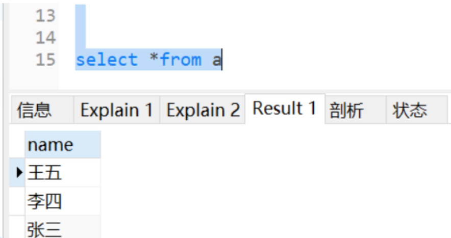
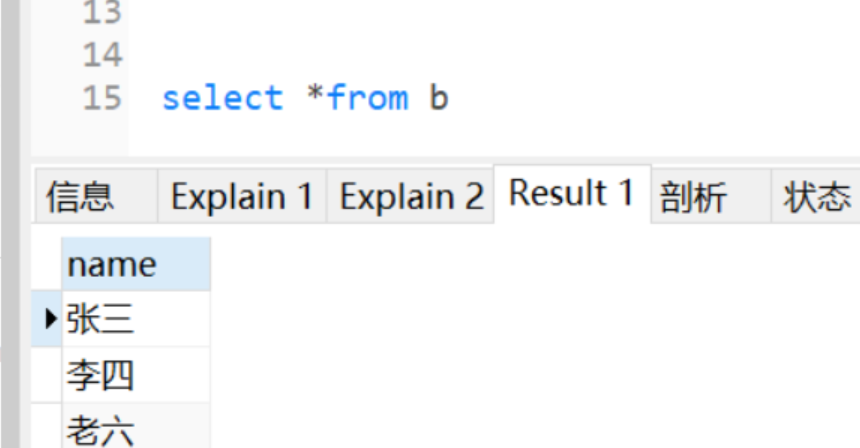
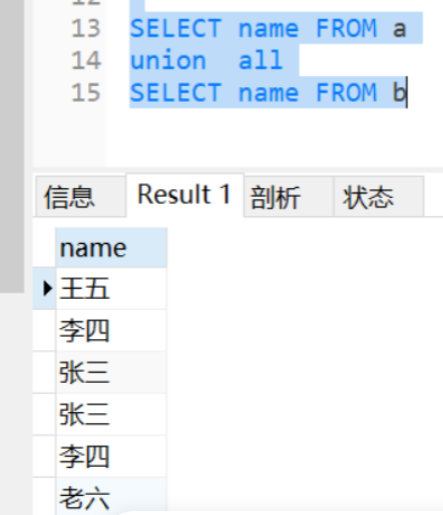
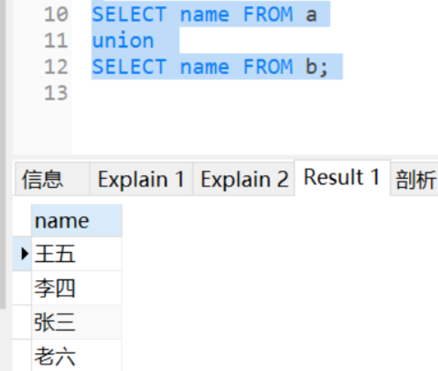
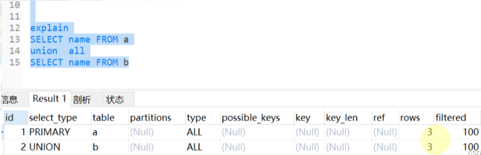
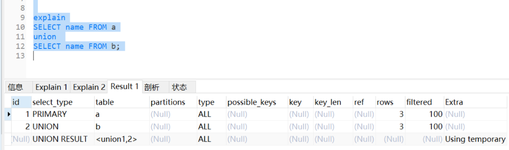

---
tags:
  - interview
  - 尚硅谷
  - Java
  - SQL语法和数据库事务
source: 尚硅谷Java技术之高频面试题-v2025.1
title: MySQL：SQL语法和数据库事务
---

# MySQL：SQL语法和数据库事务

> 来源：尚硅谷 Java 技术之高频面试题 v2025.1 · mysql：sql语法和数据库事务

# 1. 在MySQL数据库中，对查询结果去重的关键词是什么？

在MySQL数据库中，可以使用DISTINCT关键字来进行去重操作。DISTINCT关键字用于查询语句的SELECT子句中，用于返回唯一的结果集，去除重复的行。

例如，以下是使用 DISTINCT 关键字进行去重的示例：

```SQL
  SELECT DISTINCT column1, column2 FROM table_name;
```

上述示例中，column1和column2是要查询的列名，table_name是要查询的表名。查询结果将返回去重后的唯一行。

需要注意的是，DISTINCT关键字会对查询结果的所有列进行去重。如果只想对部分列进行去重，可以指定相应的列名。

# 2. MySQL多表连接有哪些方式？怎么用的？这些连接都有什么区别？

连接方式：左连接、右连接、内连接

使用方法：

- 左连接：select * from A LEFT JOIN B on [A.id=B.id](http://A.id=B.id) ;
- 右连接：select * from A RIGHT JOIN B on [A.id=B.id](http://A.id=B.id) ;
- 内连接：select * from A inner join B on a.xx=b.xx;（其中inner可以省略）

区别：

- inner join内连接，在两张表进行连接查询时，无论左表还是右表都只选取满足连接条件的记录
- left join在两张表进行连接查询时，会返回左表所有的记录，不论是否满足连接条件，即使在右表中没有匹配的记录；右表只返回满足连接条件的记录。
- right join在两张表进行连接查询时，会返回右表所有的记录，不论是否满足连接条件，即使在左表中没有匹配的记录；左表只返回满足连接条件的记录。

# 3. UNION和UNION ALL的区别？

## 3.1. 背记

- UNION：纵向合并数据+去重+排序
- UNION ALL：纵向合并数据（没有去重、排序等操作）

由于UION ALL操作简单，所以同等条件下性能会比UNION更好，但也要看业务需求来选择

## 3.2. 验证

### 3.2.1. 数据合并效果

a表数据：



b表数据：



UNION ALL的查询结果：



UNION的查询结果：



### 3.2.2. explain分析

UNION ALL只有两步操作：



UNION有三步操作：



# 4. 请简述SQL中的基本查询语句（SELECT）的语法结构。

在SQL中，`SELECT`语句用于从数据库中检索数据。其基本语法结构如下：

```SQL
SELECT column1, column2, ...
FROM table_name
WHERE condition
GROUP BY column_name
HAVING condition
ORDER BY column_name;
```

具体说明如下：

- `SELECT column1, column2, ...`: 指定要查询的列。可以使用*表示查询所有列。
- `FROM table_name`: 指定要查询的数据表。
- `WHERE condition`: 可选部分，用于过滤记录。只有满足条件的记录才会被查询出来。
- `GROUP BY column_name`: 可选部分，用于根据一个或多个列对结果进行分组。通常与聚合函数（如COUNT(), SUM(), AVG()等）一起使用。
- `HAVING condition`: 可选部分，用于对分组后的结果进行过滤。通常与`GROUP BY`子句一起使用。
- `ORDER BY column_name`: 可选部分，用于对查询结果进行排序。可以指定升序（ASC）或降序（DESC）。

例如，假设我们有一个名为`employees`的表，包含以下列：`id`, `name`, `age`, `department`。以下是一个具体的查询示例：

```SQL
SELECT id, name, age
FROM employees
WHERE age > 30
GROUP BY department
HAVING COUNT(*) > 5
ORDER BY age DESC;
```

这个查询的含义是：从`employees`表中选择年龄大于30的员工，按部门进行分组，只保留每个部门中员工数多于5个的组，最后按年龄降序排列结果。

# 5. 如何通过SQL语句实现表的插入操作？

在SQL中，通过`INSERT INTO`语句可以实现向表中插入数据。其基本语法结构如下：

```SQL
INSERT INTO table_name (column1, column2, ...)
VALUES (value1, value2, ...);
```

具体说明如下：

- `table_name`: 指定要插入数据的表名。
- `(column1, column2, ...)`: 可选部分，指定要插入数据的列名。如果省略，则表示插入所有列的数据，且必须按表定义的顺序提供所有列的值。
- `VALUES (value1, value2, ...)`: 指定要插入的具体值。这些值的数量和顺序应与指定的列名或表的列定义相匹配。

例如，假设我们有一个名为`employees`的表，包含以下列：`id`, `name`, `age`, `department`。以下是一个具体的插入操作示例：

```SQL
INSERT INTO employees (id, name, age, department)
VALUES (1, 'Alice', 30, 'HR');
```

这个语句的含义是：向`employees`表中插入一条记录，其中`id`为1，`name`为'Alice'，`age`为30，`department`为'HR'。

如果要插入多条记录，可以这样写：

```SQL
INSERT INTO employees (id, name, age, department)
VALUES
    (2, 'Bob', 25, 'Engineering'),
    (3, 'Charlie', 28, 'Marketing'),
    (4, 'David', 35, 'Finance');
```

这个语句的含义是：一次性向`employees`表中插入三条记录。

此外，还可以使用子查询来插入数据。例如，从另一个表中选择数据并插入到目标表中：

```SQL
INSERT INTO employees (id, name, age, department)
SELECT id, name, age, department
FROM new_employees;
```

这个语句的含义是：将`new_employees`表中的所有记录插入到`employees`表中。

# 6. 如何使用SQL更新表中的数据？

在SQL中，通过`UPDATE`语句可以实现对表中数据的更新。其基本语法结构如下：

```SQL
UPDATE table_name
SET column1 = value1, column2 = value2, ...
WHERE condition;
```

具体说明如下：

- `table_name`: 指定要更新数据的表名。
- `SET column1 = value1, column2 = value2, ...`: 指定要更新的列及其新值。可以同时更新多个列，用逗号分隔。
- `WHERE condition`: 可选部分，用于过滤要更新的记录。如果省略，则表示更新表中的所有记录。使用`WHERE`子句时需要特别小心，以避免意外更新大量数据。

例如，假设我们有一个名为`employees`的表，包含以下列：`id`, `name`, `age`, `department`。以下是一个具体的更新操作示例：

```SQL
UPDATE employees
SET age = 31, department = 'Engineering'
WHERE id = 1;
```

这个语句的含义是：将`employees`表中`id`为1的记录的`age`更新为31，`department`更新为'Engineering'。

如果要更新多条记录，可以使用类似的方法：

```SQL
UPDATE employees
SET age = age + 1
WHERE department = 'Engineering';
```

这个语句的含义是：将`employees`表中所有`department`为'Engineering'的记录的`age`增加1。

需要注意的是，使用`UPDATE`语句时要非常谨慎，特别是在没有`WHERE`条件的情况下，因为这会更新表中的所有记录。建议在执行更新操作之前先备份数据或在事务中进行操作，以便在出现问题时能够回滚更改。

# 7. 请解释SQL中的删除操作及其基本语法。

在SQL中，通过`DELETE`语句可以实现对表中数据的删除。其基本语法结构如下：

```SQL
DELETE FROM table_name
WHERE condition;
```

具体说明如下：

- `table_name`: 指定要删除数据的表名。
- `WHERE condition`: 可选部分，用于过滤要删除的记录。如果省略，则表示删除表中的所有记录。使用`WHERE`子句时需要特别小心，以避免意外删除大量数据。

例如，假设我们有一个名为`employees`的表，包含以下列：`id`, `name`, `age`, `department`。以下是一个具体的删除操作示例：

```SQL
DELETE FROM employees
WHERE id = 1;
```

这个语句的含义是：从`employees`表中删除`id`为1的记录。

如果要删除多条记录，可以使用类似的方法：

```SQL
DELETE FROM employees
WHERE department = 'Engineering';
```

这个语句的含义是：从`employees`表中删除所有`department`为'Engineering'的记录。

需要注意的是，使用`DELETE`语句时要非常谨慎，特别是在没有`WHERE`条件的情况下，因为这会删除表中的所有记录。建议在执行删除操作之前先备份数据或在事务中进行操作，以便在出现问题时能够回滚更改。

# 8. 什么是联合查询（UNION），它与连接查询（JOIN）有何不同？

联合查询（UNION）和连接查询（JOIN）是SQL中用于合并多个结果集的两种不同方法。它们有不同的用途和行为，通俗来说，“UNION”是竖着连，“JOIN”是横着连。以下是对它们的详细解释：

## 8.1. 联合查询（UNION）

**定义**：

`UNION`操作符用于将两个或多个`SELECT`语句的结果集合并为一个结果集。每个`SELECT`语句必须具有相同数量的列，并且相应列的数据类型必须兼容。

**语法**：

```SQL
SELECT column1, column2, ...
FROM table1
WHERE condition
UNION
SELECT column1, column2, ...
FROM table2
WHERE condition;
```

**特点**：

- `UNION`会自动去除重复的记录。如果需要保留所有重复记录，可以使用`UNION ALL`。
- 每个`SELECT`语句中的列数和数据类型必须匹配。
- 默认情况下，结果集中的列名来自第一个`SELECT`语句。

**示例**：

假设有两个表`employees_us`和`employees_uk`，结构相同。我们希望获取两个表中的所有员工姓名：

```SQL
SELECT name FROM employees_us
UNION
SELECT name FROM employees_uk;
```

这个查询会返回两个表中所有不重复的员工姓名。

## 8.2. 连接查询（JOIN）

**定义**：

`JOIN`操作符用于根据相关列将两个或多个表中的行组合起来。常见的连接类型包括内连接（INNER JOIN）、左连接（LEFT JOIN）、右连接（RIGHT JOIN）和全连接（FULL JOIN）。

**语法**：

```SQL
SELECT columns
FROM table1
JOIN table2 ON table1.column = table2.column;
```

**特点**：

- `JOIN`不会自动去除重复记录。
- 可以根据不同的条件进行复杂的多表关联。
- 可以指定不同类型的连接来控制结果集的内容。

**示例**：

假设有两个表`employees`和`departments`，我们想要获取每个员工及其所属部门的信息：

```SQL
SELECT employees.name, departments.department_name
FROM employees
INNER JOIN departments ON employees.department_id = departments.id;
```

这个查询会返回每个员工及其所属部门的名称。

## 8.3. 主要区别

1. **目的**：
  - `UNION`用于合并多个结果集，通常用于从多个表中选择相似的数据。
  - `JOIN`用于根据相关列将多个表中的行组合在一起，通常用于从多个表中提取相关的数据。
2. **去重**：
  - `UNION`默认去除重复记录，使用`UNION ALL`保留所有记录。
  - `JOIN`不会自动去除重复记录。
3. **列数和数据类型**：
  - `UNION`要求每个`SELECT`语句中的列数和数据类型必须匹配。
  - `JOIN`允许根据需要选择不同的列，但需要确保连接条件合理。
4. **应用场景**：
  - `UNION`适用于简单的数据合并场景，如从多个表中选择相同的列。
  - `JOIN`适用于复杂的数据关联场景，如从多个表中提取相关联的数据。

# 9. 请描述SQL中的INNER JOIN和LEFT JOIN的区别，并举例说明。

在SQL中，INNER JOIN和LEFT JOIN是两种常用的连接方式，它们用于将多个表的数据组合在一起。以下是它们的区别及举例：

1. **INNER JOIN**：INNER JOIN只返回两个表中匹配的行。如果左表中的行在右表中没有匹配项，那么这些行不会出现在结果集中。
2. **LEFT JOIN**：LEFT JOIN返回左表中的所有行，无论它们在右表中是否有匹配。对于左表中没有匹配的行，右表中的相应列以NULL填充。
3. **示例**
  - **INNER JOIN 示例**：假设有两个表`Customers`和`Orders`，通过`CustomerID`列进行连接。SELECT Customers.CustomerName, Orders.OrderID FROM Customers INNER JOIN Orders ON Customers.CustomerID = Orders.CustomerID;这个查询将返回`Customers`表和`Orders`表中匹配的数据行。
  - **LEFT JOIN 示例**：同样使用`Customers`和`Orders`表，通过`CustomerID`列进行连接。SELECT Customers.CustomerName, Orders.OrderID FROM Customers LEFT JOIN Orders ON Customers.CustomerID = Orders.CustomerID;这个查询将返回`Customers`表中的所有数据行，以及与之对应匹配的`Orders`表中的数据行。如果某个客户没有订单，则`OrderID`列显示为NULL。

总结来说，INNER JOIN只返回两个表中匹配的行，而LEFT JOIN返回左表中的所有行，即使右表中没有匹配的行。选择哪种连接方式取决于具体的数据需求和预期的查询结果。

# 10. 如何在SQL中使用子查询？请给出一个示例。

在SQL中，子查询（Subquery）是一个嵌套在其他查询中的查询。子查询可以出现在`SELECT`、`FROM`、`WHERE`、`HAVING`等子句中。以下是一些常见的使用场景和示例：

## 10.1. 在 `SELECT` 子句中使用子查询

**示例**：假设有两个表`employees`和`departments`，我们希望获取每个员工及其所属部门的名称。

```SQL
SELECT e.name,
       (SELECT d.department_name
        FROM departments d
        WHERE d.id = e.department_id) AS department_name
FROM employees e;
```

在这个例子中，子查询用于从`departments`表中获取与`employees`表中的`department_id`匹配的`department_name`。

## 10.2. 在 `FROM` 子句中使用子查询

**示例**：假设我们有一个表`orders`，我们希望获取每个客户的订单总数。

```SQL
SELECT customer_id, COUNT(*) as order_count
FROM (SELECT customer_id FROM orders WHERE order_date > '2023-01-01') AS recent_orders
GROUP BY customer_id;
```

在这个例子中，子查询首先筛选出最近一年的订单，然后在外部查询中对这些订单进行分组和计数。

## 10.3. 在 `WHERE` 子句中使用子查询

**示例**：假设我们有两个表`employees`和`departments`，我们希望获取所有属于某个特定部门的员工。

```SQL
SELECT name
FROM employees
WHERE department_id = (SELECT id
                       FROM departments
                       WHERE department_name = 'Sales');
```

在这个例子中，子查询用于获取名为'Sales'的部门的ID，然后外部查询根据这个ID筛选员工。

## 10.4. 在 `HAVING` 子句中使用子查询

**示例**：假设我们有一个表`sales`，我们希望获取销售额超过平均销售额的销售记录。

```SQL
SELECT employee_id, total_sales
FROM sales
GROUP BY employee_id, total_sales
HAVING total_sales > (SELECT AVG(total_sales) FROM sales);
```

在这个例子中，子查询计算了所有销售记录的平均销售额，外部查询则筛选出销售额超过平均值的记录。

## 10.5. 相关子查询（Correlated Subquery）

相关子查询是指子查询依赖于外部查询的某些列。

**示例**：假设我们有两个表`employees`和`departments`，我们希望获取每个员工及其所属部门的名称。

```SQL
SELECT e.name,
       (SELECT d.department_name
        FROM departments d
        WHERE d.id = e.department_id) AS department_name
FROM employees e;
```

在这个例子中，子查询中的`d.id = e.department_id`使得子查询依赖于外部查询的`e.department_id`列，因此这是一个相关子查询。

通过这些示例，可以看到子查询在SQL中的强大功能和灵活性。它们可以帮助解决复杂的数据检索问题，使查询更加简洁和高效。

# 11. 请解释什么是索引（Index）以及在什么情况下使用索引。

索引（Index）是一种特殊的数据结构，通过指针将数据位置与索引键关联起来，使得查询操作更加高效。可以将索引看作是书籍的目录，帮助快速找到所需的信息。合理地创建和使用索引，可以大幅度提升查询效率，但过多或不当的索引会影响数据修改的性能。

## 11.1. 索引的工作原理

1. **B树索引**：B树是一种自平衡的树形数据结构，适合于数据库索引。它能保持数据有序，并允许高效的插入、删除和查找操作。B树的高度通常较低，使得查找操作非常迅速。
2. **哈希索引**：哈希索引是一种使用哈希表实现的索引类型，主要用于快速查找等值查询。哈希索引使用哈希表结构来存储数据，能够提供快速的等值查询，时间复杂度为O(1)。但不支持范围查询，适用于简单的等值查询场景。
3. **全文索引**：全文索引专门用于文本搜索，适合处理大量文本数据的模糊搜索。它通过存储词项及其对应文档的位置，提高了搜索效率，适合处理复杂的文本查询需求。

## 11.2. 索引的使用情况

1. **频繁作为查询条件的字段**：如果某些列经常被用作查询条件，如`WHERE`子句中的列，那么在这些列上创建索引可以显著提高查询速度。
2. **排序和分组操作**：在经常需要排序（`ORDER BY`）或分组（`GROUP BY`）的列上创建索引，可以加快这些操作的速度。
3. **多表连接**：如果查询涉及多个表的连接操作，特别是在连接条件中的列上创建索引，可以提高连接操作的性能。
4. **主键和唯一性约束**：主键索引确保每行数据的唯一性，而唯一索引则防止列中出现重复的值。这两者都可以提高查询效率。

总的来说，通过合理使用索引，可以显著提高数据库查询的效率，从而优化整个系统的性能。

# 12. 如何在SQL中创建和删除数据库？

在SQL中，创建和删除数据库是常见的管理任务。以下是如何在SQL中执行这些操作的详细步骤和示例：

## 12.1. 创建数据库

要创建一个新的数据库，可以使用`CREATE DATABASE`语句。以下是一个基本的语法示例：

```SQL
CREATE DATABASE database_name;
```

**示例**：创建一个名为`testdb`的数据库。

```SQL
CREATE DATABASE testdb;
```

## 12.2. 删除数据库

要删除一个数据库，可以使用`DROP DATABASE`语句。请注意，删除数据库是一个不可逆的操作，所有数据将永久丢失，因此应谨慎使用。

```SQL
DROP DATABASE database_name;
```

**示例**：删除名为`testdb`的数据库。

```SQL
DROP DATABASE testdb;
```

## 12.3. 检查数据库是否存在

在删除数据库之前，通常需要确认数据库是否存在，以避免错误。不同的数据库管理系统（DBMS）有不同的方法来检查数据库的存在性。以下是一些常见的DBMS的示例：

### 12.3.1. MySQL

在MySQL中，可以使用`IF EXISTS`子句来避免错误：

```SQL
DROP DATABASE IF EXISTS testdb;
```

### 12.3.2. PostgreSQL

在PostgreSQL中，也可以使用`IF EXISTS`子句：

```SQL
DROP DATABASE IF EXISTS testdb;
```

### 12.3.3. SQL Server

在SQL Server中，可以使用`IF DB_ID`函数来检查数据库是否存在：

```SQL
IF DB_ID('testdb') IS NOT NULL
BEGIN
    DROP DATABASE testdb;
END;
```

## 12.4. 完整示例

以下是一个完整的示例，展示如何创建和删除数据库，并确保在删除前检查其存在性：

### 12.4.1. MySQL 示例

```SQL
-- 创建数据库
CREATE DATABASE testdb;

-- 检查并删除数据库
DROP DATABASE IF EXISTS testdb;
```

### 12.4.2. PostgreSQL 示例

```SQL
-- 创建数据库
CREATE DATABASE testdb;

-- 检查并删除数据库
DROP DATABASE IF EXISTS testdb;
```

### 12.4.3. SQL Server 示例

```SQL
-- 创建数据库
CREATE DATABASE testdb;

-- 检查并删除数据库
IF DB_ID('testdb') IS NOT NULL
BEGIN
    DROP DATABASE testdb;
END;
```

通过这些步骤和示例，你可以在SQL中有效地创建和删除数据库。请务必小心操作，特别是在删除数据库时，以免误删重要数据。

# 13. 请解释什么是视图（View），以及如何在SQL中创建和使用视图。

视图（View）是一种虚拟表，它是基于SQL查询的结果集。视图并不存储数据本身，而是存储一个查询定义。当你查询视图时，数据库系统会动态地执行该查询并返回结果。视图可以简化复杂查询、提高代码可读性以及增强数据安全性。

## 13.1. 创建视图

要创建一个视图，可以使用`CREATE VIEW`语句。以下是基本的语法：

```SQL
CREATE VIEW view_name AS
SELECT column1, column2, ...
FROM table_name
WHERE condition;
```

**示例**：假设我们有一个名为`employees`的表，我们希望创建一个只包含员工姓名和部门名称的视图。

```SQL
CREATE VIEW employee_view AS
SELECT e.name, d.department_name
FROM employees e
JOIN departments d ON e.department_id = d.id;
```

在这个例子中，`employee_view`是一个视图，它包含了`employees`表中的员工姓名和`departments`表中的部门名称。

## 13.2. 使用视图

一旦视图创建完成，你可以像查询普通表一样查询视图。例如：

```SQL
SELECT * FROM employee_view;
```

这将返回视图中的所有记录。

## 13.3. 更新视图

某些视图是可更新的，这意味着你可以通过视图来插入、更新或删除数据。然而，并不是所有视图都是可更新的。可更新视图通常需要满足以下条件：

1. **简单视图**：视图必须基于单个表。
2. **无聚合函数**：视图不能包含聚合函数（如`SUM`、`AVG`等）。
3. **无子查询**：视图不能包含子查询。
4. **无DISTINCT**：视图不能包含`DISTINCT`关键字。
5. **无GROUP BY**：视图不能包含`GROUP BY`子句。
6. **无HAVING**：视图不能包含`HAVING`子句。
7. **无UNION**：视图不能包含`UNION`操作。
8. **无连接**：视图不能包含多表连接。
9. **无计算列**：视图不能包含计算列。

**示例**：假设我们有一个名为`employees`的表，并且我们希望通过视图更新员工的薪水。

```SQL
CREATE VIEW employee_salary_view AS
SELECT name, salary
FROM employees;
```

现在，我们可以使用视图来更新员工的薪水：

```SQL
UPDATE employee_salary_view
SET salary = salary * 1.1
WHERE name = 'John Doe';
```

## 13.4. 删除视图

要删除一个视图，可以使用`DROP VIEW`语句。以下是基本的语法：

```SQL
DROP VIEW view_name;
```

**示例**：删除名为`employee_view`的视图。

```SQL
DROP VIEW employee_view;
```

## 13.5. 总结

视图在SQL中是一个非常有用的工具，可以帮助简化复杂查询、提高代码可读性和增强数据安全性。通过创建和使用视图，你可以更方便地管理和访问数据库中的数据。

# 14. SQL中的约束（Constraints）有哪些类型，它们的作用是什么？

SQL中的约束（Constraints）是用于保证数据库中数据完整性、准确性和一致性的规则。常见的约束类型包括以下几种：

1. **主键约束**：用于唯一标识表中的每一条记录，确保每行数据的唯一性和完整性。一个表中只能有一个主键，主键列的值不能为空，且必须是唯一的。
2. **外键约束**：用于建立表与表之间的关系，保证数据的参照完整性。外键列的值必须在被参照表的主键或唯一键中有对应的值，确保了相关表之间的数据一致性。
3. **唯一性约束**：确保在非主键列中不输入重复的值，允许空值，但每列只允许一个空值。主要用于防止在列中输入重复的值，保证数据的唯一性和识别性。
4. **检查约束**：确保字段中的值满足特定的条件，只有满足条件的值才允许插入或更新到该字段。可以基于逻辑表达式定义业务规则，从而确保数据符合特定的要求或标准。
5. **非空约束**：设置某列不能为空，确保指定列必须有值，不能为NULL。是一种强制性的约束，要求列中的值必须被指定，不能为NULL。
6. **默认值约束**：为没有提供输入值的字段或列提供默认值。当插入新产品时，如果没有指定库存数量，则会默认给0。

总之，合理地使用这些约束可以确保数据库中的数据质量和可靠性，同时提高查询性能和数据管理的效率。

# 15. 请描述SQL中CASE语句的使用场景，并给出一个示例。

SQL中的CASE语句是一种条件表达式，用于在查询中根据不同的条件返回不同的结果。它类似于编程语言中的`switch`或`if-else`结构，可以在SELECT、UPDATE、DELETE等SQL语句中使用。

## 15.1. 使用场景

1. **数据转换**：将数据库中的代码值转换为更具可读性的文本描述。例如，将性别代码（'M'/'F'）转换为对应的文本描述（'Male'/'Female'）。
2. **条件计算**：根据不同条件对数据进行不同的计算或处理。例如，根据员工的绩效等级计算奖金。
3. **分组统计**：在聚合查询中，根据不同条件对数据进行分类统计。例如，统计每个部门的员工数量，并根据员工是否满30岁进行分类。
4. **动态排序**：根据不同的条件对查询结果进行动态排序。例如，根据用户输入的排序字段和顺序对查询结果进行排序。

## 15.2. 示例

假设我们有一个名为`employees`的表，包含以下列：

- `id`: 员工ID
- `name`: 员工姓名
- `gender`: 性别代码 ('M'表示男性, 'F'表示女性)
- `salary`: 工资
- `performance_rating`: 绩效评级 (1到5)

我们希望创建一个查询，显示员工的姓名、性别（文本描述）、工资以及根据绩效评级计算的奖金。奖金规则如下：

- 绩效评级为1或2时，奖金为工资的10%
- 绩效评级为3或4时，奖金为工资的20%
- 绩效评级为5时，奖金为工资的30%

我们可以使用CASE语句来实现这个需求：

```SQL
SELECT
    name,
    CASE gender
        WHEN 'M' THEN 'Male'
        WHEN 'F' THEN 'Female'
        ELSE 'Unknown'
    END AS gender_description,
    salary,
    CASE performance_rating
        WHEN 1 THEN salary * 0.10
        WHEN 2 THEN salary * 0.10
        WHEN 3 THEN salary * 0.20
        WHEN 4 THEN salary * 0.20
        WHEN 5 THEN salary * 0.30
        ELSE 0
    END AS bonus
FROM employees;
```

在这个查询中：

- 第一个CASE语句将`gender`列中的代码值转换为文本描述。
- 第二个CASE语句根据`performance_rating`列的值计算奖金。

执行上述查询后，结果集将包含每个员工的姓名、性别描述、工资和计算出的奖金。

# 16. 如何通过SQL语句实现数据的分组和聚合？

在SQL中，通过使用`GROUP BY`子句和聚合函数（如`COUNT`、`SUM`、`AVG`、`MAX`、`MIN`等），可以实现数据的分组和聚合。这些操作通常用于生成汇总报告或统计数据。

## 16.1. 基本语法

```SQL
SELECT column1, column2, ..., aggregate_function(column)
FROM table_name
WHERE condition
GROUP BY column1, column2, ...;
```

- `column1, column2, ...`：要分组的列。
- `aggregate_function(column)`：应用于每个组的聚合函数。
- `table_name`：数据来源表。
- `condition`：可选的条件过滤。
- `GROUP BY column1, column2, ...`：指定分组依据的列。

## 16.2. 示例

假设我们有一个名为`sales`的表，包含以下列：

- `id`: 销售记录ID
- `product_id`: 产品ID
- `quantity`: 销售数量
- `price`: 单价
- `sale_date`: 销售日期

我们希望按产品ID分组，计算每种产品的总销售额和平均价格。可以使用以下SQL语句：

```SQL
SELECT
    product_id,
    SUM(quantity * price) AS total_sales,
    AVG(price) AS average_price
FROM sales
GROUP BY product_id;
```

在这个查询中：

- `product_id`：我们要分组的列。
- `SUM(quantity * price) AS total_sales`：计算每种产品的总销售额。
- `AVG(price) AS average_price`：计算每种产品的平均价格。
- `GROUP BY product_id`：按产品ID进行分组。

## 16.3. 更复杂的示例

假设我们想要进一步按年份和月份分组，并计算每个月的总销售额和平均价格。我们可以使用`YEAR()`和`MONTH()`函数从日期中提取年份和月份，然后进行分组：

```SQL
SELECT
    YEAR(sale_date) AS sale_year,
    MONTH(sale_date) AS sale_month,
    product_id,
    SUM(quantity * price) AS total_sales,
    AVG(price) AS average_price
FROM sales
GROUP BY YEAR(sale_date), MONTH(sale_date), product_id;
```

在这个查询中：

- `YEAR(sale_date) AS sale_year`：提取销售日期的年份。
- `MONTH(sale_date) AS sale_month`：提取销售日期的月份。
- `SUM(quantity * price) AS total_sales`：计算每个月每种产品的总销售额。
- `AVG(price) AS average_price`：计算每个月每种产品的平均价格。
- `GROUP BY YEAR(sale_date), MONTH(sale_date), product_id`：按年份、月份和产品ID进行分组。

## 16.4. 注意事项

1. **选择列**：在`SELECT`子句中，除了聚合函数外，其他列必须出现在`GROUP BY`子句中，否则会导致错误。
2. **HAVING子句**：如果需要对分组后的结果进行过滤，可以使用`HAVING`子句。它类似于`WHERE`子句，但作用于分组后的结果。例如，只显示总销售额大于1000的产品：SELECT product_id, SUM(quantity * price) AS total_sales, AVG(price) AS average_price FROM sales GROUP BY product_id HAVING SUM(quantity * price) > 1000;
3. **ORDER BY子句**：可以使用`ORDER BY`子句对结果进行排序。例如，按总销售额降序排列：SELECT product_id, SUM(quantity * price) AS total_sales, AVG(price) AS average_price FROM sales GROUP BY product_id ORDER BY total_sales DESC;

通过这些技巧，您可以灵活地使用SQL语句实现数据的分组和聚合，从而满足各种数据分析需求。

# 17. 请解释什么是规范化（Normalization），并简述其过程。

规范化（Normalization）是指对数值进行特殊函数变换的方法，将原始的某个数值 x 通过某种函数转换，得到规范化后的数值 x_bar。它完成了不同维度数据的规范和统一，但并没有对如何规范作出具体规定。

规范化的过程一般如下：

1. **确定目标**：明确规范化的目的，例如是为了消除数据尺度对算法的影响、提高算法的效率和精度，还是为了使不同特征的数值范围和分布更加一致等。
2. **选择方法**：根据数据的特点和规范化的目标选择合适的规范化方法，常见的方法包括最小-最大规范化、Z-score 规范化、对数变换、小数定标规范化等。
3. **应用变换**：使用选定的规范化方法对原始数据进行处理，将每个数据点按照相应的公式进行转换，得到规范化后的数据。
4. **验证效果**：检查规范化后的数据是否达到了预期的效果，例如数据的分布是否符合要求、是否存在异常值等。如果需要，可以对规范化过程进行调整和优化。

总之，规范化是数据处理中的重要步骤，通过将不同尺度或量纲的数据转化为统一标准，有助于提高机器学习算法的效率和精度，更好地进行数据处理和分析。

# 18. 如何在SQL中实现分页查询？

以下是不同数据库分页的不同语法：

1. **MySQL**
  - **基本语法**：`SELECT column1, column2,... FROM table_name ORDER BY column LIMIT offset, row_count;`
  - **示例**：假设有一个 `employees` 表，查询第 3 页的数据，每页 10 条记录，可使用 `SELECT * FROM employees ORDER BY employee_id LIMIT 20, 10;`。其中 `offset` 表示从第几条记录开始，`row_count` 表示查询返回的记录数。
2. **PostgreSQL**
  - **基本语法**：`SELECT column1, column2,... FROM table_name ORDER BY column LIMIT row_count OFFSET offset;`
  - **示例**：同样对于 `employees` 表，查询第 3 页的数据，每页 10 条记录，语句为 `SELECT * FROM employees ORDER BY employee_id LIMIT 10 OFFSET 20;`。
3. **Oracle**
  - **子查询 + ROWNUM 方式**：
    - **基本语法**：`SELECT * FROM ( SELECT a.*, ROWNUM rnum FROM ( SELECT column1, column2,... FROM table_name ORDER BY column ) a WHERE ROWNUM <= :max_row_num ) WHERE rnum > :min_row_num;`
    - **示例**：查询 `employees` 表的第 3 页数据，每页 10 条记录，可写成 `SELECT * FROM ( SELECT a.*, ROWNUM rnum FROM ( SELECT * FROM employees ORDER BY employee_id ) a WHERE ROWNUM <= 30 ) WHERE rnum > 20;`。
  - **分析函数 ROW_NUMBER 方式**：
    - **基本语法**：`SELECT column1, column2,... FROM ( SELECT column1, column2,..., ROW_NUMBER() OVER (ORDER BY column) AS rnum FROM table_name ) WHERE rnum BETWEEN :min_row_num AND :max_row_num;`
    - **示例**：查询 `employees` 表的第 3 页数据，每页 10 条记录，语句为 `SELECT * FROM ( SELECT *, ROW_NUMBER() OVER (ORDER BY employee_id) AS rnum FROM employees ) WHERE rnum BETWEEN 21 AND 30;`。
4. **SQL Server**
  - **基本语法**：`SELECT column1, column2,... FROM table_name ORDER BY column OFFSET row_count ROWS FETCH NEXT row_count ROWS ONLY;`
  - **示例**：对于 `employees` 表，要查询第 3 页的数据，每页 10 条记录，可以使用 `SELECT * FROM employees ORDER BY employee_id OFFSET 20 ROWS FETCH NEXT 10 ROWS ONLY;`。

综上所述，不同的数据库管理系统在实现分页功能时采用了不同的语法和方法。开发者在进行分页操作时，需要根据所使用的数据库类型选择相应的语法和策略。

# 19. 请描述存储过程（Stored Procedure）的概念及其优缺点。

存储过程是数据库管理系统中预先编译并存储的SQL语句集，它们可以接受参数、执行逻辑操作，并返回结果。以下是对存储过程概念及其优缺点的介绍：

## 19.1. 存储过程的概念

存储过程（Stored Procedure）是一组为了完成特定功能的SQL语句集，经编译后存储在数据库中。用户通过指定存储过程的名字并给出参数（如果该存储过程带有参数）来执行它。存储过程可以看作是数据库服务器上的一种程序或函数，它可以在数据库级别完成一系列操作而不需要每次都从客户端发送完整的SQL命令。

## 19.2. 存储过程的优点

1. **提高性能**：
  - 存储过程在创建时被编译，并存储在数据库服务器上。这意味着在运行时，存储过程无需重新编译，可以直接执行，从而提高了查询性能。
  - 存储过程减少了客户端与服务器之间的数据传输量，因为多条SQL语句可以在服务器端一次性执行。
2. **增强代码重用性和可维护性**：
  - 存储过程将业务逻辑封装在数据库层中，使得同一业务逻辑可以被多个应用程序或客户端重复使用，减少了代码重复。
  - 如果需要修改业务逻辑，只需修改存储过程，而不需要修改每个应用程序的代码，提高了可维护性。
3. **提高安全性**：
  - 通过使用存储过程，开发人员可以限制直接访问数据库表的权限，而只允许通过存储过程访问数据。这可以有效防止SQL注入攻击，并确保数据访问的安全性。
4. **简化复杂操作**：
  - 存储过程可以封装复杂的业务逻辑，包括条件判断、循环等，从而简化了应用程序代码。
  - 开发人员只需调用存储过程，而无需关心具体的实现细节。

## 19.3. 存储过程的缺点

1. **学习和开发成本**：编写存储过程需要专业的数据库编程知识，学习和开发的成本相对较高。
2. **依赖于特定数据库**：存储过程的语法和功能依赖于特定的数据库系统，不同数据库系统之间可能存在差异。
3. **难以调试**：调试存储过程相对较复杂，不如调试应用程序直观，需要使用特定的工具和技术。
4. **数据库层次耦合**：存储过程将业务逻辑嵌入到数据库中，导致数据库与应用程序的耦合性增加。
5. **可移植性差**：存储过程的语法和功能在不同的数据库系统中可能存在差异，降低了应用程序的可移植性。

# 20. 如何在SQL中调用存储过程？

在SQL中调用存储过程的方法取决于所使用的数据库管理系统（DBMS）。以下是一些常见数据库系统中调用存储过程的语法和示例：

## 20.1. MySQL

### 20.1.1. 基本语法

```SQL
CALL procedure_name([parameter[,...]]);
```

### 20.1.2. 示例

假设有一个名为 `getEmployee` 的存储过程，它接受一个参数 `employee_id`：

```SQL
CALL getEmployee(123);
```

## 20.2. PostgreSQL

### 20.2.1. 基本语法

```SQL
SELECT procedure_name([parameter[,...]]);
```

### 20.2.2. 示例

假设有一个名为 `getEmployee` 的存储过程，它接受一个参数 `employee_id`：

```SQL
SELECT * FROM getEmployee(123);
```

## 20.3. SQL Server (T-SQL)

### 20.3.1. 基本语法

```SQL
EXEC procedure_name [ @parameter = value [, ... ] ];
```

### 20.3.2. 示例

假设有一个名为 `getEmployee` 的存储过程，它接受一个参数 `@employee_id`：

```SQL
EXEC getEmployee @employee_id = 123;
```

## 20.4. Oracle

### 20.4.1. 基本语法

```SQL
BEGIN
    procedure_name([parameter[,...]]);
END;
/
```

### 20.4.2. 示例

假设有一个名为 `getEmployee` 的存储过程，它接受一个参数 `employee_id`：

```SQL
BEGIN
    getEmployee(123);
END;
/
```

## 20.5. SQLite

SQLite 不支持存储过程，但可以通过编写用户定义函数（UDF）来实现类似的功能。以下是一个使用 Python 创建 UDF 的示例：

### 20.5.1. 示例

首先，需要创建一个 Python 脚本来定义 UDF：

```Python
import sqlite3

def get_employee(employee_id):
    # 这里可以添加实际的业务逻辑，例如查询数据库等
    return f"Employee ID: {employee_id}"

conn = sqlite3.connect('example.db')
conn.create_function("getEmployee", 1, get_employee)
cursor = conn.cursor()
cursor.execute("SELECT getEmployee(123)")
print(cursor.fetchone())
conn.close()
```

然后，可以在 SQLite 中使用这个 UDF：

```SQL
SELECT getEmployee(123);
```

## 20.6. 总结

调用存储过程的具体方法因数据库系统而异。一般来说，你需要了解目标数据库系统的语法规则，并确保存储过程已经正确创建和编译。通过调用存储过程，你可以封装复杂的业务逻辑，提高代码的可重用性和安全性。

# 21. 请解释触发器（Trigger）的概念及其使用场景。

以下是关于触发器的概念及使用场景的介绍：

## 21.1. 概念

触发器（Trigger）是数据库中一种特殊的存储过程，它会在特定的数据库操作（如插入、更新、删除等）发生时自动执行。触发器通常与表紧密关联，当表中的数据发生变化时，触发器就会被激活并执行预先定义好的操作。这种机制使得触发器成为实现数据完整性约束、自动化业务逻辑处理和复杂数据操作的重要工具。

## 21.2. 使用场景

- **数据验证**：通过触发器可以在插入或更新数据之前对数据进行验证，确保满足特定的条件或规则，如检查数据的合法性、完整性等。
- **自动化任务**：触发器可以用于自动执行一系列复杂的任务，如记录日志、生成报表、发送邮件等。
- **数据同步**：当一个表的数据发生变化时，触发器可以触发与之相关的操作，以确保其他相关表中的数据保持同步。
- **数据审计**：在触发器中记录相关操作的详细信息，包括操作时间、操作人和修改前后的数据，方便后续的数据分析和追踪。
- **强制引用完整性**：通过触发器可以实现比CHECK约束更复杂的数据完整性约束，如跨表的级联修改等。

综上所述，触发器作为一种强大的数据库工具，在多种场景下都能发挥重要作用，帮助开发人员实现更加高效、安全和智能的数据管理。

# 22. 如何在SQL中实现数据的备份和恢复？

在SQL中，实现数据的备份和恢复通常依赖于数据库管理系统（DBMS）提供的工具和命令。以下是一些常见数据库系统中进行数据备份和恢复的方法：

## 22.1. MySQL

### 22.1.1. 备份

使用 `mysqldump` 工具可以备份MySQL数据库：

```Bash
mysqldump -u [username] -p[password] [database_name] > [backup_file.sql]
```

示例：

```Bash
mysqldump -u root -p mydatabase > backup.sql
```

### 22.1.2. 恢复

使用 `mysql` 命令行工具可以恢复MySQL数据库：

```Bash
mysql -u [username] -p[password] [database_name] < [backup_file.sql]
```

示例：

```Bash
mysql -u root -p mydatabase < backup.sql
```

## 22.2. PostgreSQL

### 22.2.1. 备份

使用 `pg_dump` 工具可以备份PostgreSQL数据库：

```Bash
pg_dump -U [username] -F c [database_name] > [backup_file.dump]
```

示例：

```Bash
pg_dump -U postgres -F c mydatabase > backup.dump
```

### 22.2.2. 恢复

使用 `pg_restore` 工具可以恢复PostgreSQL数据库：

```Bash
pg_restore -U [username] -d [database_name] [backup_file.dump]
```

示例：

```Bash
pg_restore -U postgres -d mydatabase backup.dump
```

## 22.3. SQL Server (T-SQL)

### 22.3.1. 备份

使用 T-SQL 的 `BACKUP DATABASE` 语句可以备份SQL Server数据库：

```SQL
BACKUP DATABASE [database_name] TO DISK = '[backup_file.bak]'
```

示例：

```SQL
BACKUP DATABASE mydatabase TO DISK = 'C:\backup\mydatabase.bak'
```

### 22.3.2. 恢复

使用 T-SQL 的 `RESTORE DATABASE` 语句可以恢复SQL Server数据库：

```SQL
RESTORE DATABASE [database_name] FROM DISK = '[backup_file.bak]'
```

示例：

```SQL
RESTORE DATABASE mydatabase FROM DISK = 'C:\backup\mydatabase.bak'
```

## 22.4. Oracle

### 22.4.1. 备份

使用 `expdp` 工具可以备份Oracle数据库：

```Bash
expdp [username]/[password]@[service_name] schemas=[schema_name] directory=[directory_name] dumpfile=[dump_file.dmp] logfile=[log_file.log]
```

示例：

```Bash
expdp system/password@orcl schemas=hr directory=DATA_PUMP_DIR dumpfile=hr.dmp logfile=hr.log
```

### 22.4.2. 恢复

使用 `impdp` 工具可以恢复Oracle数据库：

```Bash
impdp [username]/[password]@[service_name] schemas=[schema_name] directory=[directory_name] dumpfile=[dump_file.dmp] logfile=[log_file.log]
```

示例：

```Bash
impdp system/password@orcl schemas=hr directory=DATA_PUMP_DIR dumpfile=hr.dmp logfile=hr.log
```

## 22.5. SQLite

SQLite 是一个轻量级的嵌入式数据库，通常用于小型应用。备份和恢复操作相对简单，可以通过复制数据库文件来实现。

### 22.5.1. 备份

直接复制数据库文件即可：

```Bash
cp [database_file.db] [backup_file.db]
```

示例：

```Bash
cp mydatabase.db backup.db
```

### 22.5.2. 恢复

直接替换数据库文件即可：

```Bash
cp [backup_file.db] [database_file.db]
```

示例：

```Bash
cp backup.db mydatabase.db
```

## 22.6. 总结

不同的数据库系统有不同的备份和恢复方法，但基本思路都是通过特定的工具或命令将数据库导出到文件中，并在需要时从文件中导入数据。这些操作对于保障数据安全、实现灾难恢复以及迁移数据等场景都非常重要。

# 23. 什么是数据库事务（Transaction）？

数据库事务是一系列数据库操作的集合，这些操作要么全部执行，要么全部不执行，以确保数据库从一个一致的状态转换到另一个一致的状态。它具有以下四个特性：

1. **原子性（Atomicity）**：事务内的操作要么全部完成，要么全部不完成，不可能结束在中间某个环节。事务执行的过程中出错，会被回滚到事务开始前的状态，就像这个事务从来没有执行过一样。
2. **一致性（Consistency）**：在事务开始之前和事务结束以后，数据库的完整性没有被破坏。这表示写入的任何数据都必须满足所有设置的约束，包括数据约束、业务约束等。
3. **隔离性（Isolation）**：数据库允许多个并发事务同时对其数据进行读写和修改的能力，隔离性可以防止多个事务并发执行时由于交叉执行而导致数据的不一致。事务隔离分为不同级别，包括读未提交、读已提交、可重复读和串行化。
4. **持久性（Durability）**：一旦事务完成，无论系统发生什么故障，其修改的结果都能够保持。大多数数据库系统都提供了事务管理功能，如回滚、提交等。在开发过程中，应充分利用这些功能来确保数据的一致性和完整性。

总的来说，数据库事务通过保证一组操作的原子性、一致性、隔离性和持久性，为数据库操作提供了可靠性和一致性的保障。

# 24. 简述ACID特性及其含义。

ACID 特性是数据库事务处理系统的四个关键属性的缩写，分别是原子性（Atomicity）、一致性（Consistency）、隔离性（Isolation）和持久性（Durability），它们共同确保了数据库操作的可靠性和一致性。以下是对 ACID 特性及其含义的简述：

1. **原子性（Atomicity）**：指事务中的所有操作要么全部执行成功，要么全部不执行。如果在执行过程中发生错误，会回滚到事务开始前的状态，就像这个事务从未执行过一样。这确保了在发生系统故障或其他问题时，数据库不会处于不一致的状态。
2. **一致性（Consistency）**：保证事务执行的结果必须使数据库从一个一致的状态转换到另一个一致的状态。这意味着事务执行前后，数据库都必须满足所有的约束条件和规则，以确保数据的完整性和正确性。
3. **隔离性（Isolation）**：多个并发事务同时执行时，每个事务都应与其他事务隔离开来，互不干扰。不同的隔离级别定义了事务间相互隔离的程度，以防止并发操作导致的数据不一致问题。
4. **持久性（Durability）**：一旦事务提交成功，其结果将永久保存在数据库中，即使系统发生故障也不会丢失。这通过将数据写入磁盘或使用备份和恢复机制等方式来保证。

# 25. 如何在SQL中开始一个事务？

在SQL中，开始一个事务通常使用 `BEGIN TRANSACTION` 语句。不同的数据库管理系统（DBMS）可能有不同的语法和命令来处理事务，但大多数都支持标准的 SQL 事务控制命令。以下是一些常见 DBMS 中如何开始一个事务的示例：

## 25.1. MySQL

```SQL
START TRANSACTION;
-- 或者
BEGIN;
```

## 25.2. PostgreSQL

```SQL
BEGIN;
```

## 25.3. SQL Server (T-SQL)

```SQL
BEGIN TRANSACTION;
```

## 25.4. Oracle

```SQL
BEGIN;
```

## 25.5. SQLite

```SQL
BEGIN TRANSACTION;
```

一旦事务开始，你可以执行一系列的 SQL 操作，如插入、更新或删除数据。如果所有操作都成功，你可以使用 `COMMIT` 语句提交事务，使更改永久生效：

```SQL
COMMIT;
```

如果在事务过程中遇到错误或需要撤销所有更改，可以使用 `ROLLBACK` 语句回滚事务：

```SQL
ROLLBACK;
```

综上所述，通过使用 `BEGIN TRANSACTION` 或其等效命令，可以有效地管理数据库中的事务，确保数据的一致性和完整性。

# 26. 如何在SQL中提交（Commit）一个事务？

在SQL中，提交（Commit）一个事务意味着将事务中的所有操作永久保存到数据库中。不同的数据库管理系统（DBMS）可能有不同的语法和命令来处理事务，但大多数都支持标准的 SQL 事务控制命令。以下是一些常见 DBMS 中如何提交一个事务的示例：

## 26.1. MySQL

```SQL
COMMIT;
```

## 26.2. PostgreSQL

```SQL
COMMIT;
```

## 26.3. SQL Server (T-SQL)

```SQL
COMMIT TRANSACTION;
```

## 26.4. Oracle

```SQL
COMMIT;
```

## 26.5. SQLite

```SQL
COMMIT;
```

一旦执行了 `COMMIT` 语句，事务中的所有更改将被永久保存到数据库中。如果在事务过程中遇到错误或需要撤销所有更改，可以使用 `ROLLBACK` 语句回滚事务：

```SQL
ROLLBACK;
```

综上所述，通过使用 `COMMIT` 语句，可以有效地管理数据库中的事务，确保数据的一致性和完整性。

# 27. 如何在SQL中回滚（Rollback）一个事务？

在SQL中，回滚（Rollback）一个事务意味着撤销事务中的所有操作，使数据库恢复到事务开始前的状态。不同的数据库管理系统（DBMS）可能有不同的语法和命令来处理事务，但大多数都支持标准的 SQL 事务控制命令。以下是一些常见 DBMS 中如何回滚一个事务的示例：

## 27.1. MySQL

```SQL
ROLLBACK;
```

## 27.2. PostgreSQL

```SQL
ROLLBACK;
```

## 27.3. SQL Server (T-SQL)

```SQL
ROLLBACK TRANSACTION;
```

## 27.4. Oracle

```SQL
ROLLBACK;
```

## 27.5. SQLite

```SQL
ROLLBACK;
```

一旦执行了 `ROLLBACK` 语句，事务中的所有更改将被撤销，数据库将恢复到事务开始前的状态。这在处理错误或需要取消一系列操作时非常有用。

综上所述，通过使用 `ROLLBACK` 语句，可以有效地管理数据库中的事务，确保数据的一致性和完整性。

# 28. 请解释什么是脏读、不可重复读和幻读。

以下是对脏读、不可重复读和幻读的详细解释：

1. **脏读**
  - **定义**：一个事务读取了另一个事务未提交的数据。
  - **示例**：事务T1修改了一条记录，但尚未提交。事务T2读取了这条记录。如果T1回滚了事务，那么T2读取到的数据就是无效的，这就是脏读。
2. **不可重复读**
  - **定义**：在一个事务内多次读取同一数据时，由于其他事务的修改，导致读取结果不一致。
  - **示例**：事务T1读取了一条记录，然后事务T2修改了这条记录并提交。当T1再次读取这条记录时，结果与第一次读取的结果不同，这就是不可重复读。
3. **幻读**
  - **定义**：在一个事务内多次执行同一查询时，由于其他事务的插入或删除操作，导致查询结果集的行数发生变化。
  - **示例**：事务T1查询某个范围内的记录，得到一些结果。然后事务T2在这个范围内插入了一条新记录并提交。当T1再次执行相同的查询时，结果集中多了一条记录，这就是幻读。

总之，脏读、不可重复读和幻读是数据库中常见的数据不一致性问题。了解这些概念对于设计和维护数据库系统至关重要，可以帮助开发人员采取适当的措施来避免这些问题的发生，确保数据的一致性和完整性。

# 29. 如何在SQL中设置事务的隔离级别？有哪些隔离级别？

在SQL中，设置事务的隔离级别通常使用`SET TRANSACTION ISOLATION LEVEL`语句。以下是一些常见的隔离级别及其含义：

1. **READ UNCOMMITTED**
  - **含义**：最低的隔离级别，允许读取尚未提交的数据变更，可能会导致脏读。
  - **示例**：`SET TRANSACTION ISOLATION LEVEL READ UNCOMMITTED;`。
2. **READ COMMITTED**
  - **含义**：只能读取已经提交的事务数据，可以避免脏读，但可能会存在不可重复读和幻读的问题。
  - **示例**：`SET TRANSACTION ISOLATION LEVEL READ COMMITTED;`。
3. **REPEATABLE READ**
  - **含义**：在同一个事务中多次读取同一数据时，结果保持一致，能避免脏读和不可重复读，但可能出现幻读。
  - **示例**：`SET TRANSACTION ISOLATION LEVEL REPEATABLE READ;`。
4. **SERIALIZABLE**
  - **含义**：最高的隔离级别，完全服从ACID原理，通过强制事务串行执行来避免脏读、不可重复读和幻读，但会导致大量的超时和锁争用问题。
  - **示例**：`SET TRANSACTION ISOLATION LEVEL SERIALIZABLE;`。

综上所述，不同的数据库系统可能支持的隔离级别略有差异，具体使用时需根据所使用的数据库系统来确定。

# 30. 请描述在MySQL中如何实现可重复读隔离级别。

## 30.1. 概念

在MySQL中，实现可重复读隔离级别可以通过以下步骤：

1. **设置事务的隔离级别**：使用`SET TRANSACTION ISOLATION LEVEL REPEATABLE READ;`语句来设置当前会话的事务隔离级别为可重复读。这将确保在同一个事务中多次读取同一数据时，结果保持一致，从而避免脏读和不可重复读的问题。
2. **开始事务**：使用`START TRANSACTION;`或`BEGIN;`语句来显式地开始一个事务。
3. **执行查询和更新操作**：在事务中执行所需的查询和更新操作。由于隔离级别设置为可重复读，这些操作将遵循相应的隔离规则。
4. **提交或回滚事务**：根据需要，使用`COMMIT;`语句提交事务，使所有更改永久生效，或者使用`ROLLBACK;`语句回滚事务，撤销所有更改。

## 30.2. 示例代码

以下是一个简单的示例，展示了如何在MySQL中实现可重复读隔离级别：

```SQL
-- 设置事务的隔离级别为可重复读
SET TRANSACTION ISOLATION LEVEL REPEATABLE READ;

-- 开始事务
START TRANSACTION;

-- 执行查询操作
SELECT * FROM employees WHERE department_id = 1;

-- 执行更新操作
UPDATE employees SET salary = salary * 1.1 WHERE department_id = 1;

-- 再次执行相同的查询操作，结果应该与第一次相同
SELECT * FROM employees WHERE department_id = 1;

-- 提交事务
COMMIT;
```

在这个示例中，第一个查询和第二个查询返回的结果集应该是相同的，即使在两次查询之间进行了更新操作。这是因为可重复读隔离级别确保了在同一个事务中多次读取同一数据时，结果保持一致。

综上所述，通过设置适当的事务隔离级别并显式地管理事务，可以在MySQL中实现可重复读隔离级别，从而确保数据的一致性和完整性。

# 31. 什么是悲观锁和乐观锁？它们有什么区别？

乐观锁和悲观锁是两种常见的并发控制策略，它们在多线程或多进程环境下用于保护数据一致性，防止出现脏读、不可重复读和幻读等现象。以下是对它们的详细介绍：

## 31.1. 定义

- **乐观锁**：假设数据一般情况下不会造成冲突，所以在数据进行提交更新的时候，才会正式对数据的冲突与否进行检测，如果发现冲突了，则让返回用户错误的信息，让用户决定如何去做。
- **悲观锁**：假设会冲突，所以在操作前就锁定数据，确保同一时间只有一个线程能进行写操作。

## 31.2. 实现方式

- **乐观锁**：通常是通过版本号（version）或时间戳（timestamp）等机制来实现。在数据表中增加一个数字类型的 “version” 字段，当读取数据时，将version字段的值一同读出，数据每更新一次，对此version值加一。当提交更新时，判断数据库表对应记录的当前版本信息与第一次取出来的version值进行比对，如果相等则予以更新，否则认为是过期数据。
- **悲观锁**：通常依靠数据库提供的锁机制（如行锁、读锁和写锁等），在修改数据之前先获取锁，以确保其他事务不能访问该资源，直到自己的事务完成并释放锁。

## 31.3. 优缺点对比

优缺点对比

悲观锁

乐观锁

**优点**

数据一致性高，能确保事务在任一时刻只被一个事务访问和修改，避免数据的不一致性和脏读。

高并发高吞吐，不会阻塞其他事务的读取操作，只在提交时检查数据是否被修改，可以提供更好的并发性能。

**缺点**

性能开销大，操作数据前需要获取锁，如果有大量的并发操作，可能会导致性能问题，因为其他事务需要等待锁释放。

冲突处理复杂，在提交时需要检查数据是否被其他事务修改，如果发现冲突，需要回滚事务或重新尝试操作，这增加了冲突处理的复杂性。

## 31.4. 适用场景

- **乐观锁**：适用于读多写少、冲突较少的场景，如商品查询、排行榜查询等。在这些场景中，读取操作远多于写入操作，且数据冲突的可能性较小，使用乐观锁可以提高系统的吞吐量和并发性能。
- **悲观锁**：适用于写操作较多、数据竞争激烈的场景，如数据库事务、金融、医疗等行业中对数据一致性要求极高的场景。在这些场景中，写操作频繁且对数据的准确性和一致性要求非常高，使用悲观锁可以确保数据在任一时刻只被一个事务访问和修改，从而满足数据一致性的要求。

# 32. 请解释什么是死锁（Deadlock），并描述如何检测和解决死锁。

死锁（Deadlock）是指两个或多个线程因争夺资源而发生互相等待的现象，若无外力作用，这些线程都将无法向前推进。

检测死锁的方法主要有以下几种：

1. **资源分配图法**：通过绘制资源分配图，查看是否存在环路。若存在环路，则说明发生了死锁。在资源分配图中，节点表示进程或资源，有向边表示资源的申请或分配关系。
2. **银行家算法**：这是一种避免死锁的算法，也可用于检测死锁。该算法通过判断系统是否处于安全状态来检测死锁。如果系统处于不安全状态，则可能发生死锁。
3. **查找所有路径法**：在资源分配图中，找出所有可能的路径，检查每条路径上资源的分配情况。如果存在一条路径，使得每个进程都能获得所需的资源，则说明系统没有死锁；否则，系统可能存在死锁。

解决死锁的方法通常有以下几种：

1. **预防死锁**：通过破坏死锁产生的四个必要条件中的一个或多个来预防死锁的发生。例如，可以采用资源预先分配策略，让进程一次性申请它所需的全部资源，这样就避免了占有资源又申请资源的情况；或者采用资源有序分配策略，将资源按序号递增的顺序分配给进程。
2. **避免死锁**：对进程的每个资源申请命令动态地进行检查，根据检查结果决定是否进行资源分配。如果分配后系统可能进入不安全状态，则拒绝分配，从而避免死锁的发生。
3. **检测和解除死锁**：允许系统进入死锁状态，然后通过检测算法发现死锁，并通过一些方法解除死锁。例如，可以撤销一些死锁进程，剥夺它们的资源并分配给其他进程；或者使用资源剥夺法，挂起某些死锁进程，抢占它们的资源并分配给其他死锁进程。

综上所述，死锁问题虽然复杂，但通过合理的检测与解决方法，可以有效避免或解决这一问题，保障系统稳定运行。

# 33. 如何在数据库中实现并发控制？

在数据库中实现并发控制主要有以下几种方法：

1. **锁机制**
  - **共享锁和排他锁**：共享锁允许多个事务同时读取数据，但不能修改；排他锁则完全独占数据项，其他任何事务都无法访问该数据项。例如，在一个新闻网站中，当多个用户同时查看一篇新闻文章时，可以对这篇文章加共享锁，允许大家阅读，但如果有人要编辑该文章，就需要先获取排他锁。
  - **两阶段锁协议**：分为锁定阶段和解锁阶段。在锁定阶段，事务可以请求并获得锁，但不能释放任何锁；在解锁阶段，事务可以释放锁，但不能再请求任何锁。通过这种方式，保证了事务的原子性和隔离性。
2. **时间戳排序**
  - **基本时间戳排序**：每个事务在开始时分配一个唯一的时间戳，系统根据时间戳的顺序来执行事务。如果一个事务的时间戳早于另一个事务的时间戳，那么它必须先执行。这种方法可以避免某些类型的冲突，但可能会导致一些事务等待时间过长。
  - **多版本时间戳排序**：每次写操作会创建一个新的数据版本，读操作则根据时间戳选择合适的版本读取。这样可以提高并发度，减少事务冲突，但也增加了存储开销。
3. **乐观并发控制**
  - 假设事务冲突较少，因此允许事务在没有锁的情况下执行，只有在提交时才进行冲突检测。如果检测到冲突，事务需要回滚并重新执行。
4. **悲观并发控制**
  - 假设事务之间经常发生冲突，因此在事务读写数据之前会先锁定资源。这种方式虽然能有效地避免冲突，但也会带来额外的开销和性能损耗，特别是在高并发环境下。

综上所述，这些方法各有优缺点，具体选择哪种方法取决于应用场景、系统需求以及性能要求等因素。

# 34. 请解释两阶段锁定协议（Two-Phase Locking）。

两阶段锁定协议（Two-Phase Locking，简称 2PL）是一种用于并发控制的协议，旨在确保多个事务在同时访问数据库时能够保持数据的一致性和隔离性。以下是对其的详细解释：

1. **基本概念**
  - **两个阶段**
    - **增长阶段**：也称为扩展阶段或加锁阶段。在此阶段，事务可以获取任何锁，但不能释放任何锁。事务可以不断申请并获得新的锁，以访问需要操作的数据项。例如，一个事务在读取数据 A 时会先获取 A 的共享锁，然后再读取数据 B 时获取 B 的共享锁，在这个过程中可以持续获取其他数据项的锁。
    - **缩减阶段**：也称为收缩阶段或解锁阶段。在该阶段，事务可以释放任意数量的锁，但不能获取新的锁。当事务完成对某些数据的读写操作后，就可以释放相应的锁。比如，事务在对数据 A 的操作完成后，就可以释放 A 的锁。
2. **工作原理**
  - **加锁阶段**
    - 当事务需要对数据进行读或写操作时，首先必须获得相应的锁。如果是读操作，则申请共享锁；如果是写操作，则申请排他锁。
    - 如果所需的锁已经被其他事务占用，那么该事务必须等待，直到锁被释放。只有当锁可用时，事务才能获取锁并执行相应的操作。
    - 在获取锁之后，事务将锁状态设置为 “保持” 状态，表示已经成功获得了锁。
  - **解锁阶段**
    - 事务执行完操作后，释放它所持有的锁。此时锁状态从 “保持” 状态变为 “减少” 状态。
    - 一旦事务进入解锁阶段，就不能再获取新的锁。如果事务在释放锁之前还需要获取其他的锁，那么它会因为违反协议而被阻塞或回滚。
    - 当事务已经释放了所有锁，并且没有其他锁请求时，锁状态变为 “自由” 状态，表示该事务已经完成了所有的操作。
3. **重要原则**
  - **严格两段锁原则**：事务在执行期间可以获取锁，但在提交或回滚之前不能释放锁。这意味着事务必须在所有操作都完成后才能释放锁，以确保其他事务不会读取或修改它正在使用的数据。
  - **现在等待原则**：如果一个事务请求一个被其他事务占用的锁，它必须等待直到锁被释放。这样可以防止死锁的发生，避免多个事务之间相互等待对方释放锁而陷入僵局。
4. **优点**
  - **保证数据一致性**：通过严格的锁定机制，确保每个事务看到的数据都是一致的状态，避免了脏读、不可重复读和幻读等并发问题。
  - **提供事务隔离性**：使得不同事务之间的操作互不干扰，保证了数据库的并发控制和数据的准确性。
  - **预防死锁**：其严格的加锁和解锁规则有助于减少死锁的发生概率，提高系统的可靠性和稳定性。
5. **缺点**
  - **降低并发性**：由于事务在持有锁期间会阻止其他事务对同一数据项的访问，可能会导致一些事务长时间等待，从而降低了系统的并发性能。
  - **可能出现死锁**：尽管有预防措施，但在某些复杂的并发场景下，仍然可能发生死锁的情况，需要额外的机制来检测和解决死锁。
6. **应用场景**
  - 适用于对数据一致性和隔离性要求较高的场景，如银行转账、订单处理等关键业务系统，确保在这些系统中数据的准确和安全。
  - 在一些对并发性能要求不是特别高，但对数据完整性要求严格的企业级应用中也有广泛的应用，如库存管理系统、财务管理系统等。

综上所述，两阶段锁定协议（Two-Phase Locking）是一种重要的并发控制机制，通过其独特的加锁与解锁策略，有效保障了数据库操作的一致性与隔离性。然而，它也面临着降低并发性和潜在死锁的挑战。因此，在实际应用中，需要根据具体场景权衡利弊，合理选择是否采用此协议，并可能需要结合其他技术来优化系统性能和可靠性。

# 35. 请解释什么是表锁（Table Lock）以及其在MySQL中的实现。

表锁（Table Lock）是对整个数据库表进行锁定，以控制对该表的并发访问和修改。以下是关于表锁以及其在 MySQL 中的实现的详细解释：

## 35.1. 表锁的定义与特点

- **定义**：表锁是一种数据库锁机制，用于在对数据库表进行操作时，防止其他事务同时对同一表进行可能产生冲突的操作。
- **特点**：开销小、加锁快、锁定粒度大、发生锁冲突的概率高、并发度最低。

## 35.2. 表锁的类型

- **表共享读锁（Table Read Lock）**：允许其他事务进行读取操作，但阻止其他事务对该表进行写操作。
- **表独占写锁（Table Write Lock）**：阻止其他事务对该表进行读取和写入操作，只有持有写锁的连接可以对表进行读写操作。

## 35.3. MySQL 中实现表锁的方法

- **使用****`LOCK TABLES`****语句**：可以通过该语句手动添加表锁，语法为 `LOCK TABLES table_name READ;` 或 `LOCK TABLES table_name WRITE;`。要解除读锁或写锁，可以执行 `UNLOCK TABLES;`。
- **自动加锁**：在对表进行增删改查操作时，MySQL 会自动对表加 MDL 读锁；当要对表做结构变更操作时，MySQL 会自动对表加 MDL 写锁。

## 35.4. 示例

以下是一个使用 `LOCK TABLES` 语句对表加锁和解锁的示例：

1. 创建测试表并插入数据：CREATE TABLE mylock ( id INT PRIMARY KEY AUTO_INCREMENT, name VARCHAR(20) NOT NULL ) ENGINE=MyISAM DEFAULT CHARSET=utf8; INSERT INTO mylock (name) VALUES ('a'), ('b'), ('c'), ('d'), ('e');
2. 开启两个会话窗口，在 A 会话中对 mylock 表加读锁，在 B 会话中尝试对 mylock 表进行写操作：
  - A 会话：LOCK TABLES mylock READ; SELECT * FROM mylock;
  - B 会话：BEGIN; UPDATE mylock SET name = 'z' WHERE id = 1; ROLLBACK;
3. 查看表上的锁情况：SHOW PROCESSLIST;
4. 释放 A 会话中的读锁：UNLOCK TABLES;

# 36. 请描述MySQL中的意向锁（Intention Lock）。

在 MySQL 中，意向锁是一种表级锁，用于协调不同粒度的锁（行级锁和表级锁）之间的冲突，优化并发事务的锁管理。以下是对 MySQL 中的意向锁的描述：

1. **类型**
  - **意向共享锁（Intention Shared Lock，IS）**：表示事务计划在某些行上加共享锁。当一个事务持有某个表的意向共享锁时，它表示该连接希望在这个表上加上共享锁。
  - **意向排他锁（Intention Exclusive Lock，IX）**：表示事务计划在某些行上加排他锁。当一个连接持有某个表的意向排他锁时，它表示该连接希望在这个表上加上独占锁。
2. **工作原理**
  - 当一个事务请求获取一个行级锁或表级锁时，MySQL 会自动获取相应的表的意向锁。这样，其他事务请求获取表锁时，就可以先基于这个意向锁来发现是否有人加过锁，并根据该锁的类型来判断自己是否可以获取锁。通过这种方式，当一个事务请求表级锁时，InnoDB 可以快速确定是否有任何行级锁冲突，而无需检查表中每一行的锁状态。
3. **加锁流程**
  - **请求意向锁**：事务发出加意向锁的请求。
  - **检查兼容性**：MySQL 检查意向锁是否与当前表上的其他意向锁或表级锁兼容。如果兼容，则加锁成功。
  - **后续加锁操作**：事务在行级别上加共享锁或排他锁时，只需检查意向锁而无需检查整个表。
  - **释放锁**：事务提交或回滚后，释放意向锁。
4. **锁兼容矩阵**
  - IS 和 IS 是兼容的，可以同时存在。
  - IS 和 IX 是兼容的，可以同时存在。
  - IX 和 IX 是兼容的，可以同时存在。
  - S 和 IS 是兼容的，可以同时存在。
  - S 和 IX 以及 X 锁都是不兼容的。
5. **使用场景**
  - **高并发读写场景**：在高并发读写操作中，意向锁减少了锁冲突检测的开销，提高了系统的并发性能。
  - **行级锁与表级锁混合使用**：当事务需要在行级别加锁但可能会有其他事务请求表级锁时，意向锁有助于快速检测冲突。

综上所述，MySQL中的意向锁通过提供表级的锁定信息，避免了系统去逐行检查是否可以加表锁，极大提高了加表锁的效率，从而提升了数据库的整体性能和并发控制能力。

# 37. 请解释什么是行锁（Row Lock），以及它在MySQL中的实现。

行锁（Row Lock）是 MySQL 中用于控制对单行数据的并发访问的机制，以下是关于它的具体介绍：

1. **定义**
  - 当多个事务同时访问同一行数据时，行锁可以防止其他事务对该行的读写操作，从而保证数据的一致性和完整性。
2. **类型**
  - **共享锁（S 锁）**：允许多个事务同时读取同一行数据，但不允许修改。主要用于查询操作，确保在事务期间读取的数据不会被其他事务修改。
  - **排他锁（X 锁）**：只允许一个事务对行进行修改，其他事务既不能读也不能写该行。主要用于更新、插入和删除操作。
3. **实现方式**
  - **基于索引的行锁**：InnoDB 存储引擎通过索引来管理行锁，当使用索引字段进行查询时，会对命中的索引项加锁，而不是全表扫描。
  - **记录锁（Record Lock）**：封锁特定的行记录，阻止其他事务对该行的插入、更新和删除操作。
  - **间隙锁（Gap Lock）**：锁定索引记录之间的空隙，或者第一条索引记录之前、最后一条索引记录之后的空隙，防止幻读现象。
  - **临键锁（Next-Key Lock）**：结合了记录锁和间隙锁，锁住一段左开右闭区间的数据，避免幻读。
4. **加锁与释放时机**
  - 行锁通常在事务开始时申请，在事务结束时释放。
5. **死锁问题**
  - 多个事务相互持有对方所需的行锁，导致无法继续执行的情况。可以通过调整事务顺序、缩小锁的粒度、设置合理的超时时间等方法来避免或解决死锁问题。

综上所述，MySQL中的行锁是数据库并发控制的重要机制之一，它通过多种类型的锁和不同的实现方式，保证了在多用户环境下数据的一致性和完整性，同时也提高了系统的并发性能。

# 38. 如何在MySQL中查看当前的锁信息？

在 MySQL 中，可以通过多种方式查看当前的锁信息。以下是一些常用的方法：

## 38.1. 使用 `SHOW PROCESSLIST` 命令

`SHOW PROCESSLIST` 命令可以显示当前正在运行的线程及其状态。通过该命令，你可以查看哪些线程正在等待锁以及它们的状态。

```SQL
SHOW PROCESSLIST;
```

输出示例：

Id

User

Host

db

Command

Time

State

Info

1

root

localhost

test

Query

0

NULL

SHOW PROCESSLIST

2

root

localhost

test

Sleep

10

NULL

NULL

3

root

localhost

test

Query

5

Locked

UPDATE mytable SET name='z' WHERE id=1

在这个例子中，可以看到 ID 为 3 的线程处于 "Locked" 状态，表示它正在等待一个锁。

## 38.2. 使用 `INFORMATION_SCHEMA.INNODB_LOCKS` 表

`INFORMATION_SCHEMA.INNODB_LOCKS` 表提供了有关 InnoDB 存储引擎中的锁的信息。

```SQL
SELECT * FROM INFORMATION_SCHEMA.INNODB_LOCKS;
```

输出示例：

lock_id

lock_trx_id

lock_mode

lock_type

lock_table

lock_index

lock_space

lock_page

lock_rec

lock_data

12345:67890

12345

X

RECORD

`test`.`mytable`

PRIMARY

67890

4

5

12345

## 38.3. 使用 `INFORMATION_SCHEMA.INNODB_LOCK_WAITS` 表

`INFORMATION_SCHEMA.INNODB_LOCK_WAITS` 表提供了有关哪些事务正在等待锁的信息。

```SQL
SELECT * FROM INFORMATION_SCHEMA.INNODB_LOCK_WAITS;
```

输出示例：

requesting_trx_id

requested_lock_id

blocking_trx_id

blocking_lock_id

12345

12345:67890

67891

67891:67890

## 38.4. 使用 `INFORMATION_SCHEMA.INNODB_TRX` 表

`INFORMATION_SCHEMA.INNODB_TRX` 表提供了有关当前正在进行的 InnoDB 事务的信息。

```SQL
SELECT * FROM INFORMATION_SCHEMA.INNODB_TRX;
```

输出示例：

trx_id

trx_state

trx_started

trx_requested_lock_id

trx_wait_started

trx_weight

trx_mysql_thread_id

trx_query

12345

RUNNING

2023-10-01 12:34:56

12345:67890

NULL

1

1

UPDATE mytable
SET name='z' WHERE id=1

## 38.5. 使用 `SHOW ENGINE INNODB STATUS` 命令

`SHOW ENGINE INNODB STATUS` 命令提供了关于 InnoDB 存储引擎的详细状态信息，包括锁信息。

```SQL
SHOW ENGINE INNODB STATUS;
```

输出示例（部分）：

```Text
------------
TRANSACTIONS
------------
Trx id counter 12345
Purge done for trx's n:o < 12345 undo n:o < 0 state: running but idle
History list length 10
...
```

这些命令和表可以帮助你监控和诊断数据库中的锁问题，从而更好地管理并发事务和优化性能。

# 39. 请描述MySQL中的锁粒度及其对性能的影响。

以下是对MySQL中锁粒度及其对性能影响的描述：

## 39.1. 锁粒度

- **表级锁**：是MySQL中锁定粒度最大的一种锁，由MySQL Server控制，会对整个表进行加锁。当对一张表执行DDL语句（如ALTER TABLE、CREATE TABLE等）时，会自动加上表级锁；也可以手动指定加表级锁。一般分为读锁和写锁，读锁允许其他会话读取当前被加锁的表，但不能写入；写锁则不允许其他会话对该表进行读写操作。
- **行级锁**：由存储引擎实现，不同的存储引擎支持的锁机制不同，如InnoDB存储引擎支持行级锁。只有通过索引条件检索数据，InnoDB才会使用行级锁，否则将使用表级锁。行级锁的优点是锁粒度小，发生锁冲突的概率低，并发度高，但开销大、加锁慢，并且可能会产生死锁。
- **页面锁**：介于表级锁和行级锁之间，会锁定表中的一页数据。当一个事务对某一页数据进行写操作时，其他事务可以对该表中的其他页数据进行读写操作。

## 39.2. 对性能的影响

- **表级锁**：开销小、加锁快，不会产生死锁，能提升系统的并发处理能力。但是，它的锁定粒度大，发生锁冲突的概率也最高，会大大降低数据库的并发度。
- **行级锁**：虽然开销大、加锁慢，并且可能会出现死锁的情况，但它的锁定粒度小，发生锁冲突的概率最低，能够支持更高的并发度，在高并发的应用场景下，整体性能比表级锁更优。
- **页面锁**：并发能力和开销都比较适中，但实现相对复杂。

# 40. 请解释MySQL中的间隙锁（Gap Lock）及其作用。

间隙锁（Gap Lock）是 MySQL 中一种用于并发控制的行锁机制，以下是关于它的解释及作用：

## 40.1. 间隙锁的解释

间隙锁是 MySQL 在可重复读（REPEATABLE-READ）隔离级别下对索引记录之间的间隙进行加锁的一种机制。它锁定的是索引范围之间的间隙，这些间隙可以是两个索引记录之间，也可能是第一个索引记录之前或最后一个索引之后的空间。

## 40.2. 触发条件

1. **事务隔离级别**：只有在可重复读（REPEATABLE-READ）隔离级别下才会产生间隙锁；在其他隔离级别下，如读提交（READ COMMITTED），MySQL 可能会使用临时的意向锁来避免并发问题，而不是生成真正的间隙锁。
2. **查询条件**：当一个事务使用普通索引进行范围查询时，MySQL 会在满足条件的索引范围之间的间隙上生成间隙锁；如果查询的条件列上有索引，并且查询未命中任何记录，也会在与该条件相邻的间隙上加上间隙锁。

## 40.3. 间隙锁的作用

1. **防止幻读**：间隙锁的主要作用是防止幻读现象的发生。在可重复读隔离级别下，通过加锁索引记录之间的间隙，阻止其他事务在这个范围内插入新的数据，从而保证当前事务多次读取结果的一致性。
2. **保持数据一致性**：在高并发环境下，间隙锁可以确保数据的完整性和一致性，避免因并发操作导致的数据不一致问题。
3. **防止数据误删/改**：间隙锁还可以防止其他事务在当前事务正在处理的范围内删除或修改数据，从而保护数据的完整性。

综上所述，间隙锁是 MySQL 在可重复读隔离级别下提供的一种重要的并发控制机制，它通过加锁索引记录之间的间隙来防止幻读、保持数据一致性以及防止数据误删/改，对于保证数据库系统的稳定性和可靠性具有重要意义。

# 41. 请描述Next-Key Lock是什么及其在MySQL中的使用场景。

Next-Key Lock 是 MySQL InnoDB 存储引擎的一种锁机制，主要用于防止幻读现象的发生。以下是关于 Next-Key Lock 的详细描述及其在 MySQL 中的使用场景：

## 41.1. 定义与作用

- **定义**：Next-Key Lock 是一种结合了行锁（Record Lock）和间隙锁（Gap Lock）的锁机制。它通过锁定特定的索引记录及其前后的间隙，确保在一个事务期间，其他事务无法插入位于该间隙的记录。
- **作用**：主要用于解决幻读问题，即在同一事务中，两次执行相同的查询，结果集中出现了不同的行，通常是因为其他事务在查询间隔内插入了新记录。

## 41.2. 加锁规则

- **原则1**：加锁的基本单位是 next-key lock，它是前开后闭区间。
- **原则2**：查找过程中访问到的对象才会加锁。

## 41.3. 优化策略

- **唯一索引等值查询退化为行锁**：当对唯一索引进行精确等值查询时，Next-Key Lock 会退化为行锁，只锁定索引记录本身，而不锁定间隙。
- **间隙锁优化**：在某些情况下，InnoDB 会跳过对间隙的加锁，以提高性能，尤其是在不容易产生冲突的情况下。

## 41.4. 使用场景

- **银行系统中的余额查询**：用户查询账户余额时可能会执行范围查询（例如，查询特定时间段的交易记录）。通过 Next-Key Locking，系统可以防止其他事务在这个时间段内插入新的交易记录，确保用户每次查询得到的一致结果。
- **电商系统中的订单查询**：在电商平台中，用户查询某一时间段的订单时，可能需要保证查询过程中订单数据的一致性。通过 Next-Key Locking，避免其他用户在订单查询期间插入新的订单，确保订单数据的一致性。

# 42. 如何在MySQL中设置锁等待超时时间？

在 MySQL 中，可以通过设置锁等待超时时间来控制事务在等待获取锁时的最长等待时间。如果超过这个时间，事务将自动回滚并抛出错误。以下是设置锁等待超时时间的几种方法：

## 42.1. 1. 使用 SQL 语句设置锁等待超时时间

- **全局设置**：通过 `SET GLOBAL` 命令可以设置全局的锁等待超时时间，这将影响所有新的连接。例如，将锁等待超时时间设置为 50 秒：SET GLOBAL innodb_lock_wait_timeout = 50;
- **会话设置**：通过 `SET SESSION` 命令可以设置当前会话的锁等待超时时间，这只会影响当前连接。例如，将当前会话的锁等待超时时间设置为 30 秒：SET SESSION innodb_lock_wait_timeout = 30;

## 42.2. 2. 修改配置文件

可以在 MySQL 的配置文件（如 my.cnf 或 my.ini）中设置锁等待超时时间，这样在数据库重启后配置仍然有效。在 [mysqld] 部分添加或修改如下配置：

```Ini
[mysqld]
innodb_lock_wait_timeout = 50
```

## 42.3. 3. 使用系统变量

MySQL 提供了一些系统变量来控制锁等待的行为，除了 `innodb_lock_wait_timeout` 之外，还有以下相关变量：

- **innodb_rollback_on_timeout**：当锁等待超时时是否回滚事务。默认值为 `OFF`，表示不回滚；设置为 `ON` 则表示回滚。SET GLOBAL innodb_rollback_on_timeout = ON;

## 42.4. 4. 查看当前锁等待超时时间

可以使用以下 SQL 语句查看当前的锁等待超时时间设置：

```SQL
SHOW VARIABLES LIKE 'innodb_lock_wait_timeout';
```

## 42.5. 示例

假设你希望将锁等待超时时间设置为 60 秒，并且希望在锁等待超时时回滚事务，你可以执行以下步骤：

1. 设置全局锁等待超时时间为 60 秒：SET GLOBAL innodb_lock_wait_timeout = 60;
2. 设置在锁等待超时时回滚事务：SET GLOBAL innodb_rollback_on_timeout = ON;
3. 验证设置是否生效：SHOW VARIABLES LIKE 'innodb_lock_wait_timeout'; SHOW VARIABLES LIKE 'innodb_rollback_on_timeout';

通过以上方法，你可以灵活地控制 MySQL 中的锁等待超时时间，从而优化数据库的性能和并发处理能力。

# 43. 请解释什么是自适应哈希索引（Adaptive Hash Index）及其作用。

自适应哈希索引（Adaptive Hash Index，AHI）是 MySQL 中 InnoDB 存储引擎提供的一种高级索引优化技术。以下是对其的解释及作用：

## 43.1. 解释

自适应哈希索引是一种自动创建和管理的内存中的哈希表结构。它不同于传统的 B-tree 索引，其特点是能够根据查询模式和数据访问频率动态地调整自身结构。当 InnoDB 存储引擎监测到某些索引键值被频繁地以等值查询的方式访问时，会自动在内存中为这些键值建立哈希索引，从而加速后续的等值查询。

## 43.2. 作用

1. **提高查询性能**：对于经常进行等值查询的场景，自适应哈希索引可以显著减少查找时间。由于哈希索引基于哈希函数将索引键值映射到哈希表中，能够在 O(1) 时间复杂度内完成查找操作，因此比传统的 B-tree 索引更快。
2. **降低资源消耗**：通过减少对二级索引树的频繁访问，自适应哈希索引可以降低系统资源的消耗。在高并发环境下，这种优化效果尤为明显，能够提高数据库的整体性能和响应速度。
3. **自动适应变化**：自适应哈希索引能够根据数据的实时变化和查询模式的变化动态地调整自身的结构和内容。这意味着数据库管理员无需手动干预索引的维护和管理，提高了数据库的自动化程度和易用性。

综上所述，自适应哈希索引是 MySQL 中 InnoDB 存储引擎提供的一种高效、灵活的索引优化技术，能够显著提升特定类型查询的性能并降低系统资源消耗。

# 44. 请描述MySQL中的全局锁和局部锁的区别。

以下是对 MySQL 中全局锁和局部锁（表级锁）区别的详细描述：

## 44.1. 加锁范围

- **全局锁**：锁定整个数据库实例，使所有表都处于只读状态。
- **表级锁**：每次操作锁住整张表，只影响特定的表，其他表可以正常访问。

## 44.2. 并发度

- **全局锁**：由于锁定了整个数据库，所有其他线程的读写操作都会被阻塞，并发度最低，在备份等特定场景下使用。
- **表级锁**：只锁住一张表，其他表仍可正常访问，相比全局锁，对系统整体并发性能的影响较小，但被锁表的并发访问会受到限制。

## 44.3. 应用场景

- **全局锁**：主要用于全库逻辑备份、主从切换等需要保证数据一致性的操作。如使用 `mysqldump` 进行备份时，加上 `--single-transaction` 参数可保证备份的一致性，但对于不支持事务的存储引擎，仍需使用全局锁。
- **表级锁**：常用于 MyISAM 引擎的表操作，或在需要对某个表进行保护，防止其他并发操作时使用。例如在对大表进行一些简单操作和维护时，可先加表锁再进行操作，以避免其他线程对该表的干扰。

## 44.4. 锁的粒度

- **全局锁**：锁的粒度最大，是整个数据库实例级别的锁。
- **表级锁**：锁的粒度介于全局锁和行锁之间，是针对单张表的锁。

## 44.5. 对业务的影响

- **全局锁**：备份期间如果主库上执行全局锁，会导致业务基本停顿；如果从库执行，会导致主从延迟，影响数据的实时性。
- **表级锁**：只影响被锁表的操作，对其他表的业务影响相对较小，但如果该表是业务核心表，也可能会导致部分业务功能受限。

# 45. 如何在MySQL中手动管理锁（加锁和解锁）？

在 MySQL 中，手动管理锁（加锁和解锁）通常涉及使用表级锁或行级锁。以下是一些常见的方法：

## 45.1. 1. 使用表级锁

### 45.1.1. 加锁

- **读锁**：使用 `LOCK TABLES` 命令可以对表进行读锁定，防止其他会话对表进行写操作。例如：LOCK TABLES table_name READ;
- **写锁**：使用 `LOCK TABLES` 命令可以对表进行写锁定，防止其他会话对表进行读写操作。例如：LOCK TABLES table_name WRITE;

### 45.1.2. 解锁

- **解锁所有表**：使用 `UNLOCK TABLES` 命令可以解锁当前会话锁定的所有表。例如：UNLOCK TABLES;

## 45.2. 2. 使用行级锁

### 45.2.1. 加锁

- **共享锁（读锁）**：使用 `SELECT ... FOR SHARE` 语句可以为查询结果集中的行添加共享锁，允许其他事务读取这些行，但不允许修改。例如：START TRANSACTION; SELECT * FROM table_name WHERE condition FOR SHARE;
- **排他锁（写锁）**：使用 `SELECT ... FOR UPDATE` 语句可以为查询结果集中的行添加排他锁，阻止其他事务对这些行进行任何操作。例如：START TRANSACTION; SELECT * FROM table_name WHERE condition FOR UPDATE;

### 45.2.2. 解锁

- **提交事务**：通过提交事务来释放所有行级锁。例如：COMMIT;
- **回滚事务**：通过回滚事务来释放所有行级锁。例如：ROLLBACK;

## 45.3. 示例

假设有一个名为 `employees` 的表，我们希望手动管理该表上的锁。

### 45.3.1. 使用表级锁

1. **加读锁**：LOCK TABLES employees READ;
2. **执行查询**：SELECT * FROM employees;
3. **解锁**：UNLOCK TABLES;

### 45.3.2. 使用行级锁

1. **启动事务并加排他锁**：START TRANSACTION; SELECT * FROM employees WHERE employee_id = 1 FOR UPDATE;
2. **更新数据**：UPDATE employees SET salary = salary + 1000 WHERE employee_id = 1;
3. **提交事务**：COMMIT;

通过以上方法，你可以在 MySQL 中手动管理锁，以确保数据的一致性和并发控制。需要注意的是，手动管理锁需要谨慎操作，以避免死锁和性能问题。

# 46. 请解释自旋锁（Spinlock）及其在MySQL中的应用。

自旋锁（Spinlock）是一种典型的对临界资源进行互斥访问的手段，其名称来源于它的工作方式。以下是关于自旋锁及其在 MySQL 中的应用的介绍：

## 46.1. 自旋锁的定义与工作原理

- **定义**：自旋锁是一种同步原语，用于在多线程环境中保护共享资源的访问。当一个线程尝试获取自旋锁时，如果锁已经被其他线程占用，该线程将循环等待，不断检查锁的状态，直到成功获取锁为止。
- **工作原理**：自旋锁的实现通常依赖于原子操作，如 compare-and-swap (CAS) 指令。当一个线程尝试获取锁时，它会使用 CAS 指令检查锁的状态，并在锁未被占用时将其设置为占用状态。如果锁已被占用，线程将继续循环等待，直到锁变为可用。

## 46.2. 自旋锁的特点

- **无阻塞**：自旋锁不会使线程进入阻塞状态，而是让线程在获取锁时自旋等待。这意味着线程在等待锁的过程中仍然占用 CPU 资源。
- **轻量级**：自旋锁的实现相对简单，通常只涉及原子操作，因此在短时间的临界区中开销较小。
- **适合短时间锁定**：由于自旋锁在等待锁时会持续占用 CPU，因此它最适合用于保护短时间的临界区。如果临界区执行时间较长，使用自旋锁可能会导致性能下降。

## 46.3. 自旋锁在 MySQL 中的应用

- **InnoDB 存储引擎**：在 MySQL 的 InnoDB 存储引擎中，自旋锁被广泛用于控制对其内部数据结构的访问。InnoDB 存储引擎具有复杂的并发控制机制，自旋锁在其中扮演了重要角色，用于保护关键数据结构如表缓存、查询缓存等，以实现高性能和并发。
- **性能优化**：通过合理使用自旋锁，MySQL 可以在某些情况下避免线程上下文切换的开销，提高系统的并发性能。然而，需要注意的是，如果自旋锁的持有时间过长或竞争过于激烈，可能会导致 CPU 资源的浪费和系统性能的下降。

## 46.4. 示例代码

以下是一个使用自旋锁实现线程安全转账功能的示例代码（假设使用 MySQL 数据库）：

```SQL
-- 创建存储锁信息的表
CREATE TABLE IF NOT EXISTS account_lock (
    id INT PRIMARY KEY,
    lock_status INT
);

-- 初始化锁状态为未加锁
INSERT INTO account_lock VALUES (1, 0);

-- 转账存储过程
DELIMITER //

CREATE PROCEDURE TransferFunds(IN from_account INT, IN to_account INT, IN amount DECIMAL(10,2))
BEGIN
    DECLARE done BOOLEAN DEFAULT FALSE;
    DECLARE lock_status INT;

    -- 自旋等待获取锁
    WHILE NOT done DO
        SELECT lock_status INTO @lock_status FROM account_lock WHERE id = 1 FOR UPDATE;
        IF @lock_status = 0 THEN
            -- 尝试获取锁
            UPDATE account_lock SET lock_status = 1 WHERE id = 1;
            SELECT lock_status INTO @lock_status FROM account_lock WHERE id = 1;
            IF @lock_status = 1 THEN
                SET done = TRUE;
            ELSE
                -- 如果获取锁失败，则等待一段时间后重试
                WAIT(1);
            END IF;
        END IF;
    END WHILE;

    -- 执行转账操作
    START TRANSACTION;
    UPDATE accounts SET balance = balance - amount WHERE id = from_account;
    UPDATE accounts SET balance = balance + amount WHERE id = to_account;
    COMMIT;

    -- 释放锁
    UPDATE account_lock SET lock_status = 0 WHERE id = 1;
END //

DELIMITER ;
```

这个示例代码展示了如何使用自旋锁来实现一个简单的转账功能。在实际应用中，需要根据具体的需求和场景来选择合适的同步机制和锁策略。

# 47. 请描述如何使用SQL语句显式锁定表或行。

以下是几种常见的使用 SQL 语句显式锁定表或行的方法：

## 47.1. MySQL

- **锁定表**：
  - **共享锁**：允许多个事务读取表，但不允许写操作。语法为 `LOCK TABLES table_name READ`。
  - **排他锁**：完全锁定表，禁止其他事务进行任何读写操作。语法为 `LOCK TABLES table_name WRITE`。
- **锁定行**：
  - **基于****`SELECT ... FOR UPDATE`**：在查询时锁定所选行，防止其他事务对其进行修改。例如：`SELECT * FROM employees WHERE id = 1 FOR UPDATE`。
  - **基于****`SELECT ... LOCK IN SHARE MODE`**：允许其他事务读取锁定的行，但不允许修改。例如：`SELECT * FROM employees WHERE id = 1 LOCK IN SHARE MODE`。

## 47.2. PostgreSQL

- **锁定表**：
  - **共享锁**：允许多个事务读取表，但不允许写操作。语法为 `BEGIN; LOCK TABLE employees IN SHARE MODE; -- Perform operations on the locked table COMMIT;`。
  - **排他锁**：完全锁定表，禁止其他事务进行任何读写操作。语法为 `BEGIN; LOCK TABLE employees IN EXCLUSIVE MODE; -- Perform operations on the locked table COMMIT;`。
- **锁定行**：
  - **基于****`SELECT ... FOR UPDATE`**：在查询时锁定所选行，防止其他事务对其进行修改。例如：`BEGIN; SELECT * FROM employees WHERE id = 1 FOR UPDATE; -- Perform operations on the locked row COMMIT;`。
  - **基于****`SELECT ... FOR NO KEY UPDATE`**：与 `FOR UPDATE` 类似，但仅锁定满足条件的行，而不锁定索引列。例如：`BEGIN; SELECT * FROM employees WHERE department = 'Sales' FOR NO KEY UPDATE; -- Perform operations on the locked rows COMMIT;`。

## 47.3. SQL Server

- **锁定表**：
  - **共享锁**：允许多个事务读取表，但不允许写操作。语法为 `BEGIN TRANSACTION; SELECT * FROM employees WITH (HOLDLOCK); -- Perform operations on the locked table COMMIT;`。
  - **排他锁**：完全锁定表，禁止其他事务进行任何读写操作。语法为 `BEGIN TRANSACTION; SELECT * FROM employees WITH (TABLOCKX); -- Perform operations on the locked table COMMIT;`。
- **锁定行**：
  - **基于****`SELECT ... WITH (UPDLOCK)`**：在查询时锁定所选行，防止其他事务对其进行修改。例如：`BEGIN TRANSACTION; SELECT * FROM employees WHERE id = 1 WITH (UPDLOCK); -- Perform operations on the locked row COMMIT;`。
  - **基于****`SELECT ... WITH (ROWLOCK, UPDLOCK)`**：与 `UPDLOCK` 类似，但明确指定行级锁和更新锁。例如：`BEGIN TRANSACTION; SELECT * FROM employees WHERE id = 1 WITH (ROWLOCK, UPDLOCK); -- Perform operations on the locked row COMMIT;`。

# 48. 请描述如何使用SELECT ... FOR UPDATE语句进行行锁。

在MySQL中，可以使用 `SELECT ... FOR UPDATE` 语句进行行锁。以下是具体步骤：

1. **开启事务**：使用 `START TRANSACTION` 或 `BEGIN` 语句开启一个事务。例如：START TRANSACTION;
2. **执行查询并加锁**：在查询语句中使用 `FOR UPDATE` 关键字来获取行锁。例如，要锁定 `users` 表中 `id` 为 1 的行，可以这样写：SELECT * FROM users WHERE id = 1 FOR UPDATE;
3. **对查询结果进行操作**：在获取行锁后，可以对查询结果进行修改或其他操作，如更新、删除等。例如：UPDATE users SET name = 'new_name' WHERE id = 1;
4. **提交事务**：使用 `COMMIT` 语句提交事务，释放行锁。例如：COMMIT;

```SQL
ROLLBACK;
```

需要注意的是，行锁是在事务中执行的，并且在事务结束时才会释放。因此，要确保事务的结束，否则行锁将一直被占用，可能导致其他事务无法访问或修改被锁定的行。

# 49. 请解释什么是一致性非锁定读（Consistent Non-Locking Reads）。

一致性非锁定读（Consistent Non-Locking Reads）是InnoDB存储引擎的一种读取数据的方式，以下是具体介绍：

1. **定义**：当InnoDB执行SELECT操作时，如果读取的行正在执行DELETE或UPDATE操作，此时读取操作不会等待行上锁的释放，而是读取该行的快照数据。这种读取方式被称为一致性非锁定读。
2. **实现原理**：通过多版本并发控制（MVCC）机制来实现。InnoDB为每一行数据维护多个版本，每个事务在读取数据时，会根据一定的规则选择其中一个合适的版本进行读取。这样可以避免不同事务之间的读写冲突，提高数据库的并发性能。
3. **优点**
  - **提高并发性**：允许多个事务同时对同一行数据进行读取操作，而不会因为写操作导致的行锁而阻塞，大大提高了数据库的并发处理能力。
  - **降低锁争用**：减少了读操作对写操作的干扰，避免了因等待锁释放而产生的延迟，提高了系统的整体性能。
4. **适用场景**：适用于以读操作为主的场景，如数据查询、报表生成等，能够有效提高系统的响应速度和吞吐量。
5. **注意事项**
  - **数据一致性**：虽然一致性非锁定读可以提高并发性，但在某些情况下可能会导致数据的不一致性。例如，在一个事务中读取到的数据可能是另一个事务尚未提交的修改结果。因此，在使用一致性非锁定读时，需要根据具体的业务需求和数据一致性要求来选择合适的隔离级别。
  - **索引的使用**：为了提高一致性非锁定读的性能，需要合理地设计和使用索引。索引可以帮助InnoDB更快地定位到需要读取的行数据，减少不必要的全表扫描，从而提高读取效率。

总的来说，一致性非锁定读是InnoDB存储引擎提供的一种高效的数据读取方式，能够在保证一定数据一致性的前提下，提高数据库的并发性能和系统的整体吞吐量。在实际应用中，需要根据具体的业务场景和需求来合理地使用一致性非锁定读，并结合索引等技术来优化其性能。

# 50. 如何在MySQL中优化锁争用以提高并发性能？

在MySQL中，可以通过以下多种方法优化锁争用以提高并发性能：

1. **选择合适存储引擎**：InnoDB是MySQL默认的存储引擎，支持行级锁和外键约束，在高并发环境下表现较好。而MyISAM仅支持表级锁，适合读多写少的场景，对于频繁写操作的表，应优先选择InnoDB存储引擎。
2. **优化事务处理**
  - **缩短事务执行时间**：尽量缩短事务的执行时间，减少事务持锁的时间，避免长时间持有锁资源导致其他事务无法访问相应数据。
  - **避免大事务**：将复杂的操作分解为多个小事务，降低锁冲突的概率。
3. **合理设计索引**
  - **创建合适索引**：对经常用于查询条件的列建立索引，尤其是WHERE子句中的条件字段和JOIN操作中的连接字段，可减少全表扫描，提高查询效率，进而减少锁争用。例如，如果经常根据`user_id`和`status`两个字段进行查询，可创建组合索引`CREATE INDEX idx_user_status ON users (user_id, status);`。
  - **优化索引结构**：避免冗余索引，定期重建索引，因为随着数据更新，索引可能会碎片化，影响查询效率。同时，使用覆盖索引，让索引包含查询所需的所有列，避免回表查询，从而减少锁争用。
4. **调整隔离级别**：MySQL支持多种事务隔离级别，不同的隔离级别对并发性能和一致性有不同的影响。在高并发环境中，可通过降低隔离级别来减少锁争用和死锁情况。一般来说，READ COMMITTED或REPEATABLE READ隔离级别较为常用，而SERIALIZABLE隔离级别虽然提供了最高的数据一致性，但会严重影响并发性能。
5. **控制锁的范围与时间**
  - **缩小加锁范围**：在事务中，尽量只对需要操作的数据行加锁，而不是对整个表或大范围的数据加锁，以减少锁冲突。
  - **减少锁等待时间**：通过监控和分析锁等待情况，及时发现并解决锁等待过长的问题。可以根据实际情况调整锁等待超时参数，如`innodb_lock_wait_timeout`等。
6. **避免锁升级**：确保查询语句能够命中索引，减少锁定数据的行数，以避免MySQL将行级锁升级为表级锁，从而导致并发性能下降。
7. **采用读写分离**：在高并发环境下，可使用主从复制和读写分离架构，主数据库负责处理写操作，从数据库负责处理读操作，这样读操作不会影响写操作的锁竞争，从而提升整体性能。
8. **使用分区表或分片技术**：对于大表，可使用表分区或数据库分片技术，将数据划分为多个分区或分片，分散并发查询和更新的压力，减少单个表的锁争用。
9. **监控和分析锁的使用情况**：定期使用MySQL提供的工具，如`SHOW ENGINE INNODB STATUS`、INFORMATION_SCHEMA中的锁表等，监控和分析锁争用情况，及时发现潜在的问题并进行针对性的优化。

总的来说，通过以上多种优化策略的综合运用，可以有效减少MySQL中的锁争用情况，提高系统的并发性能和响应速度。
