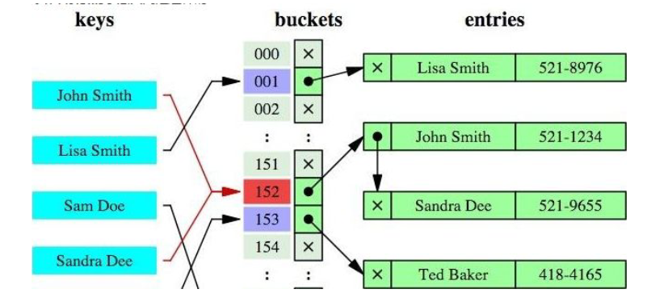
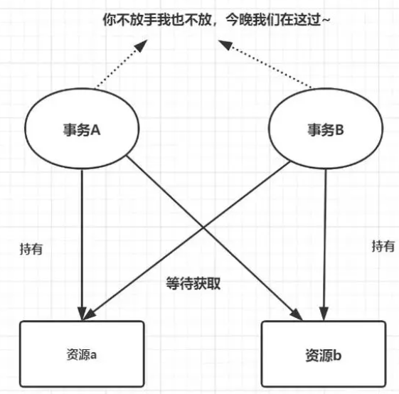

---
tags:
  - interview
  - 尚硅谷
  - Java
  - 内部原理与SQL优化
source: 尚硅谷Java技术之高频面试题-v2025.1
title: MySQL：内部原理与SQL优化
---

# MySQL：内部原理与SQL优化

> 来源：尚硅谷 Java 技术之高频面试题 v2025.1 · mysql：内部原理与sql优化

# 1. 索引的基本原理

索引用来快速地寻找那些具有特定值的记录。如果没有索引，一般来说执行查询时遍历整张表。

索引的原理：就是把无序的数据变成有序的查询

1. 把创建了索引的列的内容进行排序。
2. 对排序结果生成倒排表。
3. 在倒排表内容上拼上数据地址链。
4. 在查询的时候，先拿到倒排表内容，再取出数据地址链，从而拿到具体数据

# 2. 说一下索引的优势和劣势？

优势：适当使用索引可以大大提高查询速度

劣势：

- 针对创建索引的数据执行增、删、改操作会导致索引重新计算，拉低了增、删、改操作的执行速度
- 在数据表中数据本身之外，索引还要占用物理空间
- 维护索引很昂贵，特别是插入新行或者主键被更新导致要分页(page split)的时候。建议在大量插入新行后，选在负载较低的时间段，通过OPTIMIZE TABLE优化表，因为必须被移动的行数据可能造成碎片，而使用独享表空间可以弱化碎片。
- 表如果使用UUID（随机ID）作为主键，则会使数据存储稀疏，这就会出现使用聚簇索引有可能有比全表扫描更慢，所以建议使用int的auto_increment作为主键
- 如果主键比较大的话，那辅助索引将会变的更大，因为辅助索引的叶子存储的是主键值；过长的主键值，会导致非叶子节点占用占用更多的物理空间。

> 这里的“劣势”表述为“代价”更准确，所以总的逻辑是：为了达到快速查询的目的，即使付出再多代价也在所不惜。
> 而且很多问题是可以避免的，比如：不在频繁增、删、改的表或字段上创建索引；尽量基于主键索引或唯一索引查询；尽量实现覆盖索引；优化
> SQL
> 语句使其和索引结构更加匹配

# 3. MySQL聚簇和非聚簇索引的区别

聚簇和非聚簇索引都是B+树的数据结构

## 3.1. 背记

- 聚簇索引：索引和数据在一起
- 非聚簇索引：索引和数据不在一起

## 3.2. 理解

### 3.2.1. 聚簇索引

聚簇索引是直接在数据本身的基础上创建的，索引和数据一体。聚簇索引建立的依据是排序后的主键值，所以聚簇索引和主键索引是等同的，是同一个事物侧重不同角度时的不同名称而已。

由于聚簇索引是将数据存储与索引放到了一块、并且是按照一定的顺序组织的，所以找到索引也就找到了数据。又因为数据的物理存放顺序与索引顺序是一致的，所以只要索引是相邻的，那么对应的数据一定也是相邻地存放在磁盘上的。

### 3.2.2. 非聚簇索引

叶子节点除了被索引的那个字段之外不存储其它数据。那么为了能够找到所在行的其它数据，非聚簇索引的叶子节点需要存储所在行的主键值。

将来在查询过程中涉及两种情况：

- 不需要回表：当前非聚簇索引包含了全部要查询的字段（这种情况就是我们常说的覆盖索引，你可以理解成：索引中字段的范围把select子句所需字段范围给覆盖住了）
- 需要回表：select子句要查询的字段涉及到当前非聚簇索引之外的其它字段（非覆盖索引，没覆盖住）

所谓回表就是通过非聚簇索引查询到数据之后，拿到主键值；再根据主键值回到聚簇索引查询所需数据。

# 4. InnoDB和MyISAM中索引的区别

## 4.1. InnoDB

InnoDB中一定有主键，主键一定是聚簇索引。如果不手动设置、则会使用unique索引；如果连unique索引都没有，则会使用数据库内部的一个行的隐藏id来当作主键索引。

在聚簇索引之上创建的索引称之为辅助索引，辅助索引访问数据总是需要二次查找，非聚簇索引都是辅助索引，像复合索引、前缀索引、唯一索引，辅助索引叶子节点存储的不再是行的物理位置，而是主键值。

## 4.2. MyISAM

MyISM没有聚簇索引，所有索引都是非聚簇索引。非聚簇索引的两棵B+树看上去没什么不同，节点的结构完全一致只是存储的内容不同而已。

主键索引B+树的叶子节点存储了主键，辅助键索引B+树存储了辅助键。

表数据另外存储在独立的地方，这两颗B+树的叶子节点都使用一个地址指向真正的表数据，对于表数据来说，这两个键没有任何差别。

由于索引树是独立的，通过辅助键检索时无需访问主键的索引树。

如果涉及到大数据量的排序、全表扫描、count之类的操作的话，还是MyISAM占优势些，因为索引所占空间小，这些操作是需要在内存中完成的。

# 5. MySQL中索引有哪些数据结构可以选择？

在MySQL中，可以使用的索引数据结构主要包括以下几种：

- **B+树索引**：这是最常见的一种索引类型，InnoDB存储引擎的默认索引实现，适用于大多数情况下的查询操作，包括范围查询和排序操作。
- **Hash索引**：底层的数据结构就是哈希表，因此主要用于等值查询，效率非常高，但不支持范围查询或排序。
- **全文索引 (Full-text Index)**：这种索引用于全文搜索，适用于对文本字段进行复杂的搜索操作。它支持自然语言处理和布尔搜索等功能。
- **R树索引**：这种索引主要用于地理空间数据类型，如点、线、面等。它支持空间查询，如距离计算、区域查询等。
- **空间索引 (Spatial Index)**：类似于R-Tree索引，但更通用，适用于任何类型的空间数据。它也支持空间查询和距离计算等功能。

每种索引类型都有其适用场景和限制，选择合适的索引类型可以显著提高查询性能。

# 6. 比较B+树和HASH两种索引结构的优劣

## 6.1. B+树

### 6.1.1. B+树的特点

- B+树是一个**平衡**的**多叉**树，从根节点到每个叶子节点的高度差值不超过1（意思是：所有叶子节点都在同一层）
- 同层级的节点间有指针相互链接
- 由于B+树是平衡的多叉树，其高度是最小的。这意味着从根节点到任何叶子节点的路径长度是相同的

### 6.1.2. B+树的优势

1. **树的高度**：从根节点到任何叶子节点的路径长度相同，因此搜索效率不会因为路径长度的不同而出现大幅波动。
2. **节点的子节点数**：在B+树中，每个节点可以有多个子节点，但必须满足一定的平衡条件。具体来说，除了根节点外，每个节点必须至少有⌈m/2⌉个子节点（其中m是节点的最大子节点数），且最多有m个子节点。这种结构确保了树的高度保持相对稳定，从而保证了搜索效率的一致性。
3. **搜索过程**：在B+树上进行常规检索时，搜索过程是从根节点开始，逐层向下遍历子节点，直到找到目标叶子节点。由于树的高度是固定的，因此搜索过程中需要访问的节点数量也是固定的。这意味着搜索效率不会因为数据量的变化而出现大幅波动。
4. **磁盘I/O操作**：在数据库系统中，B+树通常用于索引结构，以减少磁盘I/O操作次数。由于B+树的高度固定，每次检索所需的磁盘I/O操作次数也是固定的。这进一步保证了搜索效率的稳定性。
5. **同层指针**：基于索引的顺序扫描时，也可以利用双向指针快速左右移动，效率非常高

因此B+树索引被广泛应用于数据库、文件系统等场景

## 6.2. 哈希索引

哈希索引就是采用一定的哈希算法，把键值换算成新的哈希值，检索时不需要类似B+树那样从根节点到叶子节点逐级查找，只需一次哈希算法即可立刻定位到相应的位置，速度非常快。



如果是等值查询，那么哈希索引明显有绝对优势，因为只需要经过一次算法即可找到相应的键值；前提是键值都是唯一的。如果键值不是唯一的，就需要先找到该键所在位置，然后再根据链表往后扫描，直到找到相应的数据；

如果是范围查询检索，这时候哈希索引就毫无用武之地了，因为原先是有序的键值，经过哈希算法后，有可能变成不连续的了，就没办法再利用索引完成范围查询检索；

哈希索引也没办法利用索引完成排序，以及like ‘xxx%’ 这样的部分模糊查询（这种部分模糊查询，其实本质上也是范围查询）；

哈希索引也不支持多列联合索引的最左匹配规则；

在有大量重复键值情况下，哈希索引的效率极低，因为存在哈希碰撞问题。

# 7. MySQL索引的设计原则

## 7.1. 总体原则

查询更快、占用空间更小

## 7.2. 详细描述

1. 适合索引的列是出现在where子句中的列，或者连接子句中指定的列。
2. 基数（数据库表中的记录数）较小的表，索引效果较差，没有必要在此列建立索引
3. 使用短索引，如果对长字符串列进行索引，应该指定一个前缀长度，这样能够节省大量索引空间，如果搜索词超过索引前缀长度，则使用索引排除不匹配的行，然后检查其余行是否可能匹配
4. 不要过度索引。索引需要额外的磁盘空间，并降低写操作的性能。在修改表内容的时候，索引会进行更新甚至重构，索引列越多，这个时间就会越长。所以只保持需要的索引有利于查询即可。
5. 定义了外键的数据列一定要建立索引。
6. 更新频繁字段不适合创建索引。
7. 若是不能有效区分数据的列不适合做索引列(如性别，男女未知，最多也就三种，区分度实在太低)
8. 对于那些查询中很少涉及的列，重复值比较多的列不要建立索引。
9. 对于定义为text、image和bit的数据类型的列不要建立索引。

# 8. MySQL中B+树和B树的区别

## 8.1. 非叶子节点数据不同

B+树的非叶子节点的数据都在叶子节点中出现过，也就是叶子节点中的数据都在非叶子节点冗余一 份。

B树中非叶子节点中元素不会冗余。

B+树非叶子节点只存放指针，不存放数据，B树所有节点（叶子节点）都存放数据。

## 8.2. 叶子节点数据不同

B+树叶子节点存放数据，B树所有节点（非叶子节）点存放数据。数据遍布整个树结构。

## 8.3. 时间复杂度不同

由于B+树的数据都存在叶子节点，因此B+树的时间复杂度固定为o(log n)，而B树的数据分布在每个节点中，因此时间复杂度不固定，最好的情况是o(1)

## 8.4. 叶子节点连接不同

B+树的叶子节点通过有序的双向链表相连，B树叶子节点不相连

## 8.5. 区间查询效率不同

因为第4点的原因，所以B+树范围查询效率更快，而B树范围查询比较慢。

因此，存在大量范围查询的场景，适合使用B+树而对大量单个key查询的场景，可以考虑B树或HASH

# 9. MySQL中的锁类型有哪些？

## 9.1. 背记

- 基于锁的属性分类：共享锁、排他锁。
- 基于锁的粒度分类：
  - 行级锁(INNODB)
  - 表级锁(INNODB、MYISAM)
  - 页级锁(BDB引擎 )
  - 记录锁
  - 间隙锁
  - 临键锁

## 9.2. 理解

### 9.2.1. 共享锁(Share Lock)

共享锁又称读锁，简称S锁；当一个事务为数据加上读锁之后，其他事务只能对该数据加读锁，而不能对数据加写锁，直到所有的读锁释放之后其他事务才能加写锁。

共享锁的特性主要是为了支持并发的读取数据，读取数据的时候不支持修改，可以避免出现不可重复读的问题。

### 9.2.2. 排他锁（Exclusive Lock）

排他锁又称写锁，简称X锁；

当一个事务为数据加上写锁时，其他请求将不能再为数据加任何锁，直到该锁释放之后，其他事务才能对数据进行加锁。

排他锁的目的是在数据修改时候，不允许其他人同时修改，也不允许其他人读取。避免了出现脏数据和脏读的问题

### 9.2.3. 表锁

表锁是指上锁的时候锁住的是整个表，当下一个事务访问该表的时候，必须等前一个事务释放了锁才能进行对表进行访问

特点： 粒度大，加锁简单，容易冲突

### 9.2.4. 行锁

行锁是指上锁的时候锁住的是表的某一行或多行记录，其他事务访问同一张表时，只有被锁住的记录不能访问，其他的记录可正常访问；

特点：粒度小，加锁比表锁麻烦，不容易冲突，相比表锁支持的并发要高

### 9.2.5. 记录锁(Record Lock)

记录锁也属于行锁中的一种，只不过记录锁的范围只是表中的某一条记录，记录锁是说事务在加锁后锁住的只是表的某一条记录。

精准条件命中，并且命中的条件字段是唯一索引加了记录锁之后数据可以避免数据在查询的时候被修改的重复读问题，也避免了在修改的事务未提交前被其他事务读取的脏读问题。

### 9.2.6. 页锁

页级锁是MySQL中锁定粒度介于行级锁和表级锁中间的一种锁。表级锁速度快，但冲突多，行级冲突少，但速度慢。

所以取了折衷的页级，一次锁定相邻的一组记录。

特点：开销和加锁时间界于表锁和行锁之间；会出现死锁；锁定粒度界于表锁和行锁之间，并发度一般。

### 9.2.7. 间隙锁(Gap Lock）

**间隙锁（Gap Lock）**是一种用于**防止幻读**现象的锁机制。在数据库中，幻读是指一个事务在读取某个范围内的数据时，另一个事务插入了新的记录，导致第一个事务再次读取该范围时发现有新的记录出现。

### 9.2.8. 间隙锁的特性：

1. **锁定范围**：间隙锁不仅锁定实际存在的记录，还锁定这些记录之间的“间隙”。这意味着即使两个事务试图插入相同的记录范围，它们也会因为间隙锁而发生冲突。
2. **防止插入**：间隙锁可以防止其他事务在锁定的范围内插入新的记录。这确保了在一个事务读取某个范围的数据后，其他事务不能在该范围内插入新的记录，从而避免了幻读现象。
3. **应用场景**：间隙锁通常用于可重复读（Repeatable Read）隔离级别，以防止幻读现象。在这种隔离级别下，事务在第一次读取数据时会对读取的范围加锁，包括间隙锁，以确保在整个事务期间数据的一致性。

### 9.2.9. 示例：

假设有一个表 `employees`，其中包含以下记录：

```Text
id | name
---|------
1  | Alice
3  | Bob
5  | Charlie
```

- 事务A执行查询 `SELECT * FROM employees WHERE id > 2 AND id < 6 FOR UPDATE;`，这将对范围 (2, 6) 加上间隙锁。
- 事务B尝试执行插入操作 `INSERT INTO employees (id, name) VALUES (4, 'David');`，由于间隙锁的存在，事务B将被阻塞，直到事务A释放锁。

通过使用间隙锁，数据库系统能够有效地防止幻读现象，确保事务的隔离性和数据的一致性。

MySQL并不直接提供显式的语法来手动加间隙锁。相反，间隙锁是通过InnoDB存储引擎在执行某些查询时自动管理的。

### 9.2.10. 临建锁(Next-Key Lock)

临建锁（Next-Key Lock）是InnoDB存储引擎中的一种锁机制，用于解决幻读问题并确保事务的隔离性。它结合了行级锁和间隙锁的特性，提供了更强的数据一致性保证。

#### 9.2.10.1. 临建锁的特性：

1. **锁定范围**：临建锁不仅锁定实际存在的记录，还锁定这些记录之间的“间隙”。这意味着即使两个事务试图插入相同的记录范围，它们也会因为临建锁而发生冲突。
2. **防止插入和删除**：临建锁可以防止其他事务在锁定的范围内插入新的记录或删除现有的记录。这确保了在一个事务读取某个范围的数据后，其他事务不能在该范围内插入新的记录或删除已有的记录，从而避免了幻读现象。
3. **兼容性**：临建锁与共享锁和排他锁是兼容的，即一个事务持有的共享锁或排他锁不会阻止其他事务获取相同范围的临建锁。然而，临建锁会阻止其他事务获取相同范围的共享锁或排他锁，除非它们也持有临建锁。
4. **应用场景**：临建锁通常用于可重复读（Repeatable Read）隔离级别，以防止幻读现象。在这种隔离级别下，事务在第一次读取数据时会对读取的范围加锁，包括临建锁，以确保在整个事务期间数据的一致性。

#### 9.2.10.2. 示例：

假设有一个表 `employees`，其中包含以下记录：

```SQL
id | name
---|------
1  | Alice
3  | Bob
5  | Charlie
```

- 事务A执行查询 `SELECT * FROM employees WHERE id > 2 AND id < 6 FOR UPDATE;`，这将对范围 (2, 6) 加上临建锁。
- 事务B尝试执行插入操作 `INSERT INTO employees (id, name) VALUES (4, 'David');`，由于临建锁的存在，事务B将被阻塞，直到事务A释放锁。

通过使用临建锁，数据库系统能够有效地防止幻读现象，确保事务的隔离性和数据的一致性。

### 9.2.11. 临键锁和间隙锁的区别是什么？

临键锁（Next-Key Lock）和间隙锁（Gap Lock）都是InnoDB存储引擎中用于防止幻读现象的锁机制，但它们在锁定范围和应用场景上有一些区别。以下是对两者的详细比较：

#### 9.2.11.1. 1. 锁定范围

- **临键锁（Next-Key Lock）**：
  - 临键锁不仅锁定实际存在的记录，还锁定这些记录之间的“间隙”。这意味着它不仅防止其他事务插入或删除锁定范围内的记录，还防止在这些间隙内插入新的记录。
  - 例如，对于范围查询 `WHERE id > 2 AND id < 6`，临键锁会锁定范围 (2, 6) 以及这个范围内的所有间隙。
- **间隙锁（Gap Lock）**：
  - 间隙锁只锁定记录之间的“间隙”，而不锁定实际存在的记录。这意味着它仅防止其他事务在这些间隙内插入新的记录，而不会锁定实际的记录本身。
  - 例如，对于范围查询 `WHERE id > 2 AND id < 6`，间隙锁只会锁定范围 (2, 6) 内的间隙，而不会锁定记录 3 和 5。

#### 9.2.11.2. 2. 兼容性

- **临键锁（Next-Key Lock）**：
  - 与共享锁和排他锁兼容，即一个事务持有的共享锁或排他锁不会阻止其他事务获取相同范围的临键锁。然而，临键锁会阻止其他事务获取相同范围的共享锁或排他锁，除非它们也持有临键锁。
- **间隙锁（Gap Lock）**：
  - 与共享锁和排他锁兼容，即一个事务持有的共享锁或排他锁不会阻止其他事务获取相同范围的间隙锁。然而，间隙锁会阻止其他事务获取相同范围的共享锁或排他锁，除非它们也持有间隙锁。

#### 9.2.11.3. 3. 应用场景

- **临键锁（Next-Key Lock）**：
  - 通常用于可重复读（Repeatable Read）隔离级别，以防止幻读现象。在这种隔离级别下，事务在第一次读取数据时会对读取的范围加锁，包括临键锁，以确保在整个事务期间数据的一致性。
- **间隙锁（Gap Lock）**：
  - 通常用于可重复读（Repeatable Read）隔离级别，以防止幻读现象。在这种隔离级别下，事务在第一次读取数据时会对读取的范围加锁，包括间隙锁，以确保在整个事务期间数据的一致性。

#### 9.2.11.4. 4. 实现方式

- **临键锁（Next-Key Lock）**：
  - 临键锁实际上是由多个锁组成的，包括行级锁和间隙锁的组合。因此，它可以同时提供行级锁和间隙锁的功能。
- **间隙锁（Gap Lock）**：
  - 间隙锁是独立的锁类型，专门用于锁定记录之间的间隙。

#### 9.2.11.5. 总结

虽然临键锁和间隙锁都用于防止幻读现象，确保事务的隔离性和数据的一致性，但它们的锁定范围和实现方式有所不同。临键锁不仅锁定实际存在的记录，还锁定这些记录之间的间隙，而间隙锁仅锁定记录之间的间隙。在实际应用中，这两种锁机制可以结合使用，以提供更强的数据一致性保证。

# 10. MySQL什么是死锁？怎么解决？

## 10.1. 概念

死锁是指两个或多个事务在同一资源上相互占用，并请求锁定对方的资源，从而导致恶性循环的现象。



## 10.2. 发生死锁现象有四个必要条件

- 互斥条件
- 请求和保持条件
- 环路等待条件
- 不剥夺条件

## 10.3. 解决思路

解决死锁思路，一般就是切断环路，尽量避免并发形成环路。如果不同程序会并发存取多个表，尽量约定以相同的顺序访问表，可以大大降低死锁机会；

在同一个事务中，尽可能做到一次锁定所需要的所有资源，减少死锁产生概率；

对于非常容易产生死锁的业务部分，可以尝试使用升级锁定颗粒度，通过表级锁定来减少死锁产生的概率；

如果业务处理不好可以用分布式事务锁或者使用乐观锁；

死锁与索引密不可分，解决索引问题，需要合理优化索引。

# 11. MySQL的约束有哪些？

约束类型

NOT NULL

UNIQUE

PRIMARY KEY

功能说明

约束字段的内容一定不能为NULL

约束字段唯一性，一个表允许有多个Unique约束

约束字段唯一，不可重复，一个表只允许存在一个

FOREIGN KEY

用于预防破坏表之间连接的动作，也能防止非法数据插入外键。
用来让两张表的数据之间建立连接，从而保证数据的一致性和完整性。

CHECK

用于控制字段的值范围。保证字段值满足某一个条件

DEFAULT

保存数据时，如果未指定该字段的值，则采用默认值

# 12. 关心过业务系统里面的SQL耗时吗？统计过慢查询吗？对慢查询都怎么优化过？

在业务系统中，除了使用主键进行的查询，其他的都会在测试库上测试其耗时，慢查询的统计主要由运维在做，会定期将业务中的慢查询反馈给我们。

慢查询的优化首先要搞明白慢的原因是什么？

1、是查询条件没有命中索引？

2、是load了不需要的数据列？

3、还是数据量太大？

所以优化也是针对这三个方向来的：

1、首先分析语句，看看是否load了额外的数据，可能是查询了多余的行并且抛弃掉了，可能是加载了许多结果中并不需要的列，对语句进行分析以及重写。

2、分析语句的执行计划，然后获得其使用索引的情况，之后修改语句或者修改索引，使得语句可以尽可能的命中索引。

3、如果对语句的优化已经无法进行，可以考虑表中的数据量是否太大，如果是的话可以进行横向或者纵向的分表。

# 13. MySQL事务的基本特性和隔离级别

事务基本特性ACID分别是：

- 原子性：指的是一个事务中的操作要么全部成功，要么全部失败。
- 一致性：指的是数据库总是从一个一致性的状态转换到另外一个一致性的状态。比如A转账给B100块钱，假设A只有90块，支付之前我们数据库里的数据都是符合约束的,但是如果事务执行成功了,我们的数据库数据就破坏约束了,因此事务不能成功,这里我们说事务提供了一致性的保证。
- 隔离性:指的是一个事务的修改在最终提交前，对其他事务是不可见的。
- 持久性：指的是一旦事务提交，所做的修改就会永久保存到数据库中。

并发问题有三种情况：

- **脏读(Drity Read)**：某个事务已更新一份数据，另一个事务在此时读取了同一份数据，由于某些原因，前一个RollBack了操作，则后一个事务所读取的数据就会是不正确的。
- **不可重复读(Non-repeatable read)：**在一个事务的两次查询之中数据不一致，这可能是两次查询过程中间插入了一个事务更新的原有的数据。
- **幻读(Phantom Read)：**在一个事务的两次查询中数据笔数不一致，例如有一个事务查询了几列(Row)数据，而另一个事务却在此时插入了新的几列数据，先前的事务在接下来的查询中，就会发现有几列数据是它先前所没有的。

隔离性有4个隔离级别，分别是：

- **read uncommit**读未提交，可能会读到其他事务未提交的数据，也叫做脏读。

用户本来应该读取到id=1的用户age应该是10，结果读取到了其他事务还没有提交的事务，结果读取结果age=20，这就是脏读。

- **read commit**读已提交，两次读取结果不一致，叫做不可重复读。

不可重复读解决了脏读的问题，他只会读取已经提交的事务。

用户开启事务读取id=1用户，查询到age=10，再次读取发现结果=20，在同一个事务里同一个查询读取到不同的结果叫做不可重复读。

- **repeatable read**可重复复读，这是mysql的默认级别，就是每次读取结果都一样，但是有可能产生幻读。
- **serializable**串行，一般是不会使用的，他会给每一行读取的数据加锁，会导致大量超时和锁竞争的问题。

# 14. MySQL中ACID靠什么保证的？

缩写

A

C

I

属性名

原子性

一致性

隔离性

保证机制

由undo log日志保证，它记录了需要回滚的日志信息，事务回滚时撤销已经执行成功的SQL

由其他三大特性保证、程序代码要保证业务上的一致性

由MVCC来保证

D

持久性

由内存和redo log来保证，MySQL修改数据同时在内存和redo log记录这次操作。
宕机的时候可以从redo log恢复。
redolog的刷盘操作会在系统空闲时进行

# 15. MySQL中的MVCC是什么？

多版本并发控制：读取数据时通过一种类似快照的方式将数据保存下来，这样读锁就和写锁不冲突了，不同的事务会看到自己特定版本的数据，版本链。

MVCC只在READ COMMITTED和REPEATABLE READ两个隔离级别下工作。其他两个隔离级别和MVCC不兼容。

因为READ UNCOMMITTED总是读取最新的数据行，而不是符合当前事务版本的数据行。而SERIALIZABLE 则会对所有读取的行都加锁。

聚簇索引记录中有两个必要的隐藏列：

trx_id：用来存储每次对某条聚簇索引记录进行修改的时候的事务id。

roll_pointer：每次对哪条聚簇索引记录有修改的时候，都会把老版本写入undo日志中。

这个roll_pointer就是存了一个指针，它指向这条聚簇索引记录的上一个版本的位置，通过它来获得上一个版本的记录信息。

（注意插入操作的undo日志没有这个属性，因为它没有老版本）

已提交读和可重复读的区别就在于它们生成ReadView的策略不同。


开始事务时创建ReadView，ReadView维护当前活动的事务id，即未提交的事务id，排序生成一个数组。

访问数据，获取数据中的事务id，对比ReadView：

如果在ReadView的左边（比ReadView都小），可以访问（在左边意味着该事务已经提交）

如果在ReadView的右边（比ReadView都大）或者就在ReadView中，不可以访问，获取roll_pointer，取上一版本重新对比（在右边意味着，该事务在ReadView生成之后出现，在ReadView中意味着该事务还未提交）

已提交读隔离级别下的事务在每次查询的开始都会生成一个独立的ReadView,而可重复读隔离级别则在第一次读的时候生成一个ReadView，之后的读都复用之前的ReadView。

这就是Mysql的MVCC,通过版本链，实现多版本，可并发读-写，写-读。通过ReadView生成策略的不同实现不同的隔离级别

# 16. 数据库表主键生成方式使用自增int类型还是UUID？

在数据库设计中，选择主键生成方式是一个需要仔细考虑的问题。自增 `int` 类型和 `UUID`（通用唯一标识符）各有优缺点，具体选择取决于应用场景、性能需求和系统架构等因素。以下是对这两种主键生成方式的详细比较：

## 16.1. 自增 `int` 类型

### 16.1.1. 优点：

1. **性能高**：自增 `int` 类型的主键生成速度非常快，因为它只是简单地递增一个整数。这在插入操作频繁的场景下表现尤为出色。
2. **存储空间小**：`int` 类型通常占用4个字节，而 `UUID` 通常占用16个字节，因此使用 `int` 可以节省存储空间。
3. **索引效率高**：由于 `int` 是固定长度且有序的，数据库引擎可以更高效地创建和维护索引。

### 16.1.2. 缺点：

1. **分布式系统中不友好**：在分布式系统中，如果多个节点同时生成自增 `int` 类型的主键，可能会导致冲突。虽然可以通过一些策略（如设置不同的起始值和步长）来避免冲突，但实现起来较为复杂。
2. **安全性问题**：自增 `int` 类型的主键容易被猜测，可能会带来安全隐患。例如，攻击者可以通过遍历主键来获取数据。

## 16.2. UUID

### 16.2.1. 优点：

1. **全局唯一性**：UUID 是基于时间和随机数生成的，几乎可以保证全球范围内的唯一性，非常适合分布式系统。
2. **安全性高**：由于 UUID 是随机生成的，不容易被猜测，从而提高了数据的安全性。
3. **无中心化管理**：不需要集中式的主键生成服务，每个节点都可以独立生成 UUID，减少了单点故障的风险。

### 16.2.2. 缺点：

1. **性能较低**：生成 UUID 的速度比自增 `int` 慢，特别是在高并发场景下，性能开销较大。
2. **存储空间大**：UUID 通常占用16个字节，比 `int` 类型的4个字节要大得多，增加了存储成本。
3. **索引效率低**：由于 UUID 是无序的，数据库引擎在创建和维护索引时效率较低。

## 16.3. 综合考虑

- **单节点应用或非分布式环境**：如果系统是单节点应用或者不需要分布式支持，自增 `int` 类型通常是更好的选择，因为它性能高且存储空间小。
- **分布式系统**：如果系统需要在多个节点之间进行数据同步或扩展，并且需要确保主键的唯一性和安全性，那么 UUID 是更好的选择。
- **安全性要求高**：如果系统对数据安全性有较高要求，不希望主键被轻易猜测，那么 UUID 是更安全的选择。

## 16.4. 实际案例

- **MySQL**：在 MySQL 中，可以使用 `AUTO_INCREMENT` 属性来实现自增 `int` 类型的主键。
- **PostgreSQL**：在 PostgreSQL 中，可以使用 `SERIAL` 类型来实现自增 `int` 类型的主键。
- **UUID**：在大多数数据库中，都提供了生成 UUID 的函数。例如，在 PostgreSQL 中可以使用 `uuid_generate_v4()` 函数生成 UUID。

综上所述，选择主键生成方式需要根据具体的业务需求和系统架构来决定。对于大多数单节点应用来说，自增 `int` 类型是一个不错的选择；而对于需要分布式支持和高安全性的系统，UUID 则更为合适。

# 17. **MySQL数据库**CPU飙升的话，要怎么处理呢？

## 17.1. 排查过程

使用top命令观察，确定是mysqld导致还是其他原因。

如果是mysqld导致的，show processlist，查看session情况，确定是不是有消耗资源的SQL在运行。

找出消耗高的SQL，看看执行计划是否准确， 索引是否缺失，数据量是否太大。

## 17.2. 处理

kill掉这些线程，同时观察CPU使用率是否下降，进行相应的调整，比如说加索引、SQL调优、改内存参数，然后重新跑SQL。

## 17.3. 其他情况

也有可能是每个SQL消耗资源并不多，但是突然之间，有大量的session连进来导致CPU飙升，这种情况就需要跟应用一起来分析为何连接数会激增，再做出相应的调整，比如说限制连接数或添加Redis缓存等。

# 18. 了解什么是表分区吗？表分区的好处有哪些？

## 18.1. 概念

表分区，是指根据一定规则，将数据库中的一张表分解成多个更小的容易管理的部分。

从逻辑上看，只有一张表，但是底层却是由多个物理分区组成。

## 18.2. 好处

### 18.2.1. 存储更多数据

分区表的数据可以分布在不同的物理设备上，从而高效地利用多个硬件设备。和单个磁盘或者文件系统相比，可以存储更多数据。

### 18.2.2. 优化查询

在where语句中包含分区条件时，可以只扫描一个或多个分区表来提高查询效率；涉及sum和count语句时，也可以在多个分区上并行处理，最后汇总结果。

分区表更容易维护。例如：想批量删除大量数据可以清除整个分区。避免某些特殊的瓶颈，例如InnoDB的单个索引的互斥访问。

# 19. 说说MySQL主从同步原理

## 19.1. MySQL主从同步的过程

MySQL的主从复制中主要有三个线程： master（binlog dump thread）、slave（I/O thread 、SQLthread），Master一条线程和Slave中的两条线程。

主节点 binlog，主从复制的基础是主库记录数据库的所有变更记录到 binlog。

binlog 是数据库服务器启动的那一刻起，保存所有修改数据库结构或内容的一个文件。

主节点 log dump 线程，当 binlog 有变动时，log dump 线程读取其内容并发送给从节点。

从节点 I/O线程接收 binlog 内容，并将其写入到 relay log 文件中。

从节点的SQL 线程读取 relay log 文件内容对数据更新进行重放，最终保证主从数据库的一致性。

注：主从节点使用 binglog 文件 + position 偏移量来定位主从同步的位置，从节点会保存其已接收到的偏移量，如果从节点发生宕机重启，则会自动从 position 的位置发起同步。由于MySQL默认的复制方式是异步的，主库把日志发送给从库后不关心从库是否已经处理，这样会产生一个问题就是假设主库挂了，从库处理失败了，这时候从库升为主库后，日志就丢失了。由此产生两个概念：全同步复制和半同步复制。

## 19.2. 全同步复制

主库写入binlog后强制同步日志到从库，所有的从库都执行完成后才返回给客户端，所以该方式数据一致性好，性能差。

## 19.3. 半同步复制

和全同步不同的是，半同步复制把从库写入日志成功后返回ACK确认给主库，主库收到至少一个从库的确认就认为写操作完成。

所以该方式性能好，数据一致性差。

# 20. 简述MyISAM和InnoDB的区别

## 20.1. MyISAM

1、不支持事务；

2、支持表级锁，即每次操作是对整个表加锁；

3、存储表的总行数；

4、一个MYISAM表有三个文件：索引文件、表结构文件、数据文件；

5、采用非聚集索引，索引文件的数据域存储指向数据文件的指针。辅索引与主索引基本一致，但是辅索引不用保证唯一性。

## 20.2. InnoDB

1、支持ACID的事务，支持事务的四种隔离级别；

2、支持行级锁及外键约束：因此可以支持写并发；

3、不存储总行数；

4、一个InnoDB引擎存储在一个文件空间（共享表空间，表大小不受操作系统控制，一个表可能分布在多个文件里），也有可能为多个（设置为独立表空间，表大小受操作系统文件大小限制，一般为2G），受操作系统文件大小的限制；

5、主键索引采用聚集索引（索引的数据域存储数据文件本身），辅索引的数据域存储主键的值；因此从辅索引查找数据，需要先通过辅索引找到主键值，再访问主键索引树；索引最好使用自增主键，防止插入数据时，为维持B+树结构，文件的大调整。

# 21. 简述MySQL中索引类型及对数据库的性能的影响

**普通索引**：允许被索引的数据列包含重复的值。

**唯一索引**：可以保证数据记录的唯一性。

**主键索引**：是一种特殊的唯一索引，在一张表中只能定义一个主键索引，主键用于唯一标识一条记录，使用关键字 PRIMARY KEY 来创建。

**联合索引**：索引可以覆盖多个数据列，如像INDEX(columnA, columnB)索引。

**全文索引**：通过建立 倒排索引 ,可以极大的提升检索效率,解决判断字段是否包含的问题，是目前搜索引擎使用的一种关键技术。可以通过ALTER TABLE table_name ADD FULLTEXT (column);创建全文索引索引可以极大的提高数据的查询速度。

通过使用索引，可以在查询的过程中，使用优化器，提高系统的性能。但是会降低插入、删除、更新表的速度，因为在执行这些写操作时，还要操作索引文件索引需要占物理空间，除了数据表占数据空间之外，每一个索引还要占一定的物理空间，如果要建立聚簇索引，那么需要的空间就会更大，如果非聚集索引很多，一旦聚集索引改变，那么所有非聚集索引都会跟着变。

# 22. MySQL执行计划怎么看

MySQL中SQL语句的执行计划可以通过explain关键词查看，其中包括查询执行的步骤、索引使用的情况等信息。

```SQL
EXPLAIN SELECT * from A where X=? and Y=?
```

| 列名 | 重要 | 描述 |
| --- | --- | --- |
| `id` | ○ | 用来告诉我们整个SQL语句在执行过程中，有哪些大的步骤和小的步骤。 |
| `select_type` | ○ | SELECT关键字对应的那个查询的类型 |
| `table` |  | 每个具体步骤对应的表名。可能是实际的表，也可能是保存中间数据的临时表。 |
| `partitions` |  | 匹配的分区信息 |
| `type` | ● | 针对单表的访问方法 |
| `possible_keys` |  | 可能用到的索引 |
| `key` | ● | 实际上使用的索引 |
| `key_len` | ● | 实际使用到的索引长度 |
| `ref` |  | 当使用索引列等值查询时，与索引列进行等值匹配的对象信息 |
| `rows` |  | 预估的需要读取的记录条数 |
| `filtered` |  | 某个表经过搜索条件过滤后剩余记录条数的百分比 |
| `Extra` |  | 一些额外的信息 |

## 22.1. id字段

是一个有顺序的编号，是查询的顺序号，有几个select就显示几行。id的顺序是按select出现的顺序增长的。id列的值越大执行优先级越高越先执行，id列的值相同则从上往下执行，id列的值为NULL最后执行。

id字段的值有可能会出现多个，每个值都有可能重复出现。其中每一个数值代表一个大步骤，同一个数值出现次数表示这个大步骤中小步骤执行的次数。

大步骤按照数值从大到小的顺序执行，小步骤按照从上到下的顺序执行

假设有如下执行结果：

id字段值

1

1

1

标号

a

b

c

2

d

2

e

3

f

3

g

3

h

基于上表中的结果，最终的执行顺序是：f、g、h、d、e、a、b、c

从调优的角度来说，大步骤和小步骤都是越少越好

## 22.2. selectType 字段

表示查询中每个select子句的类型

取值

SIMPLE

PRIMARY

SUBQUERY

说明

表示此查询不包含 UNION 查询或子查询

表示此查询是最外层的查询（包含子查询）

子查询中的第一个 SELECT

UNION

表示此查询是 UNION 的第二或随后的查询

DEPENDENT UNION

UNION 中的第二个或后面的查询语句, 取决于外面的查询UNION RESULT, UNION 的结果

DEPENDENT SUBQUERY

子查询中的第一个 SELECT, 取决于外面的查询. 即子查询依赖于外层查询的结果

DERIVED

衍生，表示导出表的SELECT（FROM子句的子查询）

## 22.3. table字段

表示该语句查询的表

## 22.4. type字段

优化SQL的重要字段，也是我们判断SQL性能和优化程度重要指标

可以把它理解为对表访问方式，表示MySQL在表中找到所需行的方式，又称“访问类型”。具体取值参见下表（从上到下，性能越来越好）：

| 取值 | 含义 |
| --- | --- |
| ALL | 全表扫描，完全没有用到任何索引，效率最低的一种情况 |
| index | 对索引表（聚簇索引、非聚簇索引都算）进行整体遍历，虽然用到了索引但效率仍然较低 |
| **range** | 在一定范围内查询索引表（例如：where age between 20 and 30，当然此时要求age字段上有索引） |
| **ref** | 通过普通的二级索引列与常量进行等值匹配时来查询某个表 例如：where age=20，当然此时要求age字段上有索引 |
| eq_ref | 在关联查询时，如果被驱动表是通过主键或者唯一二级索引列等值匹配的方式进行访问的（如果该主键或者唯一二级索引是联合索引的话，所有的索引列都必须进行等值比较），则对该被驱动表的访问方法就是`eq_ref` from emp left join dept on emp.dept_id=dept.id |
| const | 根据主键或者唯一二级索引列与常数进行等值匹配 where emp_id=5 |
| system | 表仅有一行记录，这是const类型的特例，查询起来非常迅速 |
| null | MySQL在优化过程中分解语句，执行时甚至不用访问表或索引，例如从一个索引列里选取最小值可以通过单独索引查找完成。 select user(); |

评价：

- ALL和index太差，尽量优化提升
- 从eq_ref开始的性能固然很好但是条件非常苛刻，不容易达成

结论：平时尽量把SQL优化到range、ref

## 22.5. possible_keys字段

它表示MySQL在执行该SQL语句的时候，可能用到的索引信息，仅仅是可能，实际不一定会用到。

## 22.6. key字段

此字段是MySQL在当前查询时所真正使用到的索引。 他是possible_keys的子集

## 22.7. key_len字段

表示查询优化器使用了索引的字节数，这个字段可以评估组合索引是否完全被使用，这也是我们优化SQL时，评估索引的重要指标

## 22.8. rows字段

MySQL查询优化器根据统计信息，估算该SQL返回结果集需要扫描读取的行数，这个值相关重要，索引优化之后，扫描读取的行数越多，说明索引设置不对，或者字段传入的类型之类的问题，说明要优化空间越大。

## 22.9. filtered字段

返回结果的行占需要读到的行(rows列的值)的百分比，就是百分比越高，说明需要查询到数据越准确， 百分比越小，说明查询到的数据量大，而结果集很少

## 22.10. extra字段

取值

using filesort

using index

using temporary

说明

表示 MySQL对结果集进行外部排序，不能通过索引顺序达到排序效果。
通常看到using filesort都建议优化去掉，因为这样的查询CPU资源消耗大，延时大

覆盖索引扫描，表示查询在索引树中就可查找所需数据，不用扫描表数据文件，往往说明性能不错

查询有使用临时表, 一般出现于排序， 分组和多表 join 的情况， 查询效率不高，建议优化

using where

SQL使用了where过滤，效率较高

# 23. MySQL常见优化手段

（1）尽量选择较小的列

（2）将where中用的比较频繁的字段建立索引

（3）select子句中避免使用“*”

（4）避免在索引列上使用计算、not in 和<>等操作

（5）当只需要一行数据的时候使用limit 1

（6）保证单表数据不超过200W，适时分割表。针对查询较慢的语句，可以使用explain 来分析该语句具体的执行情况

（7）避免改变索引列的类型

（8）选择最有效的表名顺序，from字句中写在最后的表是基础表，将被最先处理，在from子句中包含多个表的情况下，你必须选择记录条数最少的表作为基础表

（9）避免在索引列上面进行计算

（10）能用关联查询的不要用子查询

（11）尽量缩小子查询的结果

# 24. 你是如何进行SQL调优的？

进行SQL调优时，通常可以采取以下步骤来优化查询性能和提高数据库操作效率：

1. **分析查询执行计划**： 使用数据库管理工具或命令，获取SQL查询的执行计划。执行计划将显示查询的执行路径，包括表的连接方式、索引的使用情况等。通过分析执行计划，可以确定查询中存在的性能瓶颈。
2. **索引优化**： 确保表中的字段上存在适当的索引，以加快数据检索速度。然而，不宜过度索引，因为索引也会增加数据写入的开销。使用复合索引来覆盖多个查询条件，避免使用过多的单列索引。
3. **合理编写SQL语句**： 编写高效的SQL查询语句是调优的关键。避免使用"SELECT *”，而是只选择需要的列；合理使用JOIN操作，避免多余的连接；使用子查询时，确保子查询返回的数据量有限。
4. **缓存数据**： 对于频繁查询的数据，可以使用缓存技术，如Redis，将结果缓存起来，减少对数据库的频繁访问。
5. **分区表和分表**： 如果数据表过大，可以考虑使用分区表或分表的方式，将数据分散存储，提高查询效率。
6. **定期维护和统计**： 定期进行数据库的维护工作，如重新生成索引、更新统计信息等，以保持数据库的优化状态。
7. **避免全表扫描**： 尽量避免全表扫描操作，可以通过适当的索引、条件过滤等方式来减少数据量，提高查询速度。
8. **优化数据库参数配置**： 根据数据库类型，调整数据库的参数配置，如缓冲池大小、连接数等，以适应实际业务负载。
9. **使用合适的存储引擎**： 根据具体的应用需求，选择合适的数据库存储引擎，如InnoDB、MyISAM等。
10. **使用慢查询分析工具**： 数据库管理工具提供了慢查询分析功能，可以帮助你识别哪些查询语句执行较慢，从而有针对性地进行优化。

综合考虑上述方法，根据具体的业务需求和数据库特点，可以进行有效的SQL调优，提升数据库性能和查询效率。

# 25. 请描述MySQL中的InnoDB存储引擎如何实现事务。

InnoDB 存储引擎通过多种机制来实现事务，主要包括以下方面：

1. **日志机制**
  - **Redo Log（重做日志）**：用于实现事务的持久性。它记录了对数据库数据页的所有修改操作，包括插入、更新、删除等。在事务提交时，必须先将该事务的所有重做日志写入到重做日志文件中，待事务的 commit 操作完成才算整个事务操作完成。重做日志文件是顺序写入的，且在每次将 redo log buffer 写入 redo log file 后，通常需要调用一次 fsync 操作以确保日志真正写入磁盘，不过可以通过参数 innodb_flush_log_at_trx_commit 来控制刷新策略。例如，默认值为 1 表示每次提交事务时都执行一次 fsync 操作；设置为 2 则仅写入文件系统缓存，不进行 fsync 操作，可提高性能但有一定风险；设置为 0 时，由 master thread 每秒进行一次重做日志文件的 fsync 操作。
  - **Undo Log（回滚日志）**：记录了事务开始前的数据状态，主要用于回滚未提交的事务或提供多版本并发控制（MVCC）。当事务需要回滚时，InnoDB 会使用回滚日志将数据恢复到事务开始前的状态。同时，回滚日志也用于多版本并发控制，确保事务读取的是某个时间点的一致性视图。
2. **锁机制**
  - **行级锁**：InnoDB 支持行级锁，包括共享锁（S 锁）和排他锁（X 锁），以减少锁定粒度，提高并发性能。当多个事务试图修改同一行数据时，只有第一个事务可以获得排他锁，其他事务必须等待。这样可以在保证数据一致性的同时，允许多个事务并发地读取或修改不同的数据行。
  - **意向锁**：用于表级别的锁，表示即将对表中的某些行进行加锁，从而避免死锁。意向锁包括意向共享锁（IS 锁）和意向排他锁（IX 锁），它们并不直接锁住数据行，而是表明一个事务对某张表有某种锁的意向，为后续的行级锁做准备。
3. **多版本并发控制（MVCC）**
  - MVCC 通过保存数据的历史版本，允许多个事务同时读取数据而不会相互干扰。每个事务都有一个唯一的事务 ID，InnoDB 通过比较事务 ID 来决定哪些版本的数据是可见的。在读已提交隔离级别下，一个事务只能看到其他事务已经提交的数据；在可重复读隔离级别下，事务可以看到其他事务已经提交的数据以及当前事务开始之前其他事务提交的数据；在串行化隔离级别下，事务会被强制按顺序执行，完全串行化。
4. **双写缓冲区（Doublewrite Buffer）**
  - 为了防止部分写入导致的数据损坏，InnoDB 会先将数据写入双写缓冲区，然后再写入数据文件。这样可以在内存中先完成数据的修改和整理，然后再一次性地将完整的数据写入磁盘，提高数据写入的效率和可靠性。

综上所述，InnoDB 存储引擎通过日志机制、锁机制、多版本并发控制和双写缓冲区等多种技术手段，实现了高效、可靠的事务处理。这些机制相互配合，共同确保了事务的 ACID 特性，使得 InnoDB 成为处理复杂事务的理想选择。
