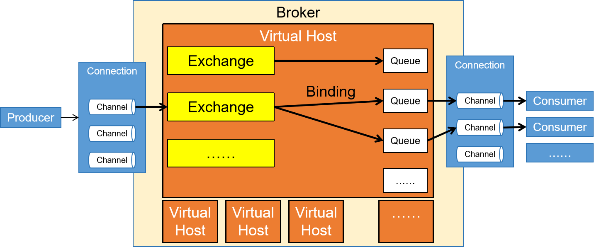
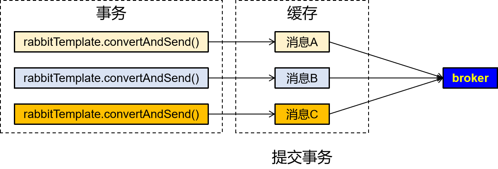

---
tags:
  - interview
  - 尚硅谷
  - Java
  - RabbitMQ
source: 尚硅谷Java技术之高频面试题-v2025.1
title: 中间件：RabbitMQ
---

# 中间件：RabbitMQ

> 来源：尚硅谷 Java 技术之高频面试题 v2025.1 · 中间件：rabbitmq

# 1. 简述RabbitMQ的架构设计

RabbitMQ是一个开源的消息队列系统，其内部结构设计灵活且扩展性强。以下是对RabbitMQ内部结构的详细说明：

1. **服务器（Broker）**
  - **核心组件**：服务器是RabbitMQ的核心组件，负责管理所有的交换器和队列。一个RabbitMQ实例可以包含多个服务器，每个服务器负责一部分交换器和队列。
  - **通信方式**：服务器之间通过HTTP协议通信，可以使用多种方式进行部署，如单机、集群、云服务等。
2. **交换器（Exchange）**
  - **消息传递核心**：交换器是RabbitMQ中的消息传递核心，负责接收、路由、传递消息。RabbitMQ支持多种交换器类型，如fanout、direct、topic等，每种类型的交换器都有不同的消息传递方式和应用场景。
  - **路由规则**：生产者将消息发送到交换器后，交换器根据路由键（RoutingKey）将消息路由到一个或多个队列中。
3. **队列（Queue）**
  - **消息存储容器**：队列是RabbitMQ中的消息存储容器，用于存储消息。RabbitMQ支持多种队列类型，如持久化、非持久化、排他访问等，每种类型的队列都有不同的存储方式和应用场景。
  - **FIFO处理机制**：队列提供FIFO（先进先出）的处理机制，并具有缓存消息的能力。
4. **信道（Channel）**
  - **虚拟连接**：信道是建立在Connection之上的虚拟连接。当应用程序与Rabbit Broker建立TCP连接时，客户端紧接着可以创建一个AMQP信道（Channel），每个信道都会被指派一个唯一的ID。
  - **功能**：RabbitMQ处理的每条AMQP指令都是通过信道完成的。信道就像电缆里的光纤束，允许所有的连接通过多条光线束进行传输和接收。
5. **绑定（Binding）**
  - **关联关系**：绑定用于将交换器和队列关联起来，在绑定的时候一般会指定一个绑定键（BindingKey），这样RabbitMQ就可以指定如何正确地路由到队列了。
  - **多对多关系**：交换器和队列实际上是多对多关系，就像关系数据库中的两张表通过外键做关联一样。
6. **虚拟主机（Virtual Host）**
  - **隔离机制**：每个RabbitMQ服务器可以开设多个虚拟主机（Virtual Host，简称vhost）。每个vhost本质上是一个mini版的RabbitMQ服务器，拥有自己的Exchange、Queue和权限机制。这种设计使得一个RabbitMQ服务器可以安全地服务于多个应用程序，每个vhost对应一个应用程序。

综上所述，RabbitMQ的内部结构由多个核心组件组成，包括服务器、交换器、队列、信道、绑定和虚拟主机等。这些组件共同协作，实现了高效、可靠和灵活的消息传递系统。

# 2. 介绍一下RabbitMQ有几种工作模式？

RabbitMQ提供了多种工作模式，每种模式适用于不同的应用场景。以下是对RabbitMQ六种主要工作模式的详细介绍：

1. **简单模式（Simple Mode）**：这是最基本的消息传递模式。在简单模式下，一个生产者向一个消费者发送一条消息。这种模式也称为点对点（Point-to-Point）模式，因为只有一个生产者和一个消费者直接通信。
2. **工作队列模式（Work Queues）**：工作队列模式实现了多个消费者从同一个队列中获取并处理消息。消费者之间是竞争关系，每个消息只会被其中一个消费者处理。这种模式适用于并发性高、需要处理多个任务的场景，例如任务队列和消息处理。
3. **发布/订阅模式（Publish/Subscribe）**：在发布/订阅模式中，一个生产者向多个消费者发送消息，每个消费者都可以接收到相同的消息。这种模式适用于多个消费者需要接收相同消息的场景，例如日志系统和广播消息。
4. **路由模式（Routing）**：路由模式中，消息会被发送到指定的接收者。生产者将消息发送到交换机，交换机根据消息的路由键将消息路由到对应的队列中，消费者从队列中获取并处理消息。这种模式适用于需要根据消息的路由键将消息路由到指定队列中的场景，例如订单系统和用户通知。
5. **主题模式（Topics）**：主题模式是路由模式的扩展，它允许生产者发送消息时指定主题（topic），消费者可以使用通配符匹配符合条件的消息。这种模式适用于需要支持复杂消息路由规则的场景，例如搜索系统和匹配系统。
6. **RPC模式（Remote Procedure Call）**：RPC模式实现了远程过程调用，客户端发送请求消息给服务端，服务端返回响应消息给客户端。客户端和服务端之间可以通过RabbitMQ传递消息进行通信。这种模式适用于需要实现分布式系统间通信的场景，例如远程调用服务和数据处理。

综上所述，RabbitMQ提供了多种工作模式，以满足不同应用场景的需求。开发者可以根据具体需求选择合适的模式来实现高效、可靠和灵活的消息传递系统。

# 3. RabbitMQ如何确保消息发送？消息接收？

RabbitMQ通过一系列机制确保消息的发送和接收，以下是详细的说明：

### 3.1. 确保消息发送

1. **生产者确认机制**：
  - 生产者在发布消息后，可以等待服务器返回确认消息。这通过设置信道为confirm模式来实现。
  - 一旦消息被RabbitMQ确认接收（即投递到队列，对于持久化的消息需要写入磁盘），信道会发送一个确认给生产者。
  - 如果RabbitMQ发生内部错误导致消息丢失，会发送一条nack（未确认）消息给生产者。
2. **事务机制**：
  - 生产者可以使用事务模式，将一系列操作包装在事务内。如果其中任何一个步骤失败，整个事务将被回滚，包括消息的发布。
  - 使用事务机制可以确保消息要么全部成功发送，要么全部不发送。

### 3.2. 确保消息接收

1. **消费者确认机制**：
  - 消费者在成功处理消息后，向RabbitMQ发送确认。这可以通过设置autoAck参数为false，然后在消费者处理完消息后手动发送确认来实现。
  - 只有消费者确认了消息，RabbitMQ才能安全地把消息从队列中删除。
  - 如果消费者在处理过程中发生异常，没有发送确认，RabbitMQ会认为这条消息没有被成功消费，可能会重新分发给下一个订阅的消费者。
2. **手动确认与自动确认**：
  - 手动确认模式较为灵活，但可能影响性能。自动确认模式可以提高性能，但在发生异常时，消息可能会被丢失。
3. **消息重试机制**：
  - 在消息发送或消费失败时，可以实现消息的重试机制。通过在失败时将消息重新放回队列，允许它重新被消费]。
4. **死信队列（DLQ）**：
  - 设置死信队列，当消息无法被消费时，将其路由到死信队列，以便后续检查和处理失败的消息。

综上所述，RabbitMQ通过生产者确认机制、事务机制、消费者确认机制、手动与自动确认的选择、消息重试机制以及死信队列等多种手段，确保了消息的可靠发送和接收。这些机制共同协作，提高了消息传递系统的可靠性和稳定性。

# 4. 请谈谈你对RabbitMQ事务消息的理解

## 4.1. 概述

在客户端有多条消息要发送到RabbitMQ时，如果希望这些消息要么都发送，要么都不发送，就可以使用事务消息机制

## 4.2. 机制说明

- 每一条消息在正式发送前都会先放入缓存
- 如果所有待发送的消息都顺利存入缓存，则提交事务，缓存中的所有消息都发送给RabbitMQ

- 如果有的消息没能存入缓存，则回滚事务，所有消息都不发送

## 4.3. 局限

- 在生产者端使用事务消息和消费端没有关系
- 在生产者端使用事务消息仅仅是控制事务内的消息是否发送
- 提交事务就把事务内所有消息都发送到交换机
- 回滚事务则事务内任何消息都不会被发送
- **事务控制对消费端****无效****！！！**

# 5. RabbitMQ如何实现延迟消息？

RabbitMQ实现延迟消息的方式主要有两种，一种是使用死信队列实现，另一种是使用延迟插件实现。以下是对这两种方式的详细说明：

## 5.1. 一、死信队列（Dead Letter Queue）

死信队列是RabbitMQ的一种特殊功能，用于处理无法被正常消费的消息。通过结合TTL（Time To Live）和DLX（Dead Letter Exchange），可以实现延迟消息的效果。

1. **原理**：
  - 生产者将消息发送到具有TTL设置的队列中。
  - 如果消息在TTL时间内未被消费，它将被转发到与该队列绑定的死信交换器（DLX）。
  - 死信交换器再将消息路由到一个或多个死信队列中，供消费者处理。
2. **实现步骤**：
  - 创建一个具有TTL设置的队列，并绑定到一个死信交换器。
  - 创建死信交换器，并将其与一个或多个死信队列绑定。
  - 生产者发送消息到TTL队列。
  - 消费者从死信队列中获取并处理过期的消息。
3. **示例代码**（基于Spring Boot）：// 配置RabbitMQ相关组件 @Configuration public class RabbitConfig { private static final long DELAY_TIME = 1000 * 30; // 延迟时间30秒 @Bean public Queue strokeOverQueue() { Map<String, Object> args = new HashMap<>(3); args.put("x-dead-letter-exchange", "STROKE_DEAD_QUEUE_EXCHANGE"); args.put("x-dead-letter-routing-key", "STROKE_DEAD_KEY"); args.put("x-message-ttl", DELAY_TIME); return QueueBuilder.durable("STROKE_OVER_QUEUE").withArguments(args).build(); } @Bean public DirectExchange strokeOverQueueExchange() { return new DirectExchange("STROKE_OVER_QUEUE_EXCHANGE"); } @Bean public Binding bindingStrokeOverDirect() { return BindingBuilder.bind(strokeOverQueue()).to(strokeOverQueueExchange()).with("STROKE_OVER_KEY"); } @Bean public Queue strokeDeadQueue() { return QueueBuilder.durable("STROKE_DEAD_QUEUE").build(); } @Bean public DirectExchange strokeDeadQueueExchange() { return new DirectExchange("STROKE_DEAD_QUEUE_EXCHANGE"); } @Bean public Binding bindingStrokeDeadDirect() { return BindingBuilder.bind(strokeDeadQueue()).to(strokeDeadQueueExchange()).with("STROKE_DEAD_KEY"); } }

## 5.2. 二、延迟插件（Delayed Message Exchange）

RabbitMQ官方提供了一款延迟消息插件，名为rabbitmq_delayed_message_exchange。这款插件原生支持延迟消息功能，简化了延迟消息的处理过程。

1. **安装步骤**：
  - 下载与RabbitMQ配套版本的延迟插件。
  - 将插件文件复制到RabbitMQ安装目录的plugins目录下。
  - 进入RabbitMQ安装目录的sbin目录下，使用命令启用延迟插件。
2. **使用步骤**：
  - 创建一个延迟交换机（Delayed Exchange）。
  - 生产者发送消息到延迟交换机时，通过消息头`x-delay`设置延迟时间（单位为毫秒）。
  - 消费者订阅与延迟交换机绑定的队列，以接收延迟后的消息。
3. **示例代码**（基于Spring Boot）：// 配置RabbitMQ延迟交换机和队列 @Configuration public class RabbitDelayConfig { private static final String DELAY_EXCHANGE = "DELAY_EXCHANGE"; private static final String DELAY_QUEUE = "DELAY_QUEUE"; private static final String DELAY_ROUTING_KEY = "DELAY_ROUTING_KEY"; @Bean public CustomExchange delayExchange() { Map<String, Object> arguments = new HashMap<>(); arguments.put("x-delayed-type", "direct"); return new CustomExchange(DELAY_EXCHANGE, "x-delayed-message", true, false, arguments); } @Bean public Queue delayQueue() { return new Queue(DELAY_QUEUE, true); } @Bean public Binding delayBinding() { return BindingBuilder.bind(delayQueue()).to(delayExchange()).with(DELAY_ROUTING_KEY).noargs(); } } // 生产者发送延迟消息 public void sendDelayMessage(String message, int delay) { AMQP.BasicProperties properties = new AMQP.BasicProperties.Builder() .expiration("永不过期") .delay(delay) // 设置延迟时间，单位毫秒 .build(); rabbitTemplate.convertAndSend(DELAY_EXCHANGE, DELAY_ROUTING_KEY, message, properties); } // 消费者接收延迟消息 @RabbitListener(queues = DELAY_QUEUE) public void receiveDelayMessage(String message) { System.out.println("Received delayed message: " + message); }

综上所述，RabbitMQ实现延迟消息的方式有死信队列和延迟插件两种。死信队列方式需要配置TTL和DLX，适用于简单的延迟消息需求；而延迟插件方式则提供了更直接、更灵活的延迟消息功能，适用于复杂的应用场景。开发者可以根据具体需求选择合适的实现方式。

# 6. RabbitMQ如何保证消息的顺序性？

RabbitMQ保证消息顺序性的方法主要包括**使用单一队列、控制并发消费者数量、避免消息重排以及实施合适的消息确认机制等**。以下是对RabbitMQ如何保证消息的顺序性的详细说明：

1. **使用单一队列**：使用单个队列是确保消息顺序性的最简单直接的方法，因为单个队列天然地保证了进入队列的消息先进先出（FIFO）。但在实际应用中，这种方法限制了系统的并发处理能力。
2. **控制并发的消费者数量**：消费者的数量直接影响了消息处理的顺序。同一时间处理一个消息可以保障顺序，但这种方式效率低下。相反，多个消费者可能会导致顺序错乱。因此，如果顺序性对业务至关重要，推荐限制消费者的数量，或者设定消费者之间的协调机制。
3. **避免消息重排**：在某些情况下，消息可能会重新进入队列，这种情况通常发生在消息处理失败或消费者拒绝消息时。为了避免破坏消息的顺序性，需要合理设计消息重试机制，并正确应用消息拒绝和确认策略。
4. **实施消息确认机制**：消息的确认机制是RabbitMQ保证消息可靠性的关键部分，同时也关系到消息顺序性。手动确认模式下，即使在消费者处理中途失败，消息也不会丢失，可以保证稍后重新处理。
5. **事务机制**：RabbitMQ的事务机制可以保证一系列操作的原子性，从而在一定程度上保证消息的顺序性和一致性。但开启事务会降低RabbitMQ的吞吐量。
6. **发布确认**：发布确认是一种异步的机制，生产者在发送消息后会得到一个确认，确保消息已经被RabbitMQ接受。这不仅能增强消息的可靠性，还可以与顺序保障机制结合使用。
7. **分区策略**：通过某种分区策略（如基于某个字段的哈希值），将消息发送到多个队列中的一个，这样每个队列中的消息都能保持顺序，同时可以提高并发处理能力。
8. **延迟消息的顺序处理**：确保在处理延迟消息或重试消息时，消息顺序不被打乱。

综上所述，RabbitMQ通过多种策略来保证消息的顺序性，包括使用单一队列、控制并发消费者数量、避免消息重排、实施消息确认机制、使用事务和发布确认机制以及分区策略等。在设计系统时，需要平衡消息顺序性和系统吞吐量，并采取适当措施以防止消息的丢失或重复。

# 7. 如何使用RabbitMQ实现分布式事务？

RabbitMQ实现分布式事务主要依赖于其消息确认机制和补偿措施。以下是详细的步骤和原理：

1. **安装并启动RabbitMQ**
  - **安装步骤**：访问官方网址下载RabbitMQ服务器，并根据操作系统进行安装。安装完成后，可以通过浏览器访问管理界面进行配置和管理。
  - **启动服务**：启动RabbitMQ服务，确保其正常运行。
2. **搭建消息发布端**
  - **添加依赖**：在项目中添加Spring Boot和RabbitMQ的依赖。
  - **配置连接工厂**：配置RabbitMQ的连接工厂，包括主机、端口、用户名和密码等信息。
  - **创建交换机和队列**：根据业务需求创建交换机和队列，并设置相应的绑定关系。例如，可以创建一个主题交换机和两个队列，分别用于不同的消息路由。
3. **消息发送与确认**
  - **开启Publisher Confirms**：在连接工厂中开启Publisher Confirms模式，以便在消息发送到交换机后接收确认回调。
  - **发送消息**：使用RabbitTemplate发送消息，并通过回调函数处理消息发送的结果。如果消息发送失败，可以进行重试或记录日志。
  - **消息重试机制**：在消息发送失败时，可以实现重试机制，确保消息最终被成功发送到RabbitMQ服务器。
4. **消费者消息确认**
  - **手动ACK模式**：消费者采用手动ACK模式，确保在消息处理成功后才发送ACK给RabbitMQ服务器。
  - **幂等性处理**：由于网络问题或消费者故障可能导致消息重复消费，因此需要在消费者端实现幂等性处理，避免重复操作。
5. **补偿机制**
  - **补单机制**：如果生产者投递消息到RabbitMQ服务器成功，但消费者消费失败导致订单回滚，可以通过补单机制进行补偿。具体来说，可以创建一个补单消费者监听特定的队列或交换机，当检测到需要补偿的订单时，重新执行相关操作。
6. **定时任务扫描日志**
  - **扫描消息日志表**：通过定时任务扫描本地数据库中的消息日志表，将未成功发送的消息重新发送至RabbitMQ服务器。
  - **删除已发送消息**：在消息成功发送至RabbitMQ服务器后，从本地数据库中删除相应的消息日志记录。

综上所述，RabbitMQ实现分布式事务的关键在于利用其消息确认机制确保消息的可靠投递，并通过补偿机制处理可能的事务回滚情况。同时，还需要注意幂等性问题和消息重试机制的设计。在实际应用中，可以根据具体业务场景选择合适的解决方案和技术栈来实现分布式事务的一致性和可靠性。

# 8. 如何防止RabbitMQ消息重复消费？

为了防止RabbitMQ消息重复消费，可以采取以下几种策略：

1. **消息去重**：在发送消息之前，为每条消息生成一个唯一的消息ID，并将该消息ID与消息一起发送到RabbitMQ。消费者在接收到消息后，可以记录已经处理的消息ID，并在处理消息之前检查该消息ID是否已经存在。如果消息ID已存在，则说明该消息已经被处理过，可以选择忽略重复的消息或进行相应的处理操作。
2. **消费者幂等性**：确保消费者的处理逻辑具备幂等性，即多次处理相同的消息不会产生额外的影响。这样即使消息被重复消费，也不会导致不一致状态。
3. **消息确认机制**：确保消息在被消费者成功处理后才被标记为已消费。RabbitMQ提供了消费者应答（ack）机制，只有在消息被成功处理后才发送ack，否则RabbitMQ会重新将消息放入队列。
4. **使用Redis实现幂等性**：可以利用Redis的原子性指令（如SETNX、SETEX、GETSET）来确保操作的原子性，从而避免重复消费。例如，在消费者处理消息前，可以使用setnx命令向Redis中插入一条数据，key是消息id，设置一个较短的过期时间。如果获取锁成功，则允许处理消息；否则，说明消息已经被其他消费者处理过了。
5. **设置消息过期时间**：为消息设置合理的超时时间。如果消费者未能在指定时间内确认处理完成，RabbitMQ会将该消息重新投递给其他消费者进行处理。
6. **使用第三方消息去重插件**：可以考虑使用第三方提供的消息去重插件，这些插件通常具有更高效的去重算法和更丰富的功能。
7. **合理配置消费者数量和重试机制**：通过限制消费者的数量或设定消费者之间的协调机制，可以避免多个消费者同时处理同一消息而导致的顺序错乱。同时，可以实现消息重试机制，确保在消息处理失败时能够重新进入队列供其他消费者重新消费。

综上所述，防止RabbitMQ消息重复消费需要综合考虑多种因素，包括消息去重、消费者幂等性、消息确认机制以及使用Redis等工具来实现幂等性等。在实际应用中，可以根据具体业务需求和系统架构来选择合适的策略和方法。

# 9. 如何解决消息队列的延时以及过期失效问题？

解决消息队列的延时以及过期失效问题，需要从多个方面进行考虑和优化。以下是一些有效的策略：

1. **合理设置消息的TTL（Time-To-Live）**：在RabbitMQ中，可以为每条消息设置一个TTL值，表示该消息在队列中的存活时间。如果消息在TTL时间内没有被消费，它将被自动删除。通过合理设置TTL，可以有效避免消息长时间滞留在队列中，从而减少资源浪费。
2. **使用死信队列（DLX）**：死信队列是一种特殊的队列，用于存储那些无法被正常消费的消息。当消息在队列中过期或达到最大重试次数时，这些消息将被发送到死信队列。通过监控死信队列，可以及时发现并处理异常情况，确保系统的健壮性。
3. **优化消费者性能**：消费者处理消息的速度直接影响到消息在队列中的停留时间。因此，优化消费者的性能是解决消息延时问题的关键。可以通过以下几种方式来优化消费者性能：
  - **提高并发度**：增加消费者的数量，以提高消息的处理速度。但需要注意，过多的消费者可能会导致资源竞争，反而降低系统性能。因此，需要根据实际情况调整消费者数量，以达到最佳性能。
  - **优化代码逻辑**：检查消费者的代码逻辑，找出瓶颈并进行优化。例如，减少不必要的计算、优化数据库查询等。
  - **使用异步处理**：将耗时的操作（如I/O操作、网络请求等）放在异步任务中执行，避免阻塞主线程。
4. **合理配置RabbitMQ参数**：RabbitMQ提供了多种参数配置，可以根据实际需求进行调整。例如，可以调整预取计数（prefetch count），控制每个消费者一次最多接收多少条消息；可以调整帧大小（frame size），以适应大消息的处理。
5. **使用优先级队列**：对于不同优先级的消息，可以使用优先级队列进行处理。高优先级的消息会优先被消费，从而减少低优先级消息的等待时间。
6. **监控和报警**：建立完善的监控和报警机制，实时监控系统中消息的流动情况。当发现消息延迟或失效问题时，能够及时采取措施进行处理。
7. **定期清理过期消息**：虽然RabbitMQ会自动删除过期消息，但在某些情况下，可能需要手动清理过期消息。可以通过编写脚本定期扫描队列，删除过期的消息。

综上所述，解决消息队列的延时以及过期失效问题需要综合考虑多方面的因素，包括合理设置TTL、使用死信队列、优化消费者性能、合理配置RabbitMQ参数、使用优先级队列、建立监控和报警机制以及定期清理过期消息等。通过这些措施的综合应用，可以有效解决消息队列的延时以及过期失效问题，提高系统的可靠性和稳定性。

# 10. 消息队列满了之后该如何处理？

当消息队列满了之后，需要采取一系列措施来确保系统的稳定运行和数据的完整性。以下是一些有效的策略：

1. **增加队列容量**：如果消息队列满了，首先可以考虑增加队列的容量。这可以通过调整RabbitMQ的配置参数来实现，例如增加磁盘空间或调整内存限制。
2. **优化消费者性能**：如果增加队列容量无法解决问题，那么需要优化消费者的性能。可以通过以下几种方式来提高消费者的处理速度：
  - **提高并发度**：增加消费者的数量，以提高消息的处理速度。但需要注意，过多的消费者可能会导致资源竞争，反而降低系统性能。因此，需要根据实际情况调整消费者数量，以达到最佳性能。
  - **优化代码逻辑**：检查消费者的代码逻辑，找出瓶颈并进行优化。例如，减少不必要的计算、优化数据库查询等。
  - **使用异步处理**：将耗时的操作（如I/O操作、网络请求等）放在异步任务中执行，避免阻塞主线程。
3. **使用优先级队列**：对于不同优先级的消息，可以使用优先级队列进行处理。高优先级的消息会优先被消费，从而减少低优先级消息的等待时间。
4. **设置合理的TTL**：为消息设置合理的TTL值，表示该消息在队列中的存活时间。如果消息在TTL时间内没有被消费，它将被自动删除。通过合理设置TTL，可以有效避免消息长时间滞留在队列中，从而减少资源浪费。
5. **使用死信队列（DLX）**：死信队列是一种特殊的队列，用于存储那些无法被正常消费的消息。当消息在队列中过期或达到最大重试次数时，这些消息将被发送到死信队列。通过监控死信队列，可以及时发现并处理异常情况，确保系统的健壮性。
6. **建立报警机制**：建立完善的报警机制，实时监控系统中消息的流动情况。当发现消息延迟或失效问题时，能够及时采取措施进行处理。
7. **定期清理过期消息**：虽然RabbitMQ会自动删除过期消息，但在某些情况下，可能需要手动清理过期消息。可以通过编写脚本定期扫描队列，删除过期的消息。
8. **分布式部署**：如果单节点的RabbitMQ无法满足需求，可以考虑采用分布式部署的方式，将消息队列分布在多个节点上，从而提高系统的吞吐量和可靠性。

综上所述，当消息队列满了之后，需要综合考虑多方面的因素，采取一系列措施来确保系统的稳定运行和数据的完整性。通过增加队列容量、优化消费者性能、使用优先级队列、设置合理的TTL、使用死信队列、建立报警机制、定期清理过期消息以及分布式部署等方法，可以有效解决消息队列满的问题，提高系统的可靠性和稳定性。

# 11. 有几百万的消息持续积压几小时，这种情况如何解决？

当消息队列中积压了几百万条消息，且这种情况持续了几小时，需要采取紧急措施来解决问题。以下是一些有效的策略：

1. **增加消费者数量**：如果当前消费者的处理速度无法满足积压的消息量，可以考虑临时增加消费者的数量。通过增加更多的消费者实例，可以加快消息的处理速度，从而减少积压的时间。
2. **优化消费者性能**：除了增加消费者数量外，还需要优化消费者的代码逻辑和性能。可以通过以下几种方式来提高消费者的处理速度：
  - **提高并发度**：增加消费者的数量，以提高消息的处理速度。但需要注意，过多的消费者可能会导致资源竞争，反而降低系统性能。因此，需要根据实际情况调整消费者数量，以达到最佳性能。
  - **优化代码逻辑**：检查消费者的代码逻辑，找出瓶颈并进行优化。例如，减少不必要的计算、优化数据库查询等。
  - **使用异步处理**：将耗时的操作（如I/O操作、网络请求等）放在异步任务中执行，避免阻塞主线程。
3. **设置合理的TTL**：为消息设置合理的TTL值，表示该消息在队列中的存活时间。如果消息在TTL时间内没有被消费，它将被自动删除。通过合理设置TTL，可以有效避免消息长时间滞留在队列中，从而减少资源浪费。
4. **使用死信队列（DLX）**：死信队列是一种特殊的队列，用于存储那些无法被正常消费的消息。当消息在队列中过期或达到最大重试次数时，这些消息将被发送到死信队列。通过监控死信队列，可以及时发现并处理异常情况，确保系统的健壮性。
5. **建立报警机制**：建立完善的报警机制，实时监控系统中消息的流动情况。当发现消息延迟或失效问题时，能够及时采取措施进行处理。
6. **定期清理过期消息**：虽然RabbitMQ会自动删除过期消息，但在某些情况下，可能需要手动清理过期消息。可以通过编写脚本定期扫描队列，删除过期的消息。
7. **分布式部署**：如果单节点的RabbitMQ无法满足需求，可以考虑采用分布式部署的方式，将消息队列分布在多个节点上，从而提高系统的吞吐量和可靠性。
8. **临时扩容**：如果以上方法都无法解决问题，可以考虑临时扩容，即增加更多的服务器或节点来分担消息的处理压力。这可以通过增加RabbitMQ集群的节点数来实现。
9. **数据迁移**：对于已经积压的消息，可以考虑将其迁移到其他系统或服务进行处理。例如，可以将消息导出到文件或数据库中，然后通过其他系统进行批量处理。

综上所述，当消息队列中积压了几百万条消息，且这种情况持续了几小时时，需要采取一系列紧急措施来解决。通过增加消费者数量、优化消费者性能、设置合理的TTL、使用死信队列、建立报警机制、定期清理过期消息、分布式部署、临时扩容以及数据迁移等方法，可以有效解决消息积压的问题，恢复系统的正常运行。
