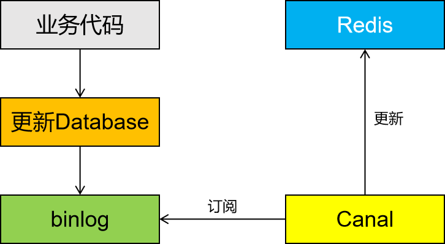

---
tags:
  - interview
  - 尚硅谷
  - Java
  - Redis
source: 尚硅谷Java技术之高频面试题-v2025.1
title: 中间件：Redis
---

# 中间件：Redis

> 来源：尚硅谷 Java 技术之高频面试题 v2025.1 · 中间件：redis

# 1. Redis是AP的还是CP的？

Redis是一个支持多种数据结构的内存数据库，它可以根据配置和使用方式在AP和CP之间做出选择。

具体来说，Redis可以在不同的场景下提供不同的一致性级别：

1. 在默认情况下，Redis追求最高的性能和可用性，更倾向于AP模型（即可用性优先）。它使用主从复制和哨兵机制来实现高可用性，但在出现网络分区或节点故障时，可能会导致数据的不一致性。
2. 但是，Redis也提供了一些支持一致性的特性，例如Redis Cluster和Redis Sentinel。通过使用这些特性，Redis可以在需要更高一致性的场景下选择CP模型（即一致性优先）。在Redis Cluster中，数据被分片存储在不同的节点上，并使用Gossip协议来保持数据的一致性。Redis Sentinel则提供了监控和自动故障转移的功能，以保证高可用性和数据的一致性。

因此，根据具体的配置和使用方式，Redis可以在AP和CP之间进行选择。

# 2. 介绍一下Redis的集群方案？

## 2.1. 主从模式

**Redis主从模式是一种经典的复制模式，用于提高数据的可用性和读取性能**。在Redis的主从模式下，一个Redis实例作为主节点（Master），负责处理所有的写操作和数据同步；而其他实例作为从节点（Slave），主要负责读操作，并实时同步主节点的数据。这种模式通过读写分离来优化性能，同时提供了一定程度的容错能力。

在配置主从结构时，可以通过三种方式实现：在配置文件中加入`slaveof {masterHost} {masterPort}`来保证持久性；在redis-server启动命令时加入`slaveof {masterHost} {masterPort}`命令；或者在Redis子节点的命令行中输入`slaveof {masterHost} {masterPort}`命令即可建立主从结构连接，输入`slaveof no one`即可断开主从结构。

主从复制的基本流程包括从节点调用`slaveof`命令开始配置主从同步关系，保存主节点的地址信息；主从节点建立TCP连接后，进行应用层的ping-pong测试以确保连接良好；如果主节点设置了密码，则需要进行密码校验；然后进行数据集的同步，首次连接会进行全量复制或部分复制；之后进入增量复制阶段，即主节点的实时复制。

为了确保连接正常，Redis提供了心跳包机制。主节点每隔10秒向从节点发送ping命令，若60秒内未收到pong响应，则认为连接异常。从节点也会每隔1秒向主节点发送特定请求，上报自身同步数据进度。

此外，当主节点故障时，需要人工干预来恢复服务。在某些情况下，如使用哨兵模式时，可以自动将从节点提升为主节点，以实现高可用性。

综上所述，Redis主从模式通过读写分离和数据同步提高了系统的可用性和性能，适用于读多写少的场景。然而，它也存在一定的局限性，如无法自动故障转移和扩展性有限等问题。因此，在选择是否使用Redis主从模式时，需要根据具体业务需求和系统环境进行综合考虑。

## 2.2. 哨兵模式

**Redis 哨兵模式（Sentinel）是用于实现高可用性的一种机制，通过监控主节点和从节点，并在主节点故障时自动进行切换，确保集群持续提供服务**。以下是对哨兵模式的详细介绍：

1. **基本组成**
  - **主节点（Master）**：提供读写服务的 Redis 实例，所有数据的写操作都由主节点处理。
  - **从节点（Slave）**：从主节点复制数据的 Redis 实例，通常用于分担读取请求。当主节点宕机时，从节点可以提升为新的主节点。
  - **哨兵（Sentinel）**：负责监控 Redis 主从节点的实例。哨兵会定期检查主节点和从节点的状态，并在主节点出现故障时，自动进行故障转移（failover），选举一个新的主节点。
2. **功能**
  - **监控**：哨兵会定期对主节点和从节点进行健康检查，判断它们是否处于正常工作状态。
  - **通知**：当主节点出现问题时，哨兵可以向管理员或其他系统发出通知。
  - **自动故障转移**：如果主节点发生故障，哨兵会在多个从节点中选举一个作为新的主节点，并将其他从节点重新配置为从新的主节点进行复制。
  - **配置提供者**：应用程序可以通过哨兵获取当前主节点的地址，这样即使发生故障转移，应用程序仍然可以通过哨兵来找到新的主节点。
3. **工作机制**
  - **健康检查**：每个哨兵会定期向主节点、从节点和其他哨兵实例发送 PING 命令，以判断这些实例是否可达。如果在规定时间内没有收到响应，哨兵会将该节点标记为主观下线（Subjectively Down，SDOWN）。
  - **主观下线与客观下线**：单个哨兵实例认为一个节点不可达为主观下线（SDOWN）；当多数哨兵实例都认为主节点不可达时，会达成共识并认为该节点确实下线，即客观下线（Objectively Down，ODOWN）。
  - **故障转移（Failover）**：当主节点被判定为 ODOWN 后，哨兵会进行故障转移操作。如果有多个哨兵实例，首先需要通过 Raft 协议选举一个领导者来执行故障转移操作。然后从可用的从节点中选择一个新的主节点，通常会选择数据最完整且与旧主节点同步延迟最小的从节点。接着将其他从节点指向新的主节点，并通知客户端更新主节点地址。
4. **优势与局限性**
  - **优势**
    - **高可用性**：在主节点发生故障时，能够自动切换到新的主节点，保证服务的连续性。
    - **自动化运维**：减少人工介入，自动完成故障转移。
    - **动态配置**：客户端可以通过哨兵获取最新的主节点信息，无需手动调整。
  - **局限性**
    - **复杂性增加**：引入哨兵增加了系统的复杂性，需要额外配置和监控哨兵本身。
    - **网络分区问题**：在网络分区的情况下，可能会发生脑裂（Split-brain）现象，导致系统不一致。
    - **依赖多哨兵**：为了实现可靠的故障检测和转移，通常需要部署多个哨兵实例，增加了运维成本。
5. **最佳实践**
  - **哨兵数量**：部署奇数个哨兵实例（至少 3 个），以确保在发生故障时能够达成共识。
  - **独立部署**：哨兵实例应尽量部署在独立的服务器上，以避免与 Redis 实例之间的相互影响。
  - **监控与报警**：定期检查哨兵的状态，并设置相应的监控和报警机制，及时发现潜在问题。
6. **搭建步骤**
  - **准备阶段**：关闭所有服务器的防火墙，修改所有服务器的 hosts 文件，Sync 其他配置。
  - **Redis 主从搭建**：安装 Redis，配置主节点和从节点的 redis.conf 文件，启动 Redis 实例，并检查主从状态。
  - **哨兵配置**：配置 sentinel.conf 文件，启动哨兵实例，查看启动状态，并进行其他注意事项的处理。

综上所述，Redis 哨兵模式是一种强大的高可用性解决方案，通过监控、通知和自动故障转移等功能，确保了 Redis 集群在主节点故障时仍能持续提供服务。然而，在实际应用中也需要注意其复杂性和局限性，并根据最佳实践进行配置和部署。

## 2.3. Redis Cluster

**Redis Cluster是一种分布式的Redis部署方案，旨在提高系统的可用性、扩展性和性能。它通过分片（sharding）的方式将数据分布在多个节点上，支持自动故障转移和动态扩展**。以下是对Redis Cluster的详细介绍：

1. **基本概念**
  - **集群（Cluster）**：由多个Redis节点组成的集合，这些节点共同提供高可用性和高性能的数据存储服务。
  - **主节点（Master Node）**：负责处理客户端请求的节点，每个主节点只负责一部分数据。
  - **从节点（Slave Node）**：复制主节点的数据，用于故障转移和读取操作。
  - **槽（Slot）**：数据分布的基本单位，Redis Cluster将整个数据集划分为16384个槽，每个主节点负责一部分槽。
2. **特点与优势**
  - **高可用性**：通过主从复制和自动故障转移机制，确保在部分节点失效时系统仍能正常工作。
  - **水平扩展**：可以动态添加或移除节点，实现无缝扩展。
  - **性能提升**：数据分布在多个节点上，可以实现更高的吞吐量和更低的延迟。
  - **去中心化**：没有单点故障，所有节点地位平等。
3. **工作原理**
  - **数据分布**：Redis Cluster使用一致性哈希算法将数据分布在不同的槽中，每个槽对应一个主节点。客户端请求会根据键的哈希值路由到相应的主节点。
  - **故障检测与转移**：哨兵机制监控各个节点的健康状态，当检测到主节点故障时，会自动将从节点提升为新的主节点，并重新分配槽。
  - **客户端交互**：客户端通过与集群中的任一节点通信来获取集群的状态信息和进行数据操作。
4. **搭建步骤**
  - **准备环境**：安装Redis，并确保所有节点之间的网络连接正常。
  - **配置节点**：在每个节点上配置redis.conf文件，指定集群模式和其他参数。
  - **启动节点**：分别启动各个节点，并使用`redis-cli --cluster create`命令创建集群。
  - **验证集群状态**：使用`redis-cli -c -h {node_ip} -p {node_port}`命令连接到集群中的任意节点，输入`cluster info`查看集群状态。
5. **注意事项**
  - **节点数量**：至少需要6个主节点才能形成稳定的集群，其中3个主节点和3个从节点。
  - **版本要求**：确保使用支持集群功能的Redis版本（3.x及以上）。
  - **持久化设置**：建议开启AOF持久化，以确保数据安全。
6. **应用场景**
  - **大规模数据存储**：适用于需要存储大量数据且访问频繁的场景。
  - **高并发应用**：适合需要高吞吐量和低延迟的应用，如电商网站、社交媒体等。
  - **弹性扩展需求**：对于需要动态扩展存储容量的应用，Redis Cluster提供了良好的解决方案。
7. **最佳实践**
  - **合理规划节点数量**：根据业务需求合理规划节点数量，避免资源浪费或不足。
  - **定期备份数据**：虽然Redis Cluster具有高可用性，但仍需定期备份数据以防万一。
  - **监控与报警**：部署监控系统，实时监控集群状态，并设置报警机制，及时发现并处理异常情况。

综上所述，Redis Cluster通过分布式架构提供了高可用性、可扩展性和高性能的数据存储解决方案。它在大规模数据处理和高并发应用场景中表现出色，但也需要合理规划和管理以确保其稳定运行。

# 3. 什么是Redis的数据分片？

Redis的数据分片是一种数据分布在多个节点上的技术，用于实现水平扩展和负载均衡。在Redis中，数据分片是通过哈希槽（Hash Slot）来实现的。

具体而言，数据分片的过程如下：

1. 哈希槽的定义：Redis将整个数据空间划分为固定数量的哈希槽，通常是16384个。每个哈希槽都有一个唯一的标识符，从0到16383。
2. 数据的映射：当客户端发送一个命令请求时，Redis Cluster通过对的哈希值进行计算，将键值对映射到一个特定的哈希槽中。这样，每个键值对就被分配到了一个特定的哈希槽中。
3. 哈希槽的分配：Redis Cluster将所有的哈希槽均匀地分配给各个节点，每个节点负责存储一部分哈希槽对应的数据。这样，数据就被分片存储在了多个节点上。
4. 数据的查找：当客户端需要访问某个键值对时，它首先计算键的哈希值，然后根据哈希值找到对应的哈希槽。客户端根据哈希槽的信息找到负责该哈希槽的节点，并将请求发送给该节点。
5. 数据的迁移：当需要添加或删除节点时，Redis Cluster会进行数据的迁移，以保持各个节点负载均衡。数据迁移的过程中，哈希槽会从一个节点移动到另一个节点，保证数据的分片均匀和一致。通过数据分片，Redis可以在多个节点上并行处理请求，提高了系统的吞吐量和容量。同时，数据分片还实现了负载均衡和故障隔离，当某个节点故障时，其他节点仍然可以继续提供服务。

总的来说，Redis的数据分片通过哈希槽的方式，将数据分布在多个节点上，实现了水平扩展、负载均衡和故障隔离。

# 4. Redis为什么这么快？

Redis之所以被认为是快速的，主要有以下几个原因：

1. 内存存储：Redis将数据存储在内存中，而不是磁盘上。相比于磁盘访问内存访问速度更快，可以实现很低的延迟和高吞吐量。
2. 单线程模型：Redis采单线程模型，避免了多线程间的竞争和上下文切换的开销。线程模型简化了并发控制，减少了锁的使用，提高了处理请求的效率。
3. 高效的数据结构：Redis提供了多种高效的数据结构，如字符串、哈希表、跳跃表、集合和有序集合等。这些数据结构在内部实现上都经过了优化，能够快速地进行插入、删除、查找和遍历操作。
4. 异步操作：Redis支持异步操作，可以在后台执行一些耗时的操作，如持久化、复制和集群的同步等。这样可以减少客户端的等待时间，提高系统的响应速度。
5. 高效的网络通信（核心）：Redis自定义的RESP协议进行网络通信，协议本身简单而高效。Redis的网络通信采用非阻塞I/O多路复用机制和事件驱动的方式，可以处理大量的并发连接，提高了系统的并发性能。
6. 优化的算法和数据结构：Redis在内部实现中使用了许多优化的算法和数据结构。例如，使用跳跃表（Skip List）来实现有序集合，使用压缩列表（ziplist）来存储小规模的列表和哈希表等。这些优化可以减少内存占用和提高数据操作的效率。

总的来说，Redis之所以快速，是因为它使用内存存储、采用单线程模型、提供高效的数据结构、支持异步操作、优化网络通信和使用优化的算法和数据结构等。这些特性使得能够在处理大量请求时保持低延迟和高吞吐量。

# 5. 请介绍一下Redis 的事务机制

在 Redis 中，事务是通过 `MULTI`、`EXEC`、`DISCARD` 和 `WATCH` 命令来实现的。以下是如何开启和使用 Redis 事务的详细步骤：

## 5.1. 启动事务

使用 `MULTI` 命令来启动一个事务。这个命令会将后续的命令放入一个事务队列中，而不是立即执行它们。

```Bash
MULTI
```

## 5.2. 添加命令到事务队列

在调用 `MULTI` 之后，你可以发送多个命令，这些命令会被放入事务队列中，但不会立即执行。

```Bash
SET key1 value1
INCR key2
```

## 5.3. 执行事务

使用 `EXEC` 命令来执行事务队列中的所有命令。如果所有命令都成功执行，那么 `EXEC` 返回每个命令的结果；如果有任何一个命令失败，那么整个事务都会被取消，`EXEC` 返回错误信息。

```Bash
EXEC
```

## 5.4. 取消事务

如果在调用 `EXEC` 之前决定不执行事务，可以使用 `DISCARD` 命令来取消事务。这会清空事务队列，并且所有在 `MULTI` 之后的命令都不会被执行。

```Bash
DISCARD
```

## 5.5. 监视键（可选）

使用 `WATCH` 命令可以监视一个或多个键。如果在调用 `EXEC` 之前这些键中的任何一个被修改了，那么事务会被取消，`EXEC` 命令会失败。这通常用于实现乐观锁。

```Bash
WATCH key1 key2
```

## 5.6. 示例

以下是一个具体的示例，展示了如何使用这些命令来开启和执行一个 Redis 事务：

```Bash
# 启动事务
MULTI

# 添加命令到事务队列
SET key1 value1
INCR key2

# 执行事务
EXEC
```

在这个示例中，`SET key1 value1` 和 `INCR key2` 这两个命令会被放入事务队列中，并在调用 `EXEC` 时一起执行。如果 `key2` 在 `EXEC` 执行之前被其他客户端修改了，那么整个事务会被取消。

## 5.7. 注意事项

- **原子性**: Redis 事务是原子性的，要么全部命令成功执行，要么全部失败。
- **隔离性**: Redis 事务是串行化的，即在一个事务执行期间，不会有其他客户端能够看到中间状态。
- **一致性**: Redis 事务保证数据库从一个一致的状态转换到另一个一致的状态。
- **持久性**: Redis 事务中的命令在 `EXEC` 执行后才会真正写入磁盘（如果开启了持久化）。

通过以上步骤和注意事项，你可以在 Redis 中有效地使用事务来确保数据的一致性和完整性。

# 6. 请介绍一下Redis的持久化机制

Redis提供了两种主要的持久化机制，分别是RDB（Redis Database File）和AOF（Append Only File）。这两种机制各有优缺点，适用于不同的场景。以下是对这两种持久化机制的详细介绍：

## 6.1. RDB（Redis Database File）持久化

1. **概述**：RDB是一种快照（Snapshot）形式的持久化方式。Redis会在指定的时间间隔内，将当前的内存数据快照保存为一个`.rdb`文件。这个文件可以用于Redis重启后的数据恢复。
2. **优点**
  - **启动速度快**：由于RDB文件是二进制的快照文件，Redis加载RDB文件的速度非常快。
  - **适合冷备份**：RDB文件是一个压缩的二进制文件，适合将其复制到其他存储介质进行长期保存，尤其是灾难恢复的场景。
  - **占用空间小**：相比AOF日志，RDB文件体积小，适合定期存储。
3. **缺点**
  - **数据丢失风险**：由于RDB是周期性保存快照的方式，如果Redis在快照之间发生宕机，最新的数据将会丢失。
  - **大数据集性能开销**：在生成快照时，Redis需要fork子进程来执行持久化操作，如果数据集较大，fork过程会消耗较多资源，可能会影响性能。
4. **配置**：RDB持久化的配置主要通过redis.conf文件中的`save`指令来设置。你可以根据需求设置保存快照的频率。

## 6.2. AOF（Append Only File）持久化

1. **概述**：AOF是一种日志记录的持久化方式。Redis通过将每一个写操作记录到日志文件中，重启时可以通过重放日志文件中的命令来恢复数据。AOF记录的文件名通常是`appendonly.aof`。
2. **优点**
  - **数据丢失最少**：AOF可以设置成每次写操作后立即同步到磁盘，数据丢失的风险非常低。
  - **日志文件可读**：AOF文件以文本格式保存，记录了所有写操作，方便审计和排查问题。
  - **重写机制**：AOF支持日志文件重写，通过定期压缩日志文件，避免日志无限增长。
3. **缺点**
  - **文件体积较大**：由于AOF记录了每一次写操作，文件体积往往比RDB文件大很多。
  - **恢复速度较慢**：AOF在重启时需要重放所有写操作，因此相较于RDB的快照恢复，速度较慢。
  - **性能开销大**：如果配置为每次写操作都同步到磁盘，AOF的性能开销较高。
4. **配置**：AOF持久化可以通过redis.conf中的以下配置项进行控制：
  - `appendonly yes`：开启AOF持久化。
  - `appendfilename "appendonly.aof"`：设置AOF文件名。
  - `appendfsync`：控制数据同步到磁盘的频率，可选值为`always`、`everysec`、`no`。

### 6.2.1. RDB与AOF对比表格

特性

RDB

AOF

持久化方式

快照形式，定期保存内存数据的快照

日志形式，记录每个写操作命令

启动速度

快，因为只需加载二进制快照文件

慢，因为需要重放所有写操作命令

数据安全性

较低，存在数据丢失风险

较高，数据丢失风险极低

文件大小

较小，因为是压缩的二进制文件

较大，因为记录了每个写操作命令

适用场景

适合冷备份和大规模数据恢复

适合数据敏感场景和实时性要求高的应用

性能开销

fork子进程时有较大性能开销，但通常较快

如果每次写操作都同步，性能开销较大

总的来说，RDB和AOF各有其优缺点，具体选择哪种持久化机制取决于业务需求。如果业务允许短暂的数据丢失，可以仅使用RDB持久化以减少性能开销；如果需要更高的可靠性，可以选择AOF，或者结合使用RDB和AOF混合模式。

# 7. 请介绍一下Redis的过期策略

Redis的过期管理策略主要包括**定时删除、惰性删除和混合策略**三种。以下是对这三种策略的具体介绍：

1. **定时删除（Fixed Interval Expiration）**
  - **原理**：为每个设置了过期时间的键创建一个定时器，当键的过期时间到达时，定时器触发并立即删除该键。
  - **优点**：这种方式可以确保内存及时释放，因为过期键一旦到达设定时间就会立刻被移除，从而避免过期数据长时间占用内存资源。
  - **缺点**：创建和管理大量定时器会消耗CPU资源，尤其是当系统中存在大量带有过期时间的键时，CPU负载可能会显著增加。此外，如果定时器的精度不够高或者执行延迟，可能会导致键在预期时间之后才被删除。
2. **惰性删除（Lazy Expiration）**
  - **原理**：只有在访问某个键时，Redis才会检查其是否已过期，如果已过期则删除该键。
  - **优点**：惰性删除不会占用额外的CPU资源进行检查，只在键被访问时才进行处理，因此对系统性能的影响较小。
  - **缺点**：如果键从未被访问，那么即使它已经过期，也会一直保留在内存中，导致内存浪费。此外，对于需要频繁访问的数据，惰性删除可能会导致短时间内大量的键被删除，从而影响系统性能。
3. **混合策略（Combined Policy）**
  - **原理**：结合定时删除和惰性删除两种策略。Redis会定期随机抽取一部分带有过期时间的键进行检查，并删除其中已过期的键；同时，在访问键时也会检查其是否已过期，如果已过期则删除该键。
  - **优点**：这种组合方式既能保证过期键及时被清理，又能尽量减少对系统性能的影响。通过合理设置扫描频率和每次扫描的耗时，可以在不同情况下平衡CPU和内存资源的使用。
  - **缺点**：虽然混合策略在一定程度上缓解了定时删除和惰性删除的缺点，但它仍然需要在CPU资源和内存资源之间做出权衡。此外，混合策略的配置可能需要根据具体的应用场景进行调整以获得最佳效果。

综上所述，Redis的过期管理策略通过定时删除、惰性删除和混合策略三种方式来管理带有过期时间的键。这些策略各有优缺点，适用于不同的场景和需求。在实际使用中，可以根据具体情况选择合适的策略或调整相关参数以达到最佳效果。

# 8. 请介绍一下Redis的内存淘汰策略

Redis的内存淘汰策略是**一种用于管理Redis实例中数据生命周期的机制，当Redis使用的内存达到预设的最大限制时，这些策略决定了哪些键值对应该被删除以释放空间**。以下是对Redis内存淘汰策略的具体介绍：

1. **noeviction**：这是Redis的默认策略（≥v3.0）。当内存使用达到最大限制时，Redis会拒绝新的写入操作，并返回错误，此时只响应读操作。这种策略适用于数据保留非常重要且不能丢失的场景，或者在内存充足的环境下使用。
2. **allkeys-lru**：在所有键中使用LRU（最近最少使用）算法进行淘汰。Redis会维护一个近似的LRU列表，虽然不完全精确，但对大多数使用场景来说是足够的。这种策略适用于缓存应用，其中需要保留最近被访问的数据以便快速响应后续的读取请求。
3. **allkeys-lfu**：在所有键中使用LFU（最不经常使用）算法进行淘汰。LFU算法根据键的访问频率来淘汰数据，访问次数最少的键优先被淘汰。这种策略适用于有明显热点数据的应用场景，可以确保热点数据不被轻易淘汰。
4. **volatile-lru**：仅在设置了过期时间的键中，基于LRU算法淘汰数据。这种策略适用于部分数据有时效性要求的场景，只针对设置了过期时间的键进行淘汰。
5. **volatile-lfu**：仅在设置了过期时间的键中，基于LFU算法淘汰数据。同样只针对设置了过期时间的键，但淘汰依据是访问频率。
6. **allkeys-random**：随机从所有key中淘汰数据。这种策略适用于对数据淘汰无特定要求的场景。
7. **volatile-random**：随机从设置了ttl key中淘汰数据。只针对设置了过期时间的键进行随机淘汰。
8. **volatile-ttl**：根据键的剩余过期时间进行淘汰，越早过期的键越先被淘汰。这种策略适用于缓存数据时效性要求严格的场景。

总的来说，Redis的内存淘汰策略提供了多种方式来管理和优化内存使用，用户可以根据具体需求选择合适的策略。在实际使用中，还需要注意监控Redis的内存使用情况，并根据需要调整相关参数以优化性能和资源利用。

# 9. 请介绍一下Redis的LRU算法

LRU 算法的全称是 Least Recently Used，从名字上就可以看出，这是按照最近最少使用的原则来筛选数据，最不常用的数据会被筛选出来，而最近频繁使用的数据会留在缓存中。

那具体是怎么筛选的呢？LRU 会把所有的数据组织成一个链表，链表的头和尾分别表示 MRU 端和 LRU端，分别代表最近最常使用的数据和最近最不常用的数据。

我们现在有数据 6、3、9、20、5。如果数据 20 和 3 被先后访问，它们都会从现有的链表位置移到 MRU端，而链表中在它们之前的数据则相应地往后移一位。因为，LRU 算法选择删除数据时，都是从 LRU 端开始，所以把刚刚被访问的数据移到 MRU 端，就可以让它们尽可能地留在缓存中。

如果有一个新数据 15 要被写入缓存，但此时已经没有缓存空间了，也就是链表没有空余位置了，那么LRU 算法做两件事：

数据 15 是刚被访问的，所以它会被放到 MRU 端；

算法把 LRU 端的数据 5 从缓存中删除，相应的链表中就没有数据 5 的记录了。

其实，LRU 算法背后的想法非常朴素：它认为刚刚被访问的数据，肯定还会被再次访问，所以就把它放在 MRU 端；长久不访问的数据，肯定就不会再被访问了，所以就让它逐渐后移到 LRU 端，在缓存满时，就优先删除它。

不过，LRU 算法在实际实现时，需要用链表管理所有的缓存数据，这会带来额外的空间开销。而且，当有数据被访问时，需要在链表上把该数据移动到 MRU 端，如果有大量数据被访问，就会带来很多链表移动操作，会很耗时，进而会降低 Redis 缓存性能。所以，在 Redis 中，LRU 算法被做了简化，以减轻数据淘汰对缓存性能的影响，Redis 默认会记录每个数据的最近一次访问的时间戳（由键值对数据结构 RedisObject 中的 lru 字段记录）。然后，Redis 在决定淘汰的数据时，第一次会随机选出 N 个数据，把它们作为一个候选集合。接下来，Redis 会比较这 N 个数据的 lru 字段，把 lru 字段值最小的数据从缓存中淘汰出去。

当需要再次淘汰数据时，Redis 需要挑选数据进入第一次淘汰时创建的候选集合。这儿的挑选标准是：能进入候选集合的数据的 lru 字段值必须小于候选集合中最小的 lru 值。当有新数据进入候选数据集后，如果候选数据集中的数据个数达到了 maxmemory-samples，Redis 就把候选数据集中 lru 字段值最小的数据淘汰出去。这样一来，Redis 缓存不用为所有的数据维护一个大链表，也不用在每次数据访问时都移动链表项，提升了缓存的性能。

# 10. 对Redis的淘汰策略的选择这个问题你有什么建议？

我的建议是：优先使用 allkeys-lru 策略。

这样，可以充分利用 LRU 这一经典缓存算法的优势，把最近最常访问的数据留在缓存中，提升应用的访问性能。

如果你的业务数据中有明显的冷热数据区分，我建议你使用 allkeys-lru 策略。

如果业务应用中的数据访问频率相差不大，没有明显的冷热数据区分，建议使用 allkeys-random 策略，随机选择淘汰的数据就行。

如果你的业务中有置顶的需求，比如置顶新闻、置顶视频，那么，可以使用 volatile-lru 策略，同时不给这些置顶数据设置过期时间。

这样一来，这些需要置顶的数据一直不会被删除。

# 11. 什么是热Key问题，如何解决热key问题

热Key问题是指在**短时间内大量请求集中访问Redis中的某个特定键，导致该键所在的节点负载过高，从而影响整个集群的性能和稳定性**。解决热Key问题可以通过以下几种方法：

1. **限流**：对特定的slot或者热key进行限流，这是一种简单直接的方法。通过限制单位时间内对热key的访问次数，可以有效减轻服务器的压力。但这种方法会对业务造成一定的影响，因此一般只在紧急情况下使用。
2. **本地缓存**：在应用层增加本地缓存（如Guava Cache），将热点数据存储在本地内存中。这样可以减少对Redis的频繁访问，降低Redis集群的负载。同时，本地缓存还可以设置过期时间，以保证数据的一致性。
3. **拆key**：将一个大的热点key拆分成多个小的key，分散到不同的节点上。这样可以有效避免单个节点负载过高的问题。例如，可以将一个大的List拆分成多个小的List，每个小List使用不同的key存储。

总的来说，热Key问题是Redis集群中常见的性能瓶颈之一。通过合理的监控、发现和处理热Key问题，可以有效提升Redis集群的稳定性和性能。

# 12. 什么是大Key问题，如何解决？

大Key问题是指在**Redis中存储的某个键值对占用了过多的内存，导致该键所在的节点负载过高，从而影响整个集群的性能和稳定性**。解决大Key问题可以通过以下几种方法：

1. **拆分大Key**：将一个大的Key拆分成多个小的Key。例如，如果一个大List或大Hash表占用了大量内存，可以将其拆分成多个小的List或Hash表，每个小的List或Hash表使用不同的Key存储。这样可以有效分散内存占用，避免单个节点负载过高的问题。
2. **压缩数据**：对于存储在Redis中的大对象，可以考虑使用压缩算法进行压缩后再存储。这样可以减少内存占用，但需要注意的是，压缩和解压缩操作会增加CPU的负担，因此需要根据实际情况权衡。
3. **优化数据结构**：选择合适的数据结构来存储数据。例如，如果需要存储大量的有序数据，可以使用Sorted Set而不是List。Sorted Set在存储大量数据时比List更节省内存。
4. **定期清理**：对于一些临时性的大Key，可以在业务逻辑中设置合理的过期时间，让Redis自动清理这些大Key。同时，也可以定期扫描Redis中的大Key并进行清理。

总的来说，大Key问题是Redis集群中常见的性能瓶颈之一。通过合理的监控、发现和处理大Key问题，可以有效提升Redis集群的稳定性和性能。

# 13. 什么是缓存击穿、缓存穿透、缓存雪崩？

缓存击穿是指**在高并发情况下，当一个热点key过期时，大量请求同时访问这个key，导致这些请求都直接穿透到数据库进行查询**。

缓存穿透是指**用户查询的数据在缓存中不存在且在数据库中也不存在**。

缓存雪崩是指**当Redis实例宕机或大量缓存数据同时失效时，大量请求直接打到数据库上，导致数据库压力骤增甚至崩溃**。

## 13.1. 缓存击穿解决方案

1. **设置热点数据永不过期**：对于一些频繁访问的热点数据，可以设置为永不过期，这样即使缓存失效，仍然能从缓存中获取到数据。
2. **使用互斥锁或分布式锁**：在缓存失效的瞬间，通过互斥锁或分布式锁来保证只有一个线程去访问数据库，其他线程等待该线程从数据库中加载数据并更新缓存后再获取。
3. **异步更新缓存**：当缓存失效时，先返回旧的缓存数据，然后异步地去更新缓存。这样可以保证用户快速获取到数据，同时避免大量请求直接访问数据库。
4. **布隆过滤器**：布隆过滤器可以用于快速判断一个元素是否存在于缓存中。当一个请求到来时，先通过布隆过滤器判断是否存在于缓存中，如果不存在，直接返回缓存不存在，避免访问数据库。

## 13.2. 缓存穿透解决方案

1. **缓存空对象**：当查询的数据在缓存和数据库中都不存在时，可以将这个键对应的值设置为null并放入缓存中，并设置一个较短的过期时间。下次再接收到同样的查询请求时，若命中缓存并且值为null，就会直接返回，不会透传到数据库。
2. **参数校验**：对输入的参数进行过滤，例如，如果我们使用ID进行查询，则可以对ID的格式进行分析，如果不符合产生ID的规则，就直接拒绝，或者在ID上放入时间信息，根据时间信息判断ID是否合法。
3. **布隆过滤器**：布隆过滤器是一种空间效率很高的概率型数据结构，可以快速判断一个元素是否存在于集合中。当要查询的元素不在布隆过滤器中时，直接返回不存在，避免访问数据库。

## 13.3. 缓存雪崩解决方案

1. **分散缓存过期时间**：为不同的数据设置不同的过期时间，或者在原有的过期时间基础上增加一个随机值，避免大量缓存在同一时间失效。
2. **缓存预热**：在系统上线前，预先加载可能会被大量访问的数据到缓存中，减少缓存未命中的情况。
3. **多级缓存**：使用本地缓存和分布式缓存相结合的方式，当分布式缓存失效时，本地缓存可以作为备份，减少对数据库的直接压力。
4. **限流和降级**：在高并发情况下，限制请求频率，保证系统在承受范围内运行。当发生缓存雪崩时，可以提供默认数据或访问服务的内存数据，避免数据库遭受巨大压力。

总的来说，通过合理地监控、发现和处理这些问题，可以有效提升Redis集群的稳定性和性能。

# 14. 什么情况下会出现数据库和缓存不一致的问题？

数据库和缓存不一致的问题可能会出现在以下几种情况下：

1. 写操作未更新缓存：当应用程序对数据库进行写操作时，如果没有及时更新相关的缓存数据，就会导致数据库和缓存的数据不一致。这通常发生在缓存和数据库的更新操作没有保持同步的情况下。
2. 缓存过期和数据库更新：当缓存中的数据过期时，如果此时有大量的并发请求查询该数据，而后端数据库正在进行更新操作，就有可能导致缓存中的旧数据被读取，与数据库中的新数据不一致。
3. 多级缓存不一致：在多级缓存架构中，不同层级的缓存可能会出现数据不一致的情况。例如，一级缓存（本地缓存）和二级缓存（分布式缓存）之间的数据同步问题，如果没有及时更新或失效旧的缓存数据，就会导致数据库和缓存数据的不一致。
4. 数据库异常和缓存更新失败：当数据库发生异常或写操作失败时，如果缓存更新操作也失败了，就会导致数据库和缓存的数据不一致。例如，数据库写操作成功了，但是缓存更新失败，导致缓存中的数据是旧的或不一致的。

最终一句话：不管哪种方式，在**高并发（读读 读写）**情况下都可能导致数据库数据和缓存数据不一致问题。

# 15. 如何解决Redis和数据库的一致性问题？

## 15.1. 方案一：双写策略

双写策略是一种常见的解决Redis和MySQL之间数据不一致问题的方法。它的核心思想是在更新数据时，同时更新Redis缓存和MySQL数据库，以确保两者的数据保持一致。以下是详细的步骤和注意事项：

### 15.1.1. 1. 更新数据时的流程

- **更新Redis**：首先将数据写入Redis缓存中。这一步是为了确保后续的读取操作能够快速获取到最新的数据。
- **更新MySQL**：然后更新MySQL数据库中的数据。这一步是为了确保数据的持久化存储，防止数据丢失。

### 15.1.2. 2. 实现细节

#### 15.1.2.1. 2.1 使用事务

为了确保Redis和MySQL的更新操作要么都成功，要么都失败，可以使用分布式事务或两阶段提交协议。但是，由于Redis不支持传统的分布式事务，因此需要采用其他方式来保证一致性。

#### 15.1.2.2. 2.2 重试机制

在实际应用中，可能会遇到网络故障、服务宕机等异常情况，导致Redis或MySQL的更新操作失败。因此，需要设计一个重试机制，当更新操作失败时，能够自动重试一定次数，直到成功为止。

#### 15.1.2.3. 2.3 幂等性

为了保证重试机制的有效性，更新操作需要是幂等的，即多次执行相同的操作不会产生不同的结果。例如，在更新MySQL时，可以使用唯一约束或乐观锁来避免重复更新。

### 15.1.3. 3. 示例代码

以下是一个基于Java的示例代码，展示了如何使用双写策略来更新Redis和MySQL中的数据：

```Java
public class DataService {
    private RedisTemplate<String, Object> redisTemplate;
    private JdbcTemplate jdbcTemplate;

    public void updateData(String key, Object newValue) {
        // 更新Redis
        boolean redisUpdated = false;
        try {
            redisTemplate.opsForValue().set(key, newValue);
            redisUpdated = true;
        } catch (Exception e) {
            // 处理Redis更新失败的情况
        }

        // 更新MySQL
        boolean mysqlUpdated = false;
        try {
            String sql = "UPDATE table_name SET column_name = ? WHERE key_column = ?";
            jdbcTemplate.update(sql, newValue, key);
            mysqlUpdated = true;
        } catch (Exception e) {
            // 处理MySQL更新失败的情况
        }

        // 如果Redis或MySQL更新失败，进行重试或其他补偿措施
        if (!redisUpdated || !mysqlUpdated) {
            // 实现重试逻辑或补偿措施
        }
    }
}
```

### 15.1.4. 4. 注意事项

- **性能影响**：双写策略会增加系统的写操作负担，因为每次更新都需要同时更新Redis和MySQL。因此，需要评估系统的性能瓶颈，并采取相应的优化措施。
- **数据一致性**：虽然双写策略可以在一定程度上保证数据的一致性，但在极端情况下（如网络分区、服务宕机等），仍然可能导致短暂的数据不一致。因此，需要结合业务场景选择合适的一致性模型。
- **错误处理**：在实际应用中，需要对Redis和MySQL的更新操作进行详细的错误处理和日志记录，以便及时发现和解决问题。

综上所述，双写策略是一种有效的解决Redis和MySQL之间数据不一致问题的方法，但需要在具体实现中注意性能、一致性和错误处理等方面的问题。

## 15.2. 方案二：延时双删

延时双删策略是一种解决Redis和MySQL之间数据不一致问题的方法。它的核心思想是在更新数据时，先删除缓存中的数据，然后更新数据库中的数据，最后再删除一次缓存中的数据。通过这种方式，可以确保在高并发情况下数据的一致性。以下是详细的步骤和注意事项：

### 15.2.1. 1. 更新数据时的流程

- **删除缓存**：首先删除Redis缓存中的数据。这一步是为了确保后续的读取操作不会命中旧的数据。
- **更新数据库**：然后更新MySQL数据库中的数据。这一步是为了确保数据的持久化存储，防止数据丢失。
- **延时删除缓存**：在更新数据库后，等待一段时间（如几百毫秒），再次删除Redis缓存中的数据。这一步是为了确保在高并发情况下，其他线程不会立即读取到旧的数据。

### 15.2.2. 2. 实现细节

#### 15.2.2.1. 2.1 延时机制

为了确保数据的一致性，需要在更新数据库后等待一段时间再删除缓存。这个等待时间需要根据具体的业务场景和系统性能来调整。一般来说，等待时间越长，数据的一致性越高，但系统的响应速度可能会受到影响。

#### 15.2.2.2. 2.2 重试机制

在实际应用中，可能会遇到网络故障、服务宕机等异常情况，导致Redis或MySQL的更新操作失败。因此，需要设计一个重试机制，当更新操作失败时，能够自动重试一定次数，直到成功为止。

#### 15.2.2.3. 2.3 幂等性

为了保证重试机制的有效性，更新操作需要是幂等的，即多次执行相同的操作不会产生不同的结果。例如，在更新MySQL时，可以使用唯一约束或乐观锁来避免重复更新。

### 15.2.3. 3. 示例代码

以下是一个基于Java的示例代码，展示了如何使用延时双删策略来更新Redis和MySQL中的数据：

```Java
public class DataService {
    private RedisTemplate<String, Object> redisTemplate;
    private JdbcTemplate jdbcTemplate;

    public void updateData(String key, Object newValue) {
        // 删除缓存
        try {
            redisTemplate.delete(key);
        } catch (Exception e) {
            // 处理Redis删除失败的情况
        }

        // 更新数据库
        try {
            String sql = "UPDATE table_name SET column_name = ? WHERE key_column = ?";
            jdbcTemplate.update(sql, newValue, key);
        } catch (Exception e) {
            // 处理MySQL更新失败的情况
            return;
        }

        // 延时删除缓存
        try {
            Thread.sleep(200); // 延时200毫秒
            redisTemplate.delete(key);
        } catch (InterruptedException e) {
            // 处理线程中断异常
        } catch (Exception e) {
            // 处理Redis删除失败的情况
        }
    }
}
```

### 15.2.4. 4. 注意事项

- **性能影响**：延时双删策略会增加系统的写操作负担，因为每次更新都需要进行两次删除操作。因此，需要评估系统的性能瓶颈，并采取相应的优化措施。
- **数据一致性**：虽然延时双删策略可以在一定程度上保证数据的一致性，但在极端情况下（如网络分区、服务宕机等），仍然可能导致短暂的数据不一致。因此，需要结合业务场景选择合适的一致性模型。
- **错误处理**：在实际应用中，需要对Redis和MySQL的更新操作进行详细的错误处理和日志记录，以便及时发现和解决问题。

综上所述，延时双删策略是一种有效的解决Redis和MySQL之间数据不一致问题的方法，但需要在具体实现中注意性能、一致性和错误处理等方面的问题。

## 15.3. 方案三：先更新数据库，再删除缓存

基于“先更新数据库，再删除缓存”的策略来解决Redis和MySQL之间数据不一致问题是一种常见的方法。它的核心思想是确保在更新数据时，数据库中的数据总是最新的，然后删除缓存中的数据，以确保后续的读取操作不会命中旧的数据。以下是详细的步骤和注意事项：

### 15.3.1. 1. 更新数据时的流程

- **更新数据库**：首先更新MySQL数据库中的数据。这一步是为了确保数据的持久化存储，防止数据丢失。
- **删除缓存**：然后删除Redis缓存中的数据。这一步是为了确保后续的读取操作不会命中旧的数据。

### 15.3.2. 2. 实现细节

#### 15.3.2.1. 2.1 事务管理

为了确保数据库和缓存的更新操作要么都成功，要么都失败，可以使用分布式事务或两阶段提交协议。但是，由于Redis不支持传统的分布式事务，因此需要采用其他方式来保证一致性。

#### 15.3.2.2. 2.2 重试机制

在实际应用中，可能会遇到网络故障、服务宕机等异常情况，导致Redis或MySQL的更新操作失败。因此，需要设计一个重试机制，当更新操作失败时，能够自动重试一定次数，直到成功为止。

#### 15.3.2.3. 2.3 幂等性

为了保证重试机制的有效性，更新操作需要是幂等的，即多次执行相同的操作不会产生不同的结果。例如，在更新MySQL时，可以使用唯一约束或乐观锁来避免重复更新。

### 15.3.3. 3. 示例代码

以下是一个基于Java的示例代码，展示了如何使用“先更新数据库，再删除缓存”的策略来更新Redis和MySQL中的数据：

```Java
public class DataService {
    private RedisTemplate<String, Object> redisTemplate;
    private JdbcTemplate jdbcTemplate;

    public void updateData(String key, Object newValue) {
        // 更新数据库
        try {
            String sql = "UPDATE table_name SET column_name = ? WHERE key_column = ?";
            jdbcTemplate.update(sql, newValue, key);
        } catch (Exception e) {
            // 处理MySQL更新失败的情况
            return;
        }

        // 删除缓存
        try {
            redisTemplate.delete(key);
        } catch (Exception e) {
            // 处理Redis删除失败的情况
        }
    }
}
```

### 15.3.4. 4. 注意事项

- **性能影响**：先更新数据库，再删除缓存会增加系统的写操作负担，因为每次更新都需要进行一次数据库操作和一次缓存删除操作。因此，需要评估系统的性能瓶颈，并采取相应的优化措施。
- **数据一致性**：虽然先更新数据库，再删除缓存可以在一定程度上保证数据的一致性，但在极端情况下（如网络分区、服务宕机等），仍然可能导致短暂的数据不一致。因此，需要结合业务场景选择合适的一致性模型。
- **错误处理**：在实际应用中，需要对Redis和MySQL的更新操作进行详细的错误处理和日志记录，以便及时发现和解决问题。

综上所述，先更新数据库，再删除缓存是一种有效的解决Redis和MySQL之间数据不一致问题的方法，但需要在具体实现中注意性能、一致性和错误处理等方面的问题。

## 15.4. 方案四：先更新数据库，再删除缓存

基于“先更新数据库，再删除缓存”的策略来解决Redis和MySQL之间数据不一致问题是一种常见的方法。它的核心思想是确保在更新数据时，数据库中的数据总是最新的，然后删除缓存中的数据，以确保后续的读取操作不会命中旧的数据。以下是详细的步骤和注意事项：

### 15.4.1. 1. 更新数据时的流程

- **更新数据库**：首先更新MySQL数据库中的数据。这一步是为了确保数据的持久化存储，防止数据丢失。
- **删除缓存**：然后删除Redis缓存中的数据。这一步是为了确保后续的读取操作不会命中旧的数据。

### 15.4.2. 2. 实现细节

#### 15.4.2.1. 2.1 事务管理

为了确保数据库和缓存的更新操作要么都成功，要么都失败，可以使用分布式事务或两阶段提交协议。但是，由于Redis不支持传统的分布式事务，因此需要采用其他方式来保证一致性。

#### 15.4.2.2. 2.2 重试机制

在实际应用中，可能会遇到网络故障、服务宕机等异常情况，导致Redis或MySQL的更新操作失败。因此，需要设计一个重试机制，当更新操作失败时，能够自动重试一定次数，直到成功为止。

#### 15.4.2.3. 2.3 幂等性

为了保证重试机制的有效性，更新操作需要是幂等的，即多次执行相同的操作不会产生不同的结果。例如，在更新MySQL时，可以使用唯一约束或乐观锁来避免重复更新。

### 15.4.3. 3. 示例代码

以下是一个基于Java的示例代码，展示了如何使用“先更新数据库，再删除缓存”的策略来更新Redis和MySQL中的数据：

```Java
public class DataService {
    private RedisTemplate<String, Object> redisTemplate;
    private JdbcTemplate jdbcTemplate;

    public void updateData(String key, Object newValue) {
        // 更新数据库
        try {
            String sql = "UPDATE table_name SET column_name = ? WHERE key_column = ?";
            jdbcTemplate.update(sql, newValue, key);
        } catch (Exception e) {
            // 处理MySQL更新失败的情况
            return;
        }

        // 删除缓存
        try {
            redisTemplate.delete(key);
        } catch (Exception e) {
            // 处理Redis删除失败的情况
        }
    }
}
```

### 15.4.4. 4. 注意事项

- **性能影响**：先更新数据库，再删除缓存会增加系统的写操作负担，因为每次更新都需要进行一次数据库操作和一次缓存删除操作。因此，需要评估系统的性能瓶颈，并采取相应的优化措施。
- **数据一致性**：虽然先更新数据库，再删除缓存可以在一定程度上保证数据的一致性，但在极端情况下（如网络分区、服务宕机等），仍然可能导致短暂的数据不一致。因此，需要结合业务场景选择合适的一致性模型。
- **错误处理**：在实际应用中，需要对Redis和MySQL的更新操作进行详细的错误处理和日志记录，以便及时发现和解决问题。

综上所述，先更新数据库，再删除缓存是一种有效的解决Redis和MySQL之间数据不一致问题的方法，但需要在具体实现中注意性能、一致性和错误处理等方面的问题。

## 15.5. 方案五：先删除缓存，再更新数据库

基于“先删除缓存，再更新数据库”的策略来解决Redis和MySQL之间数据不一致问题是一种常见的方法。它的核心思想是确保在更新数据时，先删除缓存中的数据，然后再更新数据库中的数据。这种方法可以在一定程度上避免数据不一致的问题，但需要特别注意操作的顺序和可能的异常情况。以下是详细的步骤和注意事项：

### 15.5.1. 1. 更新数据时的流程

- **删除缓存**：首先删除Redis缓存中的数据。这一步是为了确保后续的读取操作不会命中旧的数据。
- **更新数据库**：然后更新MySQL数据库中的数据。这一步是为了确保数据的持久化存储，防止数据丢失。

### 15.5.2. 2. 实现细节

#### 15.5.2.1. 2.1 事务管理

为了确保数据库和缓存的更新操作要么都成功，要么都失败，可以使用分布式事务或两阶段提交协议。但是，由于Redis不支持传统的分布式事务，因此需要采用其他方式来保证一致性。

#### 15.5.2.2. 2.2 重试机制

在实际应用中，可能会遇到网络故障、服务宕机等异常情况，导致Redis或MySQL的更新操作失败。因此，需要设计一个重试机制，当更新操作失败时，能够自动重试一定次数，直到成功为止。

#### 15.5.2.3. 2.3 幂等性

为了保证重试机制的有效性，更新操作需要是幂等的，即多次执行相同的操作不会产生不同的结果。例如，在更新MySQL时，可以使用唯一约束或乐观锁来避免重复更新。

### 15.5.3. 3. 示例代码

以下是一个基于Java的示例代码，展示了如何使用“先删除缓存，再更新数据库”的策略来更新Redis和MySQL中的数据：

```Java
public class DataService {
    private RedisTemplate<String, Object> redisTemplate;
    private JdbcTemplate jdbcTemplate;

    public void updateData(String key, Object newValue) {
        // 删除缓存
        try {
            redisTemplate.delete(key);
        } catch (Exception e) {
            // 处理Redis删除失败的情况
        }

        // 更新数据库
        try {
            String sql = "UPDATE table_name SET column_name = ? WHERE key_column = ?";
            jdbcTemplate.update(sql, newValue, key);
        } catch (Exception e) {
            // 处理MySQL更新失败的情况
            return;
        }
    }
}
```

### 15.5.4. 4. 注意事项

- **性能影响**：先删除缓存，再更新数据库会增加系统的写操作负担，因为每次更新都需要进行一次缓存删除操作和一次数据库更新操作。因此，需要评估系统的性能瓶颈，并采取相应的优化措施。
- **数据一致性**：虽然先删除缓存，再更新数据库可以在一定程度上保证数据的一致性，但在极端情况下（如网络分区、服务宕机等），仍然可能导致短暂的数据不一致。因此，需要结合业务场景选择合适的一致性模型。
- **错误处理**：在实际应用中，需要对Redis和MySQL的更新操作进行详细的错误处理和日志记录，以便及时发现和解决问题。

综上所述，先删除缓存，再更新数据库是一种有效的解决Redis和MySQL之间数据不一致问题的方法，但需要在具体实现中注意性能、一致性和错误处理等方面的问题。

## 15.6. 方案六：缓存失效机制

基于“缓存失效机制”来解决Redis和MySQL之间数据不一致问题是一种常见的方法。它的核心思想是利用缓存的失效机制来确保数据的一致性，而不是通过复杂的同步策略来保证。以下是详细的步骤和注意事项：

### 15.6.1. 1. 更新数据时的流程

- **更新数据库**：首先更新MySQL数据库中的数据。这一步是为了确保数据的持久化存储，防止数据丢失。
- **设置缓存失效**：然后设置Redis缓存中的数据为失效状态。这一步是为了确保后续的读取操作不会命中旧的数据。

### 15.6.2. 2. 实现细节

#### 15.6.2.1. 2.1 缓存失效策略

缓存失效策略可以有多种选择，如定时失效、主动失效等。定时失效是指缓存数据在设定的时间后自动失效；主动失效是指当数据发生变化时，立即使相关的缓存失效。

#### 15.6.2.2. 2.2 重试机制

在实际应用中，可能会遇到网络故障、服务宕机等异常情况，导致Redis或MySQL的更新操作失败。因此，需要设计一个重试机制，当更新操作失败时，能够自动重试一定次数，直到成功为止。

#### 15.6.2.3. 2.3 幂等性

为了保证重试机制的有效性，更新操作需要是幂等的，即多次执行相同的操作不会产生不同的结果。例如，在更新MySQL时，可以使用唯一约束或乐观锁来避免重复更新。

### 15.6.3. 3. 示例代码

以下是一个基于Java的示例代码，展示了如何使用缓存失效机制来更新Redis和MySQL中的数据：

```Java
public class DataService {
    private RedisTemplate<String, Object> redisTemplate;
    private JdbcTemplate jdbcTemplate;

    public void updateData(String key, Object newValue) {
        // 更新数据库
        try {
            String sql = "UPDATE table_name SET column_name = ? WHERE key_column = ?";
            jdbcTemplate.update(sql, newValue, key);
        } catch (Exception e) {
            // 处理MySQL更新失败的情况
            return;
        }

        // 设置缓存失效
        try {
            redisTemplate.delete(key);
        } catch (Exception e) {
            // 处理Redis删除失败的情况
        }
    }
}
```

### 15.6.4. 4. 注意事项

- **性能影响**：使用缓存失效机制会增加系统的写操作负担，因为每次更新都需要进行一次数据库操作和一次缓存失效操作。因此，需要评估系统的性能瓶颈，并采取相应的优化措施。
- **数据一致性**：虽然缓存失效机制可以在一定程度上保证数据的一致性，但在极端情况下（如网络分区、服务宕机等），仍然可能导致短暂的数据不一致。因此，需要结合业务场景选择合适的一致性模型。
- **错误处理**：在实际应用中，需要对Redis和MySQL的更新操作进行详细的错误处理和日志记录，以便及时发现和解决问题。

综上所述，缓存失效机制是一种有效的解决Redis和MySQL之间数据不一致问题的方法，但需要在具体实现中注意性能、一致性和错误处理等方面的问题。

## 15.7. 方案七：异步更新缓存

基于“异步更新缓存”来解决Redis和MySQL之间的数据不一致问题是一种常见的策略，特别是在高并发、高性能的场景下。这种方法的核心思想是先更新MySQL数据库，然后通过异步机制将变更同步到Redis缓存，从而保证数据的最终一致性。以下是详细的步骤和注意事项：

### 15.7.1. 1. 更新数据时的流程

- **更新MySQL数据库**：首先更新MySQL数据库中的数据。这一步是为了确保数据的持久化存储，防止数据丢失。
- **设置缓存失效或删除缓存**：在更新MySQL数据库后，可以选择立即删除Redis缓存中的相关数据，或者设置缓存为失效状态（例如，使用较短的过期时间）。这样做的目的是确保后续的读取操作不会命中旧的缓存数据。
- **异步更新Redis**：通过消息队列或其他异步机制，将MySQL数据库的变更信息推送到Redis，以更新缓存中的数据。这一步可以是实时的，也可以是近实时的，具体取决于业务场景对数据一致性的要求。

### 15.7.2. 2. 实现细节

#### 15.7.2.1. 2.1 消息队列

- 可以使用消息队列（如Kafka、RabbitMQ等）来实现MySQL和Redis之间的异步通信。当MySQL中的数据发生变化时，将变更信息发送到消息队列中。
- 消费者程序从消息队列中取出变更信息，并更新Redis缓存。

#### 15.7.2.2. 2.2 Canal监听binlog

- 利用Canal等工具监听MySQL的binlog日志，实时捕获数据库的变更事件。
- 将捕获到的变更事件发送到消息队列或直接更新Redis缓存。

#### 15.7.2.3. 2.3 重试机制与幂等性

- 由于网络故障、服务宕机等原因，可能会导致消息消费失败或部分成功。因此，需要设计重试机制，确保消息最终被成功消费。
- 同时，为了保证数据的一致性，更新操作需要具备幂等性，即多次执行相同的操作不会产生不同的结果。

### 15.7.3. 3. 示例代码

以下是一个基于Java和RabbitMQ的简单示例代码，展示了如何实现异步更新缓存：

```Java
public class DataService {
    private JdbcTemplate jdbcTemplate;
    private RabbitTemplate rabbitTemplate;

    public void updateData(String key, Object newValue) {
        // 更新数据库
        String sql = "UPDATE table_name SET column_name = ? WHERE key_column = ?";
        jdbcTemplate.update(sql, newValue, key);

        // 发送消息到RabbitMQ
        rabbitTemplate.convertAndSend("redis-update-queue", new UpdateMessage(key, newValue));
    }
}

@Component
public class RedisUpdateListener {
    @RabbitListener(queues = "redis-update-queue")
    public void handleUpdateMessage(UpdateMessage message) {
        // 更新Redis缓存
        redisTemplate.opsForValue().set(message.getKey(), message.getValue());
    }
}
```

### 15.7.4. 4. 注意事项

- **性能影响**：异步更新缓存会增加系统的写操作负担，因为每次更新都需要进行一次数据库操作和一次消息发送操作。因此，需要评估系统的性能瓶颈，并采取相应的优化措施。
- **数据一致性**：虽然异步更新缓存可以实现最终一致性，但在极端情况下（如网络分区、服务宕机等），仍然可能导致短暂的数据不一致。因此，需要结合业务场景选择合适的一致性模型。
- **错误处理**：在实际应用中，需要对Redis和MySQL的更新操作进行详细的错误处理和日志记录，以便及时发现和解决问题。

综上所述，基于“异步更新缓存”是一种有效的解决Redis和MySQL之间数据不一致问题的方法，但需要在具体实现中注意性能、一致性和错误处理等方面的问题。

## 15.8. 方案八：基于Canal中间件

基于Canal中间件来解决Redis和MySQL之间的数据不一致问题，是一种非常有效的方法。Canal是阿里巴巴开源的一个项目，它通过模拟MySQL的Slave协议，伪装成MySQL的从服务器，实时监控MySQL数据库的二进制日志（binlog），并将这些变更数据同步到其他存储系统，如Redis、Elasticsearch等。以下是详细的介绍：

1. **Canal的原理**
  - **模拟MySQL从库**：Canal模拟了MySQL的Slave协议，向MySQL主库发送dump协议。
  - **监听binlog**：MySQL主库收到dump请求后，开始推送binary log给Canal。
  - **解析binlog**：Canal解析这些binlog对象（原始为byte流）。
2. **搭建Canal的步骤**
  - **配置MySQL以支持binlog日志**：确保MySQL服务器配置了binlog并且是ROW模式，因为Canal依赖于binlog来捕获数据变化。
  - **创建Canal用户并配置权限**：为Canal创建一个专门的数据库用户，并赋予它必要的复制和查询权限。
  - **安装和配置Canal服务**：下载Canal的安装包，解压并配置Canal实例，修改`instance.properties`文件，设置正确的MySQL连接信息。
  - **启动Canal服务并确保其稳定运行**：启动Canal服务后，通过监控工具或API检查服务状态，确保Canal能够正确接收并解析binlog。
3. **实现数据同步的代码示例**
  - **监听MySQL binlog变化**：可以使用Java编写一个监听器来监听MySQL binlog的变化。
  - **将变化的数据写入Redis**：当监听到MySQL binlog发生变化时，将变化的数据异步写入Redis中。
4. **注意事项**
  - **数据格式转换**：在将MySQL数据同步到Redis时，需要考虑数据格式的转换。
  - **数据冲突处理**：需要处理可能出现的数据冲突问题。
  - **性能影响**：使用Canal会增加系统的写操作负担，因为每次更新都需要进行一次数据库操作和一次消息发送操作。因此，需要评估系统的性能瓶颈，并采取相应的优化措施。
  - **错误处理**：在实际应用中，需要对Redis和MySQL的更新操作进行详细的错误处理和日志记录，以便及时发现和解决问题。

综上所述，基于Canal中间件来解决Redis和MySQL之间的数据不一致问题是一种有效的方法。通过合理配置和使用Canal，可以实现数据的实时同步和一致性保障。



# 16. Redis如何实现延迟消息？

Redis本身不直接支持延迟消息队列，但可以通过一些技巧和工具来实现类似的功能。以下是几种常见的方法：

## 16.1. 1. 使用Sorted Set（有序集合）

Redis的Sorted Set数据结构可以用来实现延迟消息队列。具体步骤如下：

- **添加消息**：将消息添加到Sorted Set中，分数（score）设置为消息的执行时间戳。
- **轮询检查**：定期轮询Sorted Set，取出当前时间之前的消息进行处理。

### 16.1.1. 示例代码（Python）：

```Python
import redis
import time

r = redis.StrictRedis(host='localhost', port=6379, db=0)

def add_delayed_message(queue_name, message, delay):
    execute_at = int(time.time()) + delay
    r.zadd(queue_name, {message: execute_at})

def process_delayed_messages(queue_name):
    now = int(time.time())
    messages = r.zrangebyscore(queue_name, 0, now)
    if messages:
        r.zremrangebyscore(queue_name, 0, now)
        for message in messages:
            print(f"Processing message: {message}")
            # 在这里处理消息

# 添加一个延迟5秒的消息
add_delayed_message('my_delayed_queue', 'Hello, World!', 5)

# 模拟轮询处理消息
while True:
    process_delayed_messages('my_delayed_queue')
    time.sleep(1)
```

## 16.2. 2. 使用Redis Streams和Lua脚本

Redis Streams是Redis 5.0引入的一种新数据类型，可以用于构建复杂的消息队列系统。结合Lua脚本可以实现延迟消息的功能。

### 16.2.1. 示例代码（Python）：

```Python
import redis
import time

r = redis.StrictRedis(host='localhost', port=6379, db=0)

def add_delayed_message(stream_name, message, delay):
    execute_at = int(time.time()) + delay
    r.xadd(stream_name, {'message': message, 'execute_at': execute_at})

def process_delayed_messages(stream_name):
    now = int(time.time())
    messages = r.xread({stream_name: '0'}, count=10, block=0)
    if messages:
        for stream, msgs in messages:
            for msg_id, msg in msgs:
                if int(msg['execute_at']) <= now:
                    print(f"Processing message: {msg['message']}")
                    # 在这里处理消息
                    r.xdel(stream_name, msg_id)

# 添加一个延迟5秒的消息
add_delayed_message('my_delayed_stream', 'Hello, World!', 5)

# 模拟轮询处理消息
while True:
    process_delayed_messages('my_delayed_stream')
    time.sleep(1)
```

## 16.3. 3. 使用第三方库如Celery

虽然Redis本身不支持延迟消息，但可以使用像Celery这样的任务队列库来实现。Celery支持多种消息代理，包括Redis，并且提供了丰富的功能来处理定时任务和延迟任务。

### 16.3.1. 示例代码（Python）：

```Python
from celery import Celery

app = Celery('tasks', broker='redis://localhost:6379/0')

@app.task
def delayed_task(message):
    print(f"Processing message: {message}")
    # 在这里处理消息

# 添加一个延迟5秒的任务
delayed_task.apply_async(args=['Hello, World!'], countdown=5)
```

## 16.4. 4. 使用Redis的Keyspace Notifications和外部调度器

通过Redis的Keyspace Notifications功能，可以监听特定键的变化事件，然后结合外部调度器（如cron或自定义调度器）来实现延迟消息。这种方法较为复杂，需要额外的开发工作。

## 16.5. 总结

虽然Redis本身不直接支持延迟消息队列，但通过使用Sorted Set、Streams、Lua脚本或者结合第三方任务队列库如Celery，可以实现类似的功能。选择哪种方法取决于具体的应用场景和需求。

# 17. 除了做缓存，Redis还能用来干什么？

除了做缓存，Redis还可以用来实现以下几个功能：

1. 数据存储：Redis支持多种数据结构，如字符串、哈希、列表、集合、有序集合等。可以将Redis作为主要的数据存储，用于存储和查询数据。例如，可以将用户会话信息、配置信息、计数器等数据存储在Redis中。
2. 消息队列：Redis的发布/订阅功能可以用作简单的消息队列系统。发布者将消息发布到指定的频道，订阅者可以监听频道并接收消息。这种方式可以用于实现异步任务、事件驱动等场景。
3. 分布式锁：利用Redis的原子性操作和过期时间特性，可以实现分布式锁。通过在Redis中存储一个特定键值对作为锁标识可以实现对共享资源的互斥访问，避免并发问题。
4. 计数器：Redis的自增和自减操作可以用于实现计数器功能。可以用于统计网站的访问量、点赞数量、订单数量等场景。
5. 地理位置应用：Redis理位置数据结构（Geo）可以存储和查询地理位置信息，如地理坐标、半径查询等。可以用于实现附近的人、地理位置搜索等功能。
6. 实时排行榜：利用Redis的有序集合数据结构，可以实现实时的排行榜功能。可以根据特定的规则将成员和分数存储在有序集合中，并根据分数进行排名。
7. 分布式缓存：Redis可以作为分布式缓存系统，通过集群和主从复制等机制，提供高可用性和高性能的缓存服务。

总之，Redis不仅仅是一个缓存系统还可以用于实现多种功能和应用场景，包括数据存储、消息队列、分布式锁、计数器、地理位置应用、实时排行榜等。

# 18. 如何用SETNX实现分布式锁？

分布式锁是一种在分布式系统中控制多个节点对共享资源进行访问的机制。Redis的SETNX命令（即SET if Not eXists）可以用来实现分布式锁，原因如下：

1. **原子性**：SETNX是一个原子操作，这意味着在同一时间只有一个客户端能够成功设置键值对。如果键已经存在，SETNX将不会执行任何操作。这种原子性确保了锁的获取和释放是线程安全的。
2. **唯一性**：SETNX确保了锁的唯一性。只有第一个尝试设置键的客户端能够成功，其他客户端在尝试设置相同的键时会失败。这模拟了锁的“获取”和“释放”行为。
3. **过期时间**：通过结合EXPIRE命令或使用SET命令的EX选项，可以为锁设置一个过期时间。这防止了锁被永久占用，即使客户端在持有锁期间崩溃或未能正确释放锁。
4. **分布式环境**：Redis是一个分布式内存数据库，可以在多个节点之间共享数据。因此，使用Redis实现的锁可以在分布式系统中的多个节点之间共享，从而实现分布式锁。
5. **高性能**：Redis是一个高性能的数据库，能够处理大量的并发请求。这使得Redis非常适合作为分布式锁的实现基础。

以下是用Python代码来实现上述的使用 SETNX 命令作分布式锁的算法示例：

```Python
import time
import redis

# 创建Redis连接
r = redis.StrictRedis(host='localhost', port=6379, db=0)

def acquire_lock(lock_key, lock_timeout):
    """尝试获取分布式锁"""
    while True:
        now = int(time.time())
        lock_timeout = now + lock_timeout + 1
        if r.setnx(lock_key, lock_timeout):
            return True
        elif int(r.get(lock_key)) < now:
            r.delete(lock_key)
        else:
            time.sleep(0.001)

def release_lock(lock_key):
    """释放分布式锁"""
    r.delete(lock_key)

# 示例用法
if __name__ == '__main__':
    lock_key = 'my_distributed_lock'
    lock_timeout = 10  # 锁超时时间，单位为秒

    if acquire_lock(lock_key, lock_timeout):
        try:
            print("Lock acquired, doing job...")
            # 在这里执行需要同步的操作
            time.sleep(5)  # 模拟长时间运行的任务
        finally:
            release_lock(lock_key)
            print("Lock released")
```

总之，在使用SETNX实现分布式锁时，需要注意一些潜在的问题，比如锁误删、锁过期等。为了解决这些问题，可以采用更复杂的算法，如RedLock算法，或者使用专门的分布式锁库，如Redisson、etcd等。

# 19. 什么是RedLock，他解决了什么问题？

RedLock是一种**分布式锁算法**，它解决了**单点故障、互斥性、避免死锁以及容错性等问题**。

## 19.1. RedLock的定义：

RedLock是由Redis的作者Salvatore Sanfilippo提出的一种分布式锁算法，旨在解决在分布式系统中实现可靠锁的问题。它通过在多个独立的Redis实例上同时获取锁来提高锁服务的可用性和安全性。

## 19.2. RedLock解决的问题：

1. **单点故障问题**：单个Redis实例作为分布式锁时，如果该实例宕机，所有使用这个实例的客户端都会出现无法获取锁的情况。RedLock通过使用多个Redis节点，即使部分节点宕机，只要大多数节点仍在线，就能继续提供服务，从而避免了单点故障问题。
2. **互斥性问题**：在任何时间，只有一个客户端可以获得RedLock，确保了资源的互斥访问。
3. **避免死锁问题**：RedLock为锁设置了一个较短的过期时间，即使客户端在获得锁后由于网络故障等原因未能按时释放锁，锁也会因为过期而自动释放，避免了死锁的发生。
4. **容错性问题**：RedLock算法要求N个节点中的大多数节点（N/2+1）加锁成功才认为加锁成功，这样即使集群中有某个节点挂掉，因为大部分集群节点都加锁成功了，所以分布式锁还是可以继续使用的。

总之，RedLock是一种有效的分布式锁解决方案，它通过多个独立运行的Redis实例共同协作，提高了锁服务的可靠性和容错性。

# 20. 如何用Redisson实现分布式锁？

Redisson是一个基于Redis的Java驻内存数据网格（In-Memory Data Grid），它提供了许多高级功能，包括分布式锁。使用Redisson实现分布式锁相对简单且高效，以下是如何使用Redisson来实现分布式锁的步骤和示例代码：

## 20.1. 1. 添加依赖

首先，需要在项目中添加Redisson的依赖。如果使用Maven，可以在`pom.xml`中添加以下依赖：

```XML
<dependency>
    <groupId>org.redisson</groupId>
    <artifactId>redisson</artifactId>
    <version>3.16.4</version>
</dependency>
```

## 20.2. 2. 配置Redisson客户端

接下来，需要配置Redisson客户端以连接到Redis服务器。可以通过编程方式或配置文件来配置。

编程方式配置：

```Java
import org.redisson.Redisson;
import org.redisson.api.RedissonClient;
import org.redisson.config.Config;

public class RedissonManager {
    private static RedissonClient redissonClient;

    static {
        Config config = new Config();
        config.useSingleServer().setAddress("redis://127.0.0.1:6379");
        redissonClient = Redisson.create(config);
    }

    public static RedissonClient getRedissonClient() {
        return redissonClient;
    }
}
```

## 20.3. 3. 获取和使用分布式锁

一旦配置好Redisson客户端，就可以通过它来获取和使用分布式锁。以下是一个简单的示例：

```Java
import org.redisson.api.RLock;
import org.redisson.api.RedissonClient;

public class DistributedLockExample {
    public static void main(String[] args) {
        RedissonClient redissonClient = RedissonManager.getRedissonClient();
        RLock lock = redissonClient.getLock("myLock");

        try {
            // 尝试获取锁，等待时间为10秒，锁定后10秒自动解锁
            if (lock.tryLock(10, 10, TimeUnit.SECONDS)) {
                try {
                    // 在这里执行需要同步的操作
                    System.out.println("Lock acquired, doing job...");
                } finally {
                    lock.unlock();
                    System.out.println("Lock released");
                }
            } else {
                System.out.println("Unable to acquire lock");
            }
        } catch (InterruptedException e) {
            e.printStackTrace();
        } finally {
            redissonClient.shutdown();
        }
    }
}
```

## 20.4. 4. 关闭Redisson客户端

在应用程序结束时，应该关闭Redisson客户端以释放资源：

```Java
redissonClient.shutdown();
```

## 20.5. 总结

使用Redisson实现分布式锁是一种高效且可靠的方法。Redisson不仅提供了简单的API来获取和释放锁，还处理了许多复杂的细节，如锁的续期、故障转移等。通过上述步骤，可以轻松地在Java应用中集成Redisson并使用其分布式锁功能。
