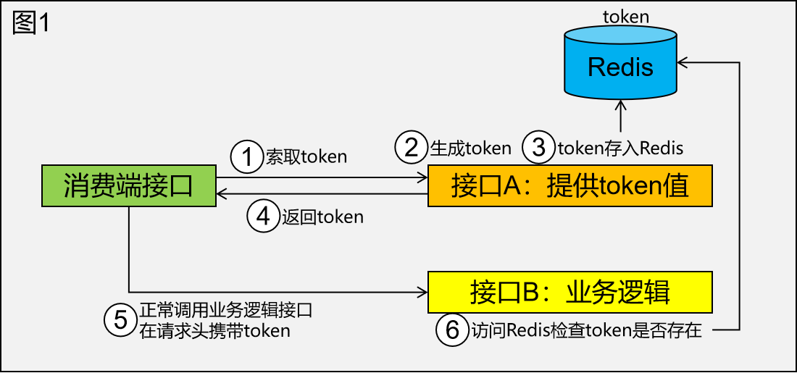
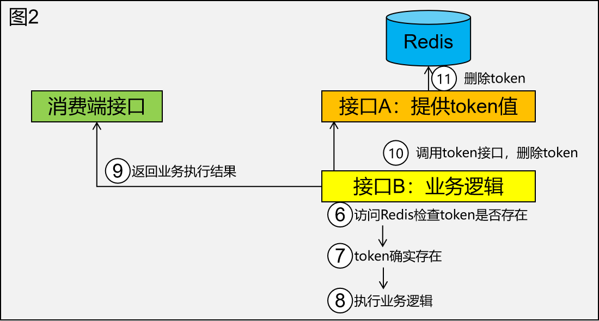
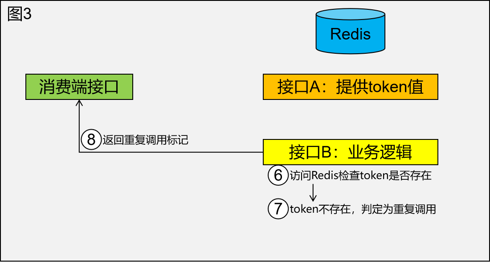

---
tags:
  - interview
  - 尚硅谷
  - Java
  - 分布式
source: 尚硅谷Java技术之高频面试题-v2025.1
title: 基础理论：分布式
---

# 基础理论：分布式

> 来源：尚硅谷 Java 技术之高频面试题 v2025.1 · 基础理论：分布式

# 1. 负载均衡的意义是什么？

负载均衡（Load Balancing）是指将网络或计算资源分配给多个服务器或设备，以达到提高系统性能、可扩展性和可靠性的目的。它在分布式系统中起到重要的作用，具有以下几个重要的意义：

1. **提高系统性能**：负载均衡将请求均匀地分配给多个服务器，避免了单个服务器过载的情况。通过合理地分配负载，可以充分利用系统的资源，提高系统的吞吐量和响应速度。
2. **实现高可用性**：通过将请求分发到多个服务器，即使其中某个服务器发生故障或不可用，仍然可以继续提供服务。负载均衡器能够检测到故障服务器，并将请求转发到其他正常工作的服务器，从而实现系统的高可用性和容错性。
3. **支持系统扩展**：随着用户量和业务需求的增加，单个服务器可能无法满足系统的需求。负载均衡器可以根据实际情况动态地添加或删除服务器，实现系统的水平扩展。通过增加服务器数量，可以提高系统的处理能力和并发性能。
4. **优化资源利用**：负载均衡器可以根据服务器的负载情况智能地分配请求，使每个服务器的负载相对均衡。这样可以避免某些服务器过载而其他服务器处于空闲状态的情况，最大限度地提高资源的利用率。
5. **简化系统管理**：通过使用负载均衡器，可以将多个服务器组织成一个逻辑集群，对外提供统一的入口。这样可以简化系统的管理和维护工作，减少对客户端的影响，提高系统的可维护性和可管理性。

总之，负载均衡在分布式系统中具有重要的意义。它能够提高系统性能、可用性和可扩展性，优化资源利用，简化系统管理。通过合理地分配负载，负载均衡器能够实现高效、稳定和可靠的系统运行。

# 2. 分布式和微服务的区别是什么？

分布式系统和微服务是两个相关但不同的概念，它们都涉及到软件架构中的组织和设计原则。以下是它们的区别：

## 2.1. 定义和范围

**分布式系统**：分布式系统是由多台计算机或服务器协同工作，通过网络通信来完成共同的任务。这些计算机可以分布在不同的地理位置，但它们通过网络连接进行协作。

**微服务**：微服务是一种软件架构风格，将一个大型应用程序拆分成一组小型、独立的服务。每个微服务都专注于执行一个特定的业务功能，可以独立开发、部署和扩展。

## 2.2. 关注点

**分布式系统**：关注于如何将不同的计算机或服务器连接起来，以实现高性能、高可用性和负载均衡等目标。

**微服务**：关注于如何将大型应用程序拆分成更小、更可管理的部分，并通过松耦合的方式来实现更灵活的开发、部署和维护。

## 2.3. 通信方式

**分布式系统**：分布式系统中的组件之间需要进行网络通信，常见的通信方式包括远程过程调用（RPC）、消息队列等。

**微服务**：微服务之间通常使用HTTP等协议进行通信，可以通过RESTful API或其他通信方式来实现。

## 2.4. 数据一致性

**分布式系统**：在分布式系统中，确保数据一致性是一个挑战，需要考虑分布式事务、数据复制等问题。

**微服务**：每个微服务可以拥有自己的数据存储，因此可以根据需求选择适当的数据库类型，并更容易管理数据一致性。

## 2.5. 部署和扩展

**分布式系统**：需要关注整体系统的部署和扩展，可能需要考虑多台服务器的管理和配置。

**微服务**：每个微服务都可以独立部署和扩展，使得开发团队更容易管理和调整特定功能。

总的来说，分布式系统是一种基础架构模式，而微服务是一种架构风格。微服务通常可以在分布式系统中实现，但并不是所有分布式系统都采用微服务架构。微服务架构的主要目标是使开发、部署和维护更加灵活，适用于复杂的应用场景。

# 3. 什么是微服务架构？优势？特点？

微服务架构是一种软件架构风格，将一个大型的应用程序拆分成多个小型、自治的服务单元，每个服务单元都专注于执行特定的业务功能。每个微服务可以独立开发、部署、扩展和维护，通过轻量级通信机制协同工作。微服务架构的优势和特点包括：

1. **模块化与自治性**：微服务架构通过拆分应用为多个服务单元，使得开发团队可以更加专注于各自的业务领域。每个微服务都是独立的，有自己的代码、数据库、API等，可以在不影响其他服务的情况下进行修改和更新。
2. **灵活性与快速交付**：微服务的自治性使得团队可以独立地开发、测试、部署和发布服务。这种独立性加速了开发周期，使团队能够更快地交付新功能和更新。
3. **可扩展性**：微服务架构允许单独扩展每个服务，根据需求动态分配资源。这使得系统更具弹性，能够应对高负载和流量峰值。
4. **技术多样性**：不同的微服务可以使用不同的技术栈，因为它们之间通过API通信。这允许团队选择最适合其任务的技术，而不受整个应用的技术限制。
5. **容错性与隔离性**：由于微服务是自治的，一个服务的故障不会影响整个系统。故障在较小的范围内隔离，从而提高了整体系统的容错性。
6. **持续集成与持续交付**：微服务架构有助于实现持续集成和持续交付，因为每个服务可以独立地构建、测试和发布。这有助于减少部署的风险，并快速响应用户需求。
7. **灵活的团队组织**：微服务架构鼓励小团队负责特定的微服务，使得团队更加灵活，能够快速做出决策和调整。

然而，微服务架构也带来了一些挑战，如分布式系统的复杂性、服务间通信的管理、数据一致性等问题。对于不同的应用场景，需仔细权衡微服务的优势与挑战，以确定是否采用这种架构。

# 4. 负载均衡算法、类型

## 4.1. 算法

### 4.1.1. 轮询法

将请求按顺序轮流地分配到后端服务器上，它均衡地对待后端的每一台服务器，而不关心服务器实际的连接数和当前的系统负载。

### 4.1.2. 随机法

通过系统的随机算法，根据后端服务器的列表大小值来随机选取其中的一台服务器进行访问。由概率统计理论可以得知，随着客户端调用服务端的次数增多，其实际效果越来越接近于平均分配调用量到后端的每一台服务器，也就是轮询的结果。

### 4.1.3. 源地址哈希法

源地址哈希的思想是根据获取客户端的IP地址，通过哈希函数计算得到的一个数值，用该数值对服务器列表的大小进行取模运算，得到的结果便是客服端要访问服务器的序号。采用源地址哈希法进行负载均衡，同一IP地址的客户端，当后端服务器列表不变时，它每次都会映射到同一台后端服务器进行访问。

### 4.1.4. 加权轮询法

不同的后端服务器可能机器的配置和当前系统的负载并不相同，因此它们的抗压能力也不相同。给配置高、负载低的机器配置更高的权重，让其处理更多的请；而配置低、负载高的机器，给其分配较低的权重，降低其系统负载，加权轮询能很好地处理这一问题，并将请求顺序且按照权重分配到后端。

### 4.1.5. 加权随机法

与加权轮询法一样，加权随机法也根据后端机器的配置，系统的负载分配不同的权重。不同的是，它是按照权重随机请求后端服务器，而非顺序。

### 4.1.6. 最小连接数法

最小连接数算法比较灵活和智能，由于后端服务器的配置不尽相同，对于请求的处理有快有慢，它是根据后端服务器当前的连接情况，动态地选取其中当前积压连接数最少的一台服务器来处理当前的请求，尽可能地提高后端服务的利用效率，将负责合理地分流到每一台服务器。

## 4.2. 类型

1、DNS 方式实现负载均衡

2、硬件负载均衡：F5 和 A10

3、软件负载均衡：Nginx 、 HAproxy 、 LVS

## 4.3. 产品落地

- Nginx ：七层负载均衡，支持 HTTP、E-mail 协议，同时也支持 4 层负载均衡；
- HAproxy ：支持七层规则的，性能也很不错。OpenStack 默认使用的负载均衡软件就是HAproxy；
- LVS ：运行在内核态，性能是软件负载均衡中最高的，严格来说工作在三层，所以更通用一些，适用各种应用服务。

# 5. 分布式架构下，Session 共享有什么方案

## 5.1. 方案一：无状态服务

采用无状态服务，抛弃Session，使用中间件存储，比如MySQL/Redis等。

- 把共享信息放到Redis中存储，虽然架构上变得复杂，并且需要多访问一次Redis ，但是这种方案带来的好处也是很大的。
- 把共享信息存入Cookie（要考虑跨域问题，且有安全风险）
- Tomcat集群Session同步使用Spring-Session

## 5.2. 方案二：IP 绑定策略

使用Nginx（或其他复杂均衡软硬件）中的IP绑定策略，同一个IP只能在指定的同一个机器访问，但是这样做失去了负载均衡的意义，当挂掉一台服务器的时候，会影响一批用户的使用，风险很大；

## 5.3. 实现了 Session 共享好处

1、可以水平扩展（增加 Redis 服务器）；

2、服务器重启 Session 不丢失（不过也要注意 数据在 Redis 中的刷新/失效机制）；

3、不仅可以跨服务器 Session 共享，甚至可以跨平台（例如网页端和 APP 端）；

# 6. CAP理论

## 6.1. 概念

### 6.1.1. Consistency（一致性）

即更新操作成功并返回客户端后，所有节点在同一时间的数据完全一致。对于客户端来说，一致性指的是并发访问时更新过的数据如何获取的问题。从服务端来看，则是更新后如何复制分布到整个系统，以保证数据最终一致。

### 6.1.2. Availability（可用性）

即服务一直可用，而且是正常响应时间。系统能够很好的为用户服务，不出现用户操作失败或者访问超时等用户体验不好的情况。

### 6.1.3. Partition Tolerance（分区容错性）

即分布式系统在遇到某节点或网络分区故障的时候，仍然能够对外提供满足一致性和可用性的服务。分区容错性要求能够使应用虽然是一个分布式系统，而看上去却好像是在一个可以运转正常的整体。比如现在的分布式系统中有某一个或者几个机器宕掉了，其他剩下的机器还能够正常运转满足系统需求，对于用户而言并没有什么体验上的影响。

## 6.2. 规则

分区容错是必须保证的，当发生网络分区的时候，如果要继续服务，那么强一致性和可用性只能2选1。

所以CAP中只有CP和AP两种情况成立

# 7. BASE定理

## 7.1. 名词解释

## 7.2. 定理含义

BASE理论是对CAP中一致性和可用性权衡的结果，其来源于对大规模互联网系统分布式实践的总结，是基于CAP定理逐步演化而来的。

BASE理论的核心思想是：即使无法做到强一致性，但每个应用都可以根据自身业务特点，采用适当的方式来使系统达到最终一致性。

在BASE理论下允许系统在某一小段时间内暂时数据不一致，以换取性能（可用性）的进一步提升，系统只要最终进入一致性状态即可。

## 7.3. 相关概念

1. **基本可用性（Basic Availability）**：系统应该尽可能地保持可用，即使在部分组件出现故障的情况下。这意味着系统不应该因为一个或多个组件的故障而完全停止服务。
2. **软状态（Soft State）**：系统中的数据可以有一定的不一致性，这种不一致性可以通过后台进程来逐步解决。软状态允许系统在面对故障时仍然能够继续运行，而不是立即进入不可用状态。
3. **最终一致性（Eventual Consistency）**：系统不需要始终保持强一致性，但最终所有的数据副本都会达到一致的状态。这意味着在短时间内，不同的节点可能会看到不同的数据状态，但随着时间的推移，所有节点上的数据将趋于一致。

## 7.4. 特征举例

1. **电商购物车系统**
  - **基本可用性**：在双十一等大型促销活动期间，即使部分节点出现故障，系统也能继续处理用户的购物车操作，只是可能会通过限流或排队来保护系统的稳定性。
  - **软状态**：用户将商品添加到购物车后，该操作可能不会立即在所有节点上同步，导致短时间内不同节点上的数据不一致。
  - **最终一致性**：通过异步通信、消息队列解耦、分布式锁、幂等性消费者以及定时任务校正机制，确保购物车数据最终在所有节点上达到一致状态。
2. **消息队列系统**
  - **基本可用性**：消息队列系统如Kafka、RabbitMQ等，在网络分区或节点故障时，仍能保证消息的传递和消费，只是可能会有短暂的延迟或顺序调整。
  - **软状态**：消息在被生产者发送到队列后，可能需要一段时间才能被所有消费者接收并处理，这期间消息的状态是“软”的。
  - **最终一致性**：尽管消息的顺序和实时性可能有所偏差，但系统最终会确保所有消息都被正确消费，达到最终一致性。
3. **分布式数据库**
  - **基本可用性**：在分布式数据库系统中，即使部分节点出现故障，系统也能继续处理读写请求，只是响应时间可能会延长。
  - **软状态**：数据的更新操作可能不会立即在所有节点上同步，导致短时间内数据不一致。
  - **最终一致性**：通过异步复制、读时修复、写时修复等策略，确保数据最终在所有节点上达到一致状态。

# 8. 分布式Id生成方案

## 8.1. UUID

### 8.1.1. 概念

UUID（Universally Unique Identifier）是一种标准的标识符格式，用于为信息分配唯一的标识符。UUID通常由32个16进制数字构成，分为五个连字符分隔的部分，例如：550e8400-e29b-41d4-a716-446655440000。

### 8.1.2. UUID的生成算法

1. **基于时间的UUID**：版本1的UUID主要依赖当前的时间戳及机器的MAC地址来生成。时间值占60位，表示从UTC 1582年10月15日以来的100纳秒间隔计数。时钟序列和节点值分别占14位和48位，用于确保在同一时刻生成的UUID也是唯一的。
2. **基于随机数的UUID**：版本4的UUID完全基于随机数或伪随机数生成。这种生成方式简单且高效，但需要使用高质量的随机数生成器以确保唯一性。
3. **基于名称空间的UUID**：版本3和版本5的UUID是基于名称空间和名称的散列值生成的。版本3使用MD5散列算法，而版本5使用SHA-1散列算法。这些UUID在不同的命名空间和名称下是唯一的。

### 8.1.3. 优点

1. **唯一性**：
  - UUID基于时间和机器MAC地址（对于版本1的UUID）或其他因素（如随机数或散列值，对于其他版本的UUID）生成，几乎可以保证全球唯一。
2. **简单易用**：
  - UUID的生成过程相对简单，不需要复杂的配置或额外的组件支持。大多数编程语言都提供了内置的库来生成UUID。
3. **本地生成**：
  - UUID可以在本地生成，无需通过网络请求或依赖外部服务，因此没有网络消耗，且生成速度快。

### 8.1.4. 缺点

1. **长度过长**：
  - UUID通常由36个字符组成（包括4个连字符），长度较长，不适合作为数据库主键或需要短ID的应用场景。
2. **无序性**：
  - UUID是无序的字符串，不具备趋势自增特性，这在某些需要有序ID的场景下可能是一个问题。
3. **查询效率低**：
  - 由于UUID的无序性和长度，其在数据库中的查询效率相对较低，尤其是在大量数据的情况下。
4. **信息泄露风险**：
  - 基于MAC地址生成的UUID可能会暴露生成该UUID的机器的MAC地址，从而引发信息泄露的风险。
5. **存储成本高**：
  - 由于UUID的长度较长，其存储成本相对较高，尤其是在需要存储大量UUID的系统中。

综上所述，UUID作为分布式ID生成方案，在唯一性、简单易用和本地生成方面具有显著优势，但也存在长度过长、无序性、查询效率低、信息泄露风险和存储成本高等缺点。在选择是否使用UUID作为分布式ID生成方案时，需要根据实际需求和场景进行权衡。

## 8.2. 数据库自增序列

### 8.2.1. 单机模式

#### 8.2.1.1. 优点

- 实现简单，依靠数据库即可，成本小。
- ID数字化，单调自增，满足数据库存储和查询性能。
- 具有一定的业务可读性。（结合业务代码）

#### 8.2.1.2. 缺点

- 强依赖DB，存在单点问题，如果数据库宕机，则业务不可用。
- DB生成ID性能有限，单点数据库压力大，无法扛高并发场景。
- 信息安全问题，比如暴露订单量，url查询改一下id查到别人的订单
- 分布式下生成的id会重复

### 8.2.2. 集群模式（数据库高可用背景下）

#### 8.2.2.1. 方案描述

具体操作方案是：多主模式做负载均衡，基于序列的起始值和步长设置，不同的初始值，相同的步长，步长大于等于节点数。例如：

初始值

1

2

3

步长

3

3

3

一步

4

5

6

两步

7

8

9

三步

10

11

12

……

……

……

……

#### 8.2.2.2. 优点

- 解决了ID生成的单点问题，同时平衡了负载。
- 解决了分布式环境下id重复问题。

#### 8.2.2.3. 缺点

- 系统扩容困难：系统定义好步长之后，增加机器之后调整步长困难。
- 主从同步延迟：向master写入数据后，再select查询有可能因为同步延迟导致查询不到

## 8.3. 基于Redis、MongoDB、ZooKeeper等中间件生成

### 8.3.1. 一、Redis

1. **优点**
  - **高性能**：Redis作为内存数据库，读写速度非常快，能够提供高效的ID生成服务。
  - **唯一性保证**：Redis支持原子操作如INCR，可以确保ID的唯一性和顺序递增。
  - **灵活性**：可以根据业务需求自定义ID生成规则，如引入时间、随机数等元素。
  - **持久化**：支持持久化选项，可以保证生成的ID在Redis重启后不丢失。
2. **缺点**
  - **依赖组件**：如果系统中没有Redis，需要额外引入并配置该组件，增加了系统复杂度。
  - **编码配置量大**：实现过程中需要编写较多的代码并进行相应的配置。
  - **单节点性能瓶颈**：虽然Redis本身是分布式系统，但单节点的性能可能成为瓶颈，需要考虑使用Redis集群来提高吞吐量。

### 8.3.2. 二、MongoDB

1. **优点**
  - **ObjectId生成机制**：MongoDB自带的ObjectId生成机制简单易用，且能保证全局唯一性。
  - **趋势递增**：ObjectId中的时间戳部分使得ID具有趋势递增的特性。
  - **无需额外组件**：对于已经使用MongoDB的系统来说，无需额外引入组件即可实现分布式ID生成。
2. **缺点**
  - **长度较长**：ObjectId的长度较长，可能不适合对ID长度有严格要求的场景。
  - **无序性问题**：在某些特定场景下，可能需要对ObjectId进行转换或处理以满足有序性要求。

### 8.3.3. 三、ZooKeeper（ZK）

1. **优点**
  - **高可用性**：ZooKeeper作为一个分布式协调服务，具有高可用性和稳定性。
  - **临时节点特性**：利用ZooKeeper的临时节点特性，可以实现分布式ID的生成和管理。
  - **灵活的ID生成策略**：可以根据业务需求自定义ID生成策略，如引入时间、机器标识等信息。
2. **缺点**
  - **依赖组件**：与Redis类似，如果系统中没有ZooKeeper，需要额外引入并配置该组件。
  - **性能问题**：在高并发场景下，ZooKeeper的性能可能成为瓶颈，需要考虑优化策略。
  - **实现复杂**：相比其他中间件，ZooKeeper的ID生成实现可能更为复杂，需要编写更多的代码和配置。

综上所述，基于Redis、MongoDB、ZooKeeper等中间件生成分布式ID的方案各有优劣。在选择具体方案时，需要根据实际业务需求、系统架构以及团队技术栈等因素进行综合考虑。

## 8.4. 雪花算法

雪花算法（Snowflake）是一种分布式ID生成算法，其生成机制和优缺点具体如下：

### 8.4.1. 生成机制

1. **基本结构**：雪花算法生成的ID是一个64位的long型数值，主要分为四个部分。
  - **1位符号位**：始终为0，因为生成的ID是正数。
  - **41位时间戳**：记录当前时间与某个固定时间的差值（通常是系统开始运行的时间），以毫秒为单位。这41位可以表示约69年的时间范围。
  - **10位机器标识**：包括5位数据中心ID和5位机器ID，用于区分不同的节点。最多可以部署在1024个节点上。
  - **12位序列号**：用于确保在同一毫秒内生成的ID是唯一的。每毫秒可生成4096个不重复的ID。
2. **生成过程**：在生成ID时，首先获取当前的时间戳。如果当前时间戳与上次生成ID的时间戳相同，则序列号加1；否则，序列号置为0，并更新时间戳。最后，将时间戳、机器标识和序列号组合成64位的长整型值，形成一个唯一的ID。

### 8.4.2. 优点

1. **高并发性能**：在高并发环境下，每秒可生成百万级别的不重复ID。
2. **唯一性保证**：通过结合时间戳、机器ID和序列号，可以确保生成的ID在分布式系统中的唯一性。
3. **趋势递增**：基于时间戳生成ID，可以保证ID的基本有序递增，满足某些业务场景的需求。
4. **灵活性**：可以根据需要自定义ID结构，如调整时间戳、机器标识和序列号的位数。

### 8.4.3. 缺点

1. **依赖服务器时间**：生成的ID依赖于服务器的时钟，如果服务器时钟回拨或不同机器之间的时钟不同步，可能会导致生成重复的ID。
2. **有限的并发性**：虽然雪花算法支持高并发，但在极端情况下仍可能出现并发问题。

综上所述，雪花算法是一种高效、可靠的分布式ID生成算法，适用于大规模分布式系统。然而，由于其依赖服务器时间的特性，需要在实际应用中注意时钟同步和回拨问题。

# 9. 分布式锁的解决方案

需要这个锁独立于每一个服务之外，而不是在服务里面。

## 9.1. 使用MySQL实现

MySQL 可以通过一些技巧来实现分布式锁，但需要注意的是，这并不是 MySQL 的原生功能，因此需要一些额外的设计和编码工作。

以下是使用 MySQL 实现分布式锁的一种常见方法：

### 9.1.1. 使用 `GET_LOCK()` 函数

MySQL 提供了 `GET_LOCK()` 函数用于获取一个命名锁。如果锁不存在，则该函数会创建一个锁并返回1；如果锁已经存在，则返回0。

```SQL
SELECT GET_LOCK('my_lock', 10); -- 尝试获取名为 'my_lock' 的锁，等待时间为10秒
```

### 9.1.2. 释放锁

MySQL 提供了 `RELEASE_LOCK()` 函数用于释放锁。

```SQL
DO RELEASE_LOCK('my_lock');
```

### 9.1.3. 示例代码

假设我们有一个表 `orders`，我们希望在插入新订单时加锁以避免并发问题。

#### 9.1.3.1. Step 1: 获取锁

```SQL
SET @lock_acquired = GET_LOCK('orders_mutex', 10); -- 尝试获取锁，等待10秒
IF @lock_acquired THEN
    -- 执行业务逻辑，例如插入订单
    INSERT INTO orders (order_id, order_details) VALUES (NULL, 'order details here');
    COMMIT; -- 确保提交事务以释放锁
END IF;
```

#### 9.1.3.2. Step 2: 释放锁

```SQL
DO RELEASE_LOCK('orders_mutex');
```

### 9.1.4. 结合应用程序代码

通常我们会在应用层结合上述 SQL 语句来控制分布式锁。以下是一个简化的伪代码示例（假设使用 Python 和 pymysql）：

```Python
import pymysql

# 数据库连接参数
conn = pymysql.connect(host='localhost', user='root', password='password', db='test')
cursor = conn.cursor()

# 尝试获取锁
lock_name = 'orders_mutex'
wait_timeout = 10  # 等待时间为10秒

try:
    cursor.execute(f"SELECT GET_LOCK('{lock_name}', {wait_timeout})")
    lock_acquired = cursor.fetchone()[0] == 1

    if lock_acquired:
        try:
            # 执行业务逻辑，例如插入订单
            cursor.execute("INSERT INTO orders (order_id, order_details) VALUES (NULL, 'order details here')")
            conn.commit()
        finally:
            # 确保释放锁
            cursor.execute(f"DO RELEASE_LOCK('{lock_name}')")
            conn.commit()
    else:
        print("未能获取到锁")
finally:
    cursor.close()
    conn.close()
```

### 9.1.5. 注意事项

1. **超时时间**：确保设置合理的等待时间，避免长时间阻塞。
2. **事务**：确保在事务中获取和释放锁，以保证操作的原子性。
3. **错误处理**：在实际应用中要添加更多的错误处理机制，如网络异常、数据库连接失败等。
4. **性能**：频繁获取和释放锁可能会影响性能，需要权衡使用。
5. **锁粒度**：根据实际需求选择合适的锁粒度，避免过度锁定导致系统瓶颈。

通过以上步骤和注意事项，您可以使用 MySQL 实现一个简单的分布式锁机制。不过，对于更复杂的场景，建议使用专门的分布式锁服务，如 Zookeeper、Redis 或者 Etcd 等。

## 9.2. 使用Zookeeper实现

使用Zookeeper实现分布式锁是一种常见的方法，可以确保在分布式系统中的多个节点上对共享资源进行互斥访问。下面将详细介绍如何使用Zookeeper实现分布式锁：

### 9.2.1. Zookeeper简介

ZooKeeper是一个开源的分布式协调服务，提供了高可用、高性能的分布式锁机制。它通过在集群中的多个节点之间共享数据来实现分布式锁的管理，确保只有一个节点能够获取到锁。

### 9.2.2. Zookeeper实现分布式锁的原理

Zookeeper的分布式锁是基于临时顺序节点（Ephemeral Sequential Znode）和Watcher监听器机制实现的。具体实现步骤如下：

1. **创建一个持久性的父节点**：在ZooKeeper中创建一个持久性的父节点，用于存储所有的锁。
2. **每个请求尝试创建一个临时顺序节点**：当一个节点需要获取锁时，它在上述创建的父节点下创建一个临时顺序节点。
3. **获取节点列表并判断是否为最小节点**：节点获取父节点下的所有子节点，并对它们进行排序。如果当前节点是所有子节点中最小的节点，则表示该节点获取了锁；否则，该节点需要监听比它小的前一个节点的删除事件。
4. **等待前一个节点释放锁**：如果节点不是最小的节点，它会监听比它小的前一个节点的变化事件。一旦前一个节点被删除，它再次尝试获取锁，重复步骤3和步骤4，直到获取到锁为止。
5. **释放锁**：当节点使用完共享资源后，它删除自己创建的临时顺序节点，从而释放锁。

### 9.2.3. Zookeeper实现分布式锁的代码示例

以下是一个使用Java语言和Zookeeper原生API实现分布式锁的简化示例：

```Java
import org.apache.zookeeper.*;
import org.apache.zookeeper.data.Stat;

import java.io.IOException;
import java.util.Collections;
import java.util.List;
import java.util.concurrent.CountDownLatch;

public class DistributedLockExample {
    private static final String ZOOKEEPER_CONNECTION_STRING = "localhost:2181";
    private static final int SESSION_TIMEOUT = 5000;
    private static final String LOCK_PATH = "/distributed_lock";

    private ZooKeeper zooKeeper;
    private String currentZnodeName;

    public DistributedLockExample() throws IOException {
        this.zooKeeper = new ZooKeeper(ZOOKEEPER_CONNECTION_STRING, SESSION_TIMEOUT, new Watcher() {
            @Override
            public void process(WatchedEvent event) {
                // Watcher实现
            }
        });
    }

    public void acquireLock() throws KeeperException, InterruptedException {
        while (true) {
            createLockNode();
            List<String> children = zooKeeper.getChildren(LOCK_PATH, false);
            Collections.sort(children);
            String smallestNode = children.get(0);
            if (currentZnodeName.equals(LOCK_PATH + "/" + smallestNode)) {
                return;
            } else {
                waitForLock(children.get(Collections.binarySearch(children, currentZnodeName.substring(LOCK_PATH.length() + 1)) - 1));
            }
        }
    }

    private void createLockNode() throws KeeperException, InterruptedException {
        Stat stat = zooKeeper.exists(LOCK_PATH, false);
        if (stat == null) {
            zooKeeper.create(LOCK_PATH, new byte[0], ZooDefs.Ids.OPEN_ACL_UNSAFE, CreateMode.PERSISTENT);
        }
        currentZnodeName = zooKeeper.create(LOCK_PATH + "/", new byte[0], ZooDefs.Ids.OPEN_ACL_UNSAFE, CreateMode.EPHEMERAL_SEQUENTIAL);
    }

    private void waitForLock(String prevZnodeName) throws KeeperException, InterruptedException {
        CountDownLatch latch = new CountDownLatch(1);
        Stat stat = zooKeeper.exists(LOCK_PATH + "/" + prevZnodeName, new Watcher() {
            @Override
            public void process(WatchedEvent event) {
                if (event.getType() == Event.EventType.NodeDeleted) {
                    latch.countDown();
                }
            }
        });

        if (stat != null) {
            latch.await();
        }
    }

    public void releaseLock() throws KeeperException, InterruptedException {
        zooKeeper.delete(currentZnodeName, -1);
        zooKeeper.close();
    }

    public static void main(String[] args) throws Exception {
        DistributedLockExample lock = new DistributedLockExample();
        lock.acquireLock();
        // 执行业务逻辑
        Thread.sleep(2000); // 模拟业务执行时间
        lock.releaseLock();
    }
}
```

### 9.2.4. 注意事项

- **临时节点的创建和删除必须是原子性的**：否则会出现多个节点同时创建或删除的情况，导致锁的失效。
- **避免死锁**：如果一个进程或节点创建临时节点但没有及时删除，就会造成死锁，因为其他进程或节点永远也无法获取到锁。
- **处理异常情况**：如果一个进程或节点获取到锁后因为某些原因没有及时释放锁，就会导致其他进程或节点一直等待，降低了系统的性能。因此，在实现分布式锁时，需要考虑锁的可靠性、高效性和容错性，并对异常情况进行处理，以确保锁的正确性和系统的稳定性。

以上是使用Zookeeper实现分布式锁的基本方法和注意事项，实际应用中可能还需要考虑超时处理、重试机制等细节。

## 9.3. 使用Redis实现

Redis是一种高性能的键值存储系统，因其读写速度快、支持多种数据结构以及高并发性能，被广泛应用于分布式锁的实现。以下是使用Redis实现分布式锁的具体方法：

1. **SETNX命令**
  - **基本概念**：SETNX（SET if Not eXists）是Redis提供的一个命令，用于在键不存在时设置键的值。如果键已经存在，则不做任何操作。这可以用于实现简单的分布式锁。
  - **示例代码**：import redis r = redis.Redis(host='localhost', port=6379, db=0) lock_key = "my_lock" lock_value = "unique_value" # 尝试获取锁 if r.setnx(lock_key, lock_value): print("Lock acquired") try: # 执行业务逻辑 pass finally: # 释放锁 r.delete(lock_key) else: print("Lock acquisition failed")
2. **EXPIRE命令**
  - **基本概念**：为了防止死锁，可以在获取锁后设置一个过期时间。当锁的持有者发生异常或崩溃时，锁会自动释放。
  - **示例代码**：import redis r = redis.Redis(host='localhost', port=6379, db=0) lock_key = "my_lock" lock_value = "unique_value" # 尝试获取锁并设置过期时间 if r.setnx(lock_key, lock_value): r.expire(lock_key, 10) # 设置过期时间为10秒 print("Lock acquired") try: # 执行业务逻辑 pass finally: # 释放锁 r.delete(lock_key) else: print("Lock acquisition failed")
3. **Lua脚本**
  - **基本概念**：为了确保加锁和设置过期时间的原子性，可以使用Lua脚本。Lua脚本在Redis中以原子方式执行，避免了中间状态的问题。
  - **示例代码**：import redis r = redis.Redis(host='localhost', port=6379, db=0) lock_key = "my_lock" lock_value = "unique_value" expire_time = 10 # 过期时间10秒 lua_script = """ local res = redis.call('setnx', KEYS[1], ARGV[1]) if res then redis.call('expire', KEYS[1], ARGV[2]) return res else return 0 end """ # 使用eval命令执行Lua脚本 if r.eval(lua_script, 1, lock_key, lock_value, expire_time): print("Lock acquired") try: # 执行业务逻辑 pass finally: # 释放锁 r.delete(lock_key) else: print("Lock acquisition failed")
4. **Redlock算法**
  - **基本概念**：Redlock算法通过在多个独立的Redis实例上获取锁来提高可靠性。客户端需要在大多数实例上成功获取锁才能认为真正获取了锁。
  - **示例代码**：import redis from redis.lock import Lock, LOCK_EXPIRE, LOCK_TIMEOUT # 定义多个Redis实例 redises = [ redis.Redis(host='localhost', port=6379), redis.Redis(host='localhost', port=6380) ] # 创建Redlock对象 redlock = Lock(redises, "my_lock", expire=10) # 尝试获取锁 if redlock.acquire(blocking=True): print("Lock acquired") try: # 执行业务逻辑 pass finally: # 释放锁 redlock.release() else: print("Lock acquisition failed")

总的来说，使用Redis实现分布式锁有多种方法，每种方法都有其优缺点和适用场景。在实际应用中，需要根据具体需求选择合适的方案，并注意处理可能出现的异常情况，以确保系统的高可用性和稳定性。

# 10. 相对于手动实现，Redisson框架解决了哪些问题？

Redisson框架在分布式锁的实现中解决了多个关键问题，使得其在高并发场景下更为可靠和高效。以下是Redisson框架解决的主要问题：

1. **死锁问题**：在使用SETNX命令时，如果没有设置过期时间，可能会导致锁忘记删除或加锁线程宕机，从而造成死锁。Redisson通过设置分布式锁的过期时间来避免这种情况，确保锁不会一直被占用。
2. **锁误删问题**：SETNX命令设置了超时时间后，如果执行时间太长，锁可能会在超时时间内自动释放，但线程可能不知道这一点，导致其他线程的锁被误删。Redisson通过为每个锁关联一个线程ID和重入次数作为分布锁value的一部分存储在Redis中，避免了锁误删的问题。
3. **不可重入问题**：同一线程在已经获取了某个锁的情况下，如果再次请求获取该锁，请求会失败。Redisson允许同一个线程对已经持有的锁进行重复锁定，解决了不可重入的问题。
4. **自动续期问题**：线程在持有锁期间，如果任务未能执行完成，锁可能会因为超时而自动释放。Redisson提供了自动续期的功能，通过定时任务（看门狗）定期延长锁的有效期，确保在业务未完成前锁不会被其他线程获取。
5. **简化操作与高级功能**：Redisson是一个开源的用于操作Redis的Java框架，它提供了许多简化Redis操作的高级API，并支持分布式对象、分布式锁、分布式集合等特性。这些高级功能大大降低了设计和研发大规模分布式系统的难度。
6. **优化策略**：Redisson还提供了多种优化策略，如选择合适的锁类型（如读锁、写锁等）、控制锁的持有时间、使用超时设置等，以提高系统的并发性能和可靠性。

综上所述，Redisson框架在分布式锁的实现中解决了死锁、锁误删、不可重入、自动续期等多个关键问题，并通过提供高级API和优化策略来降低分布式系统设计的复杂度和提高系统的并发性能。

# 11. 实现一个分布式锁需要考虑哪些问题？

实现一个分布式锁时，需要考虑以下几个问题：

1. **锁的唯一性**：在分布式环境下，需要确保同一把锁在不同的节点之间是唯一的。可以使用全局唯一标识符（例如基于ZooKeeper或Redis的分布式锁）来确保锁的唯一性。
2. **死锁和活锁**：分布式环境下的死锁和活锁是需要避免的问题。死锁是指多个节点互相等待对方释放锁的情况，而活锁是指多个节点不断争夺锁资源，但没有一个节点能够成功获取锁。为了避免死锁和活锁，可以使用超时机制、重试机制、随机等待时间等策略来解决。
3. **锁的可重入性**：分布式锁是否支持可重入是需要考虑的问题。可重入意味着同一个线程可以多次获取同一把锁，而不会发生死锁。在实现分布式锁时，需要考虑是否支持可重入，并在实现时进行相应的处理。
4. **锁的粒度**：锁的粒度是指锁的范围，即锁定的是整个系统、模块、方法还是更细粒度的资源。在分布式环境下，锁的粒度需要根据实际需求进行选择，避免锁的范围大或过小。
5. **锁的性能和可靠性**：分布式锁的性能和可靠性是需要考虑的问题。锁的获取和释放需要保证高效且可靠，同时要考虑网络延迟、节点故障等因素对锁性能和可靠性的影响。
6. **锁的容错和容量**：在分布式环境下，需要考虑节点故障和网络分区等异常情况对锁的影响。可以使用多个节点进行容错和冗余，以确保锁的可用性和容量。

综上所述，实现一个分布式锁需要考虑锁的唯一性、死锁和活锁、锁的可重入性、锁的粒度、锁的性能和可靠性，以及锁的容错和容量等问题。根据具体需求选择适合的分布式锁方案，并在实现时合理处理这些问题。

# 12. 什么是分布式事务

分布式事务是指在分布式系统中涉及多个独立的数据库或服务的事务操作，它需要确保这些操作要么全部成功执行，要么全部回滚，以保持数据的一致性和可靠性。

分布式事务的目标是在不同的系统之间维护数据的一致性，即使在出现故障或部分操作失败的情况下也能够保持数据的正确性。

在传统的单一数据库事务中，事务是由数据库管理系统负责管理和保障的，但在分布式环境下，涉及到多个独立的数据库或服务，各自拥有独立的事务管理机制，因此需要特殊的方法来确保分布式事务的一致性。

分布式事务面临的挑战和问题包括：

- **原子性（Atomicity）**： 分布式事务需要确保涉及的所有操作要么都成功执行，要么都回滚，不能出现部分操作成功而部分操作失败的情况。
- **一致性（Consistency）**： 分布式事务需要保证各个参与方的数据保持一致性，即在事务开始和结束时，系统的数据状态应该满足特定的约束。
- **隔离性（Isolation）**： 分布式事务的操作应该与其他事务隔离，避免不同事务之间的干扰和冲突。
- **持久性（Durability）**： 分布式事务需要确保在事务提交后，其结果被可靠地持久化，以防止数据丢失。

为了实现分布式事务，有一些常见的方法和技术，包括两阶段提交（Two-Phase Commit，2PC）、三阶段提交（Three-Phase Commit，3PC）、补偿事务（Compensating Transaction）等。这些方法在不同的场景下有不同的适用性和权衡，开发人员需要根据系统的需求和复杂性选择适合的方法来处理分布式事务。同时，分布式事务的实现也需要考虑到性能、可靠性和复杂性等方面的因素。

# 13. 请介绍一下分布式事务解决方案中的XA规范

## 13.1. 简介

XA协议是一种基于两阶段提交（Two-Phase Commit，2PC）协议的分布式事务解决方案，用于解决分布式系统中多个资源管理器之间的事务一致性问题

## 13.2. 基础概念

### 13.2.1. 四个角色

1. **事务管理器（Transaction Manager，TM）**：负责管理分布式事务的整个生命周期，包括事务的提交、回滚和恢复等。
2. **资源管理器（Resource Manager，RM）**：管理事务处理过程中涉及到的各种资源，如数据库、消息队列等。
3. **应用程序（Application Program，AP）**：执行业务逻辑，并发起或参与分布式事务。
4. **通信资源管理器（Communication Resource Manager，CRM）**：主要用来进行跨服务的事务的传播。

### 13.2.2. 全局事务

一个横跨多个数据库的事务，要么全部提交、要么全部回滚

### 13.2.3. JTA

JTA事务是Java对XA规范的实现，对应JDBC的单库事务


## 13.3. 工作流程

1. **开始事务**：应用程序（AP）向事务管理器（TM）发送开始事务请求。
2. **准备阶段**：事务管理器（TM）向所有的资源管理器（RM）发送事务开始通知。各个资源管理器（RM）接收到通知后，执行事务操作，并将操作结果和事务状态通知事务管理器（TM）。
3. **提交或回滚**：事务管理器（TM）接收到各资源管理器（RM）的操作结果和事务状态后，如果所有操作都成功，并且所有资源管理器（RM）都确认事务可以提交，则发送提交请求给各个资源管理器（RM）。如果有任何一个参与者出现问题，就进入回滚阶段，让所有参与者回滚事务。
4. **完成事务**：资源管理器（RM）接收到提交请求后，会执行提交操作，并将结果通知事务管理器（TM）。事务管理器（TM）接收到各资源管理器（RM）的提交结果后，如果所有资源管理器（RM）都成功提交，则发送完成事务请求给各个资源管理器（RM）。资源管理器（RM）接收到完成事务请求后，会完成事务的处理，并将结果通知事务管理器（TM）。事务管理器（TM）接收到各资源管理器（RM）的完成通知后，结束事务。

## 13.4. 特殊情况

在XA方案中，如果事务管理器（TM）通知所有资源管理器（RM）提交事务，但其中一个或多个RM在提交时宕机或失去应答，没有完成提交操作，那么系统需要采取一些措施来处理这种情况。以下是可能的处理步骤：

1. **重试机制**：事务管理器可以在一定时间内多次尝试联系那些未响应的RM，以确认它们是否已经成功提交了事务。如果在重试期间某个RM恢复了并确认了提交，那么整个事务就可以被认为已经成功提交。
2. **超时处理**：如果事务管理器在规定的时间内无法联系到所有的RM，或者无法确定某些RM是否已经提交了事务，那么它可以选择回滚整个事务。这是因为在分布式系统中，确保数据的一致性和完整性比追求高性能更为重要。
3. **日志记录**：为了应对可能的系统故障，事务管理器和各个RM应该实现详细的日志记录功能。这样，即使系统在某个时刻出现故障，也可以通过查看日志来恢复未完成的事务状态，从而避免数据不一致的问题。
4. **补偿事务**：在某些情况下，可能需要设计补偿事务来撤销已经执行的操作。例如，如果一个RM已经提交了一部分事务，但其他RM未能提交，那么可能需要执行一系列补偿操作来撤销已经提交的部分事务，以确保系统的一致性。
5. **人工干预**：在一些极端情况下，如果自动恢复机制无法解决问题，可能需要人工介入来手动解决数据不一致的问题。这可能包括检查数据库的状态、手动执行必要的SQL语句来修复数据等。
6. **监控和报警**：为了及时发现和处理类似的问题，系统应该实现全面的监控和报警机制。当检测到RM宕机或无法响应时，系统应该立即触发报警，以便管理员能够及时采取措施。

总的来说，面对RM宕机或失去应答的情况，XA方案需要结合重试机制、超时处理、日志记录、补偿事务、人工干预以及监控和报警等多种手段来确保系统的可靠性和数据的一致性。这些措施可以帮助系统在面对故障时尽可能地保持正常运行，并最小化对业务的影响。

## 13.5. 方案**优点**

1. **保证数据一致性**：XA协议能够确保在分布式环境中，所有参与节点的数据保持一致，遵循ACID特性（原子性、一致性、隔离性、持久性）。
2. **支持多种数据库**：XA协议不仅支持关系型数据库，还支持非关系型数据库，这使得它在不同的数据库系统之间具有很好的兼容性。
3. **易于集成**：由于XA协议是标准化的，因此它很容易与各种数据库和应用程序集成，无需对现有系统进行大量修改。
4. **灵活性高**：XA协议允许在事务处理过程中动态地添加或删除参与者，这使得它在处理复杂的业务逻辑时具有很高的灵活性。

## 13.6. 方案**缺点**

1. **单点故障问题**：在XA协议中，事务管理器是整个系统的协调者，如果事务管理器出现故障，可能会导致整个系统无法正常工作。
2. **性能瓶颈**：由于XA协议需要在所有参与者之间进行多次通信，这可能会导致系统的性能下降，特别是在大规模分布式系统中。
3. **数据不一致的风险**：虽然XA协议旨在保证数据的一致性，但由于网络分区、超时等问题，仍然存在一定的数据不一致风险。
4. **实现复杂**：XA协议的实现相对复杂，需要对底层数据库进行深度定制和优化，这可能会增加开发和维护的难度。

# 14. 请介绍一下分布式事务解决方案中的两阶段提交

## 14.1. 简介

两阶段提交（Two-Phase Commit，2PC）是一种用于分布式系统中的事务管理协议，旨在确保多个参与者节点之间的数据一致性和完整性。该协议通过两个阶段的提交过程来实现这一目标，即准备阶段和提交阶段。

## 14.2. 结构


## 14.3. 工作流程

1. **准备阶段**：在这个阶段已经执行完SQL语句，事务协调者向所有参与者发送一个“准备”请求，询问它们是否准备好提交事务。每个参与者都会执行相应的操作来准备提交事务，并将结果返回给协调者。如果所有参与者都准备好了，那么协调者就会进入下一个阶段；否则，它会中止事务并回滚所有已经准备好的操作。
2. **提交阶段**：在这个阶段，如果所有参与者都准备好了，事务协调者会向所有参与者发送一个“提交”请求，要求它们正式提交事务。每个参与者都会执行相应的操作来提交事务，并将结果返回给协调者。如果所有参与者都成功提交了事务，那么整个事务就被认为是成功的；否则，它会中止事务并回滚所有已经提交的操作。

## 14.4. 缺点

1. **单点故障**：在两阶段提交协议中，协调者是整个事务的关键节点。如果协调者出现故障，可能会导致整个事务无法完成，甚至可能导致数据不一致。因此，协调者的可靠性和稳定性对于整个系统至关重要。
2. **性能瓶颈**：两阶段提交协议需要在所有参与者之间进行多次通信，这可能会导致系统的性能下降，特别是在大规模分布式系统中。每次通信都需要时间，而且网络延迟和带宽限制也可能影响通信的效率。
3. **数据不一致的风险**：尽管两阶段提交协议旨在保证数据的一致性，但由于网络分区、超时等问题，仍然存在一定的数据不一致风险。例如，如果在某个参与者提交事务后，另一个参与者由于网络问题未能收到提交请求，就可能导致数据不一致。
4. **实现复杂**：两阶段提交协议的实现相对复杂，需要对底层数据库进行深度定制和优化。这可能需要大量的开发工作和专业知识，增加了实现的难度和成本。
5. **阻塞问题**：在两阶段提交过程中，如果某个参与者长时间未响应，可能会导致整个事务被阻塞。这会影响系统的吞吐量和响应时间，进而影响用户体验。
6. **缺乏灵活性**：两阶段提交协议要求所有参与者都支持该协议，并且需要严格按照协议的规定执行操作。这在一定程度上限制了系统的灵活性和可扩展性。
7. **资源占用高**：在两阶段提交过程中，需要占用大量的系统资源，如内存、CPU等。这可能会对系统的性能产生影响，特别是在资源有限的环境中。
8. **难以处理复杂业务逻辑**：对于一些复杂的业务逻辑，两阶段提交协议可能难以满足需求。例如，如果业务逻辑涉及到多个子事务的嵌套或者需要动态调整参与者列表等情况，两阶段提交协议可能无法很好地支持。

# 15. 请介绍一下分布式事务解决方案中的三阶段提交

三阶段提交（Three-Phase Commit, 3PC）是两阶段提交（2PC）的一种改进版本，旨在解决两阶段提交协议中的一些局限性，如单点故障和阻塞问题。三阶段提交通过引入一个额外的阶段——预提交阶段，来提高分布式事务的可靠性和性能。

## 15.1. 一、三阶段提交的基本流程

1. **阶段一：CanCommit阶段**，协调者询问事务参与者，是否有能力完成此次事务。
  1. 如果都返回yes，则进入第二阶段
  2. 有一个返回no或等待响应超时，则中断事务，并向所有参与者发送abort请求
2. **阶段二：PreCommit阶段**，此时协调者会向所有的参与者发送PreCommit请求，参与者收到后开始执行SQL语句。参与者执行完SQL语句后（此时属于未提交事务的状态），就会向协调者反馈“Ack”表示我已经准备好提交了，并等待协调者的下一步指令。
3. **阶段三：DoCommit阶段**， 在阶段二中如果所有的参与者节点都返回了Ack，那么协调者就会从“预提交状态”转变为“提交状态”。然后向所有的参与者节点发送"doCommit"请求，参与者节点在收到提交请求后就会各自执行事务提交操作，并向协调者节点反馈“Ack”消息，协调者收到所有参与者的Ack消息后完成事务。相反，如果有一个参与者节点未完成PreCommit的反馈或者反馈超时，那么协调者都会向所有的参与者节点发送abort请求，从而中断事务。

## 15.2. 二、三阶段提交的优点

1. **提高可靠性**：通过引入预提交阶段，三阶段提交可以在协调者出现故障时继续完成事务，从而提高了系统的可靠性。即使协调者在第二阶段出现问题，参与者仍然可以根据自己的状态来决定是否提交事务。
2. **减少阻塞**：三阶段提交允许参与者在预提交阶段超时时自行决定是否提交事务，从而减少了整个事务被阻塞的可能性。这有助于提高系统的性能和吞吐量。
3. **灵活性高**：与两阶段提交相比，三阶段提交更加灵活，能够更好地处理复杂的业务逻辑和动态调整参与者列表的情况。这使得它更适用于实际的生产环境。

## 15.3. 三、三阶段提交的缺点

1. **实现复杂**：三阶段提交的实现比两阶段提交更为复杂，需要对底层数据库进行深度定制和优化。这可能需要更多的开发工作和专业知识。
2. **性能开销**：虽然三阶段提交可以减少阻塞，但额外的预提交阶段可能会增加系统的通信开销和延迟。特别是在网络环境较差的情况下，这种开销可能会更加明显。
3. **数据不一致的风险仍然存在**：尽管三阶段提交提高了系统的可靠性，但由于网络分区、超时等问题，仍然存在一定的数据不一致风险。因此，在使用三阶段提交时仍然需要谨慎处理各种异常情况。
4. **资源占用高**：在三阶段提交过程中，需要占用大量的系统资源，如内存、CPU等。这可能会对系统的性能产生影响，特别是在资源有限的环境中。
5. **难以处理复杂业务逻辑**：对于一些复杂的业务逻辑，三阶段提交可能难以满足需求。例如，如果业务逻辑涉及到多个子事务的嵌套或者需要动态调整参与者列表等情况，三阶段提交可能无法很好地支持。
6. **缺乏标准化**：目前，三阶段提交并没有一个统一的标准或规范，不同的数据库和系统可能有不同的实现方式。这可能导致在不同系统之间进行集成时出现兼容性问题。
7. **维护成本高**：由于三阶段提交的复杂性，其维护成本也相对较高。开发者需要投入更多的时间和精力来确保系统的稳定性和可靠性。
8. **适用场景有限**：虽然三阶段提交可以提高系统的可靠性和性能，但它并不适合所有的分布式事务场景。在某些情况下，可能需要结合其他技术或策略来实现更好的效果。

综上所述，三阶段提交是两阶段提交的一种改进方案，通过引入预提交阶段来提高分布式事务的可靠性和性能。然而，它也带来了实现复杂、性能开销和数据不一致风险等问题。因此，在使用三阶段提交时需要根据具体的业务需求和系统架构进行权衡和选择。

# 16. TCC（补偿事务）

TCC（Try-Confirm-Cancel）补偿事务是一种分布式事务解决方案，它通过三个阶段来保证分布式系统中的操作成功完成或在失败时进行补偿。以下是对TCC补偿事务的简要介绍：

1. **概述**
  - TCC补偿事务模式由Atomikos公司提出，并在其商业版本事务管理器ExtremeTransactions中实现了该方案。
  - 这种模式要求应用的每个服务提供try、confirm、cancel三个接口，通过对资源的预留(提供中间态，如账户状态、冻结金额等)，尽早释放对资源的加锁。
2. **工作流程**
  - **Try阶段**：尝试执行业务操作，完成所有业务检查并预留必要的业务资源。如果Try阶段成功，进入Confirm阶段；否则，执行Cancel阶段。
  - **Confirm阶段**：确认执行业务操作，使用Try阶段预留的业务资源，并且满足幂等性。此阶段通常认为不会出错，但若出错需引入重试机制或人工处理。
  - **Cancel阶段**：取消执行业务操作，释放Try阶段预留的业务资源，并撤销之前的操作。Cancel阶段同样需要满足幂等性，以便在出现异常时能够重试。
3. **优点**
  - **高可靠性和一致性**：通过在事务执行过程中引入确认和取消机制，确保了即使在出现错误或异常情况下，系统状态仍然保持一致。
  - **灵活控制事务边界**：TCC模式通过明确的三个阶段来控制分布式事务的边界，可以灵活地控制事务的粒度和范围。
  - **提高系统的并发性能**：TCC模式可以将事务的过程拆分成多个阶段，每个阶段可以并发执行，从而提高系统的并发性能和吞吐量。
  - **降低分布式事务的复杂度**：TCC模式将分布式事务的复杂度降低到可控的范围内，便于管理和维护。
4. **缺点**
  - **实现复杂度较高**：需要对业务逻辑进行深入的理解和设计，以实现try、confirm、cancel三个阶段的业务逻辑。
  - **可能存在性能问题**：多次网络通信和状态转换可能会对系统的性能产生影响，尤其是在高并发场景下。
  - **事务边界难以确定**：在某些场景下，事务的边界难以确定，容易出现事务处理失败的情况。
  - **补偿操作复杂性高**：需要对每个参与者进行相应的补偿操作，补偿操作的复杂性取决于业务场景和实现方式。

综上所述，TCC补偿事务是一种有效的分布式事务解决方案，它提供了更高的可靠性和一致性，但也需要更多的系统资源和处理时间。在实施这种机制时，需要权衡其优缺点，并确保它适合特定应用的需求。

# 17. 如何使用消息队列实现分布式事事务？

使用消息队列实现分布式事务的关键在于**通过消息的异步处理和事务性控制，来保证在分布式系统中各个服务之间的数据一致性和完整性**。以下是使用消息队列实现分布式事务的具体步骤：

1. **开启事务**：生产者（如订单系统）开始一个新的事务，并在消息队列上发送一个“半消息”。这个半消息包含了完整的消息内容，但在事务提交之前，对于消费者来说是不可见的。
2. **执行本地事务**：生产者执行本地数据库事务操作，例如在订单库中插入一条订单记录。
3. **提交或回滚事务**：根据本地事务的执行结果，生产者决定是提交还是回滚事务。如果本地事务执行成功，则向消息队列发送提交事务的消息，此时购物车系统可以消费到这条消息，并继续后续的流程；如果本地事务执行失败，则向消息队列发送回滚事务的消息，购物车系统将不会收到这条消息。
4. **处理异常情况**：如果在提交事务消息时发生网络异常或其他问题，Kafka会直接抛出异常，让用户自行处理。在这种情况下，可以在业务代码中反复重试提交，直到提交成功，或者删除之前创建的订单进行补偿。RocketMQ则提供了事务反查机制来解决这一问题。当Producer在提交或回滚事务消息时发生网络异常，Broker没有收到请求时，它会定期去Producer上反查这个事务对应的本地事务的状态，然后根据反查结果决定提交或回滚这个事务。

总的来说，使用消息队列实现分布式事务是一种有效的解决方案，它能够在保证数据一致性和完整性的同时，提高系统的可用性和可扩展性。然而，需要注意的是，不同的消息队列产品可能具有不同的特性和限制，因此在实际应用中需要根据具体需求选择合适的消息队列产品和技术方案。

# 18. 如何使用本地消息表的方式实现分布式事务？

使用本地消息表实现分布式事务，是一种常见的解决方案，主要用于在分布式系统中保证数据的一致性和可靠性。这种方法的核心思想是将业务操作和消息记录放在同一个本地事务中，确保它们要么同时成功，要么同时失败，然后通过一个独立的消息调度器异步地将消息发送到消息队列中，从而实现跨服务的事务一致性。以下是使用本地消息表实现分布式事务的一般步骤：

1. **创建本地消息表**：在数据库中创建一个本地消息表，用于存储待发送的消息以及消息的发送状态和相关信息。表结构可以包含字段如`message_id`（消息唯一标识）、`message_body`（消息内容）、`status`（消息状态，如待发送、已发送等）和`create_time`（消息创建时间）。
2. **业务处理与消息记录**：在业务逻辑中，当需要发送消息时，首先将消息插入到本地消息表中，设置状态为待发送。然后执行业务逻辑，并将业务变更信息与消息记录插入操作放在同一个本地事务中。
3. **消息发送**：创建一个后台线程或定时任务，定时扫描本地消息表中状态为待发送的消息，并将这些消息发送到消息队列。在成功发送到消息队列后，将消息表中对应的状态修改为已发送。
4. **消息消费**：其他服务从消息队列中消费消息，并执行相应的业务逻辑处理。此步骤必须保证幂等性，即多次消费相同的消息不会导致数据不一致。
5. **消息状态确认**：当消息消费完成后，进行状态变更。如果消费失败，需要根据失败原因进行重试或人工处理。

总的来说，使用本地消息表实现分布式事务的优点在于简单易实现、高性能和高可靠性。然而，它也有一些不足之处，如开发复杂度较高、可能存在延迟性问题以及需要确保消息的幂等性。因此，在实际应用中，需要根据具体需求进行权衡和优化。

# 19. 你了解哪些分布式事事务的解决方案？

分布式事务的实现方案主要包括**基于可靠消息服务、最大努力通知、TX-LCN、X/Open DTP模型、阿里DTS、华为ServiceComb和阿里GTS等等**。以下是对这七种方案的具体介绍：

1. **基于可靠消息服务**：基于可靠消息服务的分布式事务方案通过对发送到消息中间件的消息进行“两阶段提交”，即先提交，执行完本地事务后再确认消息，给事务的回滚提供了可能。该方案能保证事务的最终原子性和持久性，但无法保证一致性和隔离性。适用于对业务的实时一致性以及事务的隔离性要求都不高的内部系统。
2. **最大努力通知**：最大努力通知方案依赖于消息中间件，不需要保证消息的可靠性，而是依靠额外的校对系统或者报警系统来保障事务的正确完成。该方案同样只能保证事务的最终原子性和持久性，无法保证一致性和隔离性。适用于对实时一致性和事务隔离性要求不高的内部系统或跨企业的业务活动中。
3. **TX-LCN**：TX-LCN的核心原理是通过协调本地事务来实现分布式事务，分布式事务的实现依赖于本地事务。如果本地事务都能保证ACID特性，那么基于LCN的分布式事务也能满足ACID。并发性能可能会降低，因为需要等待所有参与方的响应。
4. **X/Open DTP模型**：X/Open DTP模型是一种严格的分布式事务模型，遵循XA规范，通过两阶段提交实现事务的全局一致性。这种方案在实际应用中较为复杂，且对性能有一定影响。
5. **阿里DTS**：阿里DTS是基于TCC（Try-Confirm-Cancel）模型的分布式事务解决方案，通过补偿机制确保事务的最终一致性。适用于对数据一致性要求极高的场景，如金融交易等。
6. **华为ServiceComb**：华为ServiceComb是对SAGA模式的一种实现，强调服务的自治性和灵活性，通过一系列本地事务和补偿事务的组合来实现分布式事务。适用于微服务架构下的分布式事务处理。
7. **阿里GTS**：阿里GTS是开源产品Seata/Fescar的实现，对XA协议进行了改进后的分布式事务解决方案，支持多种事务模式，包括AT、TCC、SAGA等。适用于各种复杂的分布式事务场景，特别是在微服务架构下。

总的来说，每种方案都有其特定的适用场景和优缺点，选择哪种方案应根据具体的业务需求和技术条件来决定。

# 20. 什么是TCC，和2PC有什么区别？

TCC（Try-Confirm-Cancel）和2PC（Two-Phase Commit）都是用于处理分布式事务的协议，但它们在处理方式和适用场景上存在一些区别。

## 20.1. TCC (Try-Confirm-Cancel)

TCC是一种分布式事务处理方法，它将事务拆分为三个阶段：尝试（Try）、确认（Confirm）和取消（Cancel）。每个阶段都有相应的操作。在尝试阶段，参与者尝试执行事务操作，检查是否满足执行条件。如果所有参与者的尝试都成功，进入确认阶段，参与者确认执行事务。如果任何一个参与者的尝试失败或确认阶段失败，将进入取消阶段，执行事务的补偿操作来恢复系统到一致状态。TCC注重于事务的补偿机制，以确保数据的一致性。

## 20.2. 2PC (Two-Phase Commit)

2PC是另一种分布式事务处理协议，它在全局协调器和多个参与者之间进行通信。它有两个阶段：准备（Prepare）和提交（Commit）。在准备阶段，全局协调器将询问所有参与者是否可以执行事务，参与者会回复“可以”或“不可以”。如果所有参与者都回复“可以”，则进入提交阶段，在此阶段全局协调器通知所有参与者提交事务。如果任何一个参与者回复“不可以”，全局协调器会通知所有参与者中止事务。2PC依赖于中心化的协调器，其缺点包括单点故障和阻塞的可能性。

## 20.3. 区别

### 20.3.1. 处理方式

TCC采用尝试-确认-取消的模式，强调补偿机制，而2PC采用两阶段提交的方式，依赖全局协调器来决定提交或中止事务。

### 20.3.2. 灵活性

TCC相对更加灵活，因为它允许开发人员在尝试和确认阶段之间插入补偿逻辑。2PC较为严格，需要参与者在准备阶段做出确定性的回应。

### 20.3.3. 复杂性和性能

TCC通常比2PC更适用于高并发环境，因为它的操作相对较轻，而2PC的中心化协调可能导致性能瓶颈。

### 20.3.4. 可用性

TCC通常在局部事务级别上具有更好的可用性，因为每个参与者可以独立决定是否尝试事务。在选择TCC还是2PC时，需要根据系统的需求、复杂性和可靠性等因素进行权衡。

# 21. 什么是柔性事务？

## 21.1. 概念

柔性事务是相对于刚性事务来说的。刚性事务要求严格遵守ACID，而柔性事务则是基于BASE定理，满足基本可用和最终一致性。

从实际情况来看，柔性事务可以说都是分布式事务，各自的名称只是因为侧重的角度不同：

- 分布式事务：从结构性角度来看事务问题
- 柔性事务：从规则遵照执行的程度来看事务问题

## 21.2. 细节对比

刚性事务严格遵守的ACID属性，在柔性事务中：

- 原子性（A）：严格遵守
- 一致性（C）：事务执行过程中放宽一致性要求，事务执行完成后要求严格遵守
- 隔离性（I）：要求并行事务之间互不干扰，事务执行过程中结果可见性允许安全放宽
- 持久性（D）：严格遵守

# 22. 什么是Seata？他有哪几种模式？

Seata是由阿里巴巴开源的一款分布式事务解决方案落地产品，旨在解决分布式系统中的数据一致性问题。

Seata提供了一套事务管理的解决方案，支持对分布式事务进行管理和协调。

Seata有以下三种常见的模式：

## 22.1. AT模式（Automatic Transaction）

AT模式是Seata最常用的模式，它基于数据库的本地事务实现分布式事务的一致性。

在AT模式下，Seata通过拦截数据访问层的SQL操作，并将这些操作封装在一个全局事务中。

Seata通过将事务信息存储在全局事务上下文中，并协调各个分支事务的提交或回滚来实现式事务的一致性。

## 22.2. TCC模式（Try-Confirm-Cancel）

TCC模式是一种补偿型的分布式事务模式。

在TCC模式下，Seata通过定义三个阶段的操作：Try阶段尝试执行业务操作、Confirm阶段确认执行操作、Cancel阶段撤销执行操作。

Seata通过补偿机制来保证分布式事务的一致性，即使在异常情况下也能够进行回滚或补偿。

## 22.3. Saga模式

Saga模式是一种长事务的分布式事务模式，通过将业务操作分解为一系列的子事务来实现。

每个子事务都有自己的回滚操作，从而实现了分布式事务的逐步提交和回滚。Saga模式通过异步消息和补偿机制来实现事务的提交和回滚。

这三种模式在不同的场景下可以根据实际需求进行选择和组合使用，以满足分布式系统的事务管理需求。

# 23. 如何实现接口的幂等性

## 23.1. 幂等性要应对的问题

在服务调用过程中，网络传输存在不确定性：


当服务器消费端发出请求后，没有接收到服务提供端的响应，那么此时存在如下可能：

- 网络传输故障，服务提供端没有接收到请求
- 服务提供端接收到了请求，且处理成功，但由于网络传输故障导致服务消费端没有接收到响应
- 服务提供端接收到了请求，但处理失败导致没有返回响应

面对这种情况，作为服务消费端不知道发生了什么，只能选择『多次重试』——同一个请求（同一个业务数据）多次重复发送，期望至少能成功一次

但是这样就会导致服务提供端多次重复接收到同一个请求，进而有可能导致计算完成后业务数据错误

## 23.2. 幂等性概念

为了应对上述问题，为了让服务提供端保护业务数据不被多次重试请求破坏，提出幂等性概念：如果一个接口调用一次和调用多次对系统和系统中的数据的影响是一样的，那么就说这个接口满足幂等性

有了这个标准，我们就可以说：只有对满足幂等性的接口才能多次重试调用

## 23.3. 幂等性实现方案：SQL层

### 23.3.1. 天然满足幂等性的SQL语句

- 所有查询语句天然满足幂等性
- 基于指定id的删除语句：delete from xxx where id='固定值'
- 基于指定id的自适应增改：
  - 当id对应的数据不存在时：执行insert操作
  - 当id对应的数据已存在时：执行update操作

### 23.3.2. 数据库悲观锁

数据库悲观锁是对并发操作上锁，而不是对数据上锁，所以悲观锁存在期间内只能有一个事务执行操作成功，此时可以保证幂等性；


如果两个事务A和B，A事务提交之后再执行B事务，就无法保证幂等性了。


> 没有任何单个方案是万能的，在不同场景需要选择不同的适配方案，或者需要多个方案去组合起来解决综合性的问题

### 23.3.3. 数据库乐观锁

先看下面这条SQL语句：

```SQL
update t_goods set count = count -1 where good_id=2 虽然锁定了id，但是不满足幂等性
```

解决方案是使用乐观锁：

```SQL
update t_goods set count = count -1 , version = version + 1 where good_id=2 and version = 1 乐观锁的核心思想是：只允许基于最新版修改
```

- version初始值为1
- A事务第一次执行上述SQL语句，事务提交后，version值变成2
- B事务再次执行上述SQL语句，但B事务手里拿的version值还是1，version = 2的条件判断不成立所以无法更新，实现防重效果

乐观锁的局限性：每一次执行SQL时使用的version都需要先执行select语句查询，所以并发情况下可以防重，但串行情况不行

- A事务查询version得到值8
- A事务基于8执行更新成功，version+1后变成9
- A事务提交之后结束
- B事务查询version得到值9
- B事务基于9执行更新仍然能够成功

> 没有任何单个方案是万能的，在不同场景需要选择不同的适配方案，或者需要多个方案去组合起来解决综合性的问题

### 23.3.4. 唯一性约束

插入数据，应该按照唯一索引进行插入，比如订单号，相同的订单就不可能有两条记录插入。

我们在数据库层面防止重复。这个机制是利用了数据库的主键唯一约束的特性，解决了在 insert 场景时幂等问题。

如果是分库分表场景下，路由规则要保证相同请求下，落地在同一个数据库和同一表中，要不然数据库主键约束就不起效果了，因为是不同的数据库和表主键不相关。

### 23.3.5. 数据库中额外创建“防重表”

使用订单号 orderNo 做为去重表的唯一索引，把唯一索引插入去重表，再进行业务操作，且他们在同一个事务中。

这个保证了重复请求时，因为去重表有唯一约束，导致请求失败、事务回滚，从而避免了重复执行的问题。

这里要注意的是，去重表和业务表应该在同一库中，这样就保证了在同一个事务，即使业务操作失败了，也会把去重表的数据回滚。这个很好的保证了数据一致性。

### 23.3.6. 特别提醒

一个接口中很可能会包含多条SQL语句操作，此时要求所有SQL语句都满足幂等性才能保证SQL所在接口满足幂等性；有任何一条SQL语句不满足幂等性，这个接口就需要附加其它措施才能保证幂等性。所以该问题一定要站在全局角度综合考虑，不能以偏概全

## 23.4. 幂等性实现方案：基于Redis Set防重

### 23.4.1. 业务要求

有很多业务数据需要处理，且每条数据只能处理一次

### 23.4.2. 解决方案


- 不同业务数据经过MD5计算会得到不同的值
- 在业务执行过程中，处理每一条数据之前先检查Redis的SET集合中MD5值是否存在
  - 存在：说明此前曾经执行过业务计算，流程终止
  - 不存在：说明此前没有执行过业务计算，所以执行业务操作后，计算MD5值存入Redis的SET集合

## 23.5. 幂等性实现方案：业务层分布式锁

如果多个机器可能在同一时间同时处理相同的数据，比如多台机器定时任务都拿到了相同数据处理，我们就可以加分布式锁，锁定此数据，处理完成后释放锁。

获取到锁的必须先判断这个数据是否被处理过。

## 23.6. 幂等性实现方案：基于token防重

### 23.6.1. 工作机制

1、服务端提供了发送 token 的接口。我们在分析业务的时候，哪些业务是存在幂等问题的，就必须在执行业务前，先去获取 token，服务器会把 token 保存到 redis 中。

2、然后调用业务接口请求时，把 token 携带过去，一般放在请求头部。

3、服务器判断 token 是否存在 redis 中，存在表示第一次请求，然后删除 token,继续执行业务。

4、如果判断 token 不存在 redis 中，就表示是重复操作，直接返回重复标记给 client，这样就保证了业务代码，不被重复执行。







### 23.6.2. 危险性

1、先删除 token 还是后删除 token；

(1) 先删除可能导致，业务确实没有执行，重试还带上之前 token，由于防重设计导致，请求还是不能执行。

(2) 后删除可能导致，业务处理成功，但是服务闪断，出现超时，没有删除 token，别人继续重试，导致业务被执行两边

(3) 我们最好设计为先删除 token，如果业务调用失败，就重新获取 token 再次请求。

2、Token 获取、比较和删除必须是原子性

(1) redis.get(token) 、token.equals、redis.del(token)如果这两个操作不是原子，可能导致，高并发下，都 get 到同样的数据，判断都成功，继续业务并发执行

(2) 可以在 redis 使用 lua 脚本完成这个操作。

```Lua
if redis.call('get', KEYS[1]) == ARGV[1] then return redis.call('del', KEYS[1]) else
return 0 end
```

> 没有任何单个方案是万能的，在不同场景需要选择不同的适配方案，或者需要多个方案去组合起来解决综合性的问题

# 24. 微服务架构的服务治理包括哪些方面？

## 24.1. 服务注册与发现

使用服务注册表来管理所有微服务的信息，包括服务名称、地址、版本等。

服务提供者将自己的信息注册到注册表中，服务消费者通过注册表来发现可用的服务。

常见的服务注册与发现工具有Consul、ZooKeeper和etcd等。

## 24.2. 负载均衡

通过在服务提供者与服务消费者之间引入负载均衡器，将请求平均分配到多个服务实例上，以提高系统的可伸缩性和可用性。

常见的负载均衡器有Nginx、HAProxy和Envoy等。

## 24.3. 健康检查与容错机制

通过定期的健康检查来监测服务的可用性和状态，并根据检查结果进行容错处理，比如自动剔除不可用的服务实例。

常见的健康检查工具有Spring Cloud的Spring Boot Admin、Netflix的Hystrix和Istio等。

## 24.4. 熔断器与降级

在高并发或异常情况下，通过熔断器来控制请求的流量，避免服务的雪崩效应。

同时可以通过降级策略，在服务不可用时返回默认值或者静态数据，保证系统的可用性。

常见的熔断器和降级工具有Netflix的Hystrix和Sentinel等。

## 24.5. 配置中心

将微服务的配置集中管理，实现配置的动态更新和版本控制。通过配置中心，可以动态修改微服务的配置，而无需重启服务。

常见的配置中心有Spring Cloud Config、Apollo和Consul等。

## 24.6. API 网关

通过引入 API 网关来对外暴露微服务的统一接口，实现请求的路由、转发和过滤等功能。

API 网关可以对请求进行鉴权和限流，提供统一的访问控制和监控。

常见的 API 网关有Spring Cloud Gateway、Netflix的Zuul和Kong等。
