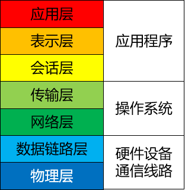

---
tags:
  - interview
  - 尚硅谷
  - Java
  - 网络与信息安全
source: 尚硅谷Java技术之高频面试题-v2025.1
title: 基础理论：网络与信息安全
---

# 基础理论：网络与信息安全

> 来源：尚硅谷 Java 技术之高频面试题 v2025.1 · 基础理论：网络与信息安全

# 1. 谈谈你对OSI网络七层模型的理解

**OSI 七层网络模型**是由国际标准化组织（ISO）制定的网络通信协议标准框架，正式名称为开放系统互连模型（Open System Interconnection），简称OSI模型。它将计算机网络体系结构划分为七个抽象的层次，从高到低依次为：

- **应用层**：作为 OSI 模型的最高层，直接为应用程序提供服务，帮助应用程序实现网络通信功能，如 HTTP、FTP 和 SMTP 等。
- **表示层**：处理数据的格式化和加密，保证应用层能够正确解释所交换的数据。这一层可以进行数据压缩、加密和转换，如 ASCII、JPEG 等编码方案。
- **会话层**：管理应用程序之间的会话控制，包括会话的建立、管理和终止。例如，NFS 和 SQL 等协议在这一层运行。
- **传输层**：提供端到端的通信服务。它负责可靠或非可靠的数据传输，确保数据以合适的速率发送，典型协议有 TCP 和 UDP。
- **网络层**：主要处理数据包在网络中的活动，包括逻辑寻址和选择最佳路径传输数据包。典型协议有 IP 和 IPX 等。网络层的主要设备是路由器。
- **数据链路层**：提供可靠的数据传输。这一层通过帧同步、差错控制等手段，将物理层传来的比特流组装成帧，并实现节点间的帧同步和差错控制。
- **物理层**：负责通过传输介质实现比特流的透明传输。它主要处理物理连接的建立、维护和释放，确保数据能在各种物理媒体上进行传输。

OSI 七层网络模型虽然是国际标准，但由于太过于理想化，所以在具体网络通信设备和产品中，并没有严格遵守该标准要求的具体实现。但尽管如此，目前我们常见的各种通信设备、协议仍然是参照七层模型来设计的。

由于 OSI 七层网络模型太过于理想化，所以并没有哪个实际网络系统完全基于该模型来实现。

但 OSI 七层网络模型作为理论基础，具有宏观上的指导意义也是毋庸置疑的。

# 2. 什么是TCP的粘包、拆包

TCP（Transmission Control Protocol）是一种常用的传输层协议，用于在计算机网络上可靠地传输数据。

在TCP通信中，粘包（Packet Sticking）和拆包（Packet Splitting）是两个可能出现的问题，涉及到数据的传输和接收过程中的数据分割和组合。

## 2.1. 粘包（Packet Sticking）

粘包指的是在发送端将多个小数据包连续发送，而接收端却可能一次性接收到了多个小数据包，这些数据包“粘”在一起，无法准确分辨出每个数据包的界限。这可能是因为发送端的数据写入缓冲区比较快，而接收端读取数据的速度较慢，导致多个数据包被一次性读取。粘包会导致接收端无法正确解析数据，从而影响数据的处理和解释。

## 2.2. 拆包（Packet Splitting）

拆包指的是在发送端将一个大数据包分割成多个小数据包发送，而接收端却可能无法正确地将这些小数据包组合成完整的大数据包。这可能是因为发送端的数据分割不当，或者接收端没有足够的信息来确定如何正确组合这些小数据包。拆包会导致接收端无法还原原始数据，从而造成数据的错误或丢失。

为了解决粘包和拆包问题，通常需要在应用层设计一些协议或者采用一些技术手段，例如：

1. 消息长度字段： 在消息的开头加入一个固定长度的字段，用来表示后续消息的长度，接收端可以根据这个字段来准确地分割和组合数据包。
2. 消息分隔符： 在消息的末尾加入一个特定的分隔符，接收端通过识别分隔符来分割数据包。
3. 使用固定长度消息： 将所有消息都固定到同样的长度，不足的部分用填充数据补齐。
4. 应用层协议设计： 在应用层定义明确的消息格式和协议，确保发送端和接收端都按照相同的规则进行数据的分割和组合。

总之，处理粘包和拆包问题需要在应用层进行合适的设计和处理，以确保数据在传输过程中能够正确地分割和组合，保证通信的可靠性和准确性。

# 3. ARP 与 RARP 的区别是什么？

ARP（Address Resolution Protocol）和RARP（Reverse Address Resolution Protocol）都是用于在网络通信中解决IP地址和物理MAC地址之间映射关系的协议，但它们的功能和应用场景有所不同。

## 3.1. ARP（Address Resolution Protocol）

ARP用于将一个已知的IP地址解析成对应的物理MAC地址。

在一个局域网中，当主机需要与另一个主机通信时，它会先检查自己的ARP缓存表，看是否已经有目标IP地址对应的MAC地址。

如果没有，它就会发送一个ARP请求广播，询问局域网内是否有响应该IP地址的主机。目标主机收到该请求后，会发送一个ARP响应，包含自己的MAC地址。

这样，请求主机就可以得到目标主机的MAC地址，从而建立通信。

## 3.2. RARP（Reverse Address Resolution Protocol）

RARP与ARP相反，它用于将已知的物理MAC地址解析成对应的IP地址。

主要应用于无盘工作站等设备，在启动时需要获取自己的IP地址，但是这些设备没有预设IP地址，只有MAC地址。

设备启动时会发送一个RARP请求广播，请求分配一个IP地址。

RARP服务器会收到请求后，查找MAC地址对应的IP地址，然后将IP地址发送回设备，使设备能够配置自己的IP地址。

总结区别：

ARP解析IP地址到MAC地址，而RARP解析MAC地址到IP地址。

ARP主要用于常规网络通信，而RARP主要用于无盘设备等特殊情况下的地址配置。

ARP请求由需要通信的主机发出，而RARP请求由需要获取IP地址的设备发出。

需要注意的是，随着网络技术的发展，ARP和RARP在现代网络中的使用逐渐减少，因为有更高级的技术和协议来管理IP地址和MAC地址的映射关系，如DHCP（Dynamic Host Configuration Protocol）和IPv6的邻居发现协议。

# 4. 路由器与交换机的区别是什么？

路由器（Router）和交换机（Switch）是网络中常见的两种设备，它们在网络中扮演不同的角色，有以下区别：

## 4.1. 功能与工作层次

路由器：路由器位于网络的边缘，连接不同的网络或子网，主要负责在不同网络之间转发数据包。它能够基于目标IP地址决定数据包的最佳路径，从而实现网络之间的通信。

交换机：交换机通常位于局域网（LAN）内部，它通过学习MAC地址来建立和维护一个MAC地址表，然后根据MAC地址表将数据包直接从源端口转发到目标端口，从而实现局域网内部设备之间的通信。

## 4.2. 转发决策

路由器：路由器通过查看数据包的目标IP地址来进行转发决策，选择最佳路径将数据包从一个网络传送到另一个网络。

交换机：交换机通过查看数据包的源MAC地址来决定将数据包发送到哪个目标端口，以实现局域网内部设备之间的直接通信。

## 4.3. 广播域和碰撞域

路由器：路由器能够隔离不同网络之间的广播域和碰撞域，这意味着在不同网络间的广播消息不会被传播到其他网络。

交换机：交换机也能够隔离广播域，但在同一个交换机内部，所有设备共享一个碰撞域，因此在交换机内部通信不会发生碰撞。

## 4.4. 网络范围

路由器：路由器通常用于连接不同的网络，可以跨越不同的物理位置和地理区域。

交换机：交换机通常用于连接同一局域网内的设备，限制在一个相对较小的网络范围内。

总之，路由器和交换机在网络中扮演不同的角色，分别用于实现不同的通信需求。路由器负责不同网络之间的数据包转发，而交换机则负责同一网络内部设备之间的数据包交换。

# 5. 什么是TCP三次握手、四次挥手？

## 5.1. 背记

### 5.1.1. TCP三次握手

TCP三次握手是在建立TCP连接时使用的一种协议，用于确保客户端和服务器之间的通信能够稳定地开始。这个过程涉及三个步骤：

1. 第一步（SYN）：客户端向服务器发送一个带有SYN（同步）标志的数据包，请求建立连接。客户端进入SYN_SENT状态。
2. 第二步（SYN-ACK）：服务器收到客户端的请求后，会发送一个带有SYN和ACK（确认）标志的数据包，表示同意建立连接。服务器进入SYN_RECEIVED状态。
3. 第三步（ACK）：客户端收到服务器的响应后，发送一个带有ACK标志的数据包给服务器，确认连接已建立。双方都进入已建立连接的状态，可以开始进行数据传输。这三步握手过程确保了双方都同意建立连接，并且双方都准备好了进行数据传输。

### 5.1.2. TCP四次挥手

TCP四次挥手是在关闭TCP连接时使用的一种协议，用于确保双方能够安全地终止连接。这个过程涉及四个步骤：

1. 第一步（FIN）：一方（通常是客户端）向另一方（通常是服务器）发送一个带有FIN（结束）标志的数据包，表示希望关闭连接。发送方进入FIN_WAIT_1状态。
2. 第二步（ACK）：接收方收到关闭请求后，发送一个带有ACK标志的数据包作为确认。发送方进入FIN_WAIT_2状态，等待接收方的确认。
3. 第三步（FIN）：接收方准备好关闭连接时，会发送一个带有FIN标志的数据包，表示同意关闭连接。接收方进入CLOSE_WAIT状态。
4. 第四步（ACK）：发送方收到接收方的关闭确认后，发送一个带有ACK标志的数据包作为确认。双方都进入连接已关闭的状态。

这四步挥手过程确保双方都完成了数据传输，并且同意关闭连接，避免了数据丢失或不完整的情况。

## 5.2. 详解：三次握手

### 5.2.1. 过程

TCP 协议的三次握手机制是**建立 TCP 连接时的一种重要过程，它涉及到客户端和服务器之间的三个报文交换**。具体如下：

1. **第一次握手**：客户端向服务器端发送一个包含 SYN（同步序号）标志位的 TCP 报文，表示希望建立连接，并携带一个随机的初始序列号。此时客户端进入SYN_SENT 状态，等待服务器的回应。
2. **第二次握手**：服务器收到客户端的 SYN 报文后，会返回一个 SYN 和 ACK（应答回复）都设置为 1 的 TCP 报文。这个报文确认了客户端的 SYN 请求，并且也携带服务器自己的 SYN 序列，同时确认客户端的初始序列号，表明服务器已准备好接收数据。此时服务器进入 SYN_RECV 状态。
3. **第三次握手**：客户端收到服务器的 SYN-ACK 报文后，会发送一个 ACK 报文，确认服务器的 SYN 响应。这个报文标志着客户端已经准备好开始发送数据。当服务器收到这个 ACK 报文后，双方就完成了三次握手，TCP 连接被成功建立，可以开始数据传输。

总的来说，三次握手的目的是确保双方都具有接收和发送数据的能力，并且同步双方的序列号和确认号，以便后续的数据通信。这个过程可以防止已经失效的连接请求突然又传送到了服务端，造成错误。

### 5.2.2. 图解

#### 5.2.2.1. 初始状态

#### 5.2.2.2. 第一次握手

#### 5.2.2.3. 第二次握手

#### 5.2.2.4. 第三次握手

### 5.2.3. 总结

1. **第一次握手**：客户端告诉服务器——我要和你连接
2. **第二次握手**：服务器回应客户端——我知道你要和我连接，你可以和我连接
3. **第三次握手**：客户端再告诉服务器——好的，我和你连上了，我要开始发送数据了

## 5.3. 详解：四次挥手

### 5.3.1. 过程

**TCP协议的四次挥手机制是用于安全、有序地终止已建立的连接**。具体过程如下：

1. **第一次挥手**：客户端完成数据发送后，会向服务器端发送一个 FIN 报文，用来关闭从自己这一端到另一端的连接。该报文包含一个序列号，并设置 ACK 标志位为 1，表明该报文是一个确认报文。此时，客户端进入 FIN_WAIT_1 状态，等待对方的回应。
2. **第二次挥手**：服务器端收到 FIN 报文后，会返回一个 ACK 报文作为回应，确认已经收到了客户端的关闭请求。此时，服务器端进入CLOSE_WAIT 状态，客户端则进入 FIN_WAIT_2 状态，继续等待对方处理关闭请求。
3. **第三次挥手**：服务器端在处理完所有数据后，也会向客户端发送一个 FIN 报文，以关闭从服务器端到客户端的连接。这个报文同样包含一个序列号和 ACK 标志位。
4. **第四次挥手**：客户端收到这个 FIN 报文后，会回复一个 ACK 报文，确认服务器端的关闭请求。这样双方都完成了各自的关闭操作，连接得以完全断开。

总的来说，通过这四次挥手，双方都能确保彼此的数据被正确处理，并且连接能够被安全地关闭。这个过程考虑了网络中可能出现的各种情况，如延迟、丢包等，以确保数据传输的可靠性和完整性。

### 5.3.2. 图解

#### 5.3.2.1. 初始状态

#### 5.3.2.2. 第一次挥手

#### 5.3.2.3. 第二次挥手

#### 5.3.2.4. 第三次挥手

#### 5.3.2.5. 第四次挥手

### 5.3.3. 总结

1. **第一次挥手**：告诉老表，我要关了
2. **第二次挥手**：老表知道我要关了
3. **第三次挥手**：老表告诉我，他要关了
4. **第四次挥手**：我知道老表要关了，我们都关掉了

# 6. TCP是如何保证可靠传输的？

TCP（传输控制协议）保证可靠传输的主要方式包括以下几个方面：

1. 三次握手：在建立连接时，发送方首先发送一个SYN（同步）标志的数据包给接收方。接收方收到后，确认收到这个SYN，并发送一个带有ACK（确认）和SYN标志的数据包给发送方。最后，发送方再发送一个带有ACK标志的数据包作为确认。这三步握手确保双方都同意建立连接，减少了连接错误的可能性。
2. 序列号和确认机制：TCP使用序列号来标识每个发送的数据包，接收方根据序列号确认收到的数据包。如果发送方未收到确认，会重新发送数据包，直到接收到确认为止。这保证了数据的可靠传输，避免了数据包丢失的情况。
3. 数据分段和重组：TCP将应用层传输的大块数据分割成小的数据段进行传输，接收方根据序列号将这些数据段重新组装成完整的数据。如果发现某个数据段丢失，TCP会要求重新发送该数据段，确保数据的完整性。
4. 流量控制：TCP利用滑动窗口机制进行流量控制，确保发送方不会发送过多的数据导致接收方无法及时处理。这防止了拥塞并保持了传输的平稳。
5. 超时重传：如果发送方在一定时间内没有收到确认，会认为数据包丢失，然后会重新发送这些数据包。这样即使数据包在传输过程中丢失，也能够通过超时重传来确保数据的到达。
6. 四次挥手：在关闭连接时，发送方和接收方都要确认关闭，防止数据的丢失或不完整。

通过上述机制，TCP可以有效地保证数据的可靠传输，确保数据在传输过程中不会丢失、重复或无序。

> 关于可靠性的辩论：
> 反方：三次握手又怎么样？我等你建立连接之后把网线拔了，你还传个毛线？你还敢说可靠？
> 正方：网线属于物理层，我是传输层，这个锅我不背。
> 反方：那你凭啥说你可靠？
> 正方：在底层设备、程序都正常的前提下，我保证可靠。
> 反方：这难不成还是有条件的？
> 正方：废话！这世界上哪有无条件的承诺？！

# 7. 如何基于UDP实现一个TCP协议？

UDP（User Datagram Protocol）是一种无连接的、不可靠的传输协议，而TCP（Transmission Control Protocol）是一种面向连接的、可靠的传输协议。基于UDP实现一个TCP协议是不可行的，因为UDP缺乏TCP提供的许多关键特性，如可靠的数据传输、流量控制、拥塞控制等。

然而，你可以使用UDP来实现一种类似TCP的协议，提供一些基本的可靠性和有序性。下面是一个简单的示例，展示了如何使用UDP实现一个基于可靠传输的简化TCP协议：

1. **序号和确认机制**： 在数据包中添加序号字段和确认字段。发送方将每个数据包分配一个唯一的序号，并等待接收方发送确认消息。接收方收到数据包后，发送确认消息，确认收到的最后一个有序数据包的序号。发送方根据接收到的确认消息确定哪些数据包已经被成功接收。
2. **超时重传**： 发送方需要设置一个定时器，在发送数据包后启动计时器。如果在一定时间内没有收到确认消息，发送方会假设数据包丢失，并重新发送该数据包。接收方在收到重复的数据包时可以丢弃重复的数据。
3. **流量控制**： 发送方和接收方可以使用滑动窗口机制来进行流量控制。发送方根据接收方的可接受窗口大小来确定发送的数据量，并根据接收方发送的确认消息调整发送窗口的大小。
4. **拥塞控制**： 由于UDP本身不提供拥塞控制机制，你可以基于UDP实现一些简单的拥塞控制策略，如慢启动和拥塞避免。这可以包括动态调整发送窗口大小和控制发送速率，以避免网络拥塞。

需要注意的是，尽管你可以使用UDP实现一些类似TCP的特性，但由于UDP的本质特点，它仍然无法提供与TCP完全相同的可靠性和性能。在实际应用中，如果需要可靠的数据传输和其他高级特性，建议使用TCP协议而不是基于UDP的自定义协议。

# 8. 为什么需要HTTP/2，他解决了什么问题？

HTTP/2 是 HTTP 协议的下一代版本，旨在改进性能和效率。它解决了 HTTP/1.1 存在的一些问题，并引入了一些新的特性和优化，以提供更快的网页加载速度、更高的效率和更好的用户体验。

以下是 HTTP/2 解决的一些问题：

1. **多路复用**（Multiplexing）： 在 HTTP/1.1 中，每个请求都需要使用单独的连接，导致了高延迟和低效率。HTTP/2 使用二进制分帧层，通过在单个连接上同时发送多个请求和响应，实现了多路复用。这意味着可以并发处理多个请求，减少了延迟，提高了效率。
2. **头部压缩**（Header Compression）： 在 HTTP/1.1 中，每个请求和响应的头部都需要重复发送，浪费了带宽和资源。HTTP/2 引入了头部压缩机制，使用了 HPACK 压缩算法，可以显著减少头部的大小，减少了数据传输量，提高了效率。
3. **服务器推送**（Server Push）： 在 HTTP/1.1 中，客户端需要发送多个请求来获取网页中的所有资源，例如脚本、样式表和图片等。而 HTTP/2 支持服务器推送，服务器可以主动将与请求的资源相关的其他资源一起推送给客户端，减少了额外的请求延迟，提高了页面加载速度。
4. **流量控制**（Flow Control）： HTTP/2 引入了流量控制机制，可以对数据流进行控制，防止发送方发送过多的数据导致接收方无法处理。这有助于平衡发送和接收之间的速度差异，提高了性能和稳定性。
5. **优先级**（Priority）： HTTP/2 支持请求的优先级设置，可以告知服务器哪些请求更重要，服务器可以相应地优先处理重要的请求，提高了用户体验。

总体而言，HTTP/2 在性能、效率和用户体验方面有了显著的改进。它通过多路复用、头部压缩、服务器推送、流量控制和优先级等特性，减少了延迟、提高了吞吐量，加快了网页加载速度，提供了更好的性能和效率。

# 9. HTTP/2存在什么问题，为什么需要HTTP/3？

尽管HTTP/2在性能和效率方面带来了显著的改进，但它仍然存在一些问题，这些问题促使了HTTP/3的出现。以下是一些 HTTP/2 存在的问题：

1. **依赖于 TCP 协议**： HTTP/2 是在 TCP 协议之上构建的，而 TCP 协议在高延迟和不可靠的网络环境下存在一些问题。当出现丢包或网络拥塞时，TCP 使用的拥塞控制机制会导致连接的延迟增加，从而影响性能。
2. **队头阻塞**（Head-of-Line Blocking）： HTTP/2 使用多路复用技术，但在一个连接上的多个请求和响应共享同一个传输通道。如果其中一个请求或响应出现延迟或丢失，将会阻塞后续的请求和响应，这被称为队头阻塞。这可能导致其他请求受到影响，影响了整体性能。
3. **部署复杂性**： HTTP/2 的实施相对复杂，需要对服务器和客户端进行更新以支持新的协议。这可能导致一些兼容性和部署问题，使得采用 HTTP/2 变得相对困难。为了解决这些问题，HTTP/3 应运而生，它采用了全新的传输协议——QUIC（Quick UDP Internet Connections）。HTTP/3 基于 UDP 协议，而不是 TCP，以提供更好的性能和可靠性。

以下是为什么需要HTTP/3 的一些原因：

1. **解决 TCP 的问题**： QUIC 作为传输层协议，克服了 TCP 的一些问题，如连接建立的延迟、队头阻塞和拥塞控制机制。QUIC 使用自己的拥塞控制算法，可以更快地适应网络状况的变化，并提供更好的性能。
2. **减少延迟**： HTTP/3 使用 QUIC 协议，通过减少握手时间和降低队头阻塞的影响，可以显著减少延迟。这对于实时通信、视频流和移动应用等对低延迟要求较高的场景非常重要。
3. **更好的并发性**： HTTP/3 在一个连接上可以同时处理多个请求和响应，避免了队头阻塞的问题。这提供了更好的并发性和吞吐量，提高了性能。
4. **更好的适应性**： HTTP/3 的部署相对简单，因为它使用了现有的 UDP 协议。它可以更容易地通过NAT 和防火墙，适应多样化的网络环境。

总的来说，HTTP/3 通过引入 QUIC 协议，解决了 HTTP/2 存在的一些问题，如 TCP 的限制和队头阻塞。

它提供了更好的性能、更低的延迟和更好的并发性，同时具有更好的适应性和部署简单性。

# 10. Cookie，Session，Token的区别是什么？

Cookie、Session 和 Token 都是用于在 Web 应用程序中管理用户身份验证和状态的方式，但它们在实现和使用上有一些区别。以下是它们之间的主要区别：

## 10.1. Cookie

Cookie 是一小段文本信息，由服务器发送到用户的浏览器，并存储在用户的本地计算机上。

主要用于在浏览器和服务器之间存储少量数据，通常用于身份验证、用户偏好设置、跟踪用户活动等。

Cookie 存储在客户端，可以在浏览器中设置过期时间，以及作用域（可以限定在特定的域名或路径下）。

可以被浏览器禁用或删除，且可能存在安全性问题，如跨站点脚本（XSS）攻击和跨站请求伪造（CSRF）攻击。

## 10.2. Session

Session 是服务器端存储的用户信息，通过一个唯一的会话标识（Session ID）与客户端进行关联。

当用户访问服务器时，服务器会创建一个新的 Session，并分配一个唯一的 Session ID，将用户数据存储在服务器上，而不是在用户的浏览器中。

Session 数据存储在服务器上，通常在内存、数据库或缓存中，因此相对安全，但会占用服务器资源。

Session 常用于存储敏感信息，如用户身份验证状态、购物车内容等。

## 10.3. Token

Token 是一种令牌，通常是一个加密的字符串，用于验证用户身份和授权。

在基于令牌的身份验证中，用户在登录后会收到一个令牌，将其保存在客户端（通常是本地存储或 Cookie）中，并在每次请求时将令牌发送给服务器。服务器使用密钥验证令牌的有效性，从而确定用户身份和权限。令牌可以在客户端存储，不需要在服务器上维护会话状态，因此适用于分布式系统和无状态应用。

总结起来：

Cookie 是在客户端存储的小段文本数据，通常用于存储用户偏好和跟踪用户活动。

Session 是服务器端存储的用户数据，通过唯一的会话标识与客户端关联，常用于存储敏感信息。

Token 是一种令牌，用于验证用户身份和授权，适用于无状态应用和分布式系统。

选择使用哪种方法取决于应用程序的需求和安全性考虑。

# 11. HTTPS只是比HTTP安全吗？

HTTPS（Hypertext Transfer Protocol Secure）不仅仅是比 HTTP（Hypertext Transfer Protocol）更安全，而且它提供了一系列安全性和保护机制，以确保在 Web 通信中的数据保密性、完整性和身份验证。

以下是HTTPS 相对于 HTTP 的主要安全改进：

1. **数据加密**： HTTPS 使用 SSL（Secure Sockets Layer）或 TLS（Transport Layer Security）协议对传输的数据进行加密。这意味着在数据从客户端发送到服务器的过程中，第三方无法轻易地截取、窃听或篡改数据。加密保护了用户的敏感信息，如登录凭据、支付信息等。
2. **身份验证**： HTTPS 通过使用数字证书对服务器进行身份验证。数字证书由受信任的证书颁发机构（Certificate Authority，CA）签发，用于证明服务器的身份。这样，用户可以确信他们正在与合法的服务器通信，而不是被冒充的恶意服务器。
3. **数据完整性**： HTTPS 使用加密算法和消息认证码（Message Authentication Code，MAC）来确保数据在传输过程中没有被篡改或损坏。接收方可以验证数据的完整性，以确保数据的原始性和完整性。
4. **信任度和安全指示**： 浏览器在使用 HTTPS 连接时会显示安全指示，如绿色锁图标、网站名称旁边的“安全”标签等。这些指示向用户传达了对网站的信任和数据的保护，帮助用户识别安全的网站并减少受到网络攻击的风险。
5. **防止窃听和篡改**： HTTPS 的加密机制防止了中间人攻击（Man-in-the-Middle Attack），其中攻击者可以窃听、篡改或伪造通信内容。通过加密和身份验证，HTTPS 提供了更高的安全性，使得中间人攻击变得更加困难。

总而言之，HTTPS 不仅仅是比 HTTP 更安全，它通过加密通信、身份验证、数据完整性和安全指示等机制，提供了更高级别的保护，确保用户的数据在传输过程中得到保密、完整和安全。因此，在涉及敏感信息传输的场景中，使用 HTTPS 是非常重要和推荐的。

# 12. 浏览器输入www.baidu.com回车之后发生了什么？

当在浏览器中输入 " [www.baidu.com](http://www.baidu.com) " 并按下回车之后，以下是大致的步骤和过程：

1. **域名解析**： 浏览器首先会将 " [www.baidu.com](http://www.baidu.com) " 解析为 IP 地址。它会检查本地 DNS 缓存，如果找到了对应的 IP 地址，则跳过后续步骤。如果没有找到，则浏览器会向本地计算机的 DNS 解析器发送查询请求。
2. **DNS 查询**： 本地计算机的 DNS 解析器会收到浏览器发送的 DNS 查询请求，并尝试解析域名" [www.baidu.com](http://www.baidu.com)"。如果本地解析器缓存中有对应的记录，则返回解析结果给浏览器。如果没有缓存记录，则本地解析器会向根域名服务器发送查询请求。
3. **递归查询**： 根域名服务器收到查询请求后，会返回给本地解析器一个对应的顶级域名服务器的 IP地址。本地解析器再次向顶级域名服务器发送查询请求。
4. **迭代查询**： 顶级域名服务器收到查询请求后，会返回给本地解析器一个次级域名服务器的 IP 地址。本地解析器再次向次级域名服务器发送查询请求。
5. **迭代查询继续**： 这个过程会一直进行下去，直到本地解析器获得了最终的目标服务器的 IP 地址。
6. **建立 TCP 连接**： 一旦浏览器获得了目标服务器的 IP 地址，它会使用 HTTP 协议中的默认端口（80）或HTTPS协议中的默认端口（443）与服务器建立TCP连接。
7. **发送 HTTP 请求**： 浏览器通过建立的 TCP 连接向服务器发送一个 HTTP 请求。这个请求包含了请求的方法（如 GET、POST）、请求的路径（如 "/"）以及其他的头部信息（如用户代理、Cookie等）。
8. **服务器处理请求**： 服务器收到浏览器发送的请求后，会根据请求的路径和其他信息来处理请求。对于百度的首页请求，服务器会返回相应的 HTML 页面。
9. **服务器响应**： 服务器处理完请求后，会生成一个 HTTP 响应。响应包括响应的状态码（如 200 表示成功）、响应的内容（如 HTML 页面）以及其他的头部信息（如响应的日期、内容类型等）。
10. **接收和渲染页面**： 浏览器收到服务器的响应后，会解析响应内容并渲染页面。它会将 HTML 解析为 DOM（文档对象模型），加载和显示页面中的其他资源（如 CSS、JavaScript、图像等）。
11. **断开连接**： 页面渲染完成后，浏览器和服务器之间的 TCP 连接会被断开。

以上是一个简化的描述，实际的过程可能还涉及到其他的细节和步骤。

但总体上，这些步骤描述了当在浏览器中输入 " [www.baidu.com](http://www.baidu.com) " 并按下回车后，浏览器如何解析域名、建立连接、发送请求、接收响应和渲染页面的过程。

# 13. 对称加密和非对称加密有什么区别？

对称加密和非对称加密是两种常见的加密算法，它们在加密和解密数据时有一些重要的区别：

## 13.1. 对称加密

使用相同的密钥（称为密钥）来进行加密和解密数据。加密和解密的过程速度较快，因为使用的算法相对简单。对称加密适用于大量数据的加密，如文件传输。密钥的管理相对较为复杂，需要确保密钥的安全性，防止未授权的人获取密钥。常见的对称加密算法有 DES（Data Encryption Standard）、AES（Advanced Encryption Standard）等。

## 13.2. 非对称加密

使用一对密钥，分别是公钥和私钥。公钥用于加密数据，私钥用于解密数据。加密和解密的过程相对较慢，因为使用的算法相对复杂。非对称加密适用于安全性要求较高的场景，如身份验证、数字签名等。公钥可以公开分发，而私钥必须保密保存。常见的非对称加密算法有 RSA（Rivest-Shamir-Adleman）、DSA（Digital Signature Algorithm）等。

总结起来，对称加密使用相同的密钥进行加密和解密，速度快但密钥管理复杂；非对称加密使用不同的密钥进行加密和解密，安全性高但速度较慢。通常的做法是，对称加密用于加密大量的数据，而非对称加密用于安全性要求较高的场景，例如建立安全的通信渠道、数字签名等。在实际应用中，通常会将对称加密和非对称加密结合起来使用，以兼顾效率和安全性。

# 14. 简单介绍一下DNS？

DNS（Domain Name System，域名系统）是互联网中用于将人类可读的域名转换为计算机可理解的IP地址的一种系统。它充当了互联网上的“电话簿”，使用户能够通过易于记忆的域名访问网站，而不必记住复杂的IP地址。

以下是 DNS 的基本工作原理和组成部分：

1. 域名结构： 域名按照层次结构划分，从右到左逐级具有不同的层级。例如，" [www.example.com](http://www.example.com) "中，顶级域是 ".com"，次级域是 "example"，子域是 "www"。
2. 域名解析： 当用户在浏览器中输入一个域名，比如 " [www.example.com](http://www.example.com)"，操作系统或浏览器会向本地计算机的 DNS 解析器发送查询请求，以获取该域名对应的IP地址。
3. DNS解析过程： 如果本地解析器的缓存中没有目标域名的IP地址，它会执行以下步骤：
  1. 递归查询： 本地解析器向根域名服务器发送查询请求，根服务器会返回顶级域名服务器的IP地址。
  2. 迭代查询： 本地解析器继续向顶级域名服务器发送查询请求，获得次级域名服务器的IP地址。
  3. 继续迭代： 这个过程会一直持续下去，直到本地解析器获取了目标域名的IP地址。
4. 响应缓存： 本地解析器在解析域名后，会将结果缓存一段时间。这样，如果再次有相同域名的查询，就可以直接从缓存中获取结果，加快访问速度。
5. 记录类型： DNS查询可以返回多种类型的记录，包括：
  1. A记录：将域名映射到IPv4地址。
  2. AAAA记录：将域名映射到IPv6地址。
  3. CNAME记录：将域名指向另一个域名。
  4. MX记录：指定邮件服务器的地址。
  5. NS记录：指定管理特定区域的域名服务器。

DNS在互联网中起着至关重要的作用，它不仅使人们能够通过易于记忆的域名访问网站，还支持电子邮件、域名注册等多种互联网服务。然而，由于其核心的分布式特性，DNS也需要关注安全性和性能方面的问题。

# 15. ping的原理是什么？

Ping是一种常用的网络工具，用于测试主机之间的连通性和测量网络延迟。它基于ICMP（Internet Control Message Protocol，互联网控制报文协议）来实现。

以下是Ping的基本工作原理：

1. **发送ICMP Echo请求**：当用户在命令行中执行ping命令，并指定目标主机的IP地址或域名时，操作系统会创建一个ICMP Echo请求报文。
2. **封装ICMP报文**：ICMP Echo请求报文包含一个特定的标识符和序列号，以及一些其他的控制信息。操作系统将ICMP报文封装在IP数据包中，设置目标IP地址为目标主机的IP地址。
3. **发送数据包**：操作系统将封装好的IP数据包发送到本地网络接口，通过网络传输到目标主机。
4. **目标主机的响应**：目标主机接收到ICMP Echo请求后，会检查目标IP地址是否与自己匹配。如果匹配，则生成一个ICMP Echo响应报文。
5. **返回响应数据包**：目标主机将ICMP Echo响应报文封装在IP数据包中，并将数据包发送回源主机的IP地址。
6. **源主机接收响应**：源主机接收到ICMP Echo响应后，会检查标识符和序列号是否与发送的请求匹配。如果匹配，则认为目标主机可达，并计算往返时间（Round-Trip Time，RTT）。

Ping的原理基于ICMP协议，它通过发送Echo请求并接收Echo响应来测试主机之间的连通性。Ping命令通常用于诊断网络问题、测量网络延迟和检查主机的可达性。通过比较发送请求和接收响应之间的时间差，可以估计网络的延迟情况。

# 16. 什么是IPV6？和IPV4有什么区别？

IPv6（Internet Protocol version 6，互联网协议第6版）是互联网上的一种网络协议，用于为设备分配唯一的IP地址以及进行数据包传输。它是IPv4（Internet Protocol version 4，互联网协议第4版）的继任者。IPv6的引入主要是为了解决IPv4地址空间不足、支持更多的设备连接以及提供更好的网络性能和安全性等问题。

主要的区别如下：

1. **地址空间**： 最显著的区别是IPv6提供了远远超过IPv4的地址空间。IPv4使用32位地址，最多支持约42亿个不同的IP地址，而IPv6采用128位地址，可支持的地址数量极其庞大，约为3.4 x 10^38个。这解决了IPv4中地址短缺的问题，使每个设备都能够拥有唯一的IP地址。
2. **地址表示**： IPv6地址使用冒号分隔的8组16进制数表示，例如：2001:0db8:85a3:0000:0000:8a2e:0370:7334。为了缩短表示，IPv6允许省略前导零，以及连续的零块。IPv4则使用点分十进制表示，例如：192.168.1.1。
3. **自动配置**： IPv6支持更强大的自动地址配置机制，设备可以通过Router Advertisement（路由器通告）协议自动获取IP地址和其他网络配置信息，从而简化了网络设置。
4. **安全性**： IPv6在设计时考虑了更多的安全性特性，包括内置的IPSec（Internet Protocol Security互联网协议安全）支持，可以更轻松地实现网络通信的加密和认证。
5. **移动性支持**： IPv6更好地支持移动设备，有助于实现无缝漫游和移动IP地址的更改。
6. **流量控制和质量服务**： IPv6引入了更灵活和精细的流量控制和质量服务机制，有助于提供更稳定和高效的网络传输。
7. **NAT（Network Address Translation）**： 在IPv4中，由于地址短缺，常常需要使用NAT来将多个设备共享单个公共IP地址。在IPv6中，地址数量充足，减少了对NAT的需求，有助于简化网络配置。

尽管IPv6带来了许多优势，但由于网络基础设施的升级以及应用程序和设备的适配等问题，目前全球网络仍然广泛使用IPv4。然而，随着时间的推移，IPv6的推广和采用逐渐增加，以满足不断增长的互联网连接需求。

# 17. 什么是正向代理和反向代理？

正向代理（Forward Proxy）和反向代理（Reverse Proxy）是两种常见的代理服务器配置，用于在客户端和目标服务器之间进行中间转发和处理。

正向代理： 正向代理是位于客户端和目标服务器之间的代理服务器。当客户端发送请求时，请求首先被发送到正向代理服务器，然后由代理服务器转发请求到目标服务器，并将响应返回给客户端。客户端通常需要配置代理服务器的地址和端口，以便与目标服务器通信。

正向代理的主要功能包括：

1. **隐藏客户端的真实IP地址**：客户端的请求被代理服务器转发，目标服务器只能看到代理服务器的IP地址，无法直接获取客户端的真实IP地址。
2. **访问控制和过滤**：代理服务器可以实施访问控制策略，限制客户端对目标服务器的访问。它还可以过滤请求和响应，对流量进行审查和修改。
3. **缓存**：代理服务器可以缓存目标服务器的响应，以减轻目标服务器的负载并提高响应速度。
4. **加速和优化**：代理服务器可以对请求和响应进行优化，例如压缩、加密、负载均衡等，以提供更快的访问速度和更好的性能。

反向代理： 反向代理是位于目标服务器和客户端之间的代理服务器。当客户端发送请求时，请求首先被发送到反向代理服务器，然后由代理服务器将请求转发到一个或多个目标服务器，最后将目标服务器的响应返回给客户端。客户端不需要知道目标服务器的存在，只需要与反向代理服务器通信。

反向代理的主要功能包括：

1. **负载均衡**：反向代理可以将请求分发到多个目标服务器，以平衡服务器负载，提高系统的可扩展性和容错性。
2. **安全性和保护**：反向代理可以充当防火墙，保护目标服务器免受恶意请求和攻击，例如DDoS攻击。
3. **缓存和加速**：反向代理可以缓存目标服务器的响应，以提供更快的访问速度和更好的性能。
4. **SSL加密和解密**：反向代理可以处理SSL/TLS加密和解密，减轻目标服务器的负载。

总结：

正向代理是代理客户端的请求，代表客户端与目标服务器通信；而反向代理是代理目标服务器的响应，代表目标服务器与客户端通信。两者在网络架构中扮演不同的角色，提供不同的功能和优势。

# 18. 什么是跨域访问问题，如何解决？

跨域访问问题（Cross-Origin Resource Sharing，CORS）是由浏览器的同源策略引起的。

同源策略是一种安全机制，它限制了一个网页中的脚本只能访问同源（相同协议、域名和端口）的资源，防止恶意网站通过脚本访问其他网站的数据。

当网页中的 JavaScript 代码尝试从一个源（域）请求另一个源的资源时，浏览器会发出跨域请求，如果目标资源的服务器没有正确配置跨域访问策略，浏览器会阻止该请求，从而导致跨域访问问题。

为了解决跨域访问问题，可以采取以下方法：

1. 服务器端设置响应头：目标服务器可以在响应中设置特定的响应头来允许跨域访问。常见的响应头是"Access-Control-Allow-Origin"，它指定允许访问资源的域。服务器可以设置该头为特定的域名，或使用通配符" "表示允许任意域名进行访问。例如，设置响应头："Access-Control-Allow-Origin: "
2. 请求时添加额外的头信息： 发起跨域请求时，可以在请求中添加一些额外的头信息，例如"Origin"头，用于告知服务器请求的来源。服务器可以根据该头信息来判断是否允许跨域访问，并设置相应的响应头。
3. 使用代理： 可以在自己的服务器上设置代理，将跨域请求转发到目标服务器。客户端与自己的服务器进行通信，而自己的服务器与目标服务器进行通信，从而避免了浏览器的跨域限制。
4. JSONP（JSON with Padding）： JSONP是一种跨域访问的解决方案，它通过在页面中动态创建<script> 标签，将跨域请求转换为对一个包含回调函数的URL的请求。服务器返回的响应会被包裹在回调函数中，从而实现跨域数据的获取。
5. CORS代理： 可以使用CORS代理服务器，将跨域请求发送到代理服务器，代理服务器再将请求发送到目标服务器，并将响应返回给客户端。这样客户端与代理服务器之间是同源的，避免了跨域问题。

需要注意的是，解决跨域访问问题需要在目标服务器上进行配置或采取相应的措施，因为同源策略是由浏览器实施的安全机制。

另外，一些高级的跨域访问场景可能需要更复杂的解决方案，如使用WebSocket、跨域资源嵌入（Cross-Origin Resource Embedding，CORE）等。

# 19. 什么是CDN，为什么他可以做缓存？

CDN全称为内容分发网络（Content Delivery Network），是一种分布式网络架构，旨在加速网站和应用程序的内容传输，提高用户访问体验和性能。

CDN通过将内容部署到全球各地的服务器节点上，使用户可以从距离更近的服务器获取所需的资源，从而减少延迟和网络拥塞。

CDN的工作原理如下：

1. 缓存： CDN服务器会缓存网站的静态资源，如图片、CSS、JavaScript文件等，将这些资源复制到分布在全球各地的服务器节点上。
2. 就近访问： 当用户访问网站时，请求会被路由到距离用户最近的CDN节点，该节点会检查是否有所需的缓存内容。如果有缓存，就直接返回缓存的资源，减少了从源服务器请求资源的时间和延迟。
3. 动态负载均衡： 如果CDN节点没有所需的缓存内容，它会根据一定的负载均衡算法将请求转发到源服务器，从中获取内容。这样可以分担源服务器的负载，提高整体性能。
4. 内容更新： 当源服务器的内容发生变化时，CDN会根据设置的策略进行内容更新。新的内容会被传送到CDN节点，从而保持内容的最新状态。CDN之所以能够做缓存，主要是因为它能够将静态资源复制到分布在各地的服务器节点上，并将这些资源保存在节点的缓存中。

这样做带来了以下优势：

1. 降低延迟： 用户从距离更近的CDN节点获取资源，减少了数据传输的时间，从而降低了延迟，提高了网站的响应速度。
2. 减轻源服务器负载： 缓存静态资源的CDN节点可以减轻源服务器的负载，使其能够更专注地处理动态请求，提高了整体的性能和稳定性。
3. 抵御突发流量： CDN节点可以分散突发的用户请求，使源服务器不容易被突发的大量访问所压垮。
4. 提高可用性： CDN的分布式架构提高了内容的可用性，即使某个节点发生故障，仍然可以从其他节点获取内容。

总的来说，CDN通过缓存静态资源、就近访问、负载均衡等方式，显著地改善了网站和应用程序的性能，提高了用户体验，同时降低了源服务器的负载。
