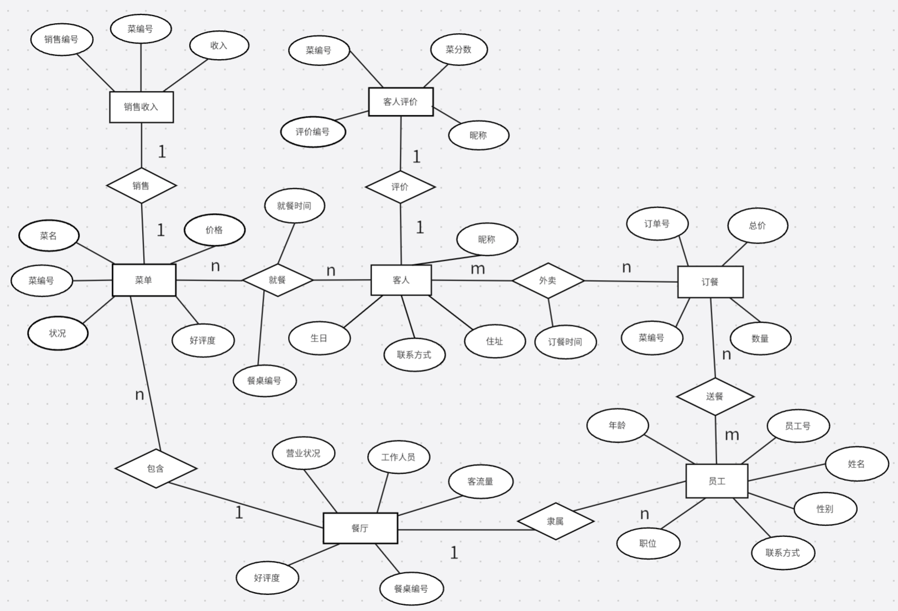
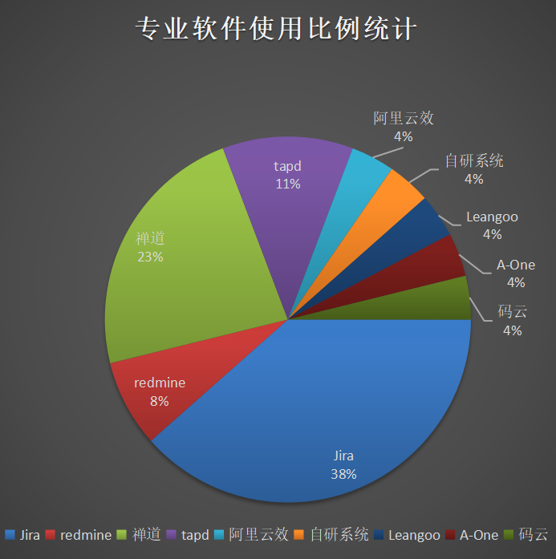
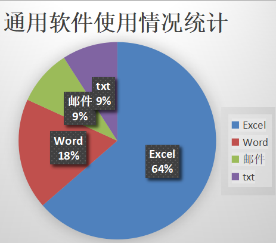
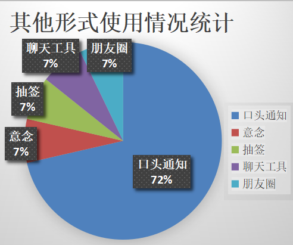
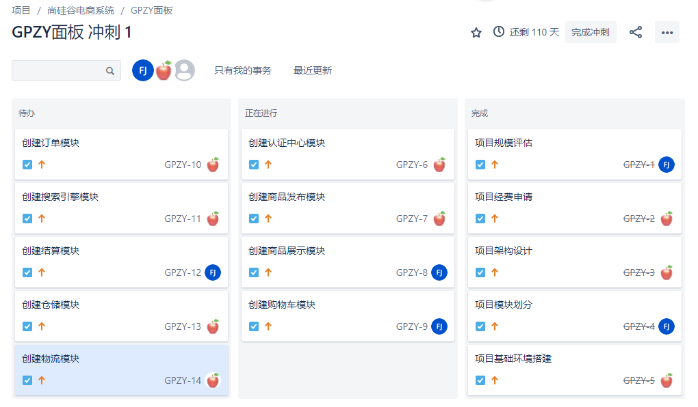
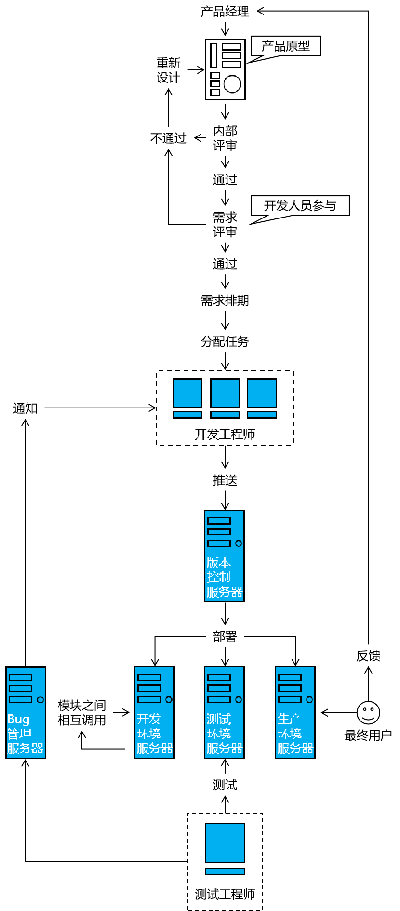

---
tags:
  - interview
  - 尚硅谷
  - Java
  - 团队协作与开发流程
source: 尚硅谷Java技术之高频面试题-v2025.1
title: 开发实践：团队协作与开发流程
---

# 开发实践：团队协作与开发流程

> 来源：尚硅谷 Java 技术之高频面试题 v2025.1 · 开发实践：团队协作与开发流程

# 1. 你上一家公司团队构成

- 后端工程师：都会有，一般小一点的团队3~5人；再大的团队就会分项目组，每组3~5人
- 前端工程师：目前来说不是每个公司都有
  - 公司不设前端岗：由后端负责写前端
  - 公司设置前端岗：前端人数会比后端少很多，比例大概是5:1
- 测试工程师：和前端情况一样
- 运维工程师：大公司才会有，小公司肯定没有
- DBA数据库管理员：更加是大公司才会有，小公司肯定没有

# 2. 在公司里谁负责建数据库表

- 整个项目全局范围的数据库表：项目启动时统一创建
- 专属于各个模块的数据库表：由该模块负责的程序员自己创建

# 3. 如何根据需求文档或原型页面创建数据库表？

## 3.1. 相关理论：三大范式

### 3.1.1. 数据库三大范式简介

数据库的三大范式是为了确保数据的结构合理、减少冗余和提高数据完整性而设立的设计原则。通俗地说，就是为了让数据存储得更科学、更高效。下面用简单的例子来解释这三个范式：

#### 3.1.1.1. 第一范式（1NF）：确保每一列都是不可分割的基本数据项

**通俗理解**：每个单元格里只能放一个值，不能有多个值混在一起。

**举例**：

- **不满足1NF**：假设有一个表记录学生的课程信息，其中一列是“课程”，值为“数学, 英语, 物理”。这就不符合1NF，因为一个单元格里包含了多个值。
- **满足1NF**：应该将“课程”这一列拆分成多行，每行只记录一门课程，比如一行是“数学”，另一行是“英语”。

#### 3.1.1.2. 第二范式（2NF）：在满足第一范式的基础上，确保表中的非主键列完全依赖于主键

**通俗理解**：除了主键外，其他列必须直接依赖于主键，而不是部分依赖。

**举例**：

- **不满足2NF**：假设有一个表记录订单信息，包含“订单号”、“商品编号”、“商品名称”、“客户姓名”、“客户地址”。这里“客户姓名”和“客户地址”依赖的是“客户”，而不是“订单号”，所以不满足2NF。
- **满足2NF**：应该将订单信息和客户信息分开成两个表，一个表记录订单信息（订单号、商品编号、商品名称），另一个表记录客户信息（客户姓名、客户地址），通过“客户ID”关联。

#### 3.1.1.3. 第三范式（3NF）：在满足第二范式的基础上，确保表中的非主键列只依赖于主键，而不依赖于其他非主键列

**通俗理解**：除了主键外，其他列不能互相依赖。

**举例**：

- **不满足3NF**：假设有一个表记录员工信息，包含“员工ID”、“部门ID”、“部门名称”、“员工姓名”。这里“部门名称”依赖于“部门ID”，而不是直接依赖于“员工ID”，所以不满足3NF。
- **满足3NF**：应该将员工信息和部门信息分开成两个表，一个表记录员工信息（员工ID、部门ID、员工姓名），另一个表记录部门信息（部门ID、部门名称），通过“部门ID”关联。

### 3.1.2. 总结

- **第一范式（1NF）**：确保每一列都是单一值。
- **第二范式（2NF）**：确保非主键列完全依赖于主键。
- **第三范式（3NF）**：确保非主键列之间没有依赖关系。

遵循这些范式可以帮助我们设计出更加合理、高效的数据库结构，避免数据冗余和不一致的问题。

这里我们要指出的是：实际开发中只是大致遵循三大范式，但不是刻板教条拘泥于范式。有的时候会有一些局部地方违背范式。

比如：订单表通过外键关联客户表，按照第二范式，订单表中不应该有“客户名称”；

但实际项目中为了减少关联查询，会把“客户名称”作为“订单表”中的冗余字段，这就违反了第二范式。

## 3.2. 相关理论：ER模型

ER模型，即实体-关系模型（Entity-Relationship Model），是一种用于描述和设计数据库结构的概念模型。它通过**实体、属性和关系**三个核心元素来表示现实世界中的数据结构和数据之间的逻辑关系。以下是对ER模型的详细介绍：

1. **实体（Entity）**：实体是ER模型中的基本单位，代表现实世界中可以独立存在的事物或对象。每个实体都有一组属性来描述其特征。实体可以是具体的，如“学生”、“教师”、“图书”等，也可以是抽象的，如“课程”、“部门”、“项目”等。在ER图中，实体通常用矩形表示，实体名称写在矩形内部。
2. **属性（Attribute）**：属性是描述实体特征的元素。例如，一个人的姓名、年龄、性别等都是属性。属性可以是简单属性（不可再分的基本数据），复合属性（由多个简单属性组成的属性）或多值属性（可以有多个值的属性）。在ER图中，属性通常用椭圆形表示，并连接到相应的实体上。
3. **关系（Relationship）**：关系是ER模型中描述实体之间联系的部分。关系可以是一对一、一对多或多对多的。在ER图中，关系通常用菱形表示，并通过连线与相关的实体连接。关系的命名应简洁明了，能够准确描述实体之间的关联。

总的来说，ER模型是一种强大的工具，它帮助人们以直观的方式理解和描述现实世界的复杂关系，从而设计出高效、准确的数据库系统。

生成ER图的软件工具有多种，以下是对一些生成ER图软件工具的具体介绍：

1. **boardmix**：boardmix支持多人在线协作，适用于团队协作、创意设计、文档笔记和知识整理等多种场景。它提供了丰富的图形绘制工具和模板库，包括ER图模板，方便用户快速创建ER图。
2. **Lucidchart**：Lucidchart是一款在线协作图表工具，支持ER图的创建和共享。它具有易用的界面和丰富的模板库，适用于个人和团队。
3. [**Draw.io**](http://Draw.io)：Draw.io是一款免费、开源的在线图表工具，支持ER图的绘制。它具有强大的导出选项和多平台兼容性，无需安装任何软件，用户可以直接通过浏览器访问和使用。
4. [**Dbdiagram.io**](http://Dbdiagram.io)：Dbdiagram.io是一个专门为数据库设计的在线工具，支持ER图的创建和自动生成SQL代码。它具有直观的界面和协作功能，适用于数据库设计师和开发团队。
5. **Microsoft Visio**：Visio是Microsoft的图表设计工具，支持ER图的绘制。它具有强大的功能，适用于大型项目和企业。Visio内置了大量的数据库模板，包括ER图模板，用户可以根据需要选择并应用不同的样式。

总的来说，这些ER图工具各有特色，用户可以根据自己的需求选择合适的工具来创建和管理ER图。

## 3.3. 操作落地

1. 查看需求文档、原型页面或接口文档，确认所有要保存到数据库的数据有哪些
2. 设计出各个实体（Entity）
3. 确定各个实体内部需要包含哪些属性（Attribute）
  1. 要求1：涵盖所有需要保存的数据
  2. 要求2：基本满足三大范式
  3. 要求3：一定要注意除了表面上看得到的数据之外，还有哪些隐含的数据
4. 确定各个实体之间的关联关系（Relationship）

# 4. 你们之前团队中任务分配与任务进度跟进使用的是什么软件？

## 4.1. 一、概述

目前各个公司的研发团队进行任务分配的具体做法可以说是五花八门，大体上可以分成：专业软件、通用软件和其他方式三种情况。

### 4.1.1. ①专业软件统计数据

### 4.1.2. ②通用软件统计数据

### 4.1.3. ③其他形式统计数据

## 4.2. 二、jira简介

专业软件中使用率最高的Jira工作界面截图如下：

# 5. 项目是怎么从0到1开发出来的？

## 5.1. 一、立项

### 5.1.1. 1、传统软件开发项目

企事业单位或政府部门面向社会发布项目招标计划，软件开发企业进行投标、竞标。软件开发企业中标后开始开发。双方会签订合同，在合同中明确所需开发的软件项目应该包含什么功能。开发团队将产品开发完成后需要甲方签字确认。此后如果需要对软件项目进行修改或增加功能则往往需要再付钱才行。

### 5.1.2. 2、互联网项目

#### 5.1.2.1. ①个人发起

#### 5.1.2.2. ②企业发起

## 5.2. 二、软件工程

### 5.2.1. 1、概念

随着应用软件的功能越来越复杂，一个能够满足用户需求的软件产品越来越不是一些if...else或for循环的简单组合。复杂的软件产品必须在开发之前进行规划，按照工程化的方式进行管理和控制，协调各个部门、小组、成员才能够有序的推进项目开发工作的进行，进而达到预期的效果。

我们想象一下在建筑工程中建设一座大楼：绝不可能是某个人一时兴起就挥舞铁锹开始挖地基。软件开发也是一样，真正能够在现实生活中投入使用的软件项目是不可能直接从敲代码开始的。

### 5.2.2. 2、瀑布模型

将软件生存周期的各项活动规定为按照固定顺序连接的若干阶段工作，从上到下推进，如同瀑布一样，因此称为瀑布模型。

#### 5.2.2.1. ①瀑布模型的优点

开发规范清晰严格

每一个阶段都严格定义了要完成的任务，每一个阶段都有清晰的目标，甚至有明确的可以检查的结果，从而可以强制要求程序员按照规范开发。

文档齐备

严格规定了每个阶段必须提交的文档，最终在项目开发完成时同时产生一套齐备的项目文档，便于日后维护和新成员接手。

#### 5.2.2.2. ②瀑布模型的缺点

僵硬死板

由于瀑布模型几乎完全依赖于书面的规格说明，很可能导致最终开发出的软件产品不能真正满足用户的需要。也就是说灵活性太差，越后面的阶段发现问题越难以调整。瀑布模型只适用于项目开始时需求已确定的情况。

总的来说，瀑布模型是一种应付需求变化能力非常弱的开发模型。

### 5.2.3. 3、其他模型

- 边做边改模型(Build-and-Fix Model)
- 快速原型模型(Rapid Prototype Model)
- 增量模型(Incremental Model)
- 螺旋模型(Spiral Model)
- 演化模型(evolution model)
- 喷泉模型(fountain model)
- 智能模型(四代技术(4GL))
- 混合模型(hybrid model)
- RAD模型

## 5.3. 三、敏捷开发

### 5.3.1. 1、曾经

在传统软件项目开发过程中，开发团队会和具体的客户基于项目功能需求签订协议，根据合同中规定的功能进行开发。所以开发过程中能够基于相对稳定的功能需求基于瀑布模型开发。

### 5.3.2. 2、互联网时代的新挑战

发展到互联网时代后，软件开发的方方面面都遇到了前所未有的挑战。在软件工程方面，程序员发现他们不再面对具体的用户，而是互联网上一个又一个人群。你既不能明确说出来他们是哪个城市、哪个公司、哪个部门或学校又更不能跟某个人签订固定功能的软件开发协议来确定任务。所以互联网时代的项目开发面临这样五个问题：

- 特定受众模糊，所以产品经理们会根据典型用户的特征创建用户画像，作为一个假想的用户个体。
- 项目功能边界不稳定，需要在市场运作中摸索
- 项目功能需要根据用户的新需求进行迭代更新
- 项目的终端设备日新月异，从PC客户端到PC浏览器再到移动客户端再到移动端浏览器不断发展，相应的交互方式和系统界面都需要持续改进
- 竞争激烈，不及时占领市场很可能被淘汰

上述种种情况已经不允许程序员再按照瀑布模型按部就班开发系统，这样太慢而且不灵活。敏捷开发理念就是在这样的时代背景下应运而生。

### 5.3.3. 3、敏捷

#### 5.3.3.1. ①概念

如果把互联网环境比作一个丛林，那么基于敏捷理念进行开发的一个互联网应用就是丛林中奔跑觅食的一只猎豹。为了生存它会在还不是很强大的时候就进入丛林捕猎，在奔跑中强化肌肉，在受伤后修复伤口，甚至是磨砺尖牙厉爪。如果有需要，它会进化出一对翅膀。当然，一个错误的决定也可能导致它的败亡。比如长出三对翅膀后不堪重负无法捕获猎物饿死。

基于敏捷理念开发的项目更应该被看作是一个生命体。环境一直在改变，它也一直在改变。环境发生了变化，它也要及时作出应对：丛林突然变冷，猎豹需要长出更厚的皮毛。它自己新的想法也要尽快付诸实践，在环境中检验自己的想法是不是正确：长出不同花色的皮毛看看异性是否喜欢从而让自己更受欢迎。

虽然敏捷开发和传统瀑布模型开发都会把项目划分为模块分别开发，但是敏捷开发中的大部分时间是在项目正在运行的同时不断做出修正和改进。想象一下一台高速飞驰的汽车，一边行驶一边加装了一门等离子炮，一边行驶一边把燃油发动起替换为了核聚变发动机。

必须指出的是：项目总体采用敏捷方式开发，但是具体模块、具体功能内部开发还是会遵循瀑布模型的顺序：先确定需求、然后设计逻辑结构、代码实现、测试、上线。

#### 5.3.3.2. ②实现

- **原型**：将最初的功能创意想法绘制成草图，基于这个草图让功能需求更加直观，前端和后端工程师据此分头开始各自的工作。相比较瀑布模型省略了大量的中间环节，快速启动项目。
- **持续部署**：项目不能满足于单元测试通过，而需要在开发过程中保证本模块可以在服务器上运行，避免大范围返工。
- **持续集成**：项目不能满足于模块独立运行正确，还必须要保证各个模块集成在一起后可以正常工作，对于庞大复杂的系统尤其如此。
- **持续交付**：要在项目有细微升级时就交付给最终用户，及时获得反馈，而不是很长时间后推出一个重大更新版本——这会导致对用户体验的感知严重滞后。

# 6. 软件项目的开发流程是什么？

# 7. 开发团队内你需要知道的黑话

## 7.1. 开发环境

缩写

对应单词

含义

PRO、PROD

Product

生产环境

PRE

预发布环境

DEV

Development

开发环境

## 7.2. 测试

缩写

对应单词

含义

TC

Test Case

单元测试用例

UAT

User Acceptable Test

用户接受度测试

SIT

System Integration Test

系统集成测试

## 7.3. 岗位名称

缩写

对应单词

含义

PM

Project Manager

项目经理

PM

Product Manager

产品经理

RD

Research and Development

研发

FE

Front-End

前端

UE

User Experience

用户体验

UI

User Interface

用户界面

QA

Quality Assurance

质量保证

OP

Operations

运维

DBA

Database Administrator

数据库管理员

## 7.4. 文档

缩写

对应单词

含义

SOP

Standard Operation Procedure

标准作业流程

MRD

Market Requirement Document

市场需求文档

PRD

Product Requirements Document

产品需求文档

FSD

Functional Specifications Document

功能详细说明
