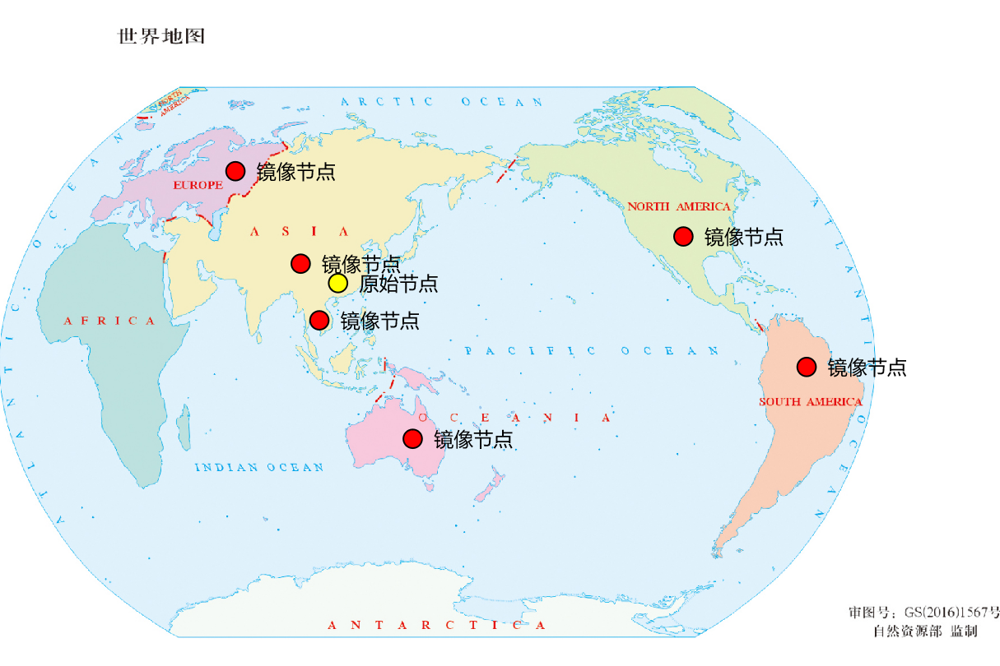
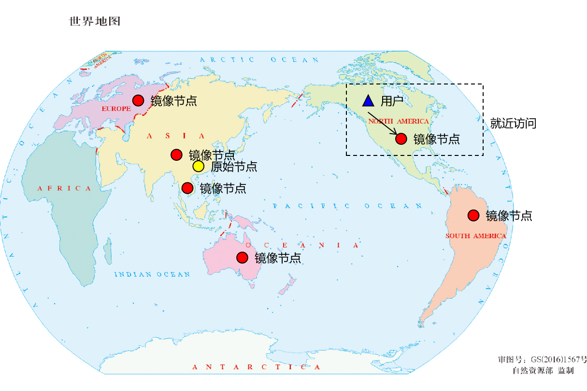
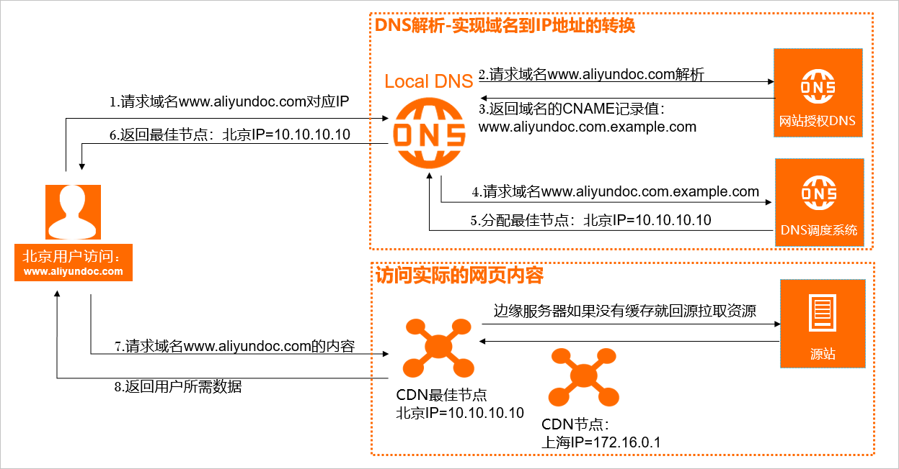
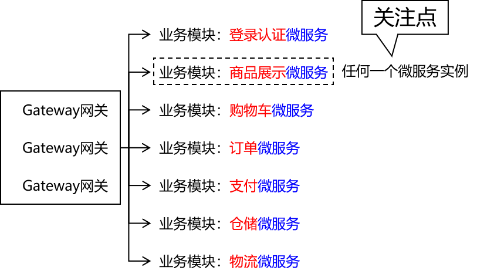
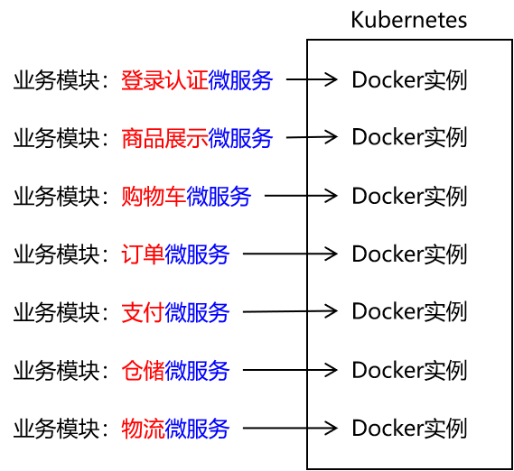
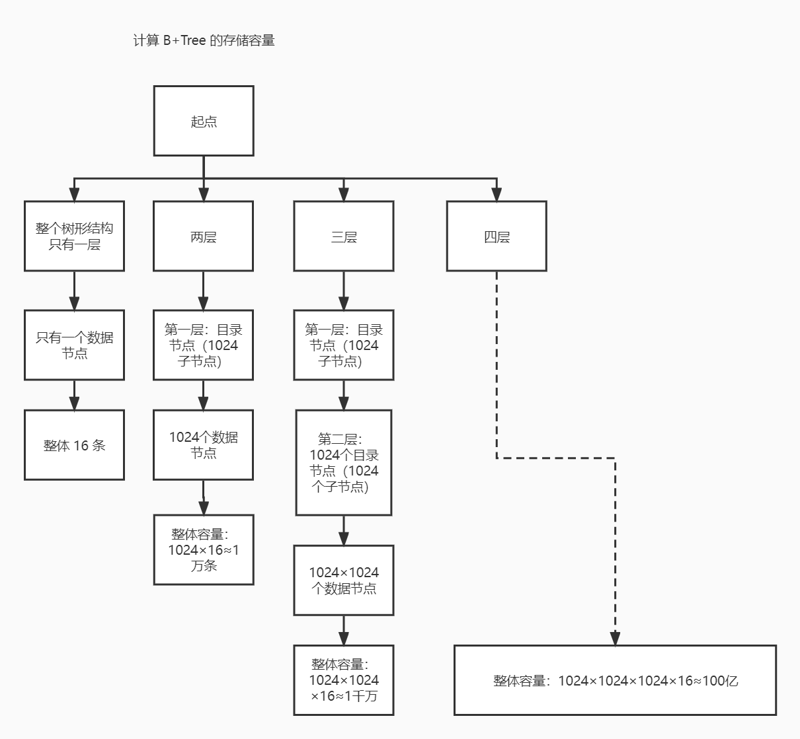

---
tags:
  - interview
  - 尚硅谷
  - Java
  - 场景题
source: 尚硅谷Java技术之高频面试题-v2025.1
title: 开发实践：场景题
---

# 开发实践：场景题

> 来源：尚硅谷 Java 技术之高频面试题 v2025.1 · 开发实践：场景题

# 1. 业务量突然提升100倍QPS如何应对？

## 1.1. 不同水准的不同工程师有不同回答

- 没有进取心的工程师这么说：这是运维岗负责的事情，不归我管
- 有进取心的工程师看到公司的项目因为突发流量和被压垮，用户体验直线下降，大量用户投诉，给公司带来了很大的经济损失，开始思考如何优化系统结构，弹性配置资源
- 身经百战的工程师这么说：无需应对，因为我们早已从项目各个组成部分都做好了充分的预案，即使QPS突然提升100倍也不会突破系统的弹性运算能力，保证系统平稳可靠运行。具体优化措施如下：
  - 镜像系统多地部署，基于CDN技术实现就近访问
  - 项目入口Nginx服务器保障与优化
  - 业务运算动静分离
  - 业务运算动态部分低更新概率：页面静态化
  - 业务运算入口Gateway网关微服务集群化配置
  - 业务运算动态部分高更新概率：动态扩缩容

## 1.2. 镜像系统多地部署

### 1.2.1. 概念

把全球划分为多个区域，在每一个区域运算平台部署一个系统镜像，原始节点和镜像节点之间运算逻辑相同，数据同步。好处：

- 对我们的系统来说：把全网各个地区的总负载分摊到各个区域，降低系统的并发压力
- 对用户来说：就近访问镜像节点，缩短响应时间，提升用户体验





### 1.2.2. 技术实现方案

以阿里云CDN技术为例：



## 1.3. 项目入口Nginx服务器保障与优化


- Nginx+Keepalived双主热备、一主一备等方式实现高可用
- 基于LVS负载均衡技术搭建Nginx集群
- 基于HAProxy负载均衡技术搭建Nginx集群

## 1.4. 业务运算动静分离


发挥Nginx高性能的优势，索取静态资源的请求由Nginx负责响应，提高响应速度的同时减轻后端Java程序服务器的压力

动态资源由Nginx路由到后端Java程序服务器

## 1.5. 业务运算动态部分低更新概率：页面静态化


### 1.5.1. 典型应用场景

在电商系统中，商品详情数据就是更新频率很低，查询频率很高的数据

- 为什么更新频率低？因为商品更新换代速度快，一款商品还没有修改就被新产品替代了，上架之后基本不会修改
- 为什么查询频率高？因为用户购买商品之前肯定要仔细了解商品详情再决定是否购买

### 1.5.2. 大致的实现原理

- 第一步：用户第一次访问指定id的商品数据时，使用视图模板技术生成完整的HTML页面（后端Java程序执行）
- 第二步：把HTML页面放到Nginx上缓存
- 第三步：以后用户再访问该指定id的商品数据页面，从Nginx上即可获取，不需要执行Java程序
- 第四步：后续如果商品数据有变动
  - 商品数据修改：重新生成HTML页面并保存到Nginx
  - 商品下架：把Nginx上的HTML页面删除

## 1.6. 业务运算入口Gateway网关微服务集群化配置


Gateway网关作为整个微服务系统的入口，所有请求都要从这里经过，所以非常容易成为整个系统的性能瓶颈

那么为了提高Gateway网关的吞吐量，并提高可用性，需要根据实际需求搭建集群

## 1.7. 业务运算动态部分高更新概率：动态扩缩容



### 1.7.1. 需求背景

用户在访问系统时，流量并不是均匀分布的，而是有高峰，有低谷，而为了应对流量波动传统的做法是手动增减服务器资源

- 流量高峰到来：增加服务器资源，应对高峰
- 流量高峰过去：减少服务器资源，节约成本

但人工手动的来做上述操作会有如下问题：

- 滞后性：对于突发流量增加，从系统发出警报再到人工操作完成需要较长的时间；
- 不精准：手动管理服务器资源增减，往往前期大流量没有承接住，后面高峰过去又白白浪费资源
- 工作繁琐：所有重复性、枯燥、无聊的事情都不适合人来做

### 1.7.2. 解决方案：云原生动态扩缩容

每一个微服务都封装为一个Docker实例并交由Kubernetes管理：



某个实例访问压力增加时Kubernetes自动复制实例构成集群分摊负载：


访问压力下降，Kubernetes自动释放空闲实例：


### 1.7.3. 方案优势

- 节约人力资源，减轻维护工作压力
- 节约资金成本，让消耗的资金更精准的用于承接访问压力
- 快速配置资源，提升用户体验

## 1.8. 相关扩展

把频繁查询数据存入Redis作为缓存，是为了应对高并发问题吗？

### 1.8.1. 缓存的作用

缓存的作用是『缩短响应时间』，例如Redis从内存提取数据就比MySQL从硬盘提取数据要快，这样就缩短了请求响应时间

### 1.8.2. 应对高并发

所谓『并发量』其实就是应用服务器在同一时间要处理的请求数量

而处理每一个请求都需要占用应用服务器内的一个线程

那么『并发压力大』其实就是应用服务器内『用来处理请求的线程』不够用了

所以应对高并发的本质就是在并发量大的时候增加处理请求的线程数量

而『使用缓存』并没有增加『线程资源』，所以使用缓存其实并不是直接用于解决高并发问题的

### 1.8.3. 有帮助

虽然没有直接关系，但从效果上使用缓存对于缓解并发压力也是有帮助的，为什么这么说呢？

- 如果不使用缓存，处理一个请求平均需要800ms，那么一个请求占用线程资源就是800ms；
- 如果使用缓存，处理一个请求平均需要300ms，这就大大缩短了线程资源被占用的时间。

线程资源被占用的时间短了，就更容易被释放出来，去处理其它请求

### 1.8.4. 举例说明

一个饭馆客人太多了，如何应对？

- 单店内部增加服务员的数量（应用服务器内增加线程池的容量）
- 开连锁店（应用服务器配置集群）
- 改进单店内部服务流程，原来服务员上菜需要到后厨去拿，现在在饭厅门口就能拿到，上菜更快（应用缓存缩短响应时间）

# 2. 让你设计一个订单号生成服务，该怎么做？

## 2.1. 订单号格式的基本要求

- 唯一性：在整个系统的全局范围内，订单号是不能重复的
- 高效性：订单服务访问量很大，所以订单号要设计一个高效的生成算法，以避免长时间的等待或计算开销
- 不溢出：订单号生成方式要充分考虑系统订单数量，如果是通过整数值自增方式生成订单号，那么一定要避免在临界值上+1导致数值溢出
- 易读性：就系统使用者来说，无论是用户还是后台管理员，都需要经常查阅订单号，所以订单号格式如果非常复杂就不好
- 表意性：订单号在满足上述要求的基础上最好还能够直观体现出该订单的生成时间、用户id等信息

## 2.2. 方案举例

### 2.2.1. 自增序列

最简单、最容易想到的方案，但需要考虑很多相关问题：

- 线程安全问题导致的订单号重复：为了解决这个问题应尽量不在Java代码中执行自增，因为Java代码自增如果不加锁会有线程安全问题，加锁会严重降低执行效率；较好的方式是使用数据库表的AUTO_INCREMENT自增机制
- 防止数据溢出：每个数据类型都存在有效范围，一旦在临界值上+1就会导致溢出，所以务必全面考虑

方案优势：

- 实现方式简单
- 计算效率较高

方案缺陷：

- 使用自增的方式生成的订单号没有表意性，无法看出订单相关信息
- 存在溢出的风险
- 在并发环境下有可能导致订单号重复

### 2.2.2. UUID

使用UUID作为订单号，几乎可以保证全局唯一性，计算效率可以接受。但是，UUID相对较长，可能影响存储和索引效率，表意性也不好。

### 2.2.3. 分布式id生成器

点击参考：《[基础理论：分布式](https://www.wolai.com/66VHx8Uany7KSTLLy8Am7k)》中《分布式id生成方案》

### 2.2.4. 相关信息拼接

如果我们能够限定『系统中同一个用户在同一个时间不能生成多个订单』，那么就可以据此设定订单格式如下：

- 紧凑格式的年月日、小时、分、秒、毫秒，例如：20250102163724088
- 用户ID：270316

那么拼接后得到：20250102163724088270316

这种方式的最大优势是表意性很好，一看就知道订单生成时间和所属的用户

### 2.2.5. 相关信息汇总后HASH

如果特定功能不希望相关信息直接暴露出来，也可以把相关信息封装到对象中，然后将对象执行HASH运算得到唯一值。

相关信息可以包括：

- 下单时间
- 用户ID
- 订单商品列表，包括商品的ID、价格等信息
- ……

## 2.3. 方案补充完善

- 缓存机制： 为了提高性能，可以引入缓存机制。将最近生成的订单号缓存起来，避免频繁地访问数据库或分布式ID生成器。
- 高可用性： 考虑实现多个订单号生成服务的实例，以提供高可用性。可以使用负载均衡来分配请求，同时保证各实例之间的订单号唯一性。
- 错误处理： 考虑异常情况，如数据库连接断开或分布式ID生成器不可用。设计适当的错误处理机制，确保系统的稳定性。
- 日志记录： 记录每个生成的订单号，包括生成时间、相关信息等，以便后续追踪和排查问题。

# 3. 订单到期关闭如何实现？

## 3.1. 总体思路

- 定时任务
  - 宏观扫描：宏观上扫描所有订单，发现超时未支付订单后执行关闭，时间误差较大
  - 精准定时：下单操作完成后就触发一个延迟指定时间的定时任务，时间精准但性能开销较大
- 消息队列中的延迟队列：下单操作完成后把一个延迟消息存入消息队列，由消费端在收到消息时检查订单是否超时，精准度和性能方面基本可以接受，但实现起来较为复杂

实际开发中采用的通常是延迟队列方式

## 3.2. 具体方案参考

1. **被动关闭**
  - **描述**：用户创建订单后，系统不做主动关单操作，而是在用户访问订单时判断是否超时，如果超过时间则进行关单操作。
  - **优点**：实现简单，不需要开发定时任务功能。
  - **缺点**：如果用户一直不查看订单，脏数据会一直存在数据库中；查询过程中进行写操作，耗时长且有失败的可能。
2. **定时任务**
  - **描述**：通过调度平台定期扫描所有到期的订单并执行关单动作。
  - **优点**：实现简单，适用于小型项目。
  - **缺点**：时间不精准，无法处理大订单量，对数据库造成压力，分库分表问题复杂。
3. **JDK自带的延迟队列**
  - **描述**：使用JDK自带的`DelayQueue`实现订单的延迟关闭。
  - **优点**：无需依赖第三方框架，实现简单。
  - **缺点**：基于JVM内存，数据量大时可能导致OOM问题，不适合分布式场景。
4. **Netty的时间轮**
  - **描述**：利用Netty的`HashedWheelTimer`实现时间轮，降低插入和删除操作的时间复杂度。
  - **优点**：效率高，任务触发延迟低。
  - **缺点**：基于内存，扩展性差，不适合分布式场景。
5. **Kafka的时间轮**
  - **描述**：使用Kafka的时间轮（TimingWheel）实现订单的延迟关闭。
  - **优点**：O(1)时间复杂度，性能高，适合分布式场景。
  - **缺点**：实现复杂，需要依赖Kafka。
6. **RocketMQ延迟消息**
  - **描述**：利用RocketMQ的延迟消息功能，在订单创建后发送一个延迟消息，等待指定时长后取消订单。
  - **优点**：实现简单，支持高并发和分布式。
  - **缺点**：延迟消息的时长受限于预定义的时长，灵活性较低。
7. **RabbitMQ延迟队列**
  - **描述**：通过RabbitMQ的死信队列或`rabbitmq_delayed_message_exchange`插件实现延迟消息。
  - **优点**：易于部署和使用，支持消息重试和顺序处理。
  - **缺点**：性能较低，不适合高吞吐量场景。
8. **Redis的zset**
  - **描述**：使用Redis的有序集合（zset），将订单超时时间戳与订单号关联，通过扫描第一个元素判断是否超时。
  - **优点**：性能高，支持高并发。
  - **缺点**：可靠性相对较低，可能会丢失消息，需要手动实现消息重试机制。

总的来说，这些方案各有优缺点，可以根据实际业务需求和系统架构选择合适的方案。例如，对于实时性要求高且数据量不大的场景，可以选择Redis的zset或RocketMQ延迟消息；对于需要高并发和分布式支持的场景，可以选择Kafka的时间轮或RocketMQ延迟消息。

# 4. 如何设计一个购物车功能？

## 4.1. 功能入口

- 查看购物车列表
- 在商品搜索结果列表页，把商品添加到购物车
- 在商品详情页，把商品添加到购物车

## 4.2. 业务功能

- 添加商品
- 查看购物车中商品列表
  - 细节1：显示购物车中所有商品的列表
  - 细节2：修改购物车中某一项商品的数量
  - 细节3：删除购物车中某一项商品
  - 细节4：展示每一项商品的单价、数量、小计金额
  - 细节5：展示整个购物车中所有被选中商品小计金额累加的总金额

## 4.3. 购物车数据和用户关联

购物车中添加的商品肯定是属于添加购物车的用户，但是如果用户没有登录呢？

- 应对措施1：如果用户没有登录，则禁止添加购物车（大多数电商平台的做法，不必考虑数据合并）
- 应对措施2：允许用户在没有登录时添加购物车，那么就需要解决两个问题：
  - 问题1：用户未登录时购物车数据如何储存
  - 问题2：用户登录后数据合并

## 4.4. 数据存储方案

### 4.4.1. 关系型数据库中的数据结构

为了数据持久化保存，在MySQL中创建购物车数据库表：cart_info

| 字段名称 | 说明 |
| --- | --- |
| id | 主键 |
| user_id | 可能性：正式用户id 可能性：临时用户id |
| sku_id | 商品id |
| cart_price | 购物车中商品价格 |
| sku_num | 商品的数量 |
| img_url | 商品的默认图片地址（冗余字段） |
| sku_name | 商品的名称（冗余字段） |
| is_checked | 当前商品条目是否被选中，被选中的商品会参与结算 |

### 4.4.2. NoSQL数据库中的数据结构

为了提高查询速度，在Redis中对数据进行缓存

#### 4.4.2.1. Key结构设计

前缀和后缀都有了：

```Java
public static final String USER_KEY_PREFIX = "user:";
public static final String USER_CART_KEY_SUFFIX = ":cart";
```

我们需要考虑的是中间的数据，key彼此之间互相区分也是靠中间部分。考虑到每一个购物车数据都是属于某一位用户的，所以中间部分使用用户id。

但是需要注意：用户id分两种情况

- 正式用户id（登录）
- 临时用户id（未登录）

#### 4.4.2.2. value结构

Redis中数据结构适用场景：

| 数据类型 | 适用场景 |
| --- | --- |
| string | 单个简单字符串 复杂对象序列化得到的字符串，通常是JSON格式 |
| list | 需要模拟队列或堆栈的情况 |
| set | 多个数据需要去重 |
| zset | 集合成员同时附带一个分数值 |
| hash | 键值对形式 filed：作为键 value：作为值，单个值没有嵌套结构 |

考虑到我们购物车功能中需要针对具体任何一条商品数据修改价格或做删除操作，所以适合使用hash类型来保存。

- filed：使用skuId的值来设定
- value：CartInfo对象的JSON字符串（不需要我们自己转换、解析，RedisTemplate已设定JSON序列化器）

# 5. 每天100w次登录请求，4C8G机器如何做JVM调优？

## 5.1. 名词解释

4C：4 CPU cores，4个CPU核心

8G：8G内存

## 5.2. 内存分配

### 5.2.1. JVM默认设置

参数

描述

示例

-Xms

初始堆大小

-Xms512m（初始堆大小为512MB）

-Xmx

最大堆大小

-Xmx2g（最大堆大小为2GB）

-XX:PermSize

永久代的初始大小（JDK 8及以后被Metaspace取代）

-XX:PermSize=128m

-XX:MaxPermSize

永久代的最大大小（JDK 8及以后被Metaspace取代）

-XX:MaxPermSize=256m

-XX:MetaspaceSize

元空间的初始大小

-XX:MetaspaceSize=128m

-XX:MaxMetaspaceSize

元空间的最大大小

-XX:MaxMetaspaceSize=256m

-Xmn

年轻代的大小（JDK 8及以后使用-Xmn替代-XX:NewSize和-XX:MaxNewSize）

-Xmn512m

-XX:NewSize

新生代的初始大小（旧版JDK）

-XX:NewSize=512m

-XX:MaxNewSize

新生代的最大大小（旧版JDK）

-XX:MaxNewSize=512m

-XX:NewRatio

老年代与年轻代的比例

-XX:NewRatio=2

-XX:SurvivorRatio

Eden区与Survivor区的比例

-XX:SurvivorRatio=8

-XX:TargetSurvivorRatio

目标幸存区比例，用于计算动态调整的幸存区比例

-XX:TargetSurvivorRatio=90

-Xss

每个线程的栈大小

-Xss1m（每个线程的栈大小为1MB）

-XX:ThreadStackSize

设置线程栈大小（与-Xss相同，但更明确）

-XX:ThreadStackSize=1024k

### 5.2.2. 实际设置

题目中给出的服务器内存是8G，在8GB内存的服务器上配置JVM参数时，需要综合考虑堆内存、新生代大小、老年代大小、栈内存以及垃圾收集器的选择。以下是一个基于通用场景的配置建议：

1. **堆内存设置**
  - **初始堆大小（-Xms）和最大堆大小（-Xmx）**：通常建议将两者设置为相同的值，以避免堆内存的动态调整带来的性能开销。对于8GB内存的服务器，可以将堆内存设置为4GB，即`-Xms4g -Xmx4g`。
2. **新生代大小**
  - 新生代的大小可以设置为堆内存的1/3至1/4。在这个例子中，可以将新生代大小设置为1GB，即`-XX:NewSize=1g -XX:MaxNewSize=1g`。
3. **老年代大小**
  - 老年代的大小通常是堆内存减去新生代大小后的剩余部分。在这个配置中，老年代大小将是3GB（4GB堆内存 - 1GB新生代）。
4. **栈内存**细节说明： 从逻辑上来说，JVM支持的线程总数量=栈内存总大小÷单个线程可申请的空间大小（也就是-Xss） 但JVM中并不存在专门针对栈内存总大小的参数设置，也就是说我们无法人为指定栈内存总大小 当JVM启动新的线程就会向操作系统申请更大的内存空间，如果申请失败则抛出OutOfMemoryError 有人说：哎，不对呀？搞错了吧！栈溢出不是抛StackOverflowError么？ 没搞错，分配给单个线程的栈空间，在线程运行时发生内存溢出抛出StackOverflowError。 而如果JVM运行的线程太多，导致操作系统都无法分配更多的内存空间，此时抛出的就是OutOfMemoryError 但是考虑到线程通常存在的时间很短，朝生夕死，这样又不断的释放出可用的空间，再加上每个线程占用的空间都不大，所以其实因为线程过多而导致内存溢出的情况几乎不可能出现 回到题目上来，我们上面说了这么多就是为了证明我们无法通过JVM内存参数设置来限定业务线程的数量 那么业务线程的数量怎么限制呢？ 答：线程池
  - 栈内存用于存储线程相关的信息，建议设置为较小的值，例如512KB，即`-Xss512k`。
5. **垃圾收集器选择**
  - 如果服务器有多个CPU核心，可以考虑使用并行垃圾收集器，如`-XX:+UseParallelGC`。
  - 对于延迟敏感的应用，推荐使用CMS垃圾收集器，即`-XX:+UseConcMarkSweepGC`。
  - 对于大内存服务且要求高吞吐量的应用，G1垃圾收集器是一个不错的选择，即`-XX:+UseG1GC`。
6. **并发线程数**： 调整并发线程数以充分利用多核CPU。对于4核的机器，可以考虑设置参数 -XX:ParallelGCThreads=4 -XX:ConcGCThreads=2。
7. **内存回收周期**： 根据应用的特点和负载，调整垃圾回收的时间间隔。可以使用参数 -XX:G1NewSizePercent 和 -XX:G1MaxNewSizePercent 来控制新生代的内存分配百分比。
8. **堆区域划分**： G1垃圾回收器允许将堆内存划分为多个区域，可以通过参数-XX:G1HeapRegionSize 来调整每个区域的大小，以优化垃圾回收的效率。
9. **元空间设置**： 对于大量的类加载和反射操作，需要适当调整元空间的大小。可以使用参数 -XX:MetaspaceSize 和 -XX:MaxMetaspaceSize。
10. **JVM日志和监控**： 开启JVM的日志和监控可以帮助你实时了解JVM的运行状态和性能指标，以便及时调整参数。 可以使用参数 -XX:+PrintGC -XX:+PrintGCTimeStamps -XX:+PrintGCDateStamps 来输出垃圾回收日志。

## 5.3. 并发能力分析

每天100万次登录请求是表面现象，具体分解拆开来看，它意味着什么呢？

### 5.3.1. 登录请求

用户登录是属于登录认证模块的业务功能，那么接下来需要考虑的是：

- 整个项目是单体应用还是分布式应用？
- 如果是分布式应用，那么各个模块是全部部署到这台4C8G的机器上，还是分别分开部署？
- 如果每一台4C8G机器运行一个模块，那么该登录认证模块是否搭建集群？

这里我们假设整个项目是分布式项目，各个模块单独部署，登录认证模块部署在4C8G的机器上。至于说这台机器是否需要搭建集群，需要根据访问压力继续分析。

### 5.3.2. 每天100万次登录请求的业务分析

就登录认证模块而言，登录只是多个不同业务功能的其中一个，所以为了推算4C8G机器内线程池该如何设置，4C8G是否需要搭建集群，我们需要一个总的访问量，而不是一个单独的业务功能。

假设登录认证模块的业务功能如下所示：

1. 用户登录
2. 忘记密码
3. 用户注册
4. 用户名是否重复的校验
5. 发送短信验证码
6. token有序性验证
7. 用户个人中心页面展示
8. 用户充值
9. VIP会员有效性验证
10. VIP会员权益校验

所以假设模块的总访问量是登录访问量的10倍，那就是每天1000万次

### 5.3.3. 总访问量的时间分布

每天1000万次访问是在24小时内均匀分布的吗？

很显然不是，大部分请求都会集中在高峰期的时间段内。

为了计算出最高峰的访问压力，我们基于二八定律来分析：

- 80%的访问量发生在20%的高峰期时间段内
- 1000万的80%=800万
- 24小时的20%=4.8小时

但是在这4.8小时内，访问量也不是均匀分布的，我们继续使用二八定律来进行两轮计算：

- 800万的访问量发生在高峰期时间段的20%时间内
- 800万的80%=640万
- 4.8小时的20%=57.6分钟
- 640万的80%=512万
- 57.6分钟的20%=11.52分钟=691.2秒

也就是说在最高峰时期，服务器需要在691.2秒内处理512万个请求

### 5.3.4. QPS

QPS（Queries Per Second，每秒查询率）是衡量服务器处理能力的一个重要指标。它表示每秒钟服务器能够处理的请求数量。

QPS的计算很简单：在一定的时间段内总请求数量÷时间段内有多少秒

代入上面分析得出的数据：服务器需要在691.2秒内处理512万个请求

QPS=512万请求÷691.2秒≈7407

也就是说：服务器在访问量最高峰的时候需要在1秒内处理大约7000个请求

### 5.3.5. 并发量

那么QPS是不是就是并发量呢？二者有极高的相关性，但是并不等同。

QPS能直观帮助我们看到服务器的访问压力，但是QPS并不直接等于并发量。

为什么这么说呢？

- 假设QPS是3，每秒处理3个请求；
- 服务器执行每个请求只需要100ms，且三个请求是先后到达
- 所以此时服务器面对这三个请求是一个一个处理的，那么在这个局部来看，并发量始终是1

那么服务器的并发能力到底是由什么决定的呢？

由于每一个请求都需要一个线程来处理，所以服务器并发能力的上限，就是它最多能够同时运行多少个线程——这么说还是很笼统

因为我们不是关心操作系统最多运行多少个线程，而是JVM最多运行多少个业务线程

实际开发中不允许私自创建新的线程，而是要使用线程池，所以这个问题就进一步明确：服务器并发能力受限于线程池中的最大线程数

那现在基于上一部分的推导，我们要面临的QPS大约是7000，此时的并发量会是多少呢？

假设服务器处理一个请求需要0.5秒，相当于每一个线程每秒处理两个请求，7000个请求对应的并发量需要3500个线程

所以接下来要考虑的就是：为了应对并发压力，线程池中的最大线程数设置成多少合适？

### 5.3.6. 线程池设置

基于上面的分析，我们得出：访问量最高峰的时间段内需要有3500个线程同时运行

那么这是否意味着线程池的最大线程数就设置为3500呢？

线程池中最大线程数的设置首先要考虑CPU核心数量，那么：

- 计算密集型任务：最大线程数=CPU核心数量+1
- I/O密集型任务：最大线程数=CPU核心数量×N（N是正整数）

那么如何区分任务类型呢？

- 计算密集型任务：游戏、视频、图像、声音等多媒体数据的浮点数计算
- I/O密集型任务：一般的后端程序大量调用内部接口或第三方接口、访问数据库、访问Redis、访问消息队列……这些都是I/O操作

所以通常来说后端程序属于I/O密集型任务

题目中设定的CPU核心数是4个核心，3500÷4=875

这么看来把最大线程数设置为CPU核心数的875倍还是太多

### 5.3.7. 集群化配置

- 登录认证模块进行集群化配置，假设集群中有10个实例
- 集群中每个实例内部的线程池最大线程数设置为4×100=400
- 那么总的线程数=400×10=4000，能够涵盖3500个线程的要求

### 5.3.8. 动态扩缩容

考虑到项目仅仅只是在有限的时间内才会面临较大的并发压力，所以没有必要在低谷期也按照高峰期的配置运行

此时使用Kubernetes+Docker实现动态扩缩容就是很好的选择（本页上面已有相关介绍，不再赘述）

## 5.4. 总结

### 5.4.1. 内存设置

内存区域

初始堆空间大小

最大堆空间大小

新生代空间大小

参数设置

-Xms4G

-Xmx4G

-Xmn1G

老年代空间大小

计算得到：3G

每个线程的栈空间大小

-Xss512K

垃圾回收器

-XX:+UseG1GC

并发线程数

-XX:ParallelGCThreads=4
-XX:ConcGCThreads=2

### 5.4.2. 并发能力设置

- 4C8G服务器只运行登录认证模块
- 线程池中最大线程数设置为4的100倍
- 结合动态扩缩容技术动态匹配访问压力

# 6. 不用Redis分布式锁，如何防止用户重复点击？

不使用 Redis 分布式锁时，你仍然可以采取其他方法来防止用户重复点击。以下是一些可能的替代方案：

1. **前端防御**： 在前端实现一些防御措施，例如在用户点击后禁用相应的按钮或链接，直到后台处理完成。这可以通过 JavaScript 来实现。虽然前端控制不是绝对可靠的方法（用户可能通过浏览器开发工具绕过），但可以防止大部分普通用户的重复点击。
2. **请求队列**： 在后端服务中实现一个请求队列，当用户发起请求时，将请求放入队列中进行处理，并且确保同一个用户的相同请求在队列中只有一个。这可以通过用户标识（如用户ID）来实现。在请求处理完成之前，拒绝队列中同一用户的相同请求。
3. **记录请求时间**： 对于每个用户，记录其最近一次请求的时间戳。当用户发起请求时，先检查距离上一次请求的时间间隔是否足够，如果不够则拒绝处理。这可以防止用户在短时间内连续点击。
4. **限制请求频率**： 设置一个全局的请求频率限制，确保同一个用户在一段时间内只能发起有限次数的请求。这可以通过限制 IP 地址、用户标识等来实现。
5. **使用数据库锁**： 尽管不如 Redis 分布式锁高效，但你可以在数据库中使用行级锁或者悲观锁来防止并发修改，从而防止用户重复点击。

需要注意的是，这些方法并不能完全消除用户重复点击的可能性，因为客户端和网络环境复杂多变，总会存在一些特殊情况。综合使用多种方法可以提高防御效果。最终的选择应该基于你的应用需求、可用技术以及风险承受能力来确定。

# 7. 让你设计一个秒杀系统，你会考虑哪些问题？

当设计一个秒杀系统时，需要考虑以下一些关键问题：

1. **高并发处理**： 秒杀活动通常会引起巨大的并发请求，系统需要能够处理大量用户同时发起的请求，确保系统稳定运行，不会因为负载过重而崩溃。
2. **数据一致性**： 在秒杀过程中，多个用户可能会竞争有限的资源，如商品库存。需要确保并发操作不会导致数据不一致或超卖现象。
3. **库存管理**： 如何高效地管理商品库存，避免超卖和卖完的情况，同时能够迅速更新库存状态，是一个关键问题。
4. **限流和防刷**： 需要采取措施限制用户频繁的请求，以防止恶意刷单和重复点击。
5. **队列和异步处理**： 使用队列技术可以将请求缓冲起来，然后异步处理，以减轻数据库和服务器压力，提高系统性能。
6. **缓存策略**： 合理使用缓存可以减轻数据库压力，提高数据访问速度，但需要注意缓存的更新策略，以确保数据的实时性和准确性。
7. **分布式架构**： 考虑采用分布式架构，将不同功能模块分散在不同的服务器上，以提高系统的扩展性和可用性。
8. **安全性和防护**： 防止恶意攻击、SQL 注入、XSS 等安全问题，保障用户数据安全和系统稳定。
9. **用户体验**： 设计友好的用户界面和流程，确保用户能够顺利参与秒杀活动，同时避免因为系统问题造成用户体验不佳。
10. **监控和调优**： 设置合适的监控系统，实时监测系统运行状态、性能指标和异常情况，及时进行调优和处理故障。
11. **容灾和备份**： 考虑系统的容灾和备份方案，确保系统在故障时能够快速恢复，并保障数据不会丢失。
12. **业务流程设计**： 定义清晰的秒杀流程，包括商品展示、下单、支付、发货等环节，确保整个流程顺畅运行。

这些只是设计秒杀系统时需要考虑的一些关键问题，具体方案需要根据业务需求和技术栈来定制。

# 8. 如果让你实现消息队列，会考虑哪些问题？

如果要设计和实现一个消息队列，需要考虑以下问题：

1. **消息传递方式**： 确定消息是通过什么方式进行传递，常见的方式包括点对点传递和发布-订阅模式。
2. **消息持久化**： 考虑消息是否需要被持久化，以防止消息在系统故障时丢失。可以选择将消息存储在数据库、文件系统或者其他持久化存储中。
3. **消息顺序性**： 某些场景下，消息的顺序性非常重要。设计时需要确保相同的消息顺序被保留，并且不同消息之间的顺序不会混淆。
4. **消息传递的可靠性**： 系统应该能够保证消息的可靠传递，即使在网络不稳定或者其他异常情况下也能够确保消息的送达。
5. **消息重试机制**： 考虑在消息处理失败时的重试机制，以确保消息最终被成功处理，避免因为一次失败就丢失了重要信息。
6. **消息格式与序列化**： 确定消息的格式以及如何进行序列化和反序列化，以便消息能够在不同组件之间进行传递和解析。
7. **消息过滤与路由**： 考虑如何根据消息的内容对消息进行过滤和路由，确保消息被正确地发送到目标处理程序。
8. **性能和吞吐量**： 根据预期的负载和性能需求，选择合适的消息队列实现，并进行性能测试和优化。
9. **扩展性**： 系统应该能够方便地进行横向扩展，以适应日益增长的消息量。
10. **监控和管理**： 设计合适的监控系统，实时监测消息队列的状态和性能指标，同时提供管理工具来管理消息的发送、消费和处理。
11. **安全性**： 考虑消息队列的安全性，防止未经授权的访问和消息篡改。
12. **集成和支持**： 考虑消息队列与其他系统的集成，提供适当的API和文档，以便开发人员能够方便地使用消息队列。

这些是设计和实现消息队列时需要考虑的一些关键问题，具体方案会根据实际需求和技术选择进行定制。

# 9. 库存扣减如何避免超卖和少卖？

针对库存扣减避免超卖和少卖的问题，你可以结合消息队列的设计和实现来解决。以下是一个基本的思路：

1. **库存管理系统**：首先，你需要一个库存管理系统来跟踪每个商品的库存数量。这个系统应该能够及时更新库存数量，记录每次的库存变动。
2. **消息队列应用**：对于库存扣减操作，你可以将其转化为消息队列的任务。每次有订单需要扣减库存时，将一个消息发送到消息队列。
3. **消费者服务**：在消息队列中，你可以有一个或多个消费者服务，负责实际的库存扣减操作。这样做的好处是，你可以控制同时进行库存扣减的并发量，从而避免超卖和少卖的问题。
4. **事务处理**：在库存扣减操作中，确保消息队列中的每个消息都被消费者服务原子性地处理。这可以使用消息队列的事务特性或者结合数据库事务来实现。如果扣减库存和订单的状态更新在不同系统中进行，确保这两个操作要么同时成功，要么同时失败，以保持数据的一致性。
5. **库存预检查**：在处理消息之前，消费者服务可以进行库存预检查，检查库存是否足够以执行扣减操作。如果库存不足，可以将消息退回到队列或者将其标记为失败。
6. **库存补偿机制**：如果发生了少卖的情况，你可以设计一个库存补偿机制。例如，定期检查库存和实际销售情况，如果有差异，则自动增加库存以补偿。
7. **监控和报警**：针对库存扣减过程，设计监控系统来实时监测消息队列状态和性能，同时监控库存的变化。设置报警机制，如果出现异常情况（比如消息积压、库存异常等），及时通知相关人员进行处理。

8. 安全性和集成： 确保消息队列的安全性，只允许授权的操作访问消息队列。同时，提供集成接口和文档，让开发人员能够方便地使用消息队列进行库存扣减。

总之，通过合理的消息队列设计、事务处理、预检查和监控机制，你可以有效地避免库存的超卖和少卖问题，保证系统的稳定和一致性。具体的实现会根据你所选择的消息队列系统和技术栈有所不同。

# 10. 如何用Redis实现朋友圈点赞功能？

当使用Redis来实现朋友圈点赞功能时，可以按照以下步骤进行设计和实现：

1. 存储点赞关系： 使用Redis的数据结构，例如Set，来存储点赞关系。对于每篇朋友圈动态，可以使用一个Set来存储点赞的用户ID。每个用户ID只能在Set中出现一次，确保每个用户只能点赞一次。
2. 点赞计数： 可以使用Redis的Sorted Set来存储点赞计数信息。每篇朋友圈动态都对应一个Sorted Set，其中成员是用户ID，分数是点赞的时间戳。这样可以实现点赞时间的排序，并且可以通过Sorted Set的长度来获取点赞的总数。
3. 取消点赞： 如果用户取消点赞，只需从点赞关系的Set中移除相应的用户ID，同时从Sorted Set中删除对应的成员。
4. 查看点赞状态： 通过判断用户ID是否在点赞关系的Set中，可以确定用户是否已经点赞。
5. 获取点赞列表： 如果需要展示最近点赞的用户列表，可以通过获取Sorted Set中的成员（用户ID）和分数（时间戳），然后根据时间戳排序，得到最近点赞的用户列表。

以下是一个简化的示例代码

```Java
public class RedisLikeDemo {

    private static final String LIKE_PREFIX = "like:";

    //点赞
    public static void likePost(String postId, String userId, Jedis jedis) {
        String key = LIKE_PREFIX + postId;
        Long now = System.currentTimeMillis();
        jedis.zadd(key, now.doubleValue(), userId);// 将用户ID及当前时间戳加入有序集合
    }

    //取消点赞
    public static void unlikePost(String postId, String userId, Jedis jedis) {
        String key = LIKE_PREFIX + postId;
        jedis.zrem(key, userId);// 将用户ID从有序集合中移除
    }

    //查看点赞列表
    public List<String> getLikes(String postId, Jedis jedis) {
        String key = LIKE_PREFIX + postId;
        ZParams zParams = new ZParams().asc();
        return jedis.zrangeByScoreWithScores(key, "+inf", "-inf", 0, -1, zParams)
                .stream()
                .map(tuple -> {
                    String userId = tuple.getElement();
                    return userId;
                }).collect(Collectors.toList());
    }

}
```

# 11. Redis的zset实现排行榜，实现分数相同按照时间顺序排序，怎么做？

要在Redis的ZSET（有序集合）中实现分数相同情况下按时间顺序排序，可以借助一些技巧和额外的字段来实现。以下是一种可能的实现方法：

假设你要存储帖子的排行榜，分数表示点赞数，时间戳表示点赞时间。

1. 添加帖子点赞时，使用ZADD命令将帖子的ID作为成员，点赞时间戳作为分数添加到ZSET中。ZADD post_likes:<post_id> <timestamp> <user_id>
2. 当多个用户点赞同一帖子时，由于分数是点赞时间戳，相同分数的成员会按照字典序排序。
3. 查询排行榜时，使用ZREVRANGE命令按分数（时间戳）倒序获取排行榜列表。ZREVRANGE post_likes:<post_id> 0 -1

这将返回按时间倒序的点赞列表，如果多个用户的点赞时间戳相同，它们会按照插入顺序排列，符合你的要求。

需要注意的是，由于Redis的ZSET是基于分数排序的，所以我们将时间戳作为分数存储，这样就能够实现相同分数情况下的时间顺序排序。在实际应用中，你可能还需要考虑数据清理、数据同步等问题，以确保系统的稳定性和一致性。

# 12. 如何实现“查找附近的人”功能？

实现“查找附近的人”功能通常涉及到地理位置数据和距离计算。

在这里，我将为你提供一个基本的思路和步骤，使用Redis的地理位置数据结构（Geospatial Indexes）来实现这个功能。

在Redis中，地理位置数据可以使用有序集合（Sorted Set）的功能来存储和查询。

每个成员都有一个经度（longitude）和纬度（latitude）的坐标，可以通过这些坐标来计算距离并进行查询。

以下是一个基本的实现步骤：

1. **存储用户地理位置信息**： 对于每个用户，使用 GEOADD 命令将其地理位置信息存储在一个有序集合中，键可以是类似于 "user_locations" 的标识。GEOADD user_locations <longitude> <latitude> <user_id>
2. **查询附近的人**： 使用 GEORADIUS 命令来查询附近的人。你可以指定一个中心点的坐标（比如当前用户的位置），然后指定一个距离范围，命令会返回在这个范围内的用户列表。这将返回一组用户及其与中心点的距离。GEORADIUS user_locations <center_longitude> <center_latitude> <radius> m WITHDIST
3. **筛选结果**： 你可以根据需要对查询结果进行进一步的筛选和处理，比如根据距离排序、限制结果数量等。

请注意，这只是一个简单的实现示例，实际情况可能会更加复杂。在实际应用中，你还需要考虑数据的更新、清理、错误处理以及性能优化等问题。

另外，随着技术的不断发展，可能会有其他更高级的方法和工具来实现类似的功能，例如使用地理信息数据库或专门的地理位置服务。

# 13. 消息队列使用拉模式好还是推模式好？为什么？

消息队列可以采用拉模式（Pull）或推模式（Push）来处理消息传递。选择哪种模式取决于你的应用场景和需求。

## 13.1. 概念

### 13.1.1. 拉模式（Pull）

在拉模式中，消费者主动从消息队列中拉取消息。消费者决定何时获取消息以及获取多少消息。这种模式的优势在于消费者可以控制消息的处理速率，以适应自己的处理能力。

拉模式适用于以下情况：

1. 消费者处理能力不稳定： 如果消费者的处理速度波动较大，拉模式可以避免消息积压问题。
2. 消费者需要灵活控制： 如果消费者希望在特定时间获取消息，或者根据自身逻辑选择性地获取特定消息，拉模式更适合。

### 13.1.2. 推模式（Push）

在推模式中，消息队列将消息主动推送给消费者。消费者只需提供一个回调函数或处理方法，消息队列会在有消息到达时调用该回调函数。推模式的优势在于即时性，适用于以下情况：

1. 低延迟要求： 如果你需要实现低延迟的消息传递，推模式可以更快地将消息发送给消费者。
2. 实时通知： 如果你需要及时通知消费者进行某些操作，推模式可以满足这种即时性的需求。

## 13.2. 选择

选择拉模式还是推模式取决于你的应用需求和场景：

- 拉模式适用于：
  - 需要灵活控制消息获取的场景。
  - 消费者处理能力波动较大的情况。
  - 对消息处理的顺序有严格要求。
- 推模式适用于：
  - 需要低延迟和实时性的场景。
  - 需要及时通知和即时反馈的情况。
  - 消费者处理能力稳定，不容易被消息积压。

需要注意的是，有些消息队列系统甚至允许在同一个应用中同时使用拉模式和推模式，以满足不同消息处理需求。在实际应用中，根据业务需求来选择适合的模式是非常重要的。

# 14. 如果让你实现一个Dubbo，会考虑用哪些技术解决哪些问题？

要实现类似于Dubbo这样的分布式服务框架，需要考虑多个方面的技术和问题。以下是一些可能的考虑和解决方案：

1. **服务注册与发现**： 使用类似Zookeeper、Etcd或Consul等分布式系统作为服务注册中心，用于服务提供者注册自己的服务，并供消费者发现可用的服务。
2. **远程通信协议**： 选择合适的远程通信协议，如RPC（Remote Procedure Call）协议，可以使用基于TCP的协议，如Netty，或者HTTP/2等。
3. **序列化与反序列化**： 选用高效的序列化方式，如Google Protocol Buffers、Apache Avro或者MessagePack，以减少网络传输时的数据体积。
4. **负载均衡**： 实现负载均衡策略，确保服务消费者能够均匀地调用不同的服务提供者，可考虑使用轮询、随机、权重等策略。
5. **容错与熔断**： 实现容错机制，处理服务提供者不可用或者网络故障等情况，可以引入熔断器，如Hystrix，以避免级联故障。
6. **并发与线程池**： 考虑到服务提供者可能会被大量请求同时调用，需要使用线程池等技术来管理并发请求，避免资源耗尽。
7. **超时与重试**： 实现超时机制，避免长时间等待，同时可以引入重试机制，确保在某些网络瞬时问题导致的失败情况下，能够进行自动重试。
8. **跨语言支持**： 如果需要支持不同编程语言间的服务调用，可以使用通用的IDL（接口定义语言）来定义接口，再根据不同语言生成对应的客户端和服务端代码。

9. 监控与治理： 引入监控和管理工具，如Dubbo-admin、Prometheus等，用于实时监控服务的调用情况、性能指标等，并能进行故障排查和性能优化。
9. **安全与认证**： 考虑数据传输的安全性，可以使用SSL/TLS加密通信，另外还可以引入认证和授权机制，确保只有合法的服务消费者能够调用服务。
10. **分布式事务**： 如果需要支持分布式事务，可以考虑使用分布式事务管理器，如Seata或TCC（Try-Confirm-Cancel）等机制。
11. **扩展性**： 构建可扩展的架构，允许根据业务需求动态添加新的服务提供者，同时保持系统的稳定性。

最终的选择会依赖于具体的业务需求、技术栈以及团队的经验和技术偏好。以上列举的技术和问题只是其中的一部分，实际实现时还需要根据具体情况进行详细的设计和调优。

# 15. 一个订单在11:00超时关闭后发现它支付成功了，如何处理？

## 15.1. 已发生问题的善后处理

### 15.1.1. 用户视角

用户支付金钱，但由于订单被关闭导致无法发货，用户一定会维权，所以这是无法容忍的故障问题

### 15.1.2. 解决方式

- 方案一：人工修改订单状态，使其回到正常流程，保证后续可以给用户发货
- 方案二：按照原路径给用户退款

## 15.2. 代码逻辑修正

### 15.2.1. 目前的逻辑

.png)

问题就在于“延迟关单”和“用户支付”是两个彼此独立的流程，二者不存在调用等待关系，所以即使后端程序关闭了订单，仍然无法阻止用户支付。

所以核心问题是：采用『先生成订单，然后再等待用户支付』的模式，用户在本系统之外做支付操作不受控制

### 15.2.2. 改进的逻辑

核心思想：调整流程顺序，用户在购物车点击结算时先支付总计的金额然后再生成订单。

反过来说就是：用户不支付，就不生成订单，自然不存在前述问题

当然在这种模式下也就不需要设置延迟关单的操作了

事实上现在很多平台都是这么处理的

# 16. 一个支付单，多个渠道同时支付成功了怎么办？

## 16.1. 已发生问题的善后处理

### 16.1.1. 问题发现

- 用户投诉，通过客服系统发现问题
- 系统自查，通过财务对账系统发现问题

### 16.1.2. 善后处理

1. 定位故障订单
2. 判断订单是否已发货
  1. 未发货（此时我们认为订单仍在交易系统）
    1. 把当前订单标记为故障单并关闭，不会发货
    2. 用户所有渠道支付全部退款，用户需重新下单
  2. 已发货（此时我们认为订单已经完成，用户争议进入售后服务阶段处理）
    1. 基于当前故障订单新建售后服务单，原订单仍保持已发货状态并在用户收货后正常关闭
    2. 售后服务单创建后，售后服务流程开始
    3. 售后服务人员负责和用户对接，核算需退款金额（总支付金额-商品应支付金额）
    4. 用户确认退款金额
    5. 系统调用支付接口发起退款

## 16.2. 系统逻辑修正

用户多渠道支付成功的核心问题在于：用户**多终端登录**，然后在不同终端使用不同渠道进行了支付。

所以解决问题的思路就是：分布式锁

用户可以在任何一个终端上支付订单，但是只有一个终端可以操作成功，底层代码执行时需要先申请分布式锁，获得锁的请求才能执行支付流程

# 17. 如何解决消息重复消费、重复下单等问题？

要解决消息重复消费、重复下单等问题，通常可以采取以下一些方法：

1. **消息去重**： 在消息队列中，你可以实现消息的唯一标识。当消费者从队列中获取消息时，首先检查该消息的唯一标识是否已经被处理过。如果已经处理过，就可以跳过该消息，避免重复消费。
2. **幂等性设计**： 在系统中引入幂等性概念，即使同一个操作被多次执行，结果也保持一致。对于下单操作，可以设计成幂等操作，确保多次重复请求只会产生一次订单。可以通过为每个订单生成一个唯一的订单号，使用订单号来识别订单的唯一性。
3. **事务控制**： 在涉及到多个操作的情况下，使用事务来确保操作的原子性。例如，在创建订单的同时扣减库存，可以将这两个操作放在同一个事务中，如果其中一个操作失败，整个事务会回滚，保证数据的一致性。
4. **幂等性校验**： 在处理请求之前，可以先查询系统的状态，判断该请求是否已经被处理过。如果已经处理过，可以直接返回之前的结果，避免重复操作。
5. **定时任务清理**： 可以设置定时任务来清理过期的数据，如未支付的订单或已经处理过的消息。这样可以确保系统中不会长期存在无效数据。
6. **消息确认机制**： 在消息队列中，可以使用消息确认机制来确保消息被成功消费。只有在消费者确认后，消息才会被标记为已消费，避免消息在处理失败时被重复消费。
7. **日志记录与审计**： 记录每个操作的日志，并建立审计机制。这样可以追踪操作的历史，及时发现异常情况并进行处理。

综合使用上述方法，可以有效地解决消息重复消费、重复下单等问题，保证系统的稳定性和数据的一致性。

# 18. 不使用synchronized和Lock如何设计一个线程安全的单例？

不使用 synchronized 和 Lock 来设计一个线程安全的单例可以考虑使用一些其他方式，例如基于静态内部类的单例模式，或者使用双重检查锁定（Double-Checked Locking）等技术来实现。以下是两种常见的线程安全单例实现方法：

## 18.1. 静态内部类单例模式

这种方法利用了类加载的特性，保证了只有在第一次使用单例的时候才会加载内部类，从而实现懒加载，同时又保证线程安全。

```Java
public class Singleton {
    private Singleton() { /* 私有构造方法 */ }

    private static class SingletonHolder {
        private static final Singleton INSTANCE = new Singleton();
    }

    public static Singleton getInstance() {
        return SingletonHolder.INSTANCE;
    }
}
```

## 18.2. CAS

CAS是项乐观锁技术，当多个线程尝试使用CAS同时更新同一个变量时，只有其中一个线程能更新变量的值，而其它线程都失败，失败的线程并不会被挂起，而是被告知这次竞争中失败，并可以再次尝试。

实现单例的方式如下：

```Java
public class Singleton {
    private static final AtomicReference<Singleton> INSTANCE = new
            AtomicReference<Singleton>();
    private Singleton() {}
    public static Singleton getInstance() {
        for (;;) {
            Singleton singleton = INSTANCE.get();
            if (null != singleton) {
                return singleton;
            }
            singleton = new Singleton();
            if (INSTANCE.compareAndSet(null, singleton)) {
                return singleton;
            }
        }
    }
}
```

用CAS的好处在于不需要使用传统的锁机制来保证线程安全,CAS是一种基于忙等待的算法,依赖底层硬件的实现,相对于锁它没有线程切换和阻塞的额外消耗,可以支持较大的并行度。

CAS的一个重要缺点在于如果忙等待一直执行不成功(一直在死循环中),会对CPU造成较大的执行开销。

另外，如果N个线程同时执行到singleton = new Singleton();的时候，会有大量对象创建，很可能导致内存溢出。

# 19. 索引失效的问题是如何排查的，有那些种情况？

在MySQL中，索引是提高查询性能的重要手段。然而，在某些情况下，索引可能会失效，导致查询性能下降。以下是一些常见导致MySQL索引失效的情况：

1. **函数的使用**：当查询条件中的列被函数包裹时，MySQL无法利用索引。例如：`SELECT * FROM users WHERE YEAR(created_at) = 2024;` 这里的 `YEAR(created_at)` 会导致索引失效。
2. **隐式类型转换**：如果查询条件中的列类型与表中列的类型不一致，MySQL会进行隐式类型转换，从而导致索引失效。例如：`SELECT * FROM users WHERE phone_number = 1234567890;` 如果 `phone_number` 是字符串类型，这将导致索引失效。
3. **使用不等于操作符**：查询中使用 `!=` 或 `<>` 操作符时，MySQL通常无法利用索引。例如：`SELECT * FROM users WHERE age != 30;`
4. **LIKE查询以 % 开头**：如果 `LIKE` 查询的模式以 `%` 开头，MySQL无法使用索引。例如：`SELECT * FROM users WHERE name LIKE '%Alice';`
5. **最左前缀原则未遵循**：MySQL的联合索引遵循最左前缀匹配原则。如果查询未使用索引的前缀部分，索引会失效。例如：`CREATE INDEX idx_name_age ON users (name, age); SELECT * FROM users WHERE age =30;`
6. **OR条件未优化**：如果查询条件中包含 `OR`，并且 `OR` 两侧的列未同时加索引，MySQL无法使用索引。例如：`SELECT * FROM users WHERE name = 'Alice' OR age = 30;`
7. **索引列参与计算或表达式**：如果查询条件中的索引列被用作计算或表达式的一部分，索引失效。例如：`SELECT * FROM users WHERE age + 1 = 30;`
8. **数据分布特性**：当查询的条件匹配大部分数据时，MySQL可能会放弃使用索引，转而选择全表扫描。
9. **统计信息不准确**：如果表的数据变化频繁，索引的统计信息可能不准确，MySQL会错误选择不使用索引。
10. **小表扫描优先**：如果表数据量较小，MySQL优化器可能会选择全表扫描，而不是使用索引。
11. **范围条件的限制**：当组合索引中包含范围条件（如 `>`, `<`, `BETWEEN`），后续的列索引无法被使用。例如：`CREATE INDEX idx_name_age_salary ON users (name, age, salary); SELECT * FROM users WHERE name = 'Alice' AND age > 30 AND salary = 5000;`
12. **IS NULL或IS NOT NULL查询**：某些版本的MySQL中，IS NULL或IS NOT NULL查询可能无法使用索引。
13. **不支持索引的存储引擎**：例如，MySQL的MEMORY引擎不支持TEXT或BLOB字段上的索引。

总结来说，了解这些导致索引失效的情况对于优化MySQL查询性能至关重要。开发者应避免这些常见的陷阱，合理设计索引和查询语句，以提高数据库的性能。

# 20. 40亿个QQ号，限制1G内存，如何去重？

在面对40亿个QQ号的去重问题时，考虑到内存限制为1G，传统的数据结构如数组或集合显然无法满足需求。以下是几种可能的解决方案：

1. **使用位图（BitMap）**
  1. **确定位图的大小**：首先，需要确定位图的大小。由于QQ号是无符号整数，其范围从0到2^32-1，因此理论上需要2^32个bit来表示所有可能的QQ号。然而，由于实际只有40亿个QQ号，所以只需要40亿个bit即可。每个byte包含8个bit，因此所需的总内存空间为40亿/8/1024/1024 ≈ 476MB，远小于1G的限制。
  2. **初始化位图**：创建一个足够大的位图数组，初始时所有bit都设置为0。这个位图将用于记录每个QQ号是否已经出现过。
  3. **计算QQ号对应的bit位置**：对于每个QQ号，通过取模运算计算出它在位图中的位置。例如，如果QQ号是12345678，那么它在位图中的位置可以通过12345678 % 位图大小来计算。
  4. **设置bit值**：根据计算出的位置，将对应的bit设置为1。如果该位置的bit已经是1，则表示该QQ号已经存在，无需重复添加。
  5. **查询和去重**：在查询或去重时，只需检查位图中相应位置的bit是否为1。如果为1，则表示该QQ号已经存在；如果为0，则表示该QQ号不存在。
2. **使用布隆过滤器（Bloom Filter）**
  - 布隆过滤器是一种基于多个哈希函数的概率型数据结构，用于快速判断一个元素是否可能存在于集合中。它通过将元素映射到位数组中的多个位置来实现。
  - 布隆过滤器的优点是可以快速插入和查询，且占用的空间相对较小。然而，它有一定的误判率，即可能会错误地认为某个不存在的元素存在。

综上所述，针对40亿个QQ号的去重问题，在1G内存的限制下，位图是一个更为合适的选择。它能够提供精确的去重结果，并且相对于直接存储所有QQ号来说，大大节省了内存空间。而布隆过滤器虽然也能在一定程度上解决问题，但其误判率可能会影响结果的准确性。

# 21. 说一说多级缓存是如何应用的？

多级缓存是计算机体系结构中常用的一种优化技术，旨在加速数据访问并提高系统性能。

它利用不同容量和速度的存储设备来缓存数据，以降低CPU访问主存储器的频率，从而减少访问延迟。

多级缓存通常分为三级，分别是L1、L2和L3缓存，它们按照从最近到最远的访问距离进行层次划分。以下是多级缓存的应用方式：

1. **Level1缓存**：位于CPU内部，速度最快但容量最小。通常用于存储当前正在执行的指令和相关数据。由于其位置接近CPU核心，可以迅速提供数据，适用于对访问延迟敏感的任务。
2. **Level2缓存**：位于CPU核心外部，容量较大，速度较快。它承担了L1缓存无法容纳的数据，并提供更大的缓存空间。L2缓存可以通过一些高效的算法来预测数据的使用模式，从而更好地满足CPU的数据需求。
3. **Level3缓存**：位于CPU芯片上但多个核心共享，容量更大，速度相对较慢。L3缓存通常用于存储多个核心之间共享的数据，以及更大规模的工作负载。它有助于降低多核处理器之间的数据传输延迟。

多级缓存的应用方式包括以下几个方面：缓存命中和缓存失效：当CPU需要访问数据时，会首先在最小的L1缓存中查找，如果找到则为缓存命中，否则会在更大的L2或L3缓存中查找。如果所有缓存层都没有找到需要的数据，就会发生缓存失效，需要从主存储器中加载数据。

缓存替换算法：当缓存空间不足时，会采用一些算法来决定替换哪些数据。常见的替换算法包括LRU（最近最少使用）、LFU（最不常用）等，以及一些变种。

数据预取：缓存控制器可能会根据访问模式预测未来可能需要的数据，并提前将其加载到缓存中，以提高命中率。

总之，多级缓存通过提供不同层次的缓存存储，有效地提高了计算机系统的数据访问速度和整体性能。在设计中，需要权衡容量、速度和成本等因素，以达到最佳的性能提升效果。

# 22. 从B+树的角度分析为什么单表2000万要考虑分表？

## 22.1. 估算B+树的数据容量



结论：根据下面的推算使用 B+Tree 的形式来组织数据库表中数据的存储方式，只需要 2~4 层就足够了。

- 一层：只有一个根节点
  - 这个根节点只能是数据页节点
  - 一个数据页默认大小是：16KB
  - 假设一条记录占空间：1KB
  - 能够存储的是数据数量：16 条
- 两层：
  - 根节点：目录页
    - 主键：8 B
    - 页码：8 B
    - 目录页的每一条记录：16 B
    - 目录页能够存储的记录数量：16 KB / 16 B = 1024
    - 对目录页来说：内部存储了多少条记录，就会指向多少个子节点
  - 叶子节点：数据页
    - 能够存储的是数据数量：16 条
  - 总和：目录页容量 × 数据页容量 = 1024 × 16 = 16384 条记录
- 三层：
  - 根节点：1 个目录页
  - 第二层：1024 个目录页
  - 第三层：目录页的个数 × 目录页的容量 = 1024 × 1024 = 1048576 个数据页
  - 总和：数据页的个数 × 数据页的容量= 1048576 × 16 = 16,777,216 条记录
- 四层：
  - 根节点：1 个目录页
  - 第二层：1024 个目录页
  - 第三层：目录页的个数 × 目录页的容量 = 1024 × 1024 = 1048576 个目录页
  - 第四层：目录页的个数 × 目录页的容量 = 1048576 × 1024 = 1,073,741,824 个数据页
  - 总和：数据页的个数 × 数据页的容量= 1,073,741,824 × 16 = 17,179,869,184 条记录

## 22.2. B+Tree 层次对性能的影响

- 根节点常驻内存。
- 访问下一层的节点会导致一次 I/O，访问硬盘。
- 所以层数越少，I/O 的次数就越少，性能就越好。

## 22.3. 结论

如果单张数据库表存储数据达到2000万条，那么B+树将会扩展为4层甚至更多，进而导致如下问题：

1. **查询性能下降**：随着数据量的增加，B+树的高度可能会增加，导致查询操作的时间复杂度增加。较深的B+树意味着需要更多的磁盘I/O操作，从而影响查询的效率。
2. **索引维护成本增加**：当数据量大时，B+树的维护成本也会增加。插入、更新和删除操作可能需要频繁地调整B+树结构，这可能导致性能下降。
3. **内存压力增大**：单表数据量增加会增加B+树节点的数量，从而需要更多的内存来存储索引。如果内存无法容纳足够多的索引节点，就可能导致频繁的磁盘访问，进而影响查询性能。
4. **数据备份和恢复困难**：单表数据量庞大时，数据备份和恢复变得更加复杂和耗时。分表可以使数据管理和维护变得更加灵活，有助于更好地进行备份和恢复操作。

# 23. InnoDB为什么不用跳表，Redis为什么不用B+树？

## 23.1. 相关概念

### 23.1.1. 跳表

跳表是一种**基于链表的多层索引结构**，它通过在有序链表中增加多级索引来提高数据检索、插入和删除操作的效率。以下是对跳表相关信息的具体介绍：

1. **基本概念**
  - **定义**：跳表是一种随机化的数据结构，实质就是一种可以进行二分查找的有序链表[^2^]。
  - **特点**：跳表通过“空间换时间”的方式，将查询、插入和删除操作的时间复杂度降至O(logn)，其中n为元素数量[^1^]。
2. **结构组成**
  - **多层次链表**：跳表由多个层次的链表构成，每一层链表的元素数量大约是下一层的一半[^3^]。
  - **头节点**：头节点包含多个指针域，用于指向不同层次链表的起始位置[^4^]。
  - **索引节点**：每层链表中的节点称为索引节点，每个索引节点包含数据节点、下层索引节点的指针以及同层下一个索引节点的指针[^5^]。
3. **操作原理**
  - **查询操作**：从顶层索引开始，逐层向下查找，每次比较都跳过一定数量的元素，直到找到目标元素或确定其不存在[^2^][^4^]。
  - **插入操作**：首先找到插入位置，然后根据概率决定新节点在各层索引中的位置，并更新相应指针[^5^]。
  - **删除操作**：找到待删除节点后，更新相关索引层的指针，移除节点[^5^]。
4. **性能分析**
  - **时间复杂度**：跳表的查询、插入和删除操作的平均时间复杂度均为O(logn)[^1^]。
  - **空间复杂度**：跳表的空间复杂度为O(n)，因为除了存储n个元素外，还需要存储额外的索引指针[^5^]。
5. **应用场景**
  - **有序集合实现**：如Redis中的有序集合zset就是使用跳表实现的[^3^]。
  - **内存数据库**：LevelDB、RocksDB等内存数据库中使用跳表来优化数据访问速度[^3^]。

总的来说，跳表作为一种高效的数据结构，在需要快速检索、插入和删除操作的场景中表现出色。它的设计思想是通过增加空间成本来换取时间效率的提升，这在处理大规模数据集时尤为重要。

### 23.1.2. B+树

B+树是一种**自平衡的搜索树**，广泛应用于数据库和文件系统的索引结构。以下是对B+树相关信息的具体介绍：

1. **基本概念**
  - B+树是B树的一种变体，它将所有的数据记录都保存在叶子节点中，而内部节点仅存储关键字信息[^1^]。这种设计使得B+树非常适合于外部存储，如磁盘或SSD，因为它减少了读取数据时所需的I/O操作次数。
2. **结构特点**
  - 每个节点可以有多个子节点，非根节点至少有m/2个子节点，至多有m个子节点（m为树的阶数）[^3^]。
  - 所有叶子节点位于同一层，且包含指向下一个叶子节点的指针，形成了一个链表结构[^1^][^3^]。
  - 内部节点只存储键值，用于引导查找路径，不存储实际数据[^3^]。
  - 所有实际数据都存储在叶子节点中，并且叶子节点之间通过链表相连[^2^]。
3. **查找算法**
  - 查找操作从根节点开始，根据键值的大小选择相应的子节点继续查找，直到到达叶子节点[^3^]。
  - 在叶子节点中进行线性或二分查找，找到对应的数据[^3^]。
4. **插入算法**
  - 插入操作首先找到适当的叶子节点，然后在叶子节点中插入键值[^3^]。
  - 如果叶子节点已满，则将其分裂为两个节点，并将中间键值上移到父节点[^3^]。
  - 若父节点也满了，继续向上分裂，直到根节点。如果根节点也满了，则树的高度增加[^3^]。
5. **删除算法**
  - 删除操作首先找到包含目标键值的叶子节点[^3^]。
  - 从叶子节点中删除键值，并检查节点的键值数量。如果删除后叶子节点的键值数量小于最小容量，则需要从兄弟节点借位或将其与兄弟节点合并[^3^]。
  - 若父节点也受到影响，则继续向上调整[^3^]。

综上所述，B+树是一种高效的树形数据结构，特别适合于需要频繁读取和写入大量数据的应用场景。它的设计优化了磁盘I/O性能，提高了范围查询的效率，因此在数据库和文件系统中得到了广泛的应用。

## 23.2. 题目答案

**InnoDB 不使用跳表的原因**： InnoDB 是 MySQL 数据库的默认存储引擎，它采用了 B+ 树作为主要的索引数据结构。B+ 树在数据库领域广泛应用，因为它对范围查询、排序等操作有着良好的支持，适合于数据库的多样化查询需求。相比之下，跳表在某些方面可能表现出色，但在数据库场景下，它的性能和特点可能不如 B+ 树。

跳表适用于有序数据的搜索，它可以在某些情况下实现快速查找，但相对于 B+ 树，跳表的实现和维护可能更为复杂，而且跳表对于范围查询的性能可能不如 B+ 树。此外，B+ 树在磁盘存储和内存管理方面也有优势，这在数据库中尤为重要。

**Redis 不使用 B+ 树的原因**： Redis 是一个内存存储数据库，它主要用于缓存和快速数据存取。在这样的场景下，B+ 树不一定是最优选择。B+ 树的设计和优势更多地与磁盘存储相关，而 Redis 的数据通常完全存储在内存中，磁盘访问并不是主要瓶颈。

Redis 使用了一种称为「跳跃表」（Skip List）的数据结构来实现有序集合。跳跃表在内存中的实现相对简单，适用于 Redis 的高速内存存储和快速读写操作。它在某些情况下可以提供良好的性能，尤其是在不需要像 B+ 树那样复杂的平衡和维护操作时。

总之，InnoDB 和 Redis 在选择数据结构上考虑了各自的使用场景、性能需求以及存储特点。虽然跳表在某些情况下可能表现得很好，但在数据库和内存存储引擎的背景下，B+ 树和跳跃表分别被选择以满足不同的性能和设计要求。

# 24. 怎么做数据对账？

当需要进行数据对账时，通常涉及比较两个或多个数据源之间的差异，以确保数据的一致性和准确性。

以下是一般的数据对账步骤：

1. **确定对账目标**： 确定要对账的数据源和目标，例如两个不同系统之间的数据、两个时间点的数据等。
2. **数据提取**： 从每个数据源中提取需要对账的数据。这可能涉及数据库查询、API调用、文件导出等。
3. **数据转换**： 将提取的数据转换成统一的格式，以便于后续比较。确保数据字段名、数据类型等匹配。
4. **数据比较**： 对转换后的数据进行比较。比较的方法可以包括逐行比对、使用哈希函数生成数据指纹后进行比对等。
5. **差异分析**： 如果数据源之间存在差异，进行详细的差异分析。确定哪些数据不一致，并找出造成差异的原因。
6. **差异解决**： 根据差异分析结果，采取适当的措施来解决数据差异。可能需要更新数据、纠正错误等。
7. **记录和报告**： 记录对账过程的结果，包括哪些数据一致，哪些数据不一致，以及差异的原因和解决方案。这可以作为后续审计和改进的依据。
8. **自动化对账（可选）**： 对于频繁进行的对账任务，可以考虑建立自动化对账流程。这可以减少人工错误和时间成本。
9. **定期重复对账**： 数据对账不是一次性任务，应该定期重复执行，以确保数据一致性的持续性。

值得注意的是，数据对账可能会因应用场景和数据的不同而有所不同，上述步骤提供了一个通用的框架，可以根据实际情况进行调整和扩展。此外，对于大规模数据，可能需要考虑性能和效率问题，选择合适的工具和算法来进行对账操作。

# 25. MySQL千万级大表如何做数据清理？

清理MySQL千万级大表的数据可以采取以下几种方法：

1. **分区表**：如果你的表支持分区，可以根据时间范围将数据分散到不同的分区中。这样，当需要清理数据时，只需删除相应的分区即可，而不需要扫描整个表。这种方法可以提高清理数据的效率。
2. **分批删除**：将要删除的数据分成多个较小的批次进行删除，而不是一次性删除整个表的数据。可以使用LIMIT和OFFSET子句来限制每个批次的删除数量，并使用循环或脚本来逐批删除数据。这样可以减少对数据库的负载，避免一次性删除大量数据时的性能问题。
3. **使用索引**：确保表中的字段上有适当的索引。索引可以加快删除操作的速度，特别是在大表中。根据删除条件创建适当的索引，这样数据库可以更快地定位到要删除的数据。
4. **优化删除语句**：使用DELETE语句删除数据时，可以优化语句的性能。避免在删除操作中使用不必要的子查询或复杂的条件，这可能会导致查询执行时间过长。确保删除语句的WHERE条件能够充分利用索引，以提高删除操作的效率。
5. **数据归档**：如果你需要保留历史数据但不经常查询，可以考虑将旧数据归档到其他表或存储介质中，例如归档表、归档文件或其他数据库。这样可以减小主表的大小，提高查询性能。
6. **定期维护**：定期进行数据库维护操作，例如优化表结构、重建索引、收集统计信息等。这些操作可以提高数据库的性能，并减少数据清理的需要。

在进行数据清理操作之前，请务必备份数据库以防止意外数据丢失。此外，根据你的具体情况，可能需要结合其他方法或工具来进行数据清理，例如使用分布式数据库、数据分片或数据迁移等。最好在测试环境中进行测试和验证，以确保清理操作的安全性和效果。

# 26. 高并发的积分系统，在数据库增加积分，怎么实现？

## 26.1. 场景细化：用户个人积分

### 26.1.1. 特点

具体到某一个用户的积分修改，在限定用户ID的情况下不会出现并发写的情况，所以宏观上不需要加锁

### 26.1.2. 并发性能保障

在Redis中建立缓存，数据结构选择Hash类型

- key：user_score:[userId]
- value：用户积分的具体数值

每一次接收到修改用户积分的请求则执行两方面操作：

- 修改Redis中的数据
- 把『用户积分修改操作』存入消息队列，由消息队列的消费端负责更新数据库

### 26.1.3. 数据一致性保障

按照用户ID执行更新即可，如果希望加强保障则可以考虑在修改数据时加行锁

## 26.2. 场景细化：团队积分

### 26.2.1. 特点

团队中的每一个个体行为都会导致团队积分改变，那这样就会造成宏观上出现并发写操作，所以需要加分布式锁

### 26.2.2. 并发性能保障

每个用户信息中都需要包含团队ID

在Redis中建立缓存，数据结构选择Hash类型

- key：team_score:[teamId]
- value：团队积分的具体数值

每一次接收到修改用户积分的请求则执行如下操作：

- 基于团队ID获取分布式锁
  - 获取成功
    - 修改Redis中的数据
    - 把『团队积分修改操作』存入消息队列，由消息队列的消费端负责更新数据库
  - 获取失败：等待并重试

### 26.2.3. 数据一致性保障

按照团队ID执行更新即可，如果希望加强保障则可以考虑在修改数据时加行锁

# 27. MySQL热点数据更新会带来哪些问题？

当MySQL中的热点数据频繁更新时，可能会导致以下问题：

1. **锁竞争**：多个并发事务同时更新同一行或同一组数据时，会引发锁竞争。如果没有合适的锁策略和并发控制机制，可能会导致事务等待和阻塞，降低系统的并发性能。
2. **死锁**：如果多个事务之间存在循环依赖的更新操作，并且没有正确处理锁的顺序，可能会导致死锁的发生。死锁会导致事务无法继续执行，需要通过超时或者手动干预来解决。
3. **数据不一致**：当热点数据频繁更新时，如果没有正确的事务隔离级别和并发控制策略，可能会导致数据不一致的问题。例如，读取到未提交的数据或者读取到部分更新的数据。
4. **性能瓶颈**：频繁的热点数据更新可能会导致数据库性能瓶颈，特别是在高并发的情况下。数据库需要处理大量的更新操作，可能会增加CPU和磁盘的负载，导致响应时间延长和吞吐量下降。
5. **数据库压力**：热点数据更新可能会导致数据库的存储空间增加和磁盘IO的负载增加。如果没有及时的数据库优化和调整，可能会导致数据库性能下降和存储资源的消耗。

为了解决这些问题，可以采取以下措施：

1. **优化查询和更新语句**：通过合理的索引设计、查询优化和更新批量处理等方式，减少对热点数据的频繁更新操作，降低锁竞争和数据库负载。
2. **选择合适的事务隔离级别**：根据业务需求和数据一致性要求，选择合适的事务隔离级别，避免读取到脏数据或不可重复读的问题。
3. **使用合理的并发控制策略**：通过锁机制、乐观锁或悲观锁等方式，控制并发事务对热点数据的访问和更新，避免锁竞争和死锁的发生。
4. **数据库优化和扩展**：通过合理的数据库配置、硬件升级、分库分表、读写分离等方式，提升数据库的性能和扩展性，以应对高并发的热点数据更新。
5. **借助外部资源**：借助消息队列或缓存空间，先把需要修改的的数据缓存起来，等到项目访问高峰期过去再集中执行更新

综上所述，热点数据的频繁更新可能会带来锁竞争、死锁、数据不一致、性能瓶颈和数据库压力等问题。通过合理的数据库设计、并发控制和优化策略，可以有效地解决这些问题，并提升系统的性能和可靠性。

# 28. 和外部机构交互如何防止被外部服务不可用而拖垮

与外部机构交互时，为了防止外部服务不可用导致自身服务受到影响，可以采取以下一些策略：

1. **超时设置和重试机制**：在与外部服务进行交互时，设置合适的超时时间。如果在预定时间内未收到响应，可以触发重试机制，多次尝试与外部服务建立连接。但是要注意避免无限制的重试，以免对自身系统造成过多负担。
2. **限流和熔断**：使用限流和熔断机制来控制与外部服务的交互频率。当外部服务不可用或响应时间过长时，可以暂时停止或降低对该服务的请求，防止过多的请求集中到不可用的服务上，从而拖垮自身服务。
3. **服务降级**：在外部服务不可用的情况下，可以采取服务降级策略，提供一个备用的功能或响应， 确保自身系统的基本功能仍然可用。例如，展示缓存数据、提供默认值等。
4. **异步处理**：将与外部服务的交互设计为异步操作，不会直接阻塞主要流程。将请求放入消息队列或异步任务中，从而减少直接依赖外部服务的耦合。
5. **多地域部署**：如果外部服务支持多地域部署，可以选择将自身服务部署在多个地理位置，以减少单一地区外部服务不可用对整体系统的影响。
6. **监控和报警**：实施有效的监控和报警系统，及时检测外部服务的可用性和性能。一旦发现问题，可以迅速采取措施，如切换到备用服务、通知相关人员等。

7. 合理的容错策略： 在代码中实施合理的容错策略，例如处理异常情况、优雅降级和自动恢复机制，确保系统在外部服务不稳定时也能正常运行。
7. **预案和应急准备**：制定与外部服务不可用时的应急预案，明确责任人员和处理流程，以便在发生问题时能够迅速应对。
8. **合作伙伴选择**：在选择外部服务供应商时，要考虑其稳定性和可靠性。选择有良好服务记录和强大基础设施的供应商，减少不可用风险。

总之，通过合理的设计和应对策略，可以最大程度地降低外部服务不可用对自身服务造成的影响，保障系统的稳定性和可用性。

# 29. MySQL 里有 2000W 数据，Redis 中只存 20W 的数据，如何保证 Redis中的数据都是热点数据?

要确保Redis中存储的数据都是热点数据，可以考虑以下策略：

1. **缓存策略选择**： 选择合适的缓存策略，如LRU（最近最少使用）、LFU（最不经常使用）或基于时间过期等。这些策略可以根据数据的访问频率和使用情况来淘汰冷数据，确保Redis中存储的数据都是热点数据。
2. **数据预热**： 在系统启动或负载低峰期，可以通过预热的方式将热点数据加载到Redis中。预热可以通过批量读取数据库中的热点数据，并将其存储到Redis中，以提前缓存热点数据，减少后续访问时的延迟。
3. **数据更新时同步更新Redis**： 当MySQL中的数据发生更新时，及时将更新的数据同步到Redis中。可以通过在应用程序中实现数据更新的逻辑，保持MySQL和Redis中数据的一致性。这样可以确保Redis中存储的数据是最新的热点数据。
4. **定期更新数据**： 定期更新Redis中的数据，将最新的热点数据加载到Redis中。可以通过定时任务或者触发器来实现定期更新，以保证Redis中的数据与MySQL中的热点数据保持同步。
5. **监控和自动清理**： 监控Redis中的数据访问情况和存储空间占用情况。根据实际情况，自动清理不再是热点数据的缓存，以释放存储空间并保持Redis中存储的数据都是热点数据。
6. **合理设置过期时间**： 对于不再频繁访问的数据，可以设置较短的过期时间，以便在一段时间内没有被访问时自动从Redis中淘汰。这样可以确保Redis中存储的数据都是当前较为活跃的热点数据。

通过以上策略，可以有效地保证Redis中存储的数据都是热点数据，提高数据访问的性能和响应速度。但需要根据具体业务场景和数据访问模式来选择和调整策略，以达到最佳效果。
