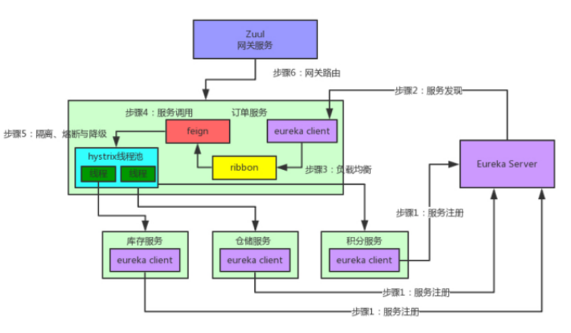
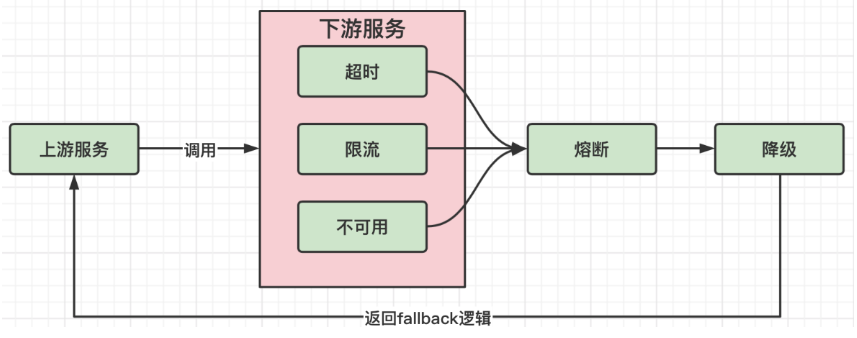
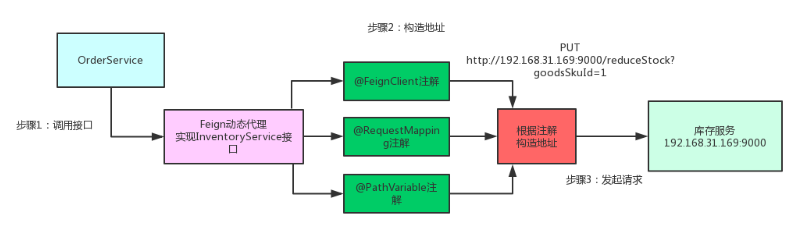
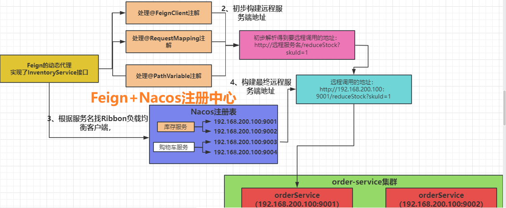

---
tags:
  - interview
  - 尚硅谷
  - Java
  - SpringCloud
source: 尚硅谷Java技术之高频面试题-v2025.1
title: 经典框架：SpringCloud
---

# 经典框架：SpringCloud

> 来源：尚硅谷 Java 技术之高频面试题 v2025.1 · 经典框架：springcloud

# 1. SpringCloud断路器的作用是什么？

Spring Cloud断路器（Hystrix）是一种用于构建弹性、容错和容灾机制的开源库。它提供了一种通过隔离和控制远程服务调用的方式，以防止由于服务故障或延迟而导致的级联故障。

断路器的作用如下：

1. **故障隔离**：断路器通过将远程服务调用封装在一个独立的断路器中，可以隔离故障的影响范围。当远程服务发生故障或延迟时，断路器可以快速失败并返回预定义的默认值，而不会影响整个系统的稳定性。
2. **容错处理**：断路器可以在远程服务不可用时提供备用方案。通过配置降级逻辑，可以在远程服务故障时返回预先定义的备用数据，以保证系统的可用性和稳定性。
3. **自动恢复**：断路器具备自我修复的能力。它会定期尝试恢复远程服务的调用，以检查其可用性。当远程服务恢复正常时，断路器会逐渐恢复对该服务的调用，并重新建立正常的调用链路。
4. **实时监控**：断路器提供了实时监控和度量功能，可以收集和展示远程服务调用的各项指标，如调用次数、失败率、响应时间等。这些指标可以帮助开发人员和运维人员了解系统的健康状况，并进行故障排查和性能优化。

通过使用Spring Cloud断路器，可以有效地处理分布式系统中的服务故障和延迟问题，提高系统的容错性和可用性。它是构建弹性和可靠微服务架构的重要组件之一。

# 2. SpringCloud的核心组件有哪些？它们的作用分别是什么？

## 2.1. Netflix系列组件

### 2.1.1. Eureka：服务注册与发现

#### 2.1.1.1. 服务注册

每个服务都向Eureka登记自己提供服务的元数据，包括服务的IP地址、端口号、版本号、通信协议等。

Eureka将各个服务维护在了一个服务清单中（双层Map，第一层key是服务名，第二层key是实例名，value是服务地址加端口）。

同时对服务维持心跳，剔除不可用的服务，Eureka集群各节点相互注册每个实例中都有一样的服务清单。

#### 2.1.1.2. 服务发现

eureka注册的服务之间调用不需要指定服务地址，而是通过服务名向注册中心咨询，并获取所有服务实例清单(缓存到本地)，然后实现服务的请求访问。

### 2.1.2. Ribbon：负载均衡

服务间发起请求的时候，基于Ribbon做负载均衡，从⼀个服务的多台机器中选择⼀台 （被调用方的服务地址有多个），Ribbon也是通过发起http请求，来进行的调用，只不过是通过调用服务名的地址来实现的。虽然说Ribbon不用去具体请求服务实例的ip地址或域名了，但是每调用一个接口都还要手动去发起Http请求。

### 2.1.3. Hystrix：熔断降级

发起请求是通过Hystrix的线程池来⾛的，不同的服务⾛不同的线程池，实现了不同服务调⽤的隔离，通过统计接口超时次数返回默认值，实现服务熔断和降级。

### 2.1.4. Zuul：网关

如果前端、移动端要调⽤后端系统，统⼀从Zuul网关进⼊，由Zuul网关转发请求给对应的服务，通过与Eureka进行整合，将自身注册为Eureka下的应用，从Eureka下获取所有服务的实例，来进行服务的路由。Zuul还提供了一套过滤器机制，开发者可以自己指定哪些规则的请求需要执行校验逻辑，只有通过校验逻辑的请求才会被路由到具体服务实例上，否则返回错误提示。

### 2.1.5. SpringCloud Config：配置中心

提供服务器端和客户端。服务器存储后端的默认实现使用git，因此它轻松支持标签版本的配置环境，以及可以访问用于管理内容的各种工具。这个还是静态的，需要得配合Spring Cloud Bus实现动态的配置更新。

## 2.2. Spring Cloud Alibaba系列

1. **Nacos**：作为服务注册中心和配置中心，Nacos提供了服务发现和动态配置的功能。它支持多种负载均衡策略，并且可以在运行时通过控制台实时修改限流降级规则，还支持查看限流降级的监控数据。
2. **Sentinel**：Sentinel是一个面向分布式服务架构的流量控制和熔断降级组件。它可以保护服务的稳定性，防止因流量突增导致的系统崩溃。
3. **RocketMQ**：RocketMQ是一款高性能、高可靠性的消息中间件，适用于大规模分布式系统中的异步消息传递。它支持发布-订阅模式和点对点模式。
4. **Seata**：Seata是一个易于使用的高性能微服务分布式事务解决方案，支持ACID特性，确保在分布式环境下事务的一致性。
5. **Dubbo**：Dubbo是高性能Java RPC框架，提供透明的远程过程调用（RPC），使得开发者可以像调用本地方法一样调用远程服务。

## 2.3. 其它新生代组件

1. **Spring Cloud Gateway**
  - **定义**：Spring Cloud Gateway是一个基于Spring Framework 5，Project Reactor和Spring Boot 2.0构建的API网关服务。
  - **主要功能**：提供路由转发、负载均衡、动态路由、路径重写、权限校验等功能。作为微服务架构中的入口，负责将外部请求路由到内部的各个微服务上，同时提供安全、监控和管理等功能。
2. **Spring Cloud LoadBalancer**
  - **定义**：Spring Cloud LoadBalancer是由SpringCloud官方提供的一个开源的、简单易用的客户端负载均衡器，它包含在SpringCloud-commons中，用它来替换以前的Ribbon组件。
  - **主要功能**：为服务调用提供负载均衡策略，如轮询、随机等。通过与注册中心（如Eureka、Consul等）集成，获取可用的服务实例列表，并根据负载均衡策略选择一个实例进行访问。
3. **Spring Cloud OpenFeign**
  - **定义**：Spring Cloud OpenFeign是一个声明式的Web服务客户端，它使得编写Web服务客户端变得更简单。
  - **主要功能**：通过注解的方式定义接口，然后由OpenFeign框架自动生成实现代码并注入Spring容器中。支持负载均衡，可以通过与Spring Cloud LoadBalancer或Ribbon集成来实现。简化了HTTP客户端的开发，提高了开发效率。

# 3. Feign和Open Feign是两个不同的组件吗？它们有什么区别？

Feign和Open Feign是两个不同的组件，它们在**定义、依赖关系以及配置方式**等方面存在区别。以下是具体分析：

1. **定义**
  - **Feign**：Feign是一个轻量级的声明式Web服务客户端，由Netflix开发。它使得编写Java HTTP客户端变得更容易，通过定义接口和使用注解来描述HTTP请求的细节。
  - **Open Feign**：Open Feign是Spring Cloud对Feign的封装和扩展，使其支持Spring MVC标准注解和HttpMessageConverters。Open Feign不仅继承了Feign的所有功能，还增加了与Spring Cloud生态系统的集成，如负载均衡、熔断降级等。
2. **依赖关系**
  - **Feign**：作为一个独立的项目，Feign可以与任何Java应用程序一起使用。
  - **Open Feign**：Open Feign是Spring Cloud中的一个组件，需要依赖Spring Cloud来使用。
3. **配置方式**
  - **Feign**：配置是通过接口上的注解来完成的，例如使用`@RequestMapping`注解定义请求路径、HTTP方法等。
  - **Open Feign**：提供了更多的配置选项，可以使用Spring Cloud的配置方式，例如通过属性文件、配置中心等来配置Feign客户端。
4. **功能扩展**
  - **Feign**：Feign本身并不包含服务降级、熔断、请求重试等功能。
  - **Open Feign**：Open Feign在Feign的基础上进行了扩展，提供了更多的功能，如服务降级、熔断、请求重试等，并且默认集成了Ribbon和Hystrix。
5. **默认集成**
  - **Feign**：不包含对Spring Cloud其他组件（如Eureka、Ribbon）的默认集成。
  - **Open Feign**：默认集成了Ribbon和Hystrix，可以通过注解和配置来启用这些功能。

综上所述，Feign和Open Feign都是用于简化微服务架构中服务间调用的工具，但Open Feign作为Spring Cloud的一部分，提供了更丰富的功能和更紧密的集成。如果您的项目已经在使用Spring Cloud，那么推荐使用Open Feign以获得更好的兼容性和功能支持。

# 4. Ribbon和**Spring Cloud LoadBalancer**的区别是什么？

Ribbon和Spring Cloud LoadBalancer都是Spring Cloud中用于实现客户端负载均衡的组件，它们在**实现方式、易用性以及生态完整**等方面存在区别。以下是具体分析：

1. **实现方式**
  - **Ribbon**：是一个独立的第三方库，需要单独引入到项目中。
  - **Spring Cloud LoadBalancer**：作为Spring Cloud的一个组件，集成在Spring Cloud中，可以直接使用。
2. **易用性**
  - **Ribbon**：作为一个较为底层的负载均衡器，开发人员需要手动配置负载均衡策略和服务发现机制。
  - **Spring Cloud LoadBalancer**：提供了一个更高层次的抽象，将负载均衡策略和服务发现机制的实现进行了封装，使开发人员更容易使用。
3. **生态完整**
  - **Ribbon**：与Eureka紧密集成，但随着Eureka的废弃，Ribbon的支持也受到了影响。
  - **Spring Cloud LoadBalancer**：与Spring Cloud的其他组件（如服务发现、配置中心等）紧密集成，形成了统一的架构风格，方便开发和维护。
4. **性能稳定性**
  - **Ribbon**：虽然Ribbon曾经是一个优秀的负载均衡器，但由于其与Eureka的紧密关联以及Eureka的废弃，导致Ribbon的性能和稳定性可能受到影响。
  - **Spring Cloud LoadBalancer**：经过优化和改进，具有卓越的性能和稳定性。

总的来说，Spring Cloud LoadBalancer作为Spring Cloud官方推出的负载均衡组件，与Ribbon相比，提供了更好的易用性、生态完整性和性能稳定性。对于新项目或需要升级的项目来说，考虑使用Spring Cloud LoadBalancer可能会是一个更好的选择。然而，在一些已经使用Ribbon并且满足需求的项目中，继续使用Ribbon也是可行的。

# 5. 作为服务注册中心，Nacos和Eureka的区别是什么？

Nacos和Eureka作为服务注册中心，在**数据存储、健康检查以及部署安装**等方面存在区别。以下是具体分析：

1. **数据存储**
  - **Nacos**：使用数据库存储来维护服务注册表，支持多种数据库，如MySQL、Oracle等。
  - **Eureka**：采用内存存储来维护服务注册表，每个Eureka服务器都会维护完整的服务注册表，多个服务器之间通过复制的方式完成数据的同步。
2. **健康检查**
  - **Nacos**：临时实例采用心跳模式，非临时实例采用主动检测模式。支持服务端主动检测提供者状态，并且当临时实例宕机时会被剔除，而非临时实例则不会被剔除。
  - **Eureka**：主要通过客户端向Eureka Server发送心跳信号来进行健康检查，如果在一定时间内没有收到心跳信号，则会将服务标记为下线。
3. **部署安装**
  - **Nacos**：提供了单节点、集群以及云原生等多种部署方式，能够满足不同规模的需求。
  - **Eureka**：需要创建Spring Boot项目，并将Eureka服务端通过gav的方式加载进来进行部署。
4. **稳定扩展性**
  - **Nacos**：采用了AP（可用性和分区容忍性）的设计原则，能够在网络分区的情况下保证服务的可用性。提供了丰富的扩展点，方便用户根据实际需求进行定制。
  - **Eureka**：采用了CP（一致性和分区容忍性）的设计原则，在网络分区的情况下可能会牺牲部分可用性。

总的来说，Nacos在功能上更为全面，适用于构建云原生应用，而Eureka则更专注于注册中心的功能，且与Spring Cloud的集成更为紧密。在选择时，需要根据项目的具体需求和技术栈来权衡各自的优势。

# 6. 作为服务配置中心，Nacos和SpringCloud Config的区别是什么？

作为服务配置中心，Nacos和SpringCloud Config在**数据存储、动态刷新以及环境管理**等方面存在区别。具体分析如下：

1. **数据存储**
  - **Nacos**：支持多种格式如Properties、YAML、JSON等，并且可以基于命名空间进行配置的隔离和管理[^1^]。
  - **SpringCloud Config**：默认使用Git仓库来存储配置文件，支持版本控制，通过分支和标签管理不同版本的配置[^6^]。
2. **动态刷新**
  - **Nacos**：实时监听配置变化并推送更新至消费者，无需应用重启即可实现配置的动态更新[^1^]。
  - **SpringCloud Config**：虽然支持动态刷新，但通常需要依赖Spring Cloud Bus和消息代理来实现[^5^]。
3. **环境管理**
  - **Nacos**：通过命名空间和分组功能，轻松实现多环境（如开发、测试、生产）的配置管理[^1^]。
  - **SpringCloud Config**：通过Profile方式隔离不同环境的配置，客户端启动时指定Profile以访问对应配置文件[^6^]。
4. **安全性**
  - **Nacos**：提供了丰富的安全特性，包括权限控制和加密传输，确保配置的安全性[^7^]。
  - **SpringCloud Config**：依赖于Git的权限管理能力，可以通过Git的权限设置来控制配置的访问和修改[^8^]。
5. **部署方式**
  - **Nacos**：提供单节点部署、集群部署以及云原生部署等多种方式，适应不同的需求和场景[^1^]。
  - **SpringCloud Config**：通常与Spring Cloud的其他组件一起部署，形成完整的微服务架构体系[^5^]。

总的来说，Nacos以其强大的功能、灵活的部署方式和易用性，成为众多企业构建现代化微服务架构的首选。而SpringCloud Config则凭借其在Spring Cloud生态中的深度集成和广泛的应用基础，继续发挥着重要作用。在选择配置中心时，建议根据项目的具体需求和技术栈进行综合考虑。

# 7. **Spring Cloud**Gateway和Zuul的区别是什么？

Spring Cloud Gateway和Zuul在**开源组织、底层实现以及内嵌Web容器**等方面存在区别。以下是具体分析：

1. **开源组织**
  - **Spring Cloud Gateway**：是Spring Cloud微服务平台的一个子项目，属于Spring开源社区。
  - **Zuul**：是Netflix公司的开源项目，Spring Cloud在Netflix项目中也已经集成了Zuul。
2. **底层实现**
  - **Spring Cloud Gateway**：基于Spring 5+构建，使用响应式、非阻塞式的API，支持WebSockets。
  - **Zuul**：构建于Servlet 2.5，使用的是阻塞式的API，不支持长连接，比如WebSockets。
3. **内嵌Web容器**
  - **Spring Cloud Gateway**：默认使用NettyWebServer。
  - **Zuul**：默认使用Tomcat作为Web容器。
4. **性能表现**
  - **Spring Cloud Gateway**：基于反应式编程，性能通常优于Zuul，特别是在高并发和后端服务响应慢的场景下。
  - **Zuul**：基于同步的Servlet API，可能在高并发场景下表现不如Spring Cloud Gateway。

总的来说，Spring Cloud Gateway在性能、易用性和与Spring生态系统的整合方面具有明显优势，而Zuul则在一些特定场景下仍有其应用价值。在选择时，建议根据项目的具体需求和技术栈进行综合考虑。

# 8. Nacos服务注册功能是如何实现的？

Nacos的服务注册功能通过**服务提供者注册、服务信息存储以及心跳机制**等步骤实现。以下是这些步骤的详细分析：

1. **服务提供者注册**
  - **启动时注册**：当服务提供者启动时，会将自己的服务实例信息（如服务名称、IP地址、端口号等）发送到Nacos服务器进行注册[^3^]。
  - **使用HTTP或gRPC协议**：服务提供者通常通过HTTP或gRPC协议连接到Nacos服务器，并发送注册请求[^3^]。
  - **自动装配与事件监听**：在Spring Cloud环境中，服务注册可以通过自动装配和事件监听机制来实现。例如，DubboServiceRegistrationNonWebApplicationAutoConfiguration类会监听ApplicationStartedEvent事件，当应用启动完成后触发注册动作[^1^]。
2. **服务信息存储**
  - **内存存储**：Nacos服务器接收到服务提供者的注册请求后，会将服务实例信息存储在内存中，以便快速查询[^2^][^3^]。
  - **持久化存储**：为了确保数据的一致性和持久性，Nacos还支持将服务实例信息持久化到数据库中（如MySQL、Derby等）[^2^][^3^]。
3. **心跳机制**
  - **定时发送心跳**：注册完成后，服务提供者会定期向Nacos服务器发送心跳包，以表明自己的服务实例仍在运行中[^3^]。
  - **健康状态检查**：如果在一定时间内（默认5秒）没有收到心跳包，Nacos会将该服务标记为不可用[^3^]。
4. **服务消费者发现**
  - **查询服务列表**：服务消费者启动时，会向Nacos服务器发送服务发现请求，获取当前可用的服务实例列表[^3^]。
  - **缓存机制**：Nacos客户端会缓存服务实例列表，并定期（默认5秒）同步更新，以减少频繁查询Nacos服务器的压力[^3^]。
5. **负载均衡策略**
  - **选择服务实例**：服务消费者可以根据不同的负载均衡策略（如轮询、随机、权重等）选择一个合适的服务实例进行调用[^2^][^3^]。
6. **数据模型与通信协议**
  - **命名空间与服务模型**：Nacos使用命名空间来隔离不同环境或租户的服务，并通过服务、集群、实例三层模型来管理服务实例[^4^]。
  - **通信协议**：Nacos默认使用HTTP协议进行通信，但也支持gRPC协议以提高性能和降低延迟[^3^]。

总的来说，Nacos的服务注册功能通过上述多个步骤和机制实现了服务的动态注册、发现和管理。这些特性使得Nacos成为构建云原生应用的理想选择，能够有效地支持微服务架构中的服务治理需求。

# 9. 微服务优点是什么？

微服务架构的优点主要包括**可扩展性、灵活性、敏捷性以及容错性**。以下是对这些优点的详细分析：

1. **可扩展性**
  - **独立部署**：每个微服务可以独立部署和扩展，这意味着可以根据单个服务的需求来增加资源，而不需要对整个应用程序进行扩展[^1^]。
  - **水平扩展**：微服务架构支持水平扩展，即通过增加更多的服务实例来处理增加的负载[^2^]。
2. **灵活性**
  - **技术多样性**：不同的微服务可以使用不同的技术栈，这为团队提供了选择最适合特定服务的技术的自由度[^3^]。
  - **独立更新**：由于微服务是独立的，一个服务的更新或更改不会影响其他服务，这使得快速迭代和部署成为可能[^4^]。
3. **敏捷性**
  - **快速开发**：微服务允许小团队专注于特定的业务功能，从而加快开发速度并缩短上市时间[^5^]。
  - **持续交付**：微服务架构与持续集成和持续交付（CI/CD）流程相结合，可以实现更频繁的发布周期和更快的市场响应[^6^]。
4. **容错性**
  - **隔离故障**：如果一个微服务出现故障，它不会直接影响到整个系统，因为其他服务仍然可以正常运行[^7^]。
  - **弹性设计**：微服务架构鼓励构建具有弹性的服务，这些服务能够自动恢复并在面对失败时继续提供服务[^8^]。
5. **技术异构性**
  - **多语言支持**：微服务可以使用不同的编程语言实现，这为开发者提供了更多的选择，可以根据服务的需求选择最合适的语言[^9^]。
  - **协议无关性**：微服务之间的通信可以通过多种协议进行，如HTTP/REST、gRPC等，这增加了系统的灵活性[^10^]。
6. **组织与文化变革**
  - **小团队自主**：微服务架构促进了小团队的自主性，每个团队负责自己的服务，这有助于提高团队的责任感和满足感[^11^]。
  - **跨职能合作**：微服务架构鼓励跨职能团队的合作，包括开发、运维和QA团队成员共同参与服务的生命周期管理[^12^]。

总的来说，微服务架构为现代软件开发提供了一种灵活、可扩展且高效的方法。它不仅能够提高开发效率和系统稳定性，还能够促进组织文化的变革，使得团队更加敏捷和自给自足。

# 10. 微服务的缺点是什么？

微服务架构虽然具有许多优点，但也存在一些缺点。以下是对微服务缺点的详细分析：

1. **复杂性增加**
  - **部署复杂性**：每个微服务都需要独立部署，这增加了部署和运维的复杂性[^1^]。
  - **通信复杂性**：服务之间的通信需要通过网络进行，这可能会引入网络延迟和通信故障的风险[^2^]。
2. **数据一致性问题**
  - **分布式事务**：在微服务架构中，保持数据一致性变得更加困难，因为数据可能分布在多个服务中[^3^]。
  - **最终一致性**：微服务通常采用最终一致性模型，这意味着在某些情况下，用户可能会看到不一致的数据[^4^]。
3. **网络延迟和故障**
  - **跨网络通信**：服务之间的通信需要通过网络进行，这可能会引入额外的延迟[^5^]。
  - **网络分区**：在网络分区的情况下，服务之间的通信可能会中断，影响系统的稳定性[^6^]。
4. **安全性挑战**
  - **更多的暴露面**：每个微服务都可能是一个攻击面，需要单独保护，增加了安全风险[^7^]。
  - **身份验证和授权**：在微服务架构中，实现跨服务的身份验证和授权机制更加复杂[^8^]。
5. **测试难度增加**
  - **端到端测试**：由于服务是分布式的，进行端到端的集成测试变得更加困难[^9^]。
  - **模拟外部依赖**：测试一个微服务时，可能需要模拟其依赖的其他服务，这增加了测试的复杂性[^10^]。
6. **监控和日志管理**
  - **分布式跟踪**：在微服务架构中，跟踪请求的完整路径需要分布式跟踪工具，这增加了监控的复杂性[^11^]。
  - **日志聚合**：由于日志分布在多个服务中，收集和分析日志变得更加困难[^12^]。
7. **成本增加**
  - **基础设施成本**：每个微服务都需要自己的运行环境，这可能会导致基础设施成本的增加[^13^]。
  - **人力成本**：开发和维护大量小型服务的团队需要更多的协调和管理，这可能会增加人力成本[^14^]。

总的来说，微服务架构虽然提供了灵活性和可扩展性，但也带来了额外的复杂性和挑战。在决定是否采用微服务架构时，组织需要仔细权衡这些优缺点，并根据自己的业务需求和技术能力做出决策。

# 11. 对比区分服务熔断和降级

服务熔断和降级是微服务架构中常用的两种容错机制，它们在**触发条件、恢复机制以及影响范围**等方面存在区别。以下是详细的对比分析：

1. **触发条件**
  - **服务熔断**：当一个服务因为某种原因（如响应时间过长、错误率过高）连续失败达到一定阈值时，熔断器会启动，暂时切断对该服务的调用。
  - **服务降级**：降级通常是基于预设的规则或策略，当系统检测到某些指标（如CPU使用率、内存使用量）超过阈值时，或者在特定条件下（如维护模式、非高峰时段），主动降低服务质量。
2. **恢复机制**
  - **服务熔断**：熔断器会在一定时间后尝试半开状态，如果服务恢复正常，则完全打开；如果仍然失败，则继续保持熔断状态。
  - **服务降级**：降级后的服务通常会保持降级状态直到系统恢复正常，或者手动切换回正常服务。
3. **影响范围**
  - **服务熔断**：熔断器只影响单个失败的服务，不会影响到其他正常运行的服务。
  - **服务降级**：降级可能会影响整个系统或多个服务，因为它是基于系统整体状态的决策。
4. **用户体验**
  - **服务熔断**：对于用户来说，熔断可能会导致请求失败，但通常这种失败是暂时的，一旦服务恢复，用户可以重新发起请求。
  - **服务降级**：降级可能会提供有限的功能或降低的服务质量，但至少保证了服务的基本可用性。
5. **实施难度**
  - **服务熔断**：实现服务熔断需要额外的逻辑来监控服务状态并控制熔断器的行为。
  - **服务降级**：降级策略的实施相对简单，通常只需要在系统中预设一些规则和阈值即可。
6. **适用场景**
  - **服务熔断**：适用于服务间依赖关系明确，且某个服务故障不会对整个系统造成严重影响的场景。
  - **服务降级**：适用于系统资源紧张或需要进行维护时，通过降低服务质量来保证核心功能的可用性。

总的来说，服务熔断和服务降级都是提高系统稳定性和可用性的重要手段。它们在不同的场景下有各自的优势和适用性。在实际应用中，可以根据系统的具体需求和特点选择合适的容错机制。

# 12. 负载均衡的意义是什么？

负载均衡（Load Balancing）是指将网络或计算资源分配给多个服务器或设备，以达到提高系统性能、可扩展性和可靠性的目的。它在分布式系统中起到重要的作用，具有以下几个重要的意义：

1. 提高系统性能：负载均衡将请求均匀地分配给多个服务器，避免了单个服务器过载的情况。通过合理地分配负载，可以充分利用系统的资源，提高系统的吞吐量和响应速度。
2. 实现高可用性：通过将请求分发到多个服务器，即使其中某个服务器发生故障或不可用，仍然可以继续提供服务。负载均衡器能够检测到故障服务器，并将请求转发到其他正常工作的服务器，从而实现系统的高可用性和容错性。
3. 支持系统扩展：随着用户量和业务需求的增加，单个服务器可能无法满足系统的需求。负载均衡器可以根据实际情况动态地添加或删除服务器，实现系统的水平扩展。通过增加服务器数量，可以提高系统的处理能力和并发性能。
4. 优化资源利用：负载均衡器可以根据服务器的负载情况智能地分配请求，使每个服务器的负载相对均衡。这样可以避免某些服务器过载而其他服务器处于空闲状态的情况，最大限度地提高资源的利用率。
5. 简化系统管理：通过使用负载均衡器，可以将多个服务器组织成一个逻辑集群，对外提供统一的入口。这样可以简化系统的管理和维护工作，减少对客户端的影响，提高系统的可维护性和可管理性。

总之，负载均衡在分布式系统中具有重要的意义。它能够提高系统性能、可用性和可扩展性，优化资源利用，简化系统管理。通过合理地分配负载，负载均衡器能够实现高效、稳定和可靠的系统运行。

# 13. SpringBoot和SpringCloud有什么联系和区别？

SpringBoot和SpringCloud都是现代Java开发中极为重要的框架，它们在**目标、功能以及独立性**等方面存在区别，下面是详细的对比分析：

1. **目标**
  - **SpringBoot**：目标是简化Spring应用的开发流程，通过自动配置和约定优于配置的原则，帮助开发者快速启动和运行Spring应用[^2^]。
  - **SpringCloud**：旨在构建微服务架构，提供一整套解决方案来简化分布式系统的开发、部署和管理。它基于SpringBoot，并集成了多个成熟的开源组件来实现微服务所需的各种功能[^2^]。
2. **功能**
  - **SpringBoot**：提供了自动配置、内嵌服务器（如Tomcat、Jetty）、健康检查、度量指标等功能，使得开发者可以快速搭建独立运行的生产级Spring应用[^3^]。
  - **SpringCloud**：包括服务注册与发现（如Eureka、Consul）、配置管理（Config Server）、断路器（Hystrix）、智能路由（Zuul或Gateway）、消息总线（Spring Cloud Stream）等，这些功能都是为了支持微服务架构而设计的[^2^][^6^]。
3. **独立性**
  - **SpringBoot**：可以独立使用，不需要依赖其他框架即可运行Spring应用[^5^]。
  - **SpringCloud**：依赖于SpringBoot，它必须与SpringBoot一起使用才能发挥其微服务治理的功能[^4^][^6^]。
4. **设计理念**
  - **SpringBoot**：强调快速开发和部署单个Spring应用，注重于简化配置和提高开发效率[^7^]。
  - **SpringCloud**：关注于全局的微服务协调治理，它将多个单体微服务整合起来，提供配置管理、服务发现、断路器等高级功能[^7^]。

总的来说，SpringBoot专注于快速开发和部署单个Spring应用，而SpringCloud则是一个更广泛的微服务架构解决方案，它依赖于SpringBoot并在此基础上增加了许多高级功能来支持微服务的开发和管理。两者结合使用，可以极大地简化微服务架构的开发和维护工作。

# 14. 面对众多可用产品，项目中的注册中心该如何选型？

在项目中选择合适的注册中心是构建微服务架构的关键决策之一。以下是一些选型时需要考虑的因素和步骤：

1. **功能需求**
  - **服务发现**：确保注册中心支持高效的服务发现机制，这对于动态扩展和维护微服务至关重要[^1^]。
  - **健康检查**：注册中心应能够定期检查服务的健康状态，自动剔除不健康的服务实例[^2^]。
  - **负载均衡**：支持客户端负载均衡，以便在多个服务实例之间均匀分配请求[^3^]。
2. **性能考量**
  - **响应时间**：注册中心的响应时间应该足够快，以避免成为系统瓶颈[^4^]。
  - **吞吐量**：评估注册中心能够处理的请求量，确保它能够满足项目的负载需求[^5^]。
3. **可扩展性**
  - **水平扩展**：注册中心应支持水平扩展，以应对服务数量的增长[^6^]。
  - **集群部署**：支持集群部署，以提高可用性和容错性[^7^]。
4. **高可用性**
  - **故障转移**：注册中心应具备故障转移机制，确保在部分组件失效时仍能继续提供服务[^8^]。
  - **数据持久化**：支持数据的持久化存储，防止因系统重启或故障导致的数据丢失[^9^]。
5. **安全性**
  - **认证授权**：注册中心应提供安全机制，如认证和授权，以保护服务信息不被未授权访问[^10^]。
  - **加密通信**：支持加密通信协议，确保数据传输的安全性[^11^]。
6. **社区和支持**
  - **活跃度**：选择一个有活跃社区支持的注册中心，这样可以更容易地找到帮助和资源[^12^]。
  - **文档完善**：确保注册中心有良好的文档和完善的支持体系[^13^]。
7. **兼容性和集成**
  - **技术栈兼容**：注册中心应与项目现有的技术栈兼容，包括编程语言、框架和其他工具[^14^]。
  - **易于集成**：注册中心应易于与现有系统集成，减少开发和迁移成本[^15^]。

总的来说，在选择注册中心时，需要综合考虑项目的具体需求、预期的系统规模、团队的技术能力以及长期维护的可行性。建议在做出决定前，进行充分的市场调研和技术评估，并在可能的情况下，进行原型验证或小规模试点。

# 15. 简单介绍一下Nacos和它的主要功能

Nacos是阿里巴巴开源的一款动态服务发现、配置管理和服务管理平台，它主要面向微服务架构中的服务注册与发现、配置管理以及动态DNS服务。以下是对Nacos及其主要功能的详细介绍：

1. **服务发现与注册**：Nacos支持基于健康检查的动态服务发现，并能够自动剔除不健康的服务实例。它提供了完整的服务生命周期管理，包括服务的注册、注销、下线和上线等操作。通过Nacos，服务消费者可以实时感知到服务提供者的状态变化，从而实现灵活的服务调用。
2. **配置管理**：Nacos具备分布式系统中外部化配置管理能力，支持配置的集中管理和动态更新。它允许用户在运行时动态调整配置，无需重启服务，极大地提高了系统的灵活性和可维护性。同时，Nacos还支持配置的版本控制和历史记录查询，方便用户进行配置变更的追踪和回滚。
3. **动态DNS服务**：Nacos借助其内建的DNS功能，支持权重路由，并且与Kubernetes等容器编排系统有很好的兼容性。这使得Nacos可以轻松地与云平台对接，为用户提供更加灵活和高效的服务部署和管理方案。
4. **服务及其元数据管理**：Nacos允许用户为每个服务添加丰富的元数据，如版本、作者信息和使用指南等。这些元数据可以帮助开发者更好地理解和维护服务，提高开发效率和质量。
5. **健康检查**：Nacos客户端会向Nacos服务器上报自己的健康状态，而Nacos Server端也会对注册的服务实例进行健康检查。这有助于及时发现并处理故障实例，确保系统的高可用性和稳定性。

综上所述，Nacos作为一款功能强大的动态服务发现、配置管理和服务管理平台，为微服务架构提供了全面的解决方案。它不仅简化了服务治理的过程，还提高了系统的可靠性和可扩展性。

# 16. Nacos是AP的还是CP的？

**Nacos是AP的，但也可以配置为CP模式**。

Nacos是一个开源的动态服务发现、配置管理和服务管理平台，它支持AP（可用性优先）和CP（一致性优先）两种模式。在默认情况下，Nacos采用AP模式，这种模式下系统会优先保证服务的可用性，即使部分节点数据不一致，也能正常对外提供服务。然而，根据具体的业务需求和场景，用户也可以选择使用CP模式，通过配置来切换。

在AP模式下，Nacos注重服务的高可用性和可靠性，即使在网络分区或部分节点故障的情况下，仍然能够提供服务。而在CP模式下，Nacos则强调数据的一致性，当发生网络分区时，系统会尽可能地保证数据的一致性，但可能会出现部分服务不可用的情况。

总的来说，Nacos既支持AP模式也支持CP模式，具体使用哪种模式取决于项目的实际需求和场景。在选择时，需要综合考虑系统的可用性、一致性、性能以及容错能力等因素。

# 17. Nacos如何实现在配置变化时让客户端可以实时感知到？

Nacos通过**长轮询机制、配置注册与监听以及配置更新通知流程**实现在配置变化时让客户端可以实时感知到。以下是对这三个核心机制的详细解释：

1. **长轮询机制**
  - **建立长连接**：当Nacos客户端需要监听配置变化时，它会向服务端发起一个长轮询请求，从而建立一个持久的HTTP连接。
  - **挂起请求**：若无配置更新，服务端会将此请求挂起，不立即响。
  - **配置变更通知**：一旦有配置变更，服务端会立刻唤醒挂起的请求，并将最新的配置发送给客户端。
2. **配置注册与监听**
  - **服务注册**：服务启动时会向Nacos服务端注册，这样服务端就能追踪到哪些服务在监听哪些配置。
  - **监听器注册**：同时，服务会为其关心的配置注册一个监听器，确保当配置发生变化时能够得到通知。
3. **配置更新通知流程**
  - **配置变更记录**：当配置发生变更，无论是通过Nacos的管理界面还是API，服务端都会记录下这个变化。
  - **查找并通知监听器**：服务端会查找所有注册了对应配置监听器的客户端，并通过之前建立的长连接发送更新通知。
  - **拉取并应用新配置**：客户端在收到通知后，会从服务端拉取最新的配置，并应用到服务中。

总的来说，Nacos通过上述机制实现了配置的热更新，使得应用程序能够在配置变化时即时作出响应，无需重启。这种即时的更新机制确保了应用程序始终运行在最新的配置环境下，为应用程序提供了一种灵活、高效的方式来动态调整其运行时的配置。

# 18. 为什么Nacos同时具备AP和CP两种工作模式的能力？

Nacos能够同时实现AP（可用性和分区容忍性）和CP（一致性和分区容忍性）的原理是通过引入不同的组件和机制来实现的。

在Nacos中，服务注册和发现模块采用了AP模型，通过将服务实例的注册信息存储在多个节点上，实现了服务的高可用性和分区容忍性。当某个节点发生故障或网络分区时，其他节点仍然可以提供服务注册和发现的功能。

而配置管理模块则采用了CP模型，通过使用Raft协议来实现一致性。当客户端更新配置时，Nacos会将配置写入多个节点的Raft日志中，经过多数节点的确认后才会认为配置写入成功。这保证了配置的一致性。在配置变更时，通过Raft协议的复制机制，确保配置变更在集群中的所有节点上同步，保证了配置的一致性和可靠性。

通过这种方式，Nacos在不同的模块中根据需求选择了合适的一致性和可用性模型，从而同时实现了AP和CP的特性。这使得Nacos能够满足分布式系统在服务注册、发现和配置管理等方面的需求，提供高可用性、弹性和可靠性的服务。

# 19. Nacos服务发现的原理

Nacos的服务发现原理主要基于**服务注册、服务同步以及客户端服务发现**这三大核心机制。以下是对这三个核心机制的详细解释：

1. **服务注册**
  - **实例信息上报**：当一个微服务启动时，它会通过Nacos客户端向Nacos服务器发送一个注册请求，这个请求包含了服务的基本信息，如服务名、IP地址、端口号等。
  - **数据存储**：Nacos服务器接收到注册请求后，会将这些信息存储在一个内部的数据结构中，通常是使用Map来保存这些信息，以便于快速检索和更新。
  - **健康检查**：为了确保服务列表的准确性，Nacos会定期对所有注册的服务进行健康检查。如果发现某个服务实例不再响应，Nacos会将其从服务列表中移除。
2. **服务同步**
  - **数据复制**：Nacos支持集群部署，这意味着在多个Nacos服务器之间需要进行数据同步，以保证每个节点上的服务列表是一致的。
  - **一致性保证**：为了保证数据的一致性，Nacos采用了基于Raft协议的一致性算法，确保即使在部分节点出现故障的情况下，整个系统的服务列表仍然保持一致。
3. **客户端服务发现**
  - **获取服务列表**：当一个服务消费者需要调用另一个服务时，它会通过Nacos客户端向Nacos服务器查询所需服务的服务列表。
  - **负载均衡**：客户端在获取到服务列表后，会根据某种负载均衡策略（如随机、轮询等）选择一个服务实例进行调用。
  - **实时更新**：如果服务列表发生变化，Nacos服务器会主动推送最新的服务列表给客户端，或者客户端可以通过长连接定时拉取最新的服务列表，以确保客户端持有的服务列表是最新的。

总的来说，Nacos通过上述机制实现了高效的服务发现，使得微服务架构中的服务能够动态地加入或退出，而消费者可以实时感知到这些变化，从而保证了微服务系统的高可用性和灵活性。

# 20. Nacos服务发现的原理

Nacos注册中心的内部原理涉及**服务注册、服务发现以及健康检查等**多个方面。以下是对其内部原理的详细阐述：

1. **服务注册**
  - **注册流程**：服务实例在启动时，会通过Nacos客户端向Nacos Server发送注册请求，包含服务的基本信息如服务名、IP地址、端口号等[^2^][^4^]。Nacos Server接收到注册请求后，将这些信息存储在内存中，通常是使用Map结构进行索引和查找[^3^]。
  - **心跳机制**：为了保持注册信息的有效性，服务实例会定期向Nacos Server发送心跳消息，包含服务实例的健康状态和可用性等信息。Nacos Server通过接收和处理心跳消息，及时更新服务实例的状态[^1^][^2^][^5^]。
2. **服务发现**
  - **查询流程**：当一个服务需要调用另一个服务时，它会向Nacos Server发起查询请求，以获取目标服务的服务列表[^2^][^4^]。Nacos Server会根据查询请求返回相应的服务实例列表，包括它们的网络地址和其他附加信息[^1^]。
  - **负载均衡**：调用者可以根据返回的服务实例列表，使用某种负载均衡算法（如随机、轮询等）选择一个服务实例进行通信[^2^]。
3. **健康检查**
  - **内置机制**：Nacos提供了健康监测功能，通过内置的健康检查机制，可以实时监测服务的健康状态[^3^]。对于不健康的实例，Nacos会自动将其从服务列表中剔除，从而保证服务的可用性[^3^][^5^]。
4. **数据一致性与高可用性**
  - **集群部署与数据复制**：Nacos支持集群部署和数据复制，以确保不同节点之间的数据一致性。通过将多个Nacos Server实例组成集群，可以提供冗余和负载均衡，以应对单点故障[^1^]。同时，Nacos Server之间会互相同步服务实例信息，以保证数据的一致性[^3^]。

总的来说，Nacos注册中心通过上述机制实现了服务的自动注册与发现、健康检查以及高可用性和数据一致性的保障。这些特性使得Nacos成为微服务架构下不可或缺的组件之一。

# 21. Feign的调用原理

首先，如果你对某个接口定义了@FeignClient注解，Feign就会针对这个接口创建一个动态代理Feign的动态代理会根据你在接口上的@RequestMapping等注解，来动态构造出你要请求的服务的地址最后针对这个地址，发起请求、解析响应。

# 22. Feign+Nacos注册中心原理

# 23. Feign的底层调用源码大致流程

1. 判断当前代理的方式是不是equals()、hashCode()、toString().如果是 直接结束，因为本地服务有这些方法，压根不需要从远程来要。
2. dispatch.get(method).invoke(args) ：核心代理逻辑从一个派发器中获取解析当前方法的处理器 ---派发器的结构是一个Map--- Map<Method, MethodHandler>来获取解析这个方法的处理器。默认从这个Map中找到的方法处理器是SynchronousMethodHandler---同步方法处理器
3. SynchronousMethodHandler.invoke(args)
  1. 构建一个RequestTemplate。作用是为了发请求的是时候用这个模版造一个请求。细节：根据老的请求模版构建一个新的请求模版，接着会将老的请求模版中的一些参数放到新的请求模版中，但是请求头中参数如果没有在Feign中去指定的话， 那么这个老模版中就没有头，而新模板中也就没有请求头数据。因此后面在用这个新模版创建请求的时候，该请求就没有请求头数据，所以Feign在远程调用时出现了请求头丢失问题。
  2. 支持Options---可以独立对自己的业务远程接口去指定一些连接超时时间和读取的超时时间。
  3. 得到一个重试器Retryer如果在发送远程调用的时候，出现异常，那么feign在底层会用catch捕捉到，然后进行重试--- retryer.continueOrPropagate(e);但是对于重试feign自己也有规则：如果一旦在重试期间出现了异常，直接将异常抛出，结束这一次远程调用。如果在重试期间没有出现异常，但是feign通过最大次数（5次调用）如果到了最大次数5 那么feign仍然是会抛出异常，结束这一次远程调用。
  4. executeAndDecode---执行并解码（执行：指的是要去给远程发请求 解码：远程给我的数据都是字节流 我要将自字节流转成我业务能用的对象【反序列化】）
    1. 发送请求response = client.execute();---根据服务名从Nacos找到该服务下的所有客户端，然后负载均衡的掉用某一个。并且在第一次找该客户端的时候，会将第一次找到的这个客户端放到缓存中去，下一次再来发起远程调用的时候，直接从缓存中获取该客户端。
    2. 对响应的数据进行反序列化handleResponse();

# 24. 远程调用的本质

1、建立连接

2、给远程发送请求

3、远程处理数据

4、远程响应数据

5、将数据进行渲染
