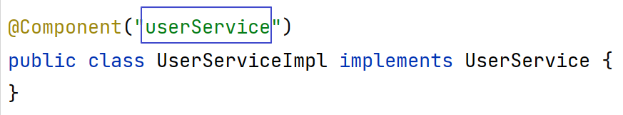
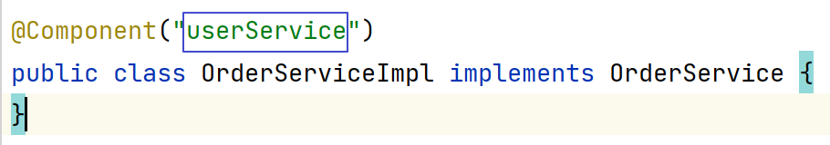

---
tags:
  - interview
  - 尚硅谷
  - Java
  - Spring、SpringMVC和SpringBoot
source: 尚硅谷Java技术之高频面试题-v2025.1
title: 经典框架：Spring、SpringMVC和SpringBoot
---

# 经典框架：Spring、SpringMVC和SpringBoot

> 来源：尚硅谷 Java 技术之高频面试题 v2025.1 · 经典框架：spring、springmvc和springboot

# 1. 什么是 Spring IOC 容器？

## 1.1. 背记

Spring IoC（控制反转）容器是Spring框架的核心组件，它负责创建、配置和管理Java对象及其生命周期。

### 1.1.1. IoC就是控制反转

简单的来说就是将创建对象的权利交由spring框架进行管理，spring会根据配置文件去创建实例对象以及管理依赖。以前创建对象的时机都是自己把握，主动权在自己的手上，现在可以使用java的反射机制进行自动生产，根据配置文件在运行时动态的去创建对象以及管理对象，并调用对象的方法。

### 1.1.2. DI依赖注入

DI依赖注入是IOC的一种具体实现方式，就是通过容器获取对象，并进行属性的赋值。IOC是一种思想，而DI是一种实现。

## 1.2. 理解

Spring IoC（控制反转）是Spring框架的核心，它是一种设计原则，旨在减少代码之间的耦合，提高模块之间的独立性和灵活性。

以下是对Spring IoC的个人理解：

1. **管理对象的创建和生命周期**：在传统的Java应用程序中，对象通常由开发者直接创建和管理。而在Spring IoC中，对象的创建和生命周期管理由Spring容器负责。这样，开发者可以将注意力集中在业务逻辑上，而不是对象的创建和管理细节。
2. **依赖注入**：Spring IoC通过依赖注入机制，将对象的依赖项（如其他对象、数据源等）动态地注入到对象中。这样，对象不需要自己创建或查找它们的依赖项，而是被动地接收由Spring容器提供的依赖项。
3. **降低代码耦合**：Spring IoC通过将对象的创建和依赖管理交给外部容器，降低了代码之间的耦合。对象不需要关心如何创建和管理它们的依赖项，只需要通过简单的配置或注解来声明它们的依赖关系。
4. **提高代码的可测试性**：由于对象是通过Spring IoC容器创建和管理的，因此可以轻松地为测试提供模拟对象或虚假实现。这极大地简化了单元测试和集成测试的编写和维护。
5. **灵活性和扩展性**：Spring IoC容器提供了丰富的配置选项和扩展机制，使得开发者可以根据需要定制和扩展容器的行为。这种灵活性和扩展性使得Spring IoC能够适应各种应用场景和需求变化。
6. **促进良好的设计实践**：使用Spring IoC鼓励开发者遵循良好的设计原则，如单一职责原则、开放封闭原则等。通过将对象的创建和管理交给外部容器，可以促使开发者编写更加模块化、可维护和可重用的代码。

总的来说，Spring IoC是一种强大的设计原则，它通过将对象的创建和管理交给外部容器，降低了代码之间的耦合，提高了模块之间的独立性和灵活性。这使得开发者可以更加专注于业务逻辑的开发，同时提高了代码的可维护性和可测试性。

# 2. 如何实现一个Spring容器

## 2.1. 实现基本思路

创建一个集合容器，先将对象创建出来放到容器中，需要使用对象时，只需要从容器中获取对象即可，而不需要重新创建，此时容器就是对象的管理者。

## 2.2. 实现基本步骤

自定义Spring IoC容器的步骤如下：

1. **定义Bean**：首先，需要定义具体的Bean类，即希望由Spring容器管理的对象。这些Bean类需要提供默认的构造函数或有参构造函数，并且要有合适的属性和方法。
2. **配置XML文件**：创建一个XML配置文件，用于描述Bean的定义和它们之间的依赖关系。在该文件中，你需要声明Bean的ID（唯一标识符）和对应的类名，以及其他相关的属性。
3. **创建IoC容器**：在你的应用程序中，通过加载XML文件来创建一个Spring IoC容器。可以使用ClassPathXmlApplicationContext 或 FileSystemXmlApplicationContext 等容器实现类来加载XML文件。
4. **获取Bean**：一旦IoC容器创建成功，你可以使用 getBean() 方法从容器中获取你所需要的Bean对象。根据Bean的ID或名称，Spring会在容器中查找相应的Bean，并将其返回给你。
5. **使用Bean**：拿到Bean对象后，你就可以使用它们的属性和方法来完成相应的业务逻辑了。

# 3. 什么是依赖注入？可以通过多少种方式完成依赖注入？

## 3.1. 背记

依赖注入（Dependency Injection，简称DI）是一种设计模式，它的核心思想是将对象的依赖关系从对象内部转移到外部，由外部容器在创建对象时动态地将依赖关系注入到对象中，具体来说，对象的依赖关系是指对象所需的其他服务或组件。在传统的程序设计中，对象通常自己负责创建它们所依赖的对象，这导致了高度耦合和难以维护的代码，而依赖注入可以改变了这种状况。依赖注入可以通过三种主要方式完成：构造函数注入、Setter注入和接口注入

通常，依赖注入可以通过三种方式完成，即：

- 构造函数注入
- setter 注入
- 接口注入

在 Spring Framework 中，仅使用构造函数和 setter 注入。

## 3.2. 理解

依赖注入（Dependency Injection，简称DI）是一种设计模式，它的核心思想是将对象的依赖关系从对象内部转移到外部，由外部容器在创建对象时动态地将依赖关系注入到对象中。这种设计模式的目的是降低代码之间的耦合度，提高代码的可维护性和灵活性。

以下是对依赖注入的个人理解：

1. **解耦**：依赖注入通过将对象的依赖关系从对象内部转移到外部，降低了对象之间的耦合度。对象不需要自己创建和管理它们的依赖项，而是通过外部容器来提供这些依赖项。这样，对象只需要关注自己的业务逻辑，而不需要考虑如何获取和处理它们的依赖项。
2. **可测试性**：由于对象是通过外部容器来获取它们的依赖项，因此可以很容易地为测试提供模拟对象或虚假实现。这极大地简化了单元测试和集成测试的编写和维护，提高了代码的可测试性。
3. **灵活性和扩展性**：依赖注入提高了代码的灵活性和扩展性。由于依赖关系是通过外部容器来提供的，因此可以很容易地替换或添加新的依赖实现，而不会影响到使用这些依赖的代码。这使得在不同的环境或测试场景中切换依赖实现变得更加容易，同时也支持了良好的扩展性。
4. **模块化**：依赖注入鼓励开发者编写模块化的代码。由于对象之间的依赖关系被转移到了外部容器，因此每个对象都可以被视为一个独立的模块，它们之间相互独立但又协同工作。这种模块化的设计使得代码更加易于理解、维护和扩展。
5. **配置集中化**：依赖注入通常与配置文件一起使用，以便在一个地方集中管理所有依赖关系。这样可以很容易地查看和管理一个对象所需的所有依赖项，并且可以在不修改代码的情况下更改依赖关系。

总的来说，依赖注入是一种强大的设计模式，它通过将对象的依赖关系从对象内部转移到外部，降低了代码之间的耦合度，提高了代码的可维护性和灵活性。在实际开发中，依赖注入通常是通过使用专门的框架或库来实现的，如Spring框架中的IoC容器。

# 4. BeanFactory 和 ApplicationContext的区别？

ApplicationContext是BeanFactory的子接口

ApplicationContext提供了更完整的功能：

- ①继承MessageSource，因此支持国际化。
- ②统一的资源文件访问方式。
- ③提供在监听器中注册bean的事件。
- ④同时加载多个配置文件。
- ⑤载入多个（有继承关系）上下文 ，使得每一个上下文都专注于一个特定的层次，比如应用的web层。

BeanFactroy采用的是延迟加载形式来注入Bean的，即只有在使用到某个Bean时(调用getBean())，才对该Bean进行加载实例化。这样，我们就不能发现一些存在的Spring的配置问题。如果Bean的某一个属性没有注入，BeanFacotry加载后，直至第一次使用调用getBean方法才会抛出异常。ApplicationContext，它是在容器启动时，一次性创建了所有的Bean。这样，在容器启动时，我们就可以发现Spring中存在的配置错误，这样有利于检查所依赖属性是否注入。

ApplicationContext启动后预载入所有的单实例Bean，通过预载入单实例bean ,确保当你需要的时候，你就不用等待，因为它们已经创建好了。相对于基本的BeanFactory，ApplicationContext 唯一的不足是占用内存空间。当应用程序配置Bean较多时，程序启动较慢。BeanFactory通常以编程的方式被创建，ApplicationContext还能以声明的方式创建，如使用ContextLoader。

BeanFactory和ApplicationContext都支持BeanPostProcessor、BeanFactoryPostProcessor的使用，但两者之间的区别是：BeanFactory需要手动注册，而ApplicationContext则是自动注册

# 5. 构造函数注入和 setter 注入

构造函数注入和setter注入是依赖注入（Dependency Injection）中两种常见的方式，用于将依赖对象注入到目标对象中。它们在注入方式和使用方式上有所不同。

## 5.1. 构造函数注入（Constructor Injection）

构造函数注入是通过目标对象的构造函数来接收依赖对象的注入。依赖对象在创建目标对象时通过构造函数的参数传递进来。一旦目标对象被创建，其依赖对象就不能再改变。构造函数注入可以保证目标对象在创建时就具备了必要的依赖，使得目标对象的状态是完整和一致的。

示例（Java）：

```Java
public class UserService {
    private UserRepository userRepository;
    public UserService(UserRepository userRepository) {
      this.userRepository = userRepository;
    }
    // 使用userRepository进行用户操作
}
```

## 5.2. Setter注入（Setter Injection）

- Setter注入是通过目标对象的setter方法来接收依赖对象的注入。
- 依赖对象通过setter方法设置到目标对象中。
- 可以在任何时候通过调用setter方法来改变目标对象的依赖对象。
- Setter注入可以提供更灵活的依赖注入方式，允许在运行时动态地改变依赖对象。

示例（Java）：

```Java
public class UserService {
  private UserRepository userRepository;
  public void setUserRepository(UserRepository userRepository) {
    this.userRepository = userRepository;
  }
  // 使用userRepository进行用户操作
}
```

## 5.3. 总结

- 构造函数注入适用于那些在目标对象创建时就必须具备依赖对象的情况，可以保证目标对象的依赖是不可变的。
- Setter注入适用于那些依赖对象可以在运行时动态改变的情况，提供了更大的灵活性。
- 在选择注入方式时，应根据具体的需求和设计考虑使用哪种方式，或者在需要时结合两种方式使用。

# 6. Spring 提供了哪些配置方式？

## 6.1. 基于XML配置方式

bean 所需的依赖项和服务在 XML 格式的配置文件中指定。这些配置文件通常包含许多 bean 定义和特定于应用程序的配置选项。它们通常以 bean 标签开头。例如：

```XML
<bean id="studentbean" class="org.edureka.firstSpring.StudentBean">
    <property name="name" value="Edureka"></property>
</bean>
```

## 6.2. 基于注解配置方式

您可以通过在相关的类，方法或字段声明上使用注解，将 bean 配置为组件类本身，而不是使用XML来描述 bean 装配。默认情况下，Spring 容器中未打开注解装配。因此，您需要在使用它之前在 Spring 配置文件中启用它。例如：

```XML
<beans>
<context:annotation-config/>
<!-- bean definitions go here -->
</beans>
```

## 6.3. 基于 Java Config配置

这是目前的主流方式，Spring 的 Java 配置是通过使用 @Bean 和 @Configuration 来实现。

1. @Bean 注解扮演与 元素相同的角色。
2. @Configuration 类允许通过简单地调用同一个类中的其他 @Bean 方法来定义 bean 间依赖关系。
3. @Component注解

例如：

```Java
@Configuration
public class AppConfig{
  @Bean
  public Student Student () {
  return new Student ();
  }
}

@Component
public class Person{

}
```

# 7. Spring 中的 bean 的作用域有哪些?

**singleton**：默认，每个容器中只有一个bean的实例，单例的模式由BeanFactory自身来维护。该对象的生命周期是与Spring IOC容器一致的（但在第一次被注入时才会创建）

**prototype**: 每次请求都会创建一个新的 bean 实例

**request**：bean被定义为在每个HTTP请求中创建一个单例对象，也就是说在单个请求中都会复用这一个单例对象。

**session**：与request范围类似，确保每个session中有一个bean的实例，在session过期后，bean会随之失效。

**application**：bean被定义为在ServletContext的生命周期中复用一个单例对象。

**websocket**：bean被定义为在websocket的生命周期中复用一个单例对象。

**global-session**：全局作用域，global-session和Portlet应用相关。当你的应用部署在Portlet容器中工作时，它包含很多portlet。如果你想要声明让所有的portlet共用全局的存储变量的话，那么这全局变量需要存储在global-session中。全局作用域与Servlet中的session作用域效果相同。

**refesh**:Springcloud组件扩展了Bean对象的作用域在一次配置文件修改之后有效。

# 8. 深入谈谈对Ioc的理解？

## 8.1. IoC容器

实际上就是个Map（key，value），里面存的是各种对象（在xml里配置的bean节点、@repository、@service、@controller、@component），在项目启动的时候会读取配置文件里面的bean节点，根据全限定类名使用反射创建对象放到map里、扫描到打上上述注解的类还是通过反射创建对象放到map里。这个时候map里就有各种对象了，接下来我们在代码里需要用到里面的对象时，再通过DI注入（@autowired、@resource等注解，xml里bean节点内的ref属性，项目启动的时候会读取xml节点ref属性根据id注入，也会扫描这些注解，根据类型或id注入；id就是对象名）。

## 8.2. 控制反转

没有引入IOC容器之前，对象A依赖于对象B，那么对象A在初始化或者运行到某一点的时候，自己必须主动去创建对象B或者使用已经创建的对象B。无论是创建还是使用对象B，控制权都在自己手上。引入IOC容器之后，对象A与对象B之间失去了直接联系，当对象A运行到需要对象B的时候，IOC容器会主动创建一个对象B注入到对象A需要的地方。

通过前后的对比，不难看出来：对象A获得依赖对象B的过程,由主动行为变为了被动行为，控制权颠倒过来了，这就是“控制反转”这个名称的由来。全部对象的控制权全部上缴给“第三方”IOC容器，所以，IoC容器成了整个系统的关键核心，它起到了一种类似“粘合剂”的作用，把系统中的所有对象粘合在一起发挥作用，如果没有这个“粘合剂”，对象与对象之间会彼此失去联系，这就是有人把IOC容器比喻成“粘合剂”的由来。

## 8.3. 依赖注入

"获得依赖对象的过程被反转了"。控制被反转之后，获得依赖对象的过程由自身管理变为了由IOC容器主动注入。依赖注入是实现IOC的方法，就是由IOC容器在运行期间，动态地将某种依赖关系注入到对象之中。

# 9. 将一个类声明为Spring的 bean 的注解有哪些?

我们一般使用 @Autowired 注解自动装配 bean，要想把类标识成可用于 @Autowired 注解自动装配的bean 的类,采用以下注解可实现：

- @Component ：通用的注解，可标注任意类为 Spring 组件。如果一个Bean不知道属于哪个层，可以使用@Component 注解标注。
- @Repository : 对应持久层即 Dao 层，主要用于数据库相关操作。
- @Service : 对应服务层，主要涉及一些复杂的逻辑，需要用到 Dao层。
- @Controller : 对应 Spring MVC 控制层，主要用户接受用户请求并调用 Service 层返回数据给前端页面。
- @Configuration+\@Bean的方式

# 10. Spring 中的 bean 生命周期?

1.读取配置文件或配置类生成BeanDefinition，并注册到BeanDefinitionMap中

2.合并得到BeanDefiniton

3.加载类resolveBeanClass

4.实例化前

5.实例化

6.实例化后

7.属性填充

8.执行各种Aware

9.初始化前

10.初始化

11.初始化后

12.放入单例池

13.使用Bean对象

14.销毁Spring容器关闭时调用DisposableBean中destory()方法。

其中在实例化前后以及初始化前后程序员都可以通过BeanPostProcessor或者BeanPostProcessor接口的子接口InstantiationAwareBeanPostProcessor进行扩展。

因为Bean的生命周期涉及到的细节太多了...具体源码分析流程，可参考面试题精讲。

# 11. 什么是bean的自动装配，有哪些方式？

开启自动装配，只需要在XML配置文件中定义“autowire”属性。

```XML
<bean id="cutomer" class="com.xxx.xxx.Customer" autowire="" />
```

autowire属性有六种装配的方式：

## 11.1. no

缺省情况下，自动配置是通过“ref”属性手动设定。手动装配：以value或ref的方式明确指定属性值都是手动装配。需要通过‘ref’属性来连接bean。

## 11.2. byName

根据bean的属性名称进行自动装配。

```XML
<bean id="cutomer" class="com.xxx.xxx.Cutomer" autowire="byName"/>
<bean id="person" class="com.xxx.xxx.Person"/> Cutomer的属性名称是person，Spring会将bean id为person的bean通过setter方法进行自动装
```

配。

## 11.3. byType

根据bean的类型进行自动装配

```XML
<bean id="cutomer" class="com.xxx.xxx.Cutomer" autowire="byType"/>
<bean id="person" class="com.xxx.xxx.Person"/> Cutomer的属性person的类型为Person，Spirng会将Person类型通过setter方法进行自动装配。
```

## 11.4. constructor

类似byType，不过是应用于构造器的参数。如果一个bean与构造器参数的类型形相同，则进行自动装配，否则导致失效。

```XML
<bean id="cutomer" class="com.xxx.xxx.Cutomer" autowire="construtor"/>
<bean id="person" class="com.xxx.xxx.Person"/> Cutomer构造函数的参数person的类型为Person，Spirng会将Person类型通过构造方法进行自动装
```

配。

## 11.5. autodetect

如果有默认的构造器，则通过constructor方式进行自动装配，否则使用byType方式进行自动装配。但是spring3.0+已将该值废弃。

如果有默认的构造器，则通过constructor方式进行自动装配，否则使用byType方式进行自动装配

## 11.6. default

由上级标签<beans>的default-autowire属性确定。

@Autowired自动装配bean，可以在字段、setter方法、构造函数上使用。相比Spring自带的自动注入方式，更加灵活。

# 12. Spring中出现同名bean怎么办？

## 12.1. 情况一

如果是在不同的@Component注解中定义的同一个BeanName，那么Spring会直接报错。





> 报错信息节录如下：
> org.springframework.context.annotation.
> Conflicting
> BeanDefinitionException: Annotation-specified bean name 'userService' for bean class [com.atguigu.demo.service.impl.UserServiceImpl]
> conflicts
> with existing, non-compatible bean definition of same name and class [com.atguigu.demo.service.impl.OrderServiceImpl]

## 12.2. 情况二

如果是ComponentScan和@Bean出现同名Bean。那么@Bean的会生效，@ComponentScan扫描进来不会生效。原因就是扫描进来的Bean定义是最先被注册的,而Spring默认又是支持BeanDefinition重写。也即allowBeanDefinitionOverriding为true,因此Spring底层就会以后解析的@Bean生成一个新BeanDefinition,且名字仍然是BeanName.然后注册到BeanDefinitonMap中，因此对于Map来说，同一个key的value值以最后一次为准。

# 13. Spring 怎么解决循环依赖问题？

## 13.1. 什么是循环依赖？

### 13.1.1. 简单概括

- A对象创建时需要注入B对象；
- B对象创建时需要注入A对象；

### 13.1.2. 详细分析

这里不会对Bean的生命周期进行详细的描述，只描述一下大概的过程。

Bean的生命周期指的就是：在Spring中，Bean是如何生成的？

被Spring管理的对象叫做Bean。Bean的生成步骤如下：

1. Spring扫描class得到BeanDefinition
2. 根据得到的BeanDefinition去生成bean
3. 首先根据class推断构造方法
4. 根据推断出来的构造方法，反射，得到一个对象（暂时叫做原始对象）
5. 填充原始对象中的属性（依赖注入）
6. 如果原始对象中的某个方法被AOP了，那么则需要根据原始对象生成一个代理对象
7. 把最终生成的代理对象放入单例池（源码中叫做singletonObjects）中，下次getBean时就直接从单例池拿即可

可以看到，对于Spring中的Bean的生成过程，步骤还是很多的，并且不仅仅只有上面的7步，还有很多很多，比如Aware回调、初始化等等，不详细讨论。

可以发现，在Spring中，构造一个Bean，包括了new这个步骤（第4步构造方法反射）。

得到一个原始对象后，Spring需要给对象中的属性进行依赖注入，那么这个注入过程是怎样的？

比如上文说的A类，A类中存在一个B类的b属性，所以，当A类生成了一个原始对象之后，就会去给b属性去赋值，此时就会根据b属性的类型和属性名去BeanFactory中去获取B类所对应的单例bean。

- 如果此时BeanFactory中存在B对应的Bean，那么直接拿来赋值给b属性；
- 如果此时BeanFactory中不存在B对应的Bean，则需要生成一个B对应的Bean，然后赋值给b属性。

问题就出现在第二种情况，如果此时B类在BeanFactory中还没有生成对应的Bean，那么就需要去生成，就会经过B的Bean的生命周期。

那么在创建B类的Bean的过程中，如果B类中存在一个A类的a属性，那么在创建B的Bean的过程中就需要A类对应的Bean，但是，触发B类Bean的创建的条件是A类Bean在创建过程中的依赖注入，所以这里就出现了循环依赖：

ABean创建-->依赖了B属性-->触发BBean创建--->B依赖了A属性--->需要ABean（但ABean还在创建过程中）从而导致ABean创建不出来，BBean也创建不出来。

## 13.2. 如何解决循环依赖？

### 13.2.1. 关键核心思想

设置一个缓存区域，把正在创建过程中的对象临时性的暂时保存起来，如此一来A需要B同时B需要A的时候，就可以把创建了一半的A放入缓存，B把缓存里的A注入进来就能创建完成，然后再给A注入B，整个过程就完成了

### 13.2.2. 详细说明

.jpg)

Spring底层最终解决靠的是四个Map（其中三个缓存Map,还有一个是判断有没有提前进行过Aop的Map以及一个Set（判断当前对象是否处于正在创建中）

1. singletonObjects：缓存某个beanName对应的经过了完整生命周期的bean也即我们平时说的单例池。
2. earlySingletonObjects：缓存提前通过原始对象进行了AOP之后得到的代理对象，原始对象还没有进行属性注入和后续的BeanPostProcessor等生命周期
3. singletonFactories：缓存的是一个ObjectFactory，也就是一个Lambda表达式。在创建一个Bean时，在每个Bean的生成过程中，都会提前暴露一个Lambda表达式，并保存到三级缓存中，这个Lambda表达式可能用到，也可能用不到，如果没有出现循环依赖依赖本bean，那么这个Lambda表达式无用，本bean按照自己的生命周期执行，执行完后直接把本bean放入singletonObjects中即可，如果出现了循环依赖依赖了本bean，则从三级缓存中获取Lambda表达式，并执行Lambda表达式得到一个AOP之后的代理对象(如果有AOP的话，如果无需AOP，则直接得到一个原始对象)，并把得到的对象放入二级缓存
4. 其实还要一个缓存，就是earlyProxyReferences，它用来记录某个原始对象是否进行过AOP了。
5. **creatingMap**这个作用是去判断是不是出现了循环依赖 也即是不是某个类是不是在创建中。

详情流程分析很多...笔者也不能一下子展开，请结合面试精讲课上的源码分析。

# 14. Spring 中的单例 bean 的线程安全问题？

Spring中的Bean默认是单例模式的，框架并没有对bean进行多线程的封装处理。

如果Bean是有状态的 那就需要开发人员自己来进行线程安全的保证，最简单的办法就是改变bean的作用域把 "singleton"改为"protopyte" 这样每次请求Bean就相当于是 new Bean() 这样就可以保证线程的安全了。

有状态就是有数据存储功能。无状态就是不会保存数据 controller、service和dao层本身并不是线程安全的，只是如果只是调用里面的方法，而且多线程调用一个实例的方法，会在内存中复制变量，这是自己的线程的工作内存，是安全的。

Dao会操作数据库Connection，Connection是带有状态的，比如说数据库事务，Spring的事务管理器使用Threadlocal为不同线程维护了一套独立的connection副本，保证线程之间不会互相影响（Spring是如何保证事务获取同一个Connection的）不要在bean中声明任何有状态的实例变量或类变量，如果必须如此，那么就使用ThreadLocal把变量变为线程私有的，如果bean的实例变量或类变量需要在多个线程之间共享，那么就只能使用synchronized、lock、CAS等这些实现线程同步的方法了。

# 15. 什么是AOP？

AOP(Aspect-Oriented Programming), 即 面向切面编程, 它与 OOP( Object-Oriented Programming, 面向对象编程) 相辅相成, 提供了与 OOP 不同的抽象软件结构的视角. 在 OOP 中, 我们以类(class)作为我们的基本单元, 而 AOP 中的基本单元是 Aspect(切面)

# 16. 谈谈你对AOP的理解

系统是由许多不同的组件所组成的，每一个组件各负责一块特定功能。除了实现自身核心功能之外，这些组件还经常承担着额外的职责。

例如日志、事务管理和安全这样的核心服务经常融入到自身具有核心业务逻辑的组件中去。这些系统服务经常被称为横切关注点，因为它们会跨越系统的多个组件。

当我们需要为分散的对象引入公共行为的时候，OOP则显得无能为力。也就是说，OOP允许你定义从上到下的关系，但并不适合定义从左到右的关系。例如日志功能。

日志代码往往水平地散布在所有对象层次中，而与它所散布到的对象的核心功能毫无关系。在OOP设计中，它导致了大量代码的重复，而不利于各个模块的重用。

AOP：将程序中的交叉业务逻辑（比如安全，日志，事务等），封装成一个切面，然后注入到目标对象（具体业务逻辑）中去。AOP可以对某个对象或某些对象的功能进行增强，比如对象中的方法进行增强，可以在执行某个方法之前额外的做一些事情，在某个方法执行之后额外的做一些事情。

# 17. AOP 有哪些实现方式？

实现 AOP 的技术，主要分为两大类：

静态代理 - 指使用 AOP 框架提供的命令进行编译，从而在编译阶段就可生成 AOP 代理类，因此也

称为编译时增强；

编译时编织（特殊编译器实现）

类加载时编织（特殊的类加载器实现）。

动态代理 - 在运行时在内存中“临时”生成 AOP 动态代理类，因此也被称为运行时增强。

JDK 动态代理：通过反射来接收被代理的类，并且要求被代理的类必须实现一个接口 。JDK 动

态代理的核心是 InvocationHandler 接口和 Proxy 类。

CGLIB动态代理： 如果目标类没有实现接口，那么 Spring AOP 会选择使用 CGLIB 来动态代理目标类 。

CGLIB ，是一个代码生成的类库，可以在运行时动态的生成某个类的子类，注意：CGLIB 是通过继承的方式做的动态代理，因此如果某个类被标记为 final ，那么它是无法使用CGLIB 做动态代理的。

# 18. Spring 框架中用到了哪些设计模式？

## 18.1. 工厂设计模式

### 18.1.1. 简单工厂

由一个工厂类根据传入的参数，动态决定应该创建哪一个产品类Spring中的BeanFactory就是简单工厂模式的体现，根据传入一个唯一的标识来获得Bean对象，但是否是在传入参数后创建还是传入参数前创建这个要根据具体情况来定。

### 18.1.2. 工厂方法

实现了FactoryBean接口的bean是一类叫做factory的bean。其特点是，Spring会在使用getBean()调用获得该bean时，会自动调用该bean的getObject()方法，所以返回的不是factory这个bean，而是这个bean.getOjbect()方法的返回值。

## 18.2. 单例模式

保证一个类仅有一个实例，并提供一个访问它的全局访问点。Spring对单例的实现： Spring中的单例模式完成了后半句话，即提供了全局的访问点BeanFactory。

但没有从构造器级别去控制单例，这是因为Spring管理的是任意的java对象。

## 18.3. 适配器模式

Spring定义了一个适配接口，使得每一种Controller有一种对应的适配器实现类，让适配器代替Controller执行相应的方法。

这样在扩展Controller时，只需要增加一个适配器类就完成了SpringMVC的扩展了。

## 18.4. 装饰器模式

动态地给一个对象添加一些额外的职责。就增加功能来说，Decorator模式相比生成子类更为灵活。

Spring中用到的装饰器模式在类名上有两种表现：一种是类名中含有Wrapper，另一种是类名中含有Decorator。

## 18.5. 代理模式

切面在应用运行的时刻被织入。一般情况下，在织入切面时，AOP容器会为目标对象创建动态的创建一个代理对象。SpringAOP就是以这种方式织入切面的。

> 织入：把切面应用到目标对象并创建新的代理对象的过程。

## 18.6. 观察者模式

Spring的事件驱动模型使用的是观察者模式 ，Spring中Observer模式常用的地方是listener的实现。

## 18.7. 策略模式

Spring框架的资源访问Resource接口。该接口提供了更强的资源访问能力，Spring 框架本身大量使用了Resource 接口来访问底层资源。

## 18.8. 模板方法模式

父类定义了骨架（调用哪些方法及顺序），某些特定方法由子类实现Spring 中 jdbcTemplate、hibernateTemplate 等以 Template 结尾的对数据库操作的类，它们就使用到了模

板模式。

# 19. Spring 事务实现方式有哪些以及原理

## 19.1. 编程式事务管理

这意味着你可以通过编程的方式管理事务，这种方式带来了很大的灵活性，但很难维护。

## 19.2. 声明式事务管理

这种方式意味着你可以将事务管理和业务代码分离。你只需要通过注解或者XML配置管理事务。@Transactional注解就是声明式事务。

首先，事务这个概念是数据库层面的，Spring只是基于数据库中的事务进行了扩展，以及提供了一些能让程序员更加方便操作事务的方式。

比如我们可以通过在某个方法上增加@Transactional注解，就可以开启事务，这个方法中所有的SQL都会在一个事务中执行，统一成功或失败。

在一个方法上加了@Transactional注解后，Spring会基于这个类生成一个代理对象，会将这个代理对象作为bean，当在使用这个代理对象的方法时，如果这个方法上存在@Transactional注解，那么代理逻辑会先把事务的自动提交设置为false，然后再去执行原本的业务逻辑方法，如果执行业务逻辑方法没有出现异常，那么代理逻辑中就会将事务进行提交，如果执行业务逻辑方法出现了异常，那么则会将事务进行回滚。

当然，针对哪些异常回滚事务是可以配置的，可以利用@Transactional注解中的rollbackFor属性进行配置，默认情况下会对RuntimeException和Error进行回滚。

# 20. Spring事务的隔离级别

Spring事务隔离级别就是数据库的隔离级别：外加一个默认级别

read uncommitted（未提交读）

read committed（提交读、不可重复读）

repeatable read（可重复读）

serializable（可串行化）

注意：

数据库的配置隔离级别是Read Commited，而Spring配置的隔离级别是Repeatable Read，请问这时隔离级别时以哪一个为准？

以Spring配置的为准，如果Spring设置的隔离级别数据库不支持，效果取决于数据库。

# 21. Spring事务定义的传播规则

多个事务方法相互调用时,事务如何在这些方法间传播。

方法A是一个事务的方法，方法A执行过程中调用了方法B，那么方法B有无事务以及方法B对事务的要求不同都会对方法A的事务具体执行造成影响，同时方法A的事务对方法B的事务执行也有影响，这种影响具体是什么就由两个方法所定义的事务传播类型所决定。

REQUIRED( Spring默认的事务传播类型)：如果当前没有事务，则自己新建一个事务，如果当前存在事务，则加入这个事务。

SUPPORTS：当前存在事务，则加入当前事务，如果当前没有事务，就以非事务方法执行。

MANDATORY：当前存在事务，则加入当前事务，如果当前事务不存在，则抛出异常。

REQUIRES_NEW：创建一个新事务，如果存在当前事务，则挂起该事务。

NOT_SUPPORTED：以非事务方式执行,如果当前存在事务，则挂起当前事务。

NEVER：不使用事务，如果当前事务存在，则抛出异常。

NESTED：如果当前事务存在，则在嵌套事务中执行，否则REQUIRED的操作一样（开启一个事务）。

NESTED和REQUIRES_NEW的区别

REQUIRES_NEW是新建一个事务并且新开启的这个事务与原有事务无关，而NESTED则是当前存在事务时（我们把当前事务称之为父事务）会开启一个嵌套事务（称之为一个子事务）。

在NESTED情况下父事务回滚时，子事务也会回滚，而在REQUIRES_NEW情况下，原有事务回滚，不会影响新开启的事务。

NESTED和REQUIRED的区别REQUIRED情况下，调用方存在事务时，则被调用方和调用方使用同一事务，那么被调用方出现异常时，由于共用一个事务，所以无论调用方是否catch其异常，事务都会回滚 而在NESTED情况下，被调用方发生异常时，调用方可以catch其异常，这样只有子事务回滚，父事务不受影响

# 22. Spring事务什么时候会失效

Spring事务的原理是AOP，进行了切面增强，那么失效的根本原因是这个AOP不起作用了！常见情况有如 下几种

1、发生自调用，类里面使用this调用本类的方法（this通常省略），此时这个this对象不是代理类，而是该类的实例对象本身！解决方法很简单，让那个this变成该类的的代理类实例对象即可！

2、方法不是public的

3、数据库不支持事务

4、没有被Spring管理

5、异常被吃掉，事务不会回滚(或者抛出的异常没有被定义，默认为RuntimeException)

# 23. SpringMVC 工作原理了解吗?

流程说明（重要）：

1) 用户发送请求至前端控制器 DispatcherServlet。

2）DispatcherServlet 收到请求调用 HandlerMapping 处理器映射器。

3）处理器映射器找到具体的处理器(可以根据 xml 配置、注解进行查找)，生成处理器及处理器拦截器(如果有则生成)一并返回给 DispatcherServlet。

4）DispatcherServlet 调用 HandlerAdapter 处理器适配器。

5）HandlerAdapter 经过适配调用具体的处理器(Controller，也叫后端控制器)

6）Controller 执行完成返回 ModelAndView。

7）HandlerAdapter 将 controller 执行结果 ModelAndView 返回给 DispatcherServlet。

8）DispatcherServlet 将 ModelAndView 传给 ViewReslover 视图解析器。

9）ViewReslover 解析后返回具体 View。

10）DispatcherServlet 根据 View 进行渲染视图（即将模型数据填充至视图中）。

11）DispatcherServlet 响应用户。

# 24. 简单介绍 Spring MVC 的核心组件

## 24.1. Handler

Handler：也就是处理器。它直接应对着MVC中的C也就是Controller层，它的具体表现形式有很多，可以是类，也可以是方法。在Controller层中@RequestMapping标注的所有方法都可以看成是一个Handler，只要可以实际处理请求就可以是Handler。

## 24.2. HandlerMapping

initHandlerMappings(context)，处理器映射器，根据用户请求的资源uri来查找Handler的。在SpringMVC中会有很多请求，每个请求都需要一个Handler处理，具体接收到一个请求之后使用哪个Handler进行，这就是HandlerMapping需要做的事。

## 24.3. HandlerAdapter

initHandlerAdapters(context)，适配器。因为SpringMVC中的Handler可以是任意的形式，只要能处理请求就ok，但是Servlet需要的处理方法的结构却是固定的，都是以request和response为参数的方法。如何让固定的Servlet处理方法调用灵活的Handler来进行处理呢？这就是HandlerAdapter要做的事情。Handler是用来干活的工具；HandlerMapping用于根据需要干的活找到相应的工具；HandlerAdapter是使用工具干活的人。

## 24.4. HandlerExceptionResolver

initHandlerExceptionResolvers(context)， 其它组件都是用来干活的。在干活的过程中难免会出现问题，出问题后怎么办呢？这就需要有一个专门的角色对异常情况进行处理，在SpringMVC中就是HandlerExceptionResolver。具体来说，此组件的作用是根据异常设置ModelAndView，之后再交给render方法进行渲染。

## 24.5. ViewResolver

initViewResolvers(context)，ViewResolver用来将String类型的视图名和Locale解析为View类型的视图。View是用来渲染页面的，也就是将程序返回的参数填入模板里，生成html（也可能是其它类型）文件。这里就有两个关键问题：使用哪个模板？用什么技术（规则）填入参数？这其实是ViewResolver主要要做的工作，ViewResolver需要找到渲染所用的模板和所用的技术（也就是视图的类型）进行渲染，具体的渲染过程则交由不同的视图自己完成。

## 24.6. RequestToViewNameTranslator

initRequestToViewNameTranslator(context)，ViewResolver是根据ViewName查找View，但有的Handler处理完后并没有设置View也没有设置ViewName，这时就需要从request获取ViewName了，如何从request中获取ViewName就是RequestToViewNameTranslator要做的事情了。RequestToViewNameTranslator在Spring MVC容器里只可以配置一个，所以所有request到ViewName的转换规则都要在一个Translator里面全部实现。

## 24.7. LocaleResolver

initLocaleResolver(context)， 解析视图需要两个参数：一是视图名，另一个是Locale。视图名是处理器返回的，Locale是从哪里来的？这就是LocaleResolver要做的事情。LocaleResolver用于从request解析出Locale，Locale就是zh-cn之类，表示一个区域，有了这个就可以对不同区域的用户显示不同的结果。SpringMVC主要有两个地方用到了Locale：一是ViewResolver视图解析的时候；二是用到国际化资源或者主题的时候。

## 24.8. ThemeResolver

initThemeResolver(context)，用于解析主题。SpringMVC中一个主题对应一个properties文件，里面存放着跟当前主题相关的所有资源、如图片、css样式等。SpringMVC的主题也支持国际化，同一个主题不同区域也可以显示不同的风格。SpringMVC中跟主题相关的类有 ThemeResolver、ThemeSource和Theme。

主题是通过一系列资源来具体体现的，要得到一个主题的资源，首先要得到资源的名称，这是ThemeResolver的工作。然后通过主题名称找到对应的主题（可以理解为一个配置）文件，这是ThemeSource的工作。最后从主题中获取资源就可以了。

## 24.9. MultipartResolver

initMultipartResolver(context)，用于处理上传请求。处理方法是将普通的request包装成MultipartHttpServletRequest，后者可以直接调用getFile方法获取File，如果上传多个文件，还可以调用getFileMap得到FileName->File结构的Map。此组件中一共有三个方法，作用分别是判断是不是上传请求，将request包装成MultipartHttpServletRequest、处理完后清理上传过程中产生的临时资源。

## 24.10. FlashMapManager

initFlashMapManager(context)，用来管理FlashMap的，FlashMap主要用在redirect中传递参数。

# 25. @Controller 注解有什么用？

@Controller 注解标记一个类为 Spring Web MVC 控制器 Controller。

Spring MVC 会将扫描到该注解的类，然后扫描这个类下面带有 @RequestMapping 注解的方法，根据注解信息，为这个方法生成一个对应的处理器对象，在上面的 HandlerMapping 和 HandlerAdapter组件中讲到过。

当然，除了添加 @Controller 注解这种方式以外，你还可以实现 Spring MVC 提供的 Controller 或者 HttpRequestHandler 接口，对应的实现类也会被作为一个处理器对象

# 26. @RestController 和 @Controller 有什么区别？

@RestController 注解，在 @Controller 基础上，增加了 @ResponseBody 注解，更加适合目前前后端分离的架构下，提供 Restful API ，返回例如 JSON 数据格式。当然，返回什么样的数据格式，根据客户端的ACCEPT 请求头来决定。

# 27. @RequestMapping 和 @GetMapping 注解的不同之处在哪里？

1. @RequestMapping：可注解在类和方法上；@GetMapping 仅可注册在方法上
2. @RequestMapping：可进行 GET、POST、PUT、DELETE 等请求方法；@GetMapping 是@RequestMapping 的 GET 请求方法的特例，目的是为了提高清晰度。

# 28. @RequestParam 和 @PathVariable 两个注解的区别

两个注解都用于方法参数，获取参数值的方式不同，@RequestParam 注解的参数从请求携带的参数中获取，而 @PathVariable 注解从请求的 URI 中获取。

# 29. 返回 JSON 格式使用什么注解？

可以使用 @ResponseBody 注解，或者使用包含 @ResponseBody 注解的 @RestController 注解。

当然，还是需要配合相应的支持 JSON 格式化的 HttpMessageConverter 实现类。

例如，Spring MVC 默认使用 MappingJackson2HttpMessageConverter。

# 30. 什么是SpringMVC拦截器以及如何使用它？

Spring MVC拦截器（Interceptor）是一种用于拦截和处理请求的组件，它可以在请求的前后进行处理，并对请求进行修改或添加额外的功能。拦截器可以用于实现一些通用的功能，例如身份验证、日志记录、性能监控等。

以下是使用Spring MVC拦截器的步骤：

## 30.1. 创建拦截器类

创建一个实现HandlerInterceptor接口的拦截器类。拦截器类可以包含在Spring MVC应用程序的任何位置，例如包下的一个单独类或者一个独立的模块。

## 30.2. 实现拦截器方法

在拦截器类中实现preHandle、postHandle和afterCompletion等方法。

preHandle()方法在请求处理之前执行，可以进行一些前置处理，例如身份验证、权限检查等。

postHandle()方法在请求处理之后、视图渲染之前执行，可以对模型数据进行处理或添加额外的功能。

afterCompletion()方法在整个请求完成之后执行，可以进行一些资源清理或日志记录等操作。

## 30.3. 配置拦截器

在Spring MVC配置文件（如XML配置文件或Java配置类）中配置拦截器。通过注册拦截器类的方式将其添加到拦截器链中。可以指定拦截器的拦截路径（URL模式）或排除路径，以确定哪些请求会被拦截。

## 30.4. 测试拦截器

启动Spring MVC应用程序，并发送请求进行测试。

拦截器将根据配置的规则拦截相应的请求，并执行拦截器方法。通过使用Spring MVC拦截器，您可以在请求的前后进行处理，实现一些通用的功能和逻辑。

拦截器提供了一种灵活的方式来对请求进行拦截和处理，使您能够在应用程序中添加额外的功能和行为。

# 31. 为什么要用SpringBoot?

在使用Spring框架进行开发的过程中，需要配置很多Spring框架包的依赖，如spring-core、spring-bean、spring-context等，而这些配置通常都是重复添加的，而且需要做很多框架使用及环境参数的重复配置，如开启注解、配置日志等。Spring Boot致力于弱化这些不必要的操作，提供默认配置，当然这些默认配置是可以按需修改的，快速搭建、开发和运行Spring应用。

以下是使用SpringBoot的一些好处：自动配置，使用基于类路径和应用程序上下文的智能默认值，当然也可以根据需要重写它们以满足开发人员的需求。创建Spring Boot Starter 项目时，可以选择选择需要的功能，Spring Boot将为你管理依赖关系。SpringBoot项目可以打包成jar文件。可以使用Java-jar命令从命令行将应用程序作为独立的Java应用程序运行。在开发web应用程序时，springboot会配置一个嵌入式Tomcat服务器，以便它可以作为独立的应用程序运行。（Tomcat是默认的，当然你也可以配置Jetty或Undertow）SpringBoot包括许多有用的非功能特性（例如安全和健康检查）。

# 32. Spring Boot 自动配置原理？

@Import + @Configuration + Spring自动配置类由各个starter提供，使用@Configuration + @Bean定义配置类，放到META-INF/spring.factories下。使用Spring spi扫描META-INF/spring.factories下的配置类。使用@Import导入自动配置类。


详细流程原理分析，参考毕业精讲课。

# 33. Spring Boot中如何实现对不同环境的属性配置文件的支持？

Spring Boot支持不同环境的属性配置文件切换，通过创建application-{profile}.properties文件，其中{profile}是具体的环境标识名称，

例如：

application-dev.properties用于开发环境，application-test.properties用于测试环境，application-uat.properties用于uat环境。

如果要想使用application-dev.properties文件，则在application.properties文件中添加spring.profiles.active=dev。

如果要想使用application-test.properties文件，则在application.properties文件中添加spring.profiles.active=test。

# 34. Spring Boot 的核心注解是哪个？它主要由哪几个注解组成的？

启动类上面的注解是@SpringBootApplication，它也是 Spring Boot 的核心注解，主要组合包含了以下3个注解：

- **@SpringBootConfiguration**：组合了 @Configuration 注解，实现配置文件的功能。
- **@EnableAutoConfiguration**：打开自动配置的功能，也可以关闭某个自动配置的选项，如关闭数据源自动配置功能：@SpringBootApplication(exclude = { DataSourceAutoConfiguration.class })。
- **@ComponentScan**：Spring组件扫描。

# 35. 你如何理解 Spring Boot 中的 Starter？

starter就是定义一个starter的jar包，写一个@Configuration配置类、将这些bean定义在里面，然后在starter包的META-INF/spring.factories中写入该配置类，springboot会按照约定来加载该配置类。开发人员只需要将相应的starter包依赖进应用，进行相应的属性配置（使用默认配置时，不需要配置），就可以直接进行代码开发，使用对应的功能了，比如mybatis-spring-boot--starter，spring-boot-starter-redis

# 36. Spring Boot Starter 的工作原理是什么？

Spring Boot 在启动的时候会干这几件事情：

- Spring Boot 在启动时会去依赖的 Starter 包中寻找 resources/META-INF/spring.factories 文件，然后根
- 据文件中配置的 Jar 包去扫描项目所依赖的 Jar 包。
- 根据 spring.factories 配置加载 AutoConfigure 类
- 根据 @Conditional 注解的条件，进行自动配置并将 Bean 注入 Spring Context

总结一下，其实就是 Spring Boot 在启动的时候，按照约定去读取 Spring Boot Starter 的配置信息，再根据配置信息对资源进行初始化，并注入到 Spring 容器中。这样 Spring Boot 启动完毕后，就已经准备好了一切资源，使用过程中直接注入对应 Bean 资源即可

# 37. 什么是嵌入式服务器？为什么要使用嵌入式服务器?

节省了下载安装Tomcat的时间，应用也不需要先打war包然后放到webapp目录下再运行

只需要一个安装了JVM，就可以直接在上面部署应用程序了

SpringBoot已经内置了tomcat.jar，运行main方法时会去启动Tomcat，并利用Tomcat的SPI机制加载SpringMVC
